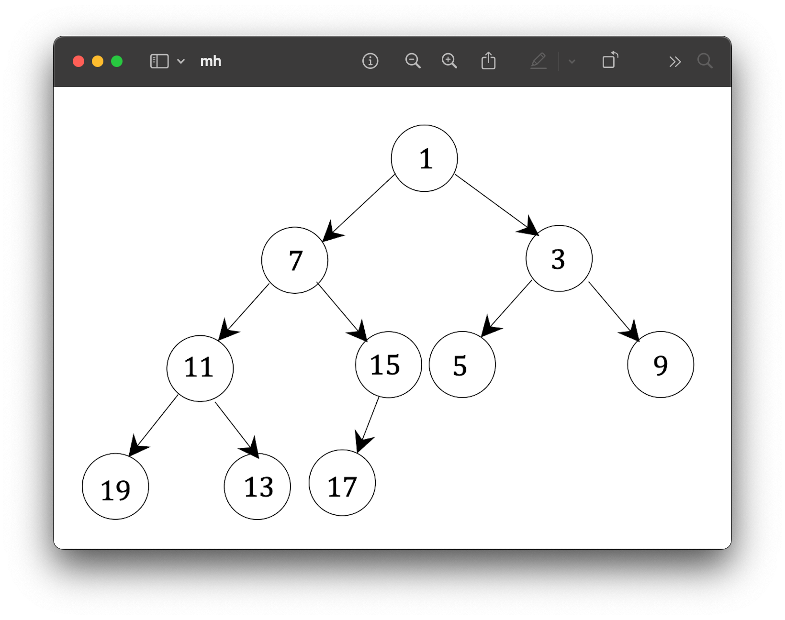

# Heaps: Practice Questions

## Question 1



Given the **min-heap `h`** above, we execute the following sequence of operations:

```python
h.insert(6, None) 
h.insert(8, None) 
h.insert(0, None) 
h.delete_min() 
h.delete_min() 
h.delete_min() 
h.delete_min() 
```

For **each operation**, draw:

* The **tree representation**
* The **array representation**

> **Note**: In this question, we only care about the structure of the heap and the **priorities**. The value is always `None`.

---

## Question 2

### a) Implement a FIFO queue

Implement the **FIFO queue ADT** (`q.enqueue(elem)`, `q.dequeue()`, `q.first()`, `len(q)`, and `q.is_empty()`) using:

* A **priority queue**
* A **single additional integer** as a data member

### b) Professor Idle’s Suggestion

Professor Idle suggests that when inserting an element into the queue, you assign it a priority equal to the **current size** of the queue.

* **Question**: Does this strategy result in **FIFO semantics**?
* **Task**: Either:

  * Prove that it works, or
  * Provide a **counterexample**

---

## Question 3

Add this method to the `ArrayMinHeap` class:

```python
def find_less_than_or_equal_to(self, k)
```

* This method takes an integer `k`
* It returns a list of all priorities in the heap that are **≤ k**

Example:

```python
h.find_less_than_or_equal_to(11)  # might return [1, 7, 3, 11, 5, 9]
```

> **Requirements**:

* Must run in time **proportional to the size of the returned list**
* **Do not modify** the heap!

---

## Question 4

Implement the following function:

```python
def k_largest_elements(lst, k)
```

* Given a list of integers `lst` and an integer `k`
* Return a list of the `k` **largest elements** in `lst`

Example:

```python
k_largest_elements([3, 9, 2, 7, 1, 7, 1, 3], 4)
# Output could be [7, 9, 7, 3]
```

> **Implementation Requirements**:

1. If `lst` has `n` items, the runtime must be **Θ(n log k)**
2. You may use **O(k) auxiliary space**

