<h2 align=center>Week I</h2>

<h1 align=center>Python In Memoriam: <em>Lists and Strings</em></h1>

<p align=center><strong><em>Song of the day</strong>: <a href="https://youtu.be/0qUtT6k83Go?si=c-pKA-WsWJ57CQjp"><strong><u>Fior di Latte</u></strong></a> by Phoenix (2017).</em></p>

---

## Sections

1. [**Variables in Memory**](#1)
2. [**Lists in Memory**](#2)
    1. [**Sequencing**](#2-1)
    2. [**Indexing**](#2-2)
3. [**Aliasing and Appending in Memory**](#3)
4. [**Strings in Memory**](#4)
5. [**Function Namespaces**](#5)

<p align=center><strong><em><a href="assets/intro.pdf">Intro Slideshow</a></em></strong></p>

---

<a id="1"></a>

## _Variables in Memory_

Our first step in understanding how our computers store and organise data is by looking at Python's most atomic action: assignment. Say that we create a variable, `x`, and we assigned (`=`) the value of `15` to it. In memory, this might look like this:

<a id="fg-1"></a>

<p align=center>
    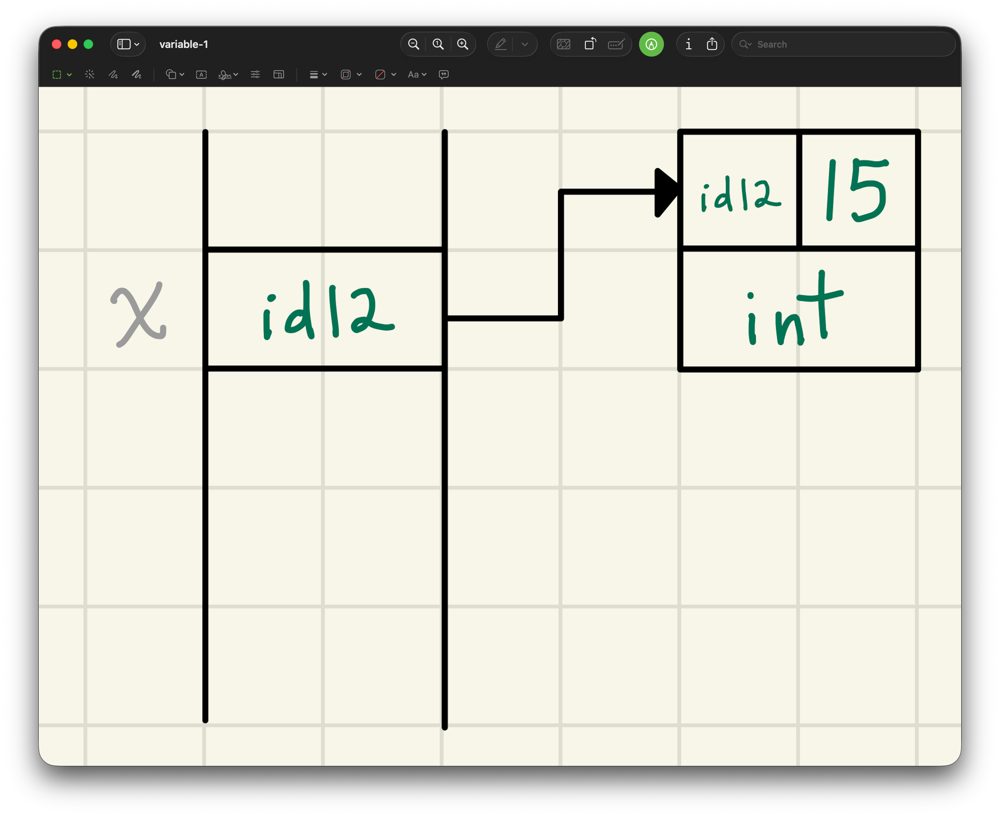
    </img>
</p>

<p align=center>
    <sub>
        <strong>Figure I</strong>: The left "strip" represents your RAM (random access memory). Python then makes a reference to an <code>int</code> object with a specific id. Note here that the id that I picked is completely random—it could be any number.
    </sub>
</p>

Later on down our program, say we _reassign_ the value of `42.0` to `x`. What happens in this case?

1. The reference to the `int` object `15` is "broken".
2. A new reference to the `float` object `42.0` is "created".

<a id="fg-2"></a>

<p align=center>
    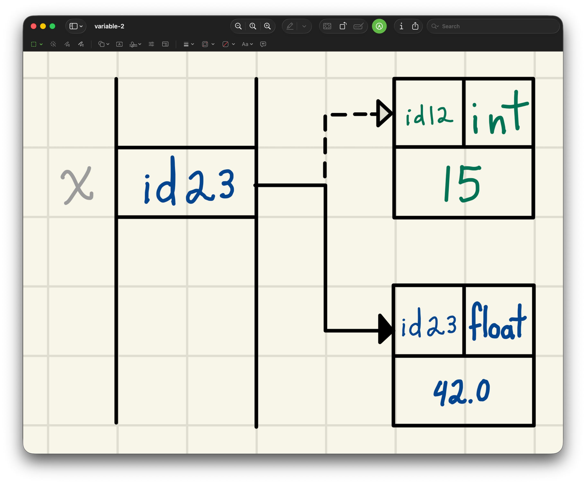
    </img>
</p>

<p align=center>
    <sub>
        <strong>Figure II</strong>: Note the different id numbers.
    </sub>
</p>

The key thing to note is that the id numbers are different, _in spite of the values having been stored inside of the same variable_. Why is this? Well, remember that a variable is simply just a "box" where we store a value that we want to use later. What we actually care about is the data inside of it. In Python, **all immutable objects have their own specific id**.

What this means is that if I were to, say, create a second variable, `y`, and assign _it_ the value of `42.0`, it would actually link to the same exact object that `x` does:

<a id="fg-3"></a>

<p align=center>
    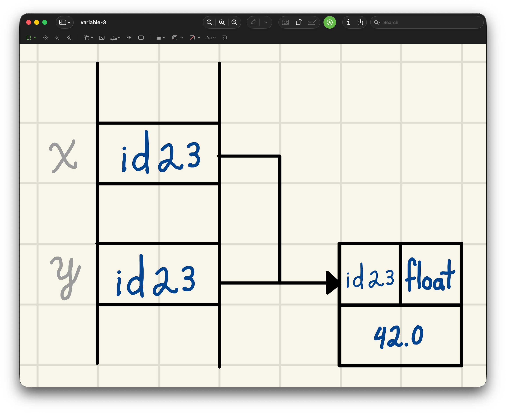
    </img>
</p>

<p align=center>
    <sub>
        <strong>Figure III</strong>: Why does Python do this? In order to save memory space, mainly.
    </sub>
</p>

This established, let's look at more complex structures and how Python stores those.

<br>

<a id="2"></a>

## _Lists in Memory_

Let's say we defined the following list:

```Python
lst = [1, 2, 3]
```

The way Python stores it in memory can be represented in the following way:

<a id="fg-4"></a>

<p align=center>
    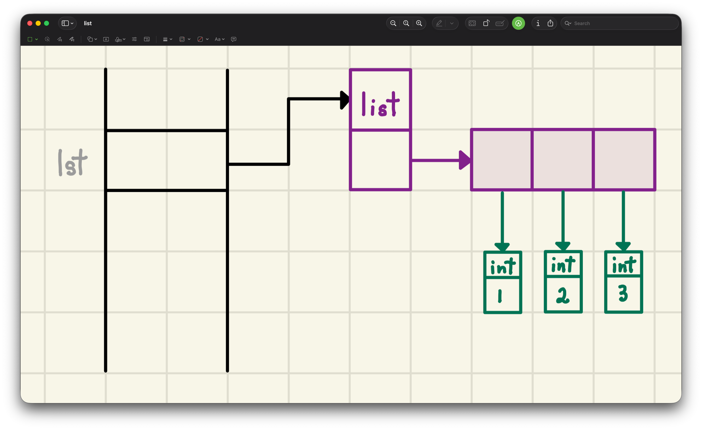
    </img>
</p>

<p align=center>
    <sub>
        <strong>Figure IV</strong>: Note that the integers <code>1</code>, <code>2</code>, and <code>3</code> are stored <a href="https://www.sciencedirect.com/topics/computer-science/contiguous-memory"><strong><em>contiguously</em></strong></a> in memory.
    </sub>
</p>

Let's say, then, that we wanted to add the value `10` to each of the integers inside of this list. There are two ways we can go about this, either by _sequencing_ or by _indexing_.

<a id="2-1"></a>

### _Sequencing_

When I say sequencing, this is what I mean:

```Python
lst = [1, 2, 3]

for elem in lst:
    elem += 10

print(lst)
```

When we run this program, what gets printed? Let's see:


<a id="fg-5"></a>

<p align=center>
    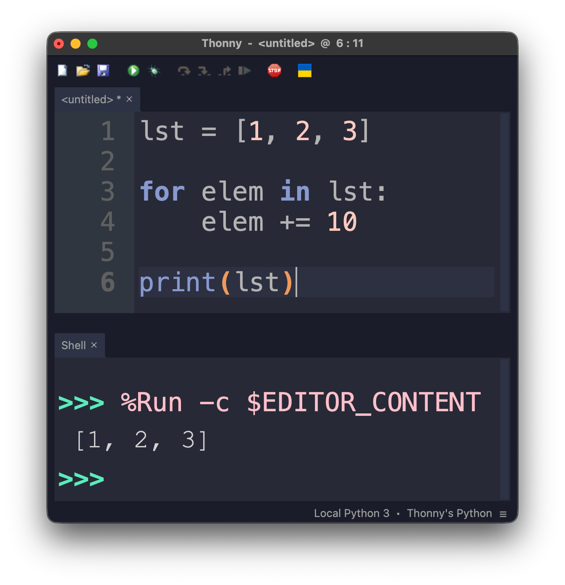
    </img>
</p>

<p align=center>
    <sub>
        <strong>Figure V</strong>: Maybe not what you expected?
    </sub>
</p>

The original list remains unchanged. Why is this the case? Well, it's worth taking apart this `for`-loop and looking at what it actually does in memory. If I were to "translate" it into English, I would say something like this:

> The `for`-loop _creates a loop variable_ called `elem` and assigns it the first value within the sequence `lst` (in our case, `1`). Then, the `for`-loop _reassigns the value of **`elem + 10` to `elem`**_ (in our case, `1 + 10`, or `11`).

Note that this is all happening to _`elem` only_; `lst` only provided the initial value of `1` to `elem`, but whatever changes happen to it from there on are completely unrelated to `lst`.

Let's see how that looks like in memory:

<a id="fg-6"></a>

<p align=center>
    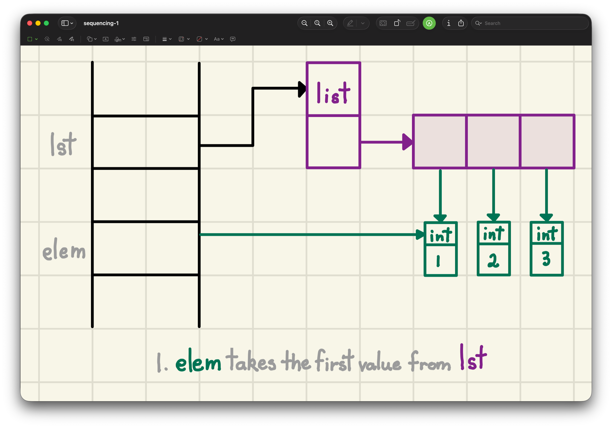
    </img>
</p>

<a id="fg-7"></a>

<p align=center>
    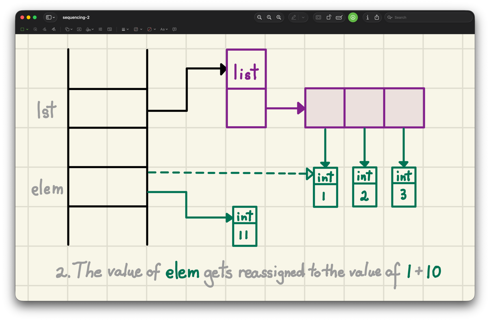
    </img>
</p>

<a id="fg-8"></a>

<p align=center>
    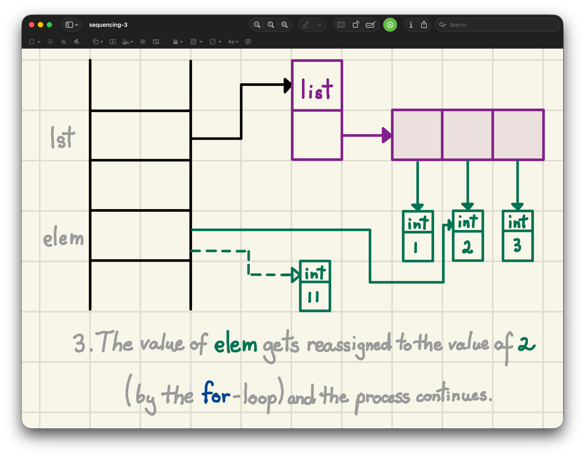
    </img>
</p>

<p align=center>
    <sub>
        <strong>Figures VI to VIII</strong>: Note that <code>elem</code> is defined in a completely different place in memory to <code>lst</code>.
    </sub>
</p>

So, what do we do when we _do_ want to change the original values of `lst`? That's where indexing comes in.

<a id="2-2"></a>

### _Indexing_

We use indices when we want to indicate to Python that we want to access a specific location within a _sequential_ structure. The indices (`# idx`) of `lst` are as follow:

```Python
# idx: 0  1  2
lst = [1, 2, 3]
```

So, if we wanted to iterate through those indices, we should take advantage of the `range` and `len` functions with our `for`-loop:

```Python
# idx: 0  1  2
lst = [1, 2, 3]

for i in range(len(lst)):
    lst[i] += 10

print(lst)
```

_Now_, when we run this program, we see the changes to `lst`:

<a id="fg-9"></a>

<p align=center>
    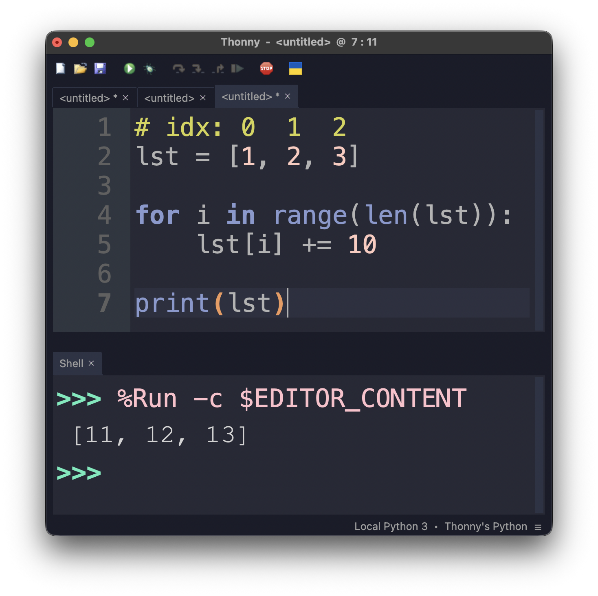
    </img>
</p>

<p align=center>
    <sub>
        <strong>Figure IX</strong>: <code>lst</code> <em>did</em> change.
    </sub>
</p>

Let's explore why. When we index a sequence, what we're asking Python to do is to access the data that is located _at that exact location within memory_. In other words, we're not creating a separate variable in memory like `elem` anymore, we're dealing with the original stuff. So, in English, we might say that:

> The `for`-loop creates a loop variable called `i` which will iterate through the indices of `lst` (provided by `range(len(lst))`). Then, the `for`-loop takes _the value at location `lst[i]`_ and _**reassigns it the value `lst[i] + 10`**_.

In memory, this would look as follows:

<a id="fg-10"></a>

<p align=center>
    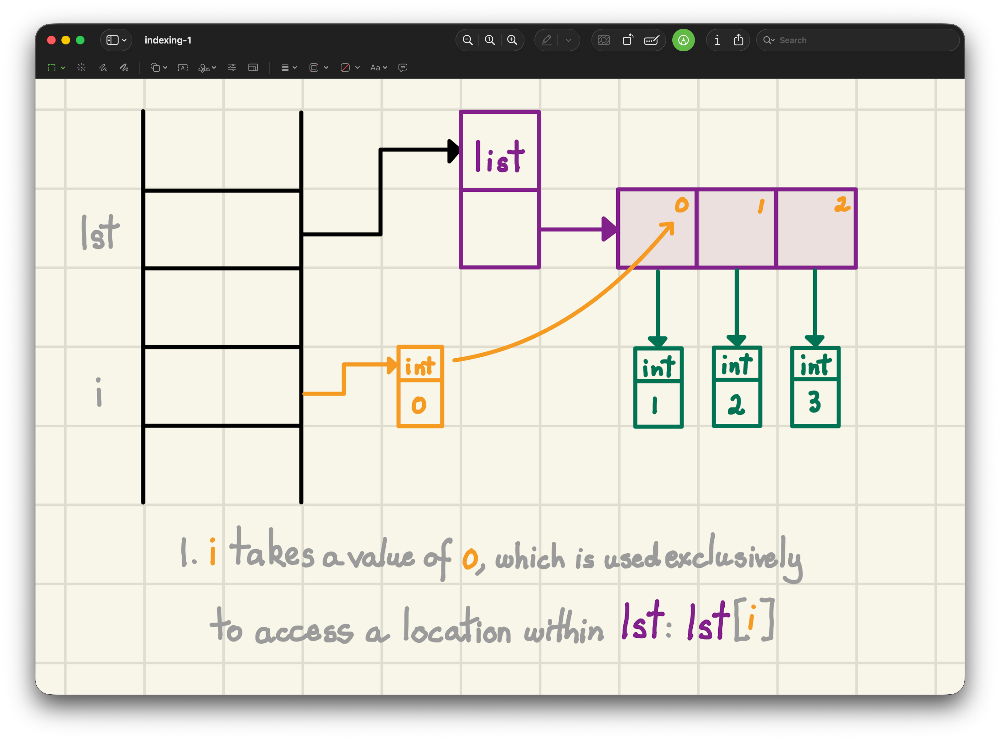
    </img>
</p>

<a id="fg-11"></a>

<p align=center>
    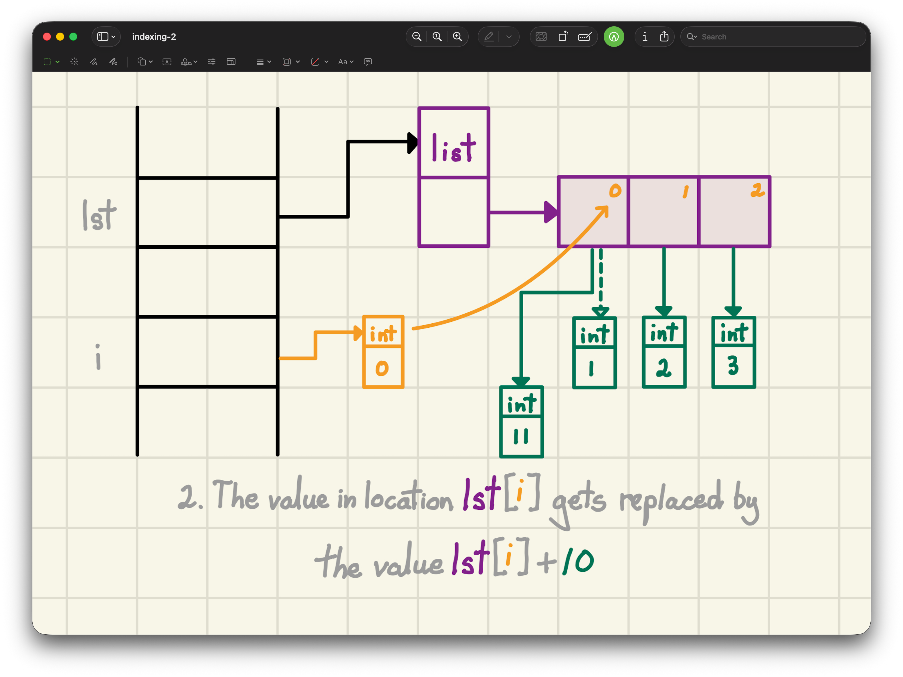
    </img>
</p>

<p align=center>
    <sub>
        <strong>Figures X & XI</strong>: Note that <code>i</code> is simply being used as a "pointer" to the location within <code>lst</code>.
    </sub>
</p>

<br>

<a id="3"></a>

## _Aliasing and Appending in Memory_

What's next? Well, recall that we have something in Python called _aliasing_. For lists, this process—while similar-looking to making a copy—actually does nothing of the sort. Let's explore:

Suppose I define three variables as follows:

```python
lst1 = [1, 2, 3]
lst2 = lst1
lst3 = [1, 2, 3]
```

Now, let's append an integer to each variable, which is (in some way) storing a list:

```python
lst1.append(4)
lst2.append(5)
lst3.append(6)

print(lst1, lst2, lst3, sep='\n')
```

What do you suppose the output of our `print` statement will look like?

<a id="fg-12"></a>

<p align=center>
    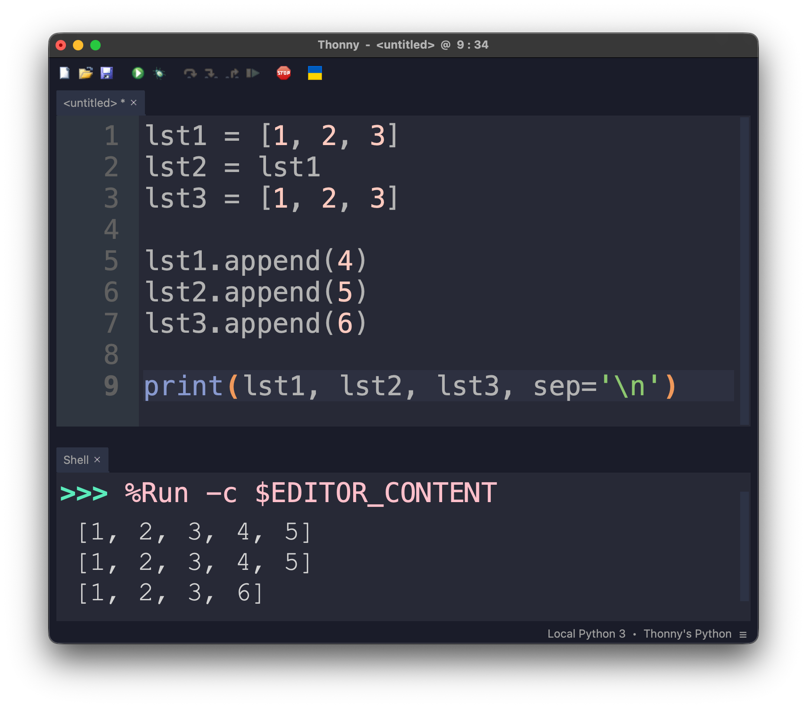
    </img>
</p>

<p align=center>
    <sub>
        <strong>Figure XII</strong>: Note that, in spite of <code>4</code> being appended to <code>lst1</code> and <code>5</code> being appended to <code>lst2</code>, both changes are reflected in both lists.
    </sub>
</p>

Hm, interesting. What's happening here? On the surface, the creation of the variable `lst2` (i.e. its assignment of the value `lst1`) _might_ look like we're creating a completely separate object—after all, the names `lst1` and `lst2` _are_ technically created in separate spaces within RAM. However, what Python is actually doing is **creating an alias to the list created when we defined `lst1`**.

An analogy of this goes as follows: there is only one campus for NYU Tandon, whose address is (generally) given at 6 MetroTech Center. However, different people might refer to 6 MetroTech using different names. I might call it "my workplace," you might call it "school," and your parents might simply call it "NYU". The three names are different, but they are all referring to the same thing. That's what aliasing is.

In memory, this would look as follows:

<a id="fg-13"></a>

<p align=center>
    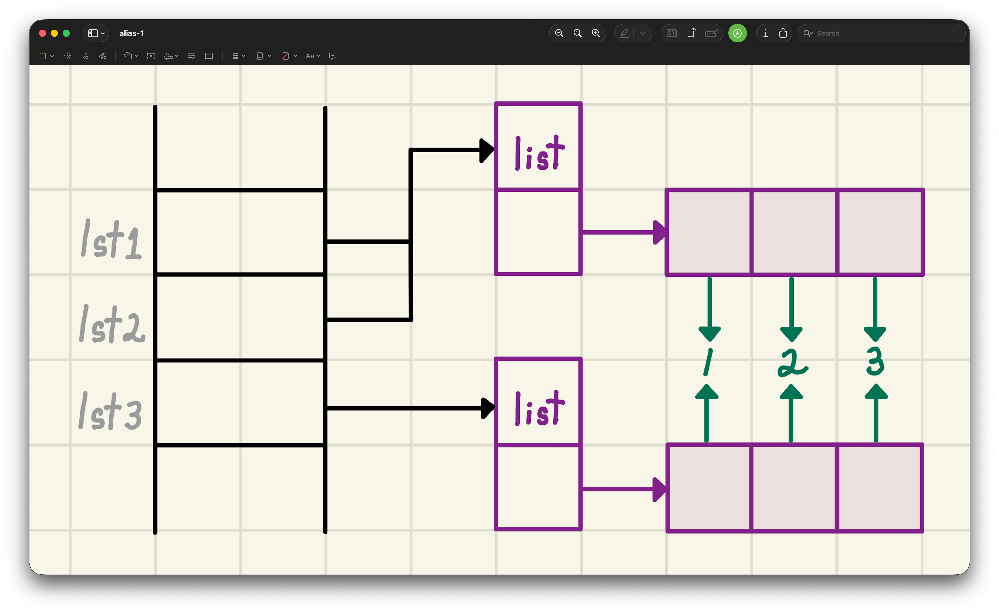
    </img>
</p>

<a id="fg-14"></a>

<p align=center>
    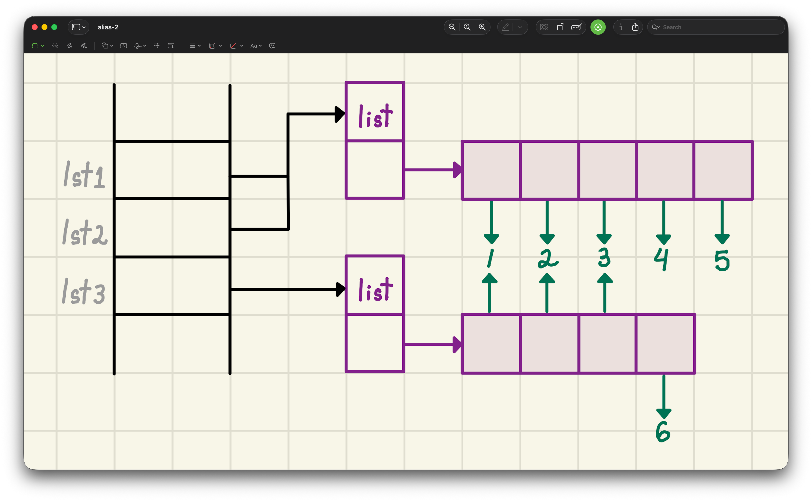
    </img>
</p>

<p align=center>
    <sub>
        <strong>Figures XIII & XIV</strong>: Only two lists are being stored in memory, in spite of their being three variables.
    </sub>
</p>

The place where these variables are stored is called the **namespace**, which is something we'll revisit a little bit later.

<br>

<a id="4"></a>

## _Strings in Memory_

Lists are mutable objects and that's part of the reason why they behave in memory the way that they do. But what about other immutable objects, such as strings?

Suppose we have a very simple string, `"abc"`, assigned to a variable called `s`. What happens, then when we call the `upper` method on `s`?

<a id="fg-15"></a>

<p align=center>
    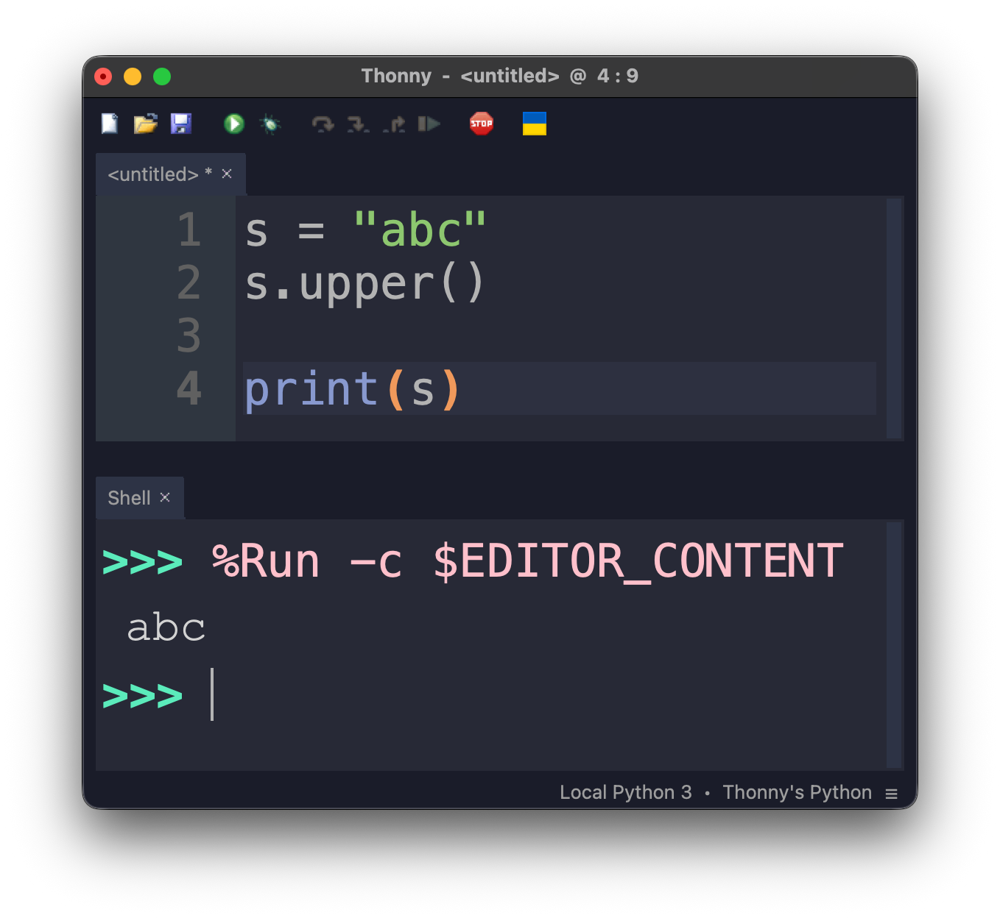
    </img>
</p>

<p align=center>
    <sub>
        <strong>Figure XV</strong>: The value of <code>s</code> remains <em>unchanged</em>.
    </sub>
</p>

If your first instinct was to think that `"ABC"` would be printed out instead, it's worth quoting the [**official documentation for the `upper` method**](https://docs.python.org/3/library/stdtypes.html#str.upper):

> _**Return** a copy of the string with all the cased characters converted to uppercase._

In other words, `s`—being immutable—remains untouched. Instead, _another string is created_ containing all cased characters uppercased. Of course, if we were to _reassign_ this new string to `s`, the story would be different:

<a id="fg-16"></a>

<p align=center>
    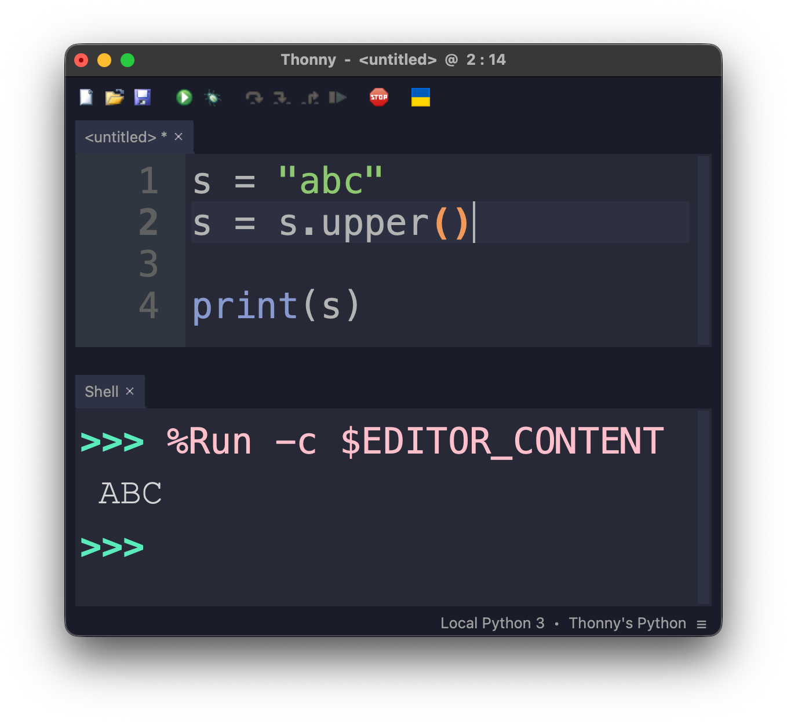
    </img>
</p>

<p align=center>
    <sub>
        <strong>Figure XVI</strong>: Here, we completely replaced the original value of <code>s</code> for something else</em>.
    </sub>
</p>

The corresponding memory diagram for figure XVI would be:

<a id="fg-17"></a>

<p align=center>
    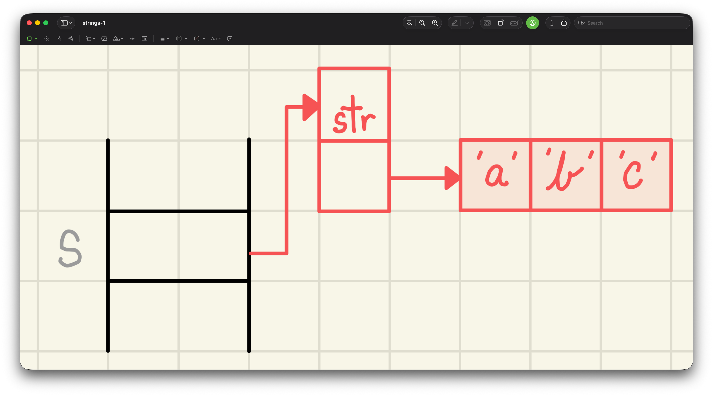
    </img>
</p>

<a id="fg-18"></a>

<p align=center>
    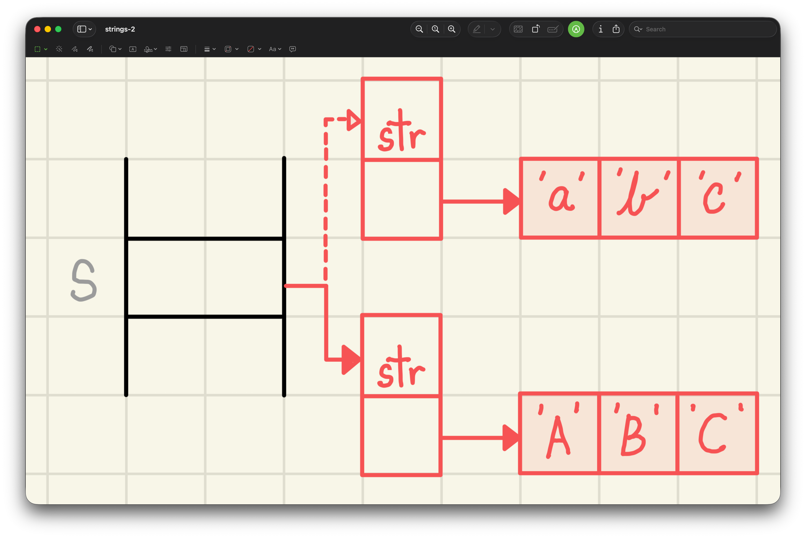
    </img>
</p>

<p align=center>
    <sub>
        <strong>Figures XVII & XVIII</strong>: One variable in the namespace, two objects in memory.
    </sub>
</p>

<br>

<a id="5"></a>

## Function Namespaces

Rounding this all up brings us back to namespaces. These take on a more important role when it comes to functions vis-à-vis the values that get passed as arguments.

Consider the following program:

```python
def func(lst, s):
    lst.append(6)
    s = s.upper()
    print("func:", lst, s)

def main():
    lst = [1, 2, 3]
    s = "abc"

    func(lst, s)
    print("main:", lst, s)

main()
```

Here, we have two functions, `func` and `main`. We say that each function here has its own namespace. This essentially means that (depending on the situation), whatever happens inside of that function generally is limited to that function.

Let's first see what we get for output when we run it:

<a id="fg-19"></a>

<p align=center>
    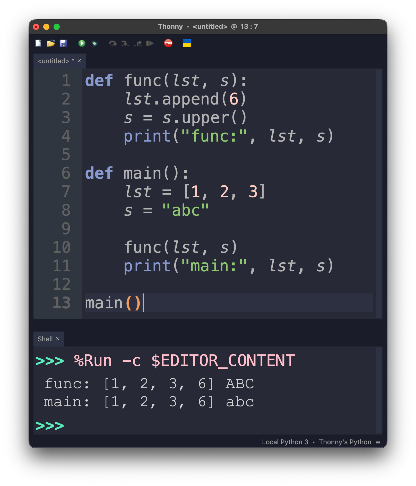
    </img>
</p>

<p align=center>
    <sub>
        <strong>Figure XIX</strong>: The thing to note here is that the <code>main</code> function's <code>lst</code> <em>changed</em> after a call to <code>func</code>, but the value of <code>s</code> <em>didn't</em>, even though we "changed" both of them inside of <code>func</code>.
    </sub>
</p>

Whoa, what?

This is confusing: why does `lst` reflect the changes done by `func` in `main` but `s` doesn't? The answer is the following. **In Python**:

> When _mutable_ objects get passed as arguments into a function, the corresponding parameter makes a **reference** to the exact same object instead of creating a new one.
>
> When _immutable_ objects get passed as arguments into a function, the corresponding parameter makes a **copy** of the original object.

In other words, both the `lst` variable in `main` and the `lst` parameter in `func` are the _exact same object in memory_. The `s` parameter in `func`, on the other hand, is a _copy_ of the `s` variable in `main`.

Let's check out the memory diagrams for this process:

<a id="fg-20"></a>

<p align=center>
    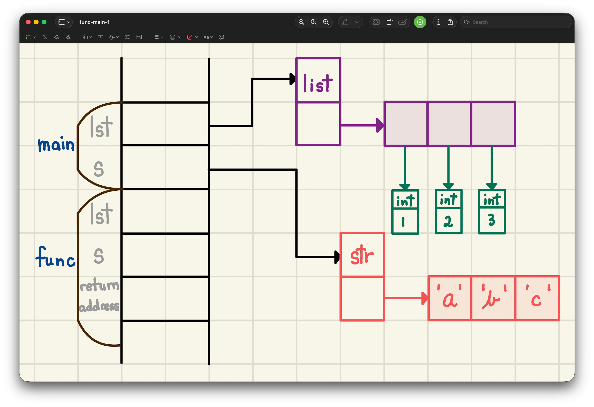
    </img>
</p>

<a id="fg-21"></a>

<p align=center>
    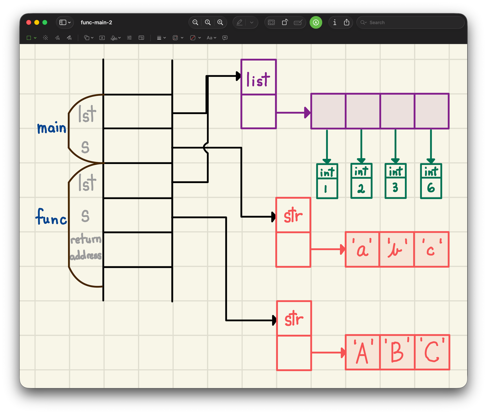
    </img>
</p>

<p align=center>
    <sub>
        <strong>Figures XX - XXI</strong>: Note that <code>func</code>'s namespace also includes something called a "return address". This is simply a reference to the location to <em>where the function (<code>func</code>) was called</em>. Functions need this so that, whenever they are finished executing, they know where in memory to go back to so that the program can continue.
    </sub>
</p>