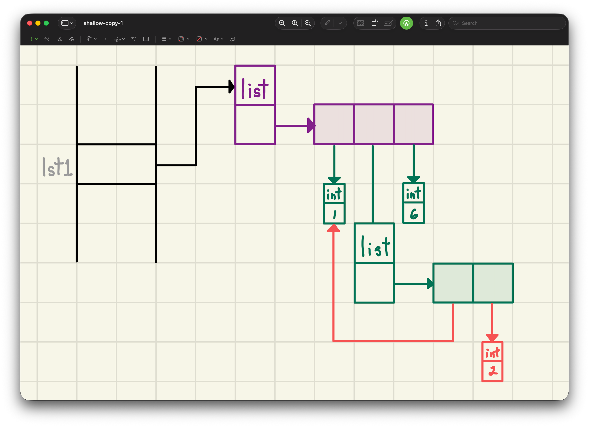
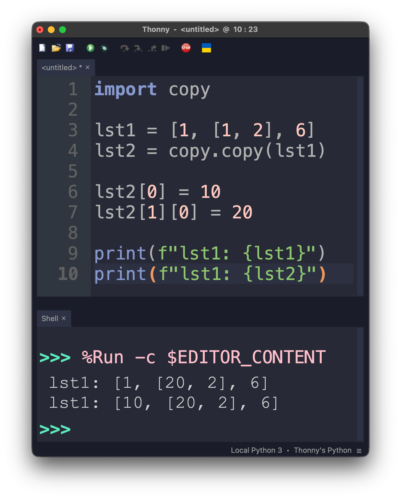
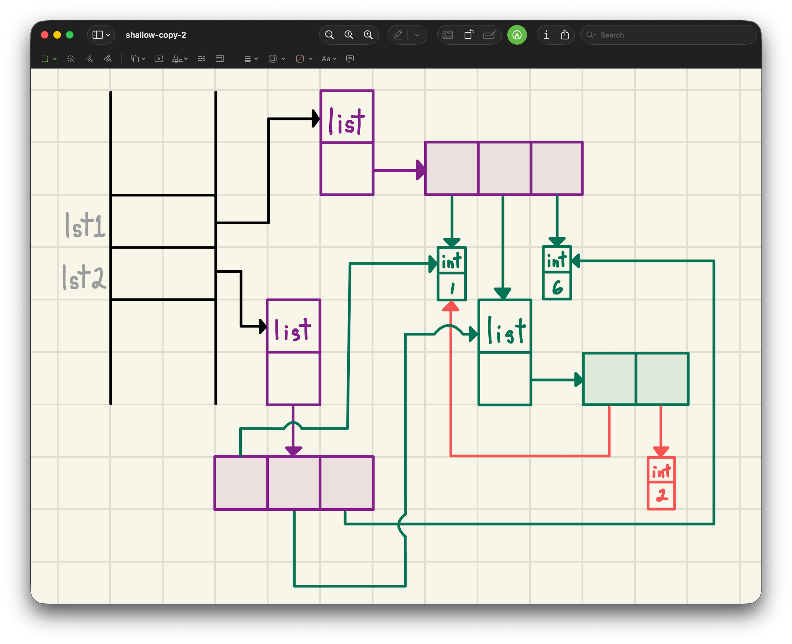
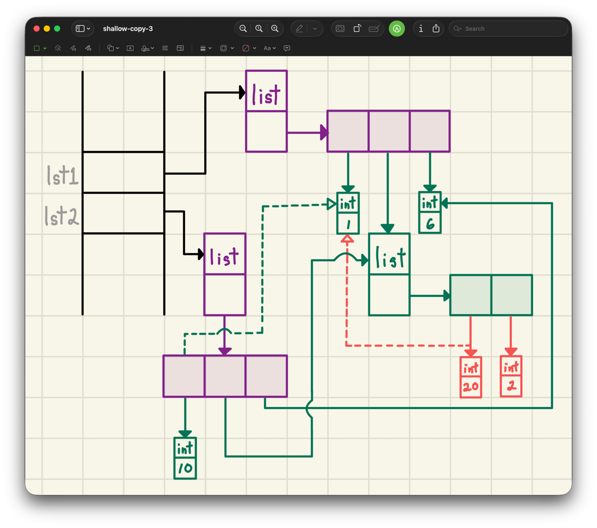
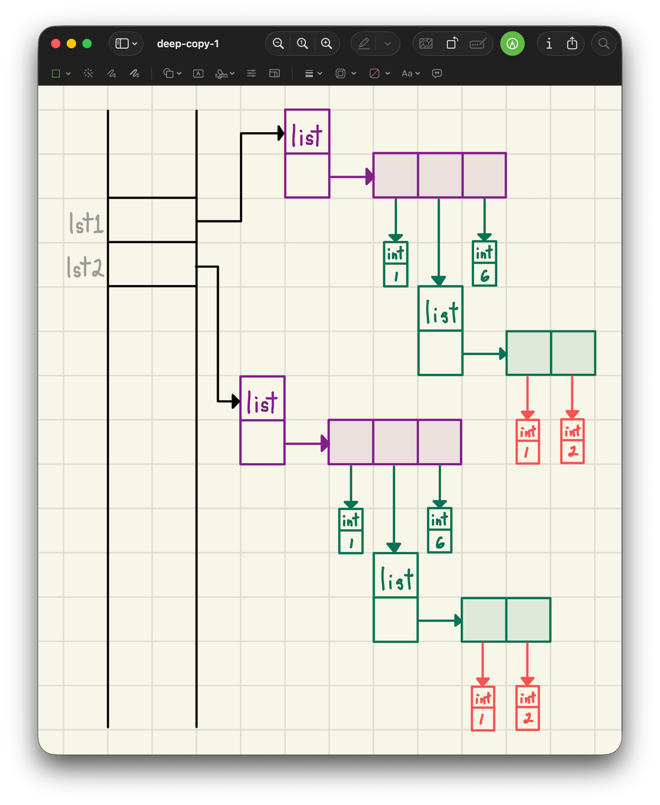
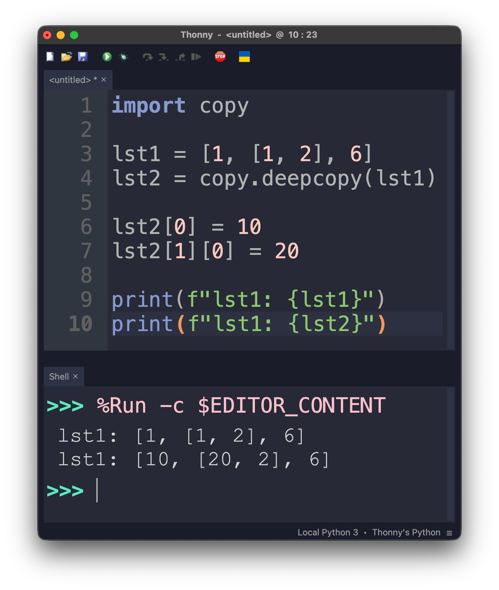
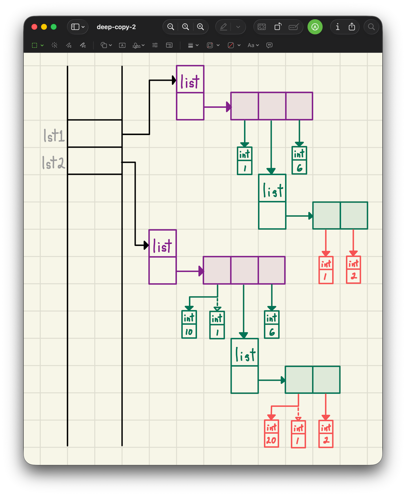
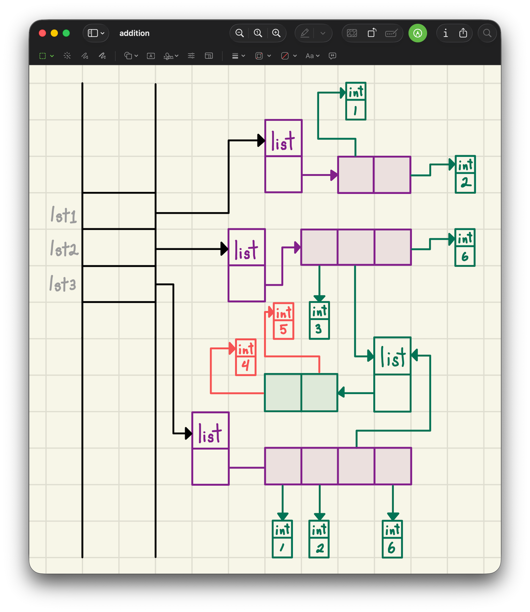
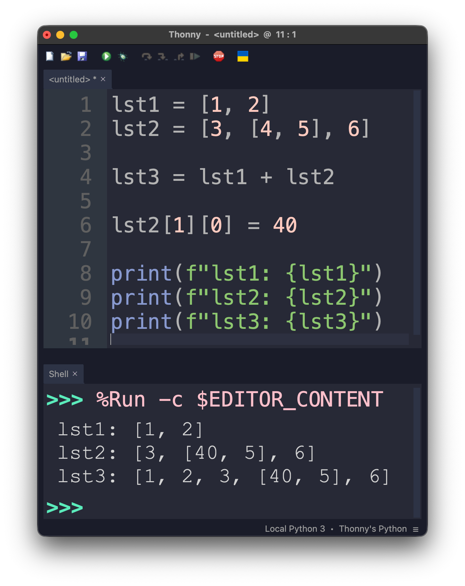

<h2 align=center>Week II: <em>Day 1</em></h2>

<h1 align=center>Python In Memoriam: <em>Copying</em></h1>

<p align=center><strong><em>Song of the day</strong>: <a href="https://youtu.be/Q02RoRVJOVs?si=MUWENoPDiEak0N-K"><strong><u>Iced Coffee</u></strong></a> by Red Velvet (2022)</em></p>

---

## Sections

1. [**Copying**](#1)
    1. [**Shallow Copying**](#1-1)
    2. [**Deep Copying**](#1-2)
2. [**List Addition & Mutation**](#2)
3. [**Lists of User-Defined Objects**](#3)
    1. [**List Comprehension**](#3-1)
    2. [**List Multiplication**](#3-2)
4. [**List Extension vs Concatenation**](#4)

<p align=center><strong><em><a href="assets/memory-maps.pdf">Notes From Zoom Lecture</a></em></strong></p>

---

<a id="1"></a>

## _Copying_

Last time, when we spoke about [**aliasing**](https://github.com/sebastianromerocruz/CS1134-data-structures-and-algorithms/tree/main/lectures/01-memory-lst-str#3), we learned about its role in memory and, in particular, how it does _not_ create a copy of the aliased object. Instead, it simply creates a "pointer" to the same object that both variables are linked to:

<a id="fg-1"></a>

<p align=center>
    
    </img>
</p>

<p align=center>
    <sub>
        <strong>Figure I</strong>: <code>lst1</code> and <code>lst2</code> are aliases of each other.
    </sub>
</p>

So, what if we want to make actual copies of these objects? Python doesn't have a way to do this natively—we have to import to the `copy` module into our program:

```Python
import copy  # or: from copy import ...
```

There's two types of copies that the `copy` module can produce for us and that also concern us: **shallow copying** (provided by the `copy` method) and **deep copying** (provided by the `deepcopy` method). Let's look at them in order now.

<a id="1-1"></a>

### _Shallow Copying_

When we're concerned with lists, shallow copying can be described as follows:

<a id="def-1"></a>

> **Shallow Copy**: A new list object created with a new container (to store the items) but the contents (of the original list) are shared with the original list.

This wording might be a little confusing, so let's illustrate what we mean. Say we had the following list:

```Python
import copy

lst1 = [1, [1, 2], 6]
```

That is, a list with 3 elements in it, one of which (i.e. index `1`) is itself a list. In memory, this might look as follows:

<a id="fg-2"></a>

<p align=center>
    
    </img>
</p>

<p align=center>
    <sub>
        <strong>Figure II</strong>: Note that the nested, inner list has its own container for its own contents (`2` and `3`).
    </sub>
</p>

Say, then that we create a shallow copy of `lst1` (`lst2`) and make the following modifications:

```Python
import copy

lst1 = [1, [1, 2], 6]
lst2 = copy.copy(lst1)  # can also do lst1.copy()

lst2[0] = 10
lst2[1][0] = 20

print(f"lst1: {lst1}")
print(f"lst1: {lst2}")
```

That is:
1. Reassign the first element of `lst2` to the integer `10`, and...
2. Reassign the zeroeth element of the first element of `lst2` (i.e. the nested list) to the integer `20`.

What's our output?

<a id="fg-3"></a>

<p align=center>
    
    </img>
</p>

<p align=center>
    <sub>
        <strong>Figure III</strong>: The first reassignment is not reflected on <code>lst1</code>, but the second one is.
    </sub>
</p>

Clearly, we're not dealing with aliases anymore—otherwise, we'd see both reassignments reflected on both lists. So, what exactly is going on in memory?

<a id="fg-4"></a>

<p align=center>
    
    </img>
</p>

<p align=center>
    <sub>
        <strong>Figure IV</strong>: As promised, <code>lst1</code> and <code>lst2</code> <em>are</em> indeed two different lists.
    </sub>
</p>

This matches up pretty well with our [**earlier definition**](#def-1) of shallow copying: the contents of both lists are being shared by both lists in spite of them being completely different objects in memory. Because of this, making a change to their shared inner list is reflected by both lists (assignment #2), but when we reassign the zeroeth element of `lst2` to another integer, `lst1` is under no obligation to also do so because it is it's own, independent object:

<a id="fg-5"></a>

<p align=center>
    
    </img>
</p>

<p align=center>
    <sub>
        <strong>Figure V</strong>: This is where the name "shallow" comes from. Only the most shallow level of the object is copied, while the deeper levels (the contents) aren't.
    </sub>
</p>

<a id="1-2"></a>

### _Deep Copying_

Now, when we don't want our copies to share their contents at all, on any level, we make a deep copy:

> **Deep Copy**: A new list object is created with a new container (to store the items), and the contents (of the original list) are _nestedly_ copied as well.

For example, let's return to our earlier list and instead create a deep copy of it:

```python
import copy

lst1 = [1, [1, 2], 6]
lst2 = copy.deepcopy(lst1)
```

In memory, this would look as follows:

<a id="fg-6"></a>

<p align=center>
    
    </img>
</p>

<p align=center>
    <sub>
        <strong>Figure VI</strong>: Note here that, technically, since integers are immutable, Python can't create copies of it. Instead, only one instance of each exists across all memory. Still, in order to have neater diagrams and to drive the point home, here we've displayed <code>lst1</code>'s integers and <code>lst1</code>'s integers as being separate objects.
    </sub>
</p>

Applying the same mutations would thus print the following:

<a id="fg-7"></a>

<p align=center>
    
    </img>
</p>

<p align=center>
    <sub>
        <strong>Figure VII</strong>: Neither of <code>lst2</code>'s changes is reflected on <code>lst</code>.
    </sub>
</p>

Which, in turn, looks as thus in memory:

<a id="fg-8"></a>

<p align=center>
    
    </img>
</p>

<p align=center>
    <sub>
        <strong>Figure VIII</strong>: Once more, nothing is shared.
    </sub>
</p>

<br>

<a id="2"></a>

## _List Addition & Mutation_

So that's copying but, as we know, these are not the only ways of creating new lists. Another very common way (at least, in Python) is through list "addition"—in other words by using two lists as the operands of the `+` (addition) operator:

```python
lst1 = [1, 2]
lst2 = [3, [4, 5], 6]

lst3 = lst1 + lst2
```

Turns out addition is easy:

1. A _new list_ is created (`lst3`)
2. The components (`lst1` and `lst2`) are _shallow copies_ of the original.

In other words:

<a id="fg-8"></a>

<p align=center>
    
    </img>
</p>

<p align=center>
    <sub>
        <strong>Figure VIII</strong>: These diagrams can get real complicated real fast. That's why sometimes we allow the "existence" of multiple objects of the same immutable values (like integers, etc.).
    </sub>
</p>

And, if we make a small change to `lst2`...

<a id="fg-9"></a>

<p align=center>
    
    </img>
</p>

<p align=center>
    <sub>
        <strong>Figure XIX</strong>: The change is reflected both in <code>lst2</code> and <code>lst3</code>.
    </sub>
</p>

<a id="3"></a>

## _Lists of User-Defined Objects_

There a couple more ways of creating lists, and to illustrate them we'll create a small, simple class that we can readily modify to test our theories:

```python
class Counter:
    def __init__(self):
        self.value = 0
    
    def inc(self):
        self.value += 1
    
    def __repr__(self):
        return str(self.value)
```

For example:

```python
c = Counter()
c.inc()
c.inc()

print(c)
```

...would print a value of **`2`**. Keep this in mind as we go on.

<a id="3-1"></a>

