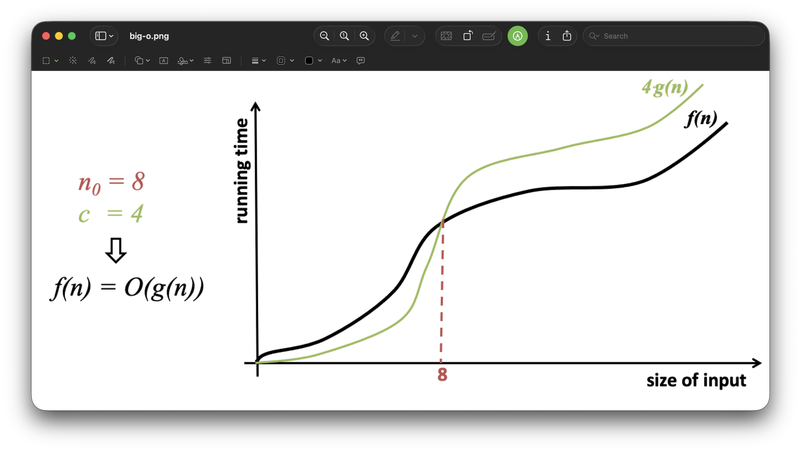
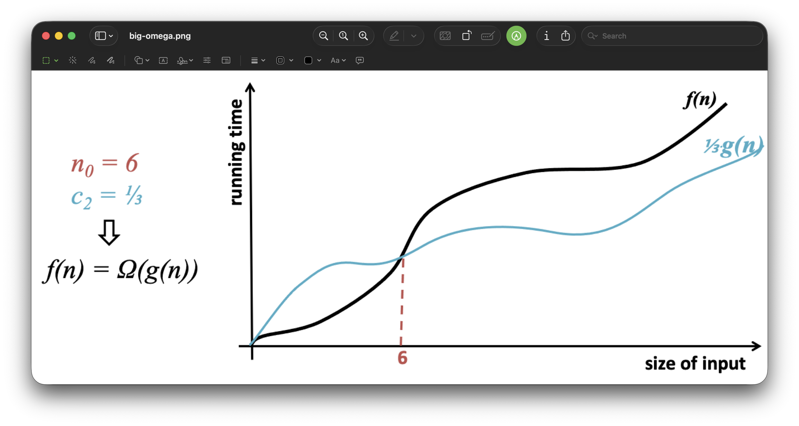
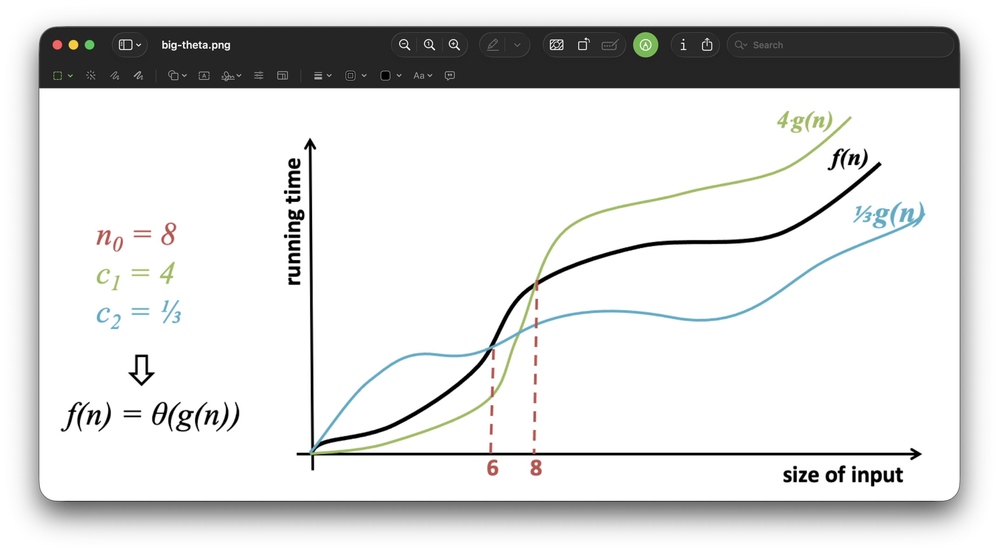

<h2 align=center>Week 03: <em>Day 2</em></h2>

<h1 align=center>Asymptotic Analysis</h1>

<p align=center>
    <em>
        <strong>
            Song of the day
        </strong>
        recommended by Reeve C.:
    </em>
    <br>
    <em>
        <a href="https://youtu.be/fYEXdCCpfVQ?si=bm8ZEH0Goc__B_9v">
            <strong>
                <u>
                    Hand Me Downs
                </u>
            </strong>
        </a> by Mac Miller (2020)
    </em>
</p>

---

## Sections

1. [**Asymptotic Analysis**](#1)
    1. [**Big-O Analysis**](#1-1)
    2. [**Big-Omega (Ω) Analysis**](#1-2)
    3. [**Big-Theta (Θ) Analysis**](#1-3)
    4. [**In Summary**](#1-4)
2. [**Analysing Code**](#2)
3. [**Addendum**](#3)

<!-- <p align=center><strong><em><a href="assets/Asymptotic Analysis.pdf">Handwritten Class Notes</a></em></strong></p> -->

---

<a id="1"></a>

<br>

## Asymptotic Analysis

We use big-theta notation to capture both the _upper and lower bounds_ to describe the exact rate of growth. That is, an algorithm with Θ(√`n`) runtime grows at _exactly the same rate_ as √`n` as `n` gets larger. Now, when designing algorithms, we typically only care about the _upper bound_. Why? Well, it's simply because it _can_ happen. However unlikely, if you algorithm can reach a runtime bound that is too high, your still need to plan around it. Expect the best, prepare for the worst.

In order to consider only the upper bound in asymptotic analysis, we use a slightly different notation—that of big-O. **Big-O notation** describes the upper bound of an algorithm's growth, focusing on its **worst-case** performance as the input size grows. Using [**our example from last class**]() in the case of big-O, we can no longer assume that the runtime grows at exactly the same rate as √`n` as `n` gets larger. Instead, we say that we now have two function at play here.

<a id="1-1"></a>

### Big-O Analysis

Let...

> **f(`n`)**: be the runtime of your algorithm (how many steps it takes as the input size `n` grows).  
>
> **g(`n`)**: be a simple function (like `n`, `n`², log(`n`)) that we use to compare how fast f(`n`) grows.

Using these, we say:

> f(`n`) = O(g(`n`))

That is, the runtime of f(`n`) grows no faster than g(`n`) when `n` is really, really big (worst-case scenario).

The way we prove this is a little abstract, but the actual process is relatively simple. When f(`n`) = O(g(`n`)), we say that there's a constant, `c`, that makes f(`n`) smaller than or equal to `c` * g(`n`). Moreover, there's a certain value of `n` (call it `n`<sub>0</sub>) where this relationship holds for _all `n` bigger than `n`<sub>0</sub>_ (the point where we start saying "really, really big" values of `n`).

Confused? Yeah, I don't blame you. Let's try to concretise this by showing you a simple example. Say that:

> f(`n`) = 3`n`² + 6`n` − 15

And we're trying to prove that the following simple function:

> g(`n`) = `n`²

can also be used to describe the runtime of f(`n`) (i.e., if _f(`n`) = O(g(`n`))_). The steps to do this are as follows:

1. Pick a value for our constant `c` that would satisfy the inequality f(`n`) ≤ `c` * g(`n`). In this case, any constant greater than or equal to 3 works, as it must match the coefficient of the dominant term (3`n`²) while accounting for the smaller terms (+6`n` − 15). Let’s choose `c = 4`. We thus get:

> f(`n`) = 3`n`² + 6`n` − 15  
>
> g(`n`) = 4`n`²

2. Write the inequality out. We ask ourselves: is f(`n`) ≤ `c` * g(`n`) for all `n` ≥ 1? Let’s see:

> 3`n`² + 6`n` − 15 ≤ 4`n`²  
>
>
> For `n`<sub>0</sub> = 5:  
>
> 3(5)² + 6(5) − 15 ≤ 4(5)²  
>
> 75 + 30 − 15 ≤ 100  
>
> 90 ≤ 100  

3. Since the inequality holds for all large `n`, f(`n`) has a worst-case runtime (an upper bound) of O(`n`²). We've confirmed correctness!

  
<sub>**Figure 1**: Here's how this upper bound might look, visually.</sub>

<a id="1-2"></a>

### Big-Omega (Ω) Analysis

Now that we’ve talked about Big-O and how it gives us an **upper bound** on how fast an algorithm grows, let’s switch perspectives. What if we wanted to describe a **lower bound** instead—how fast the algorithm is guaranteed to grow in the **best-case scenario**?

That’s where Big-Omega (Ω) comes in.

Let...

> **f(`n`)**: be the runtime of your algorithm (how many steps it takes as the input size `n` grows).  
>
> **g(`n`)**: be a simple function (like `n`, `n`², log(`n`)) that we use to compare how fast f(`n`) grows.

Using these, we say:

> f(`n`) = Ω(g(`n`))

That is, the runtime of f(`n`) grows **at least as fast** as g(`n`) when `n` is really, really big (best-case scenario).

The way we prove this is similar to Big-O, but flipped around: when f(`n`) = Ω(g(`n`)), we say that there’s a constant, `c`, that makes f(`n`) **larger than or equal to** `c` * g(`n`). Moreover, there’s a certain value of `n` (call it `n`<sub>0</sub>) where this relationship holds for _all `n` bigger than `n`<sub>0</sub>_ (the point where we start saying "really, really big" values of `n`).

Still a bit abstract? Let’s use a simple example to clarify. Say that:

> f(`n`) = 3`n`² + 6`n` − 15

And we want to prove that:

> g(`n`) = `n`²

is a valid lower bound for f(`n`) (i.e., if _f(`n`) = Ω(g(`n`))_). Here’s how we do it:

1. Pick a value for our constant `c` that satisfies the inequality f(`n`) ≥ `c` * g(`n`). In this case, any constant less than or equal to 3 works, as it must reflect the coefficient of the dominant term (3`n`²) without overestimating. Let’s pick `c = 2.5`. We now compare:

> f(`n`) = 3`n`² + 6`n` − 15  
>
> g(`n`) = 2.5`n`²

2. Write the inequality out. We ask ourselves: is f(`n`) ≥ `c` * g(`n`) for all `n` ≥ 1? Let’s check:

> 3`n`² + 6`n` − 15 ≥ 2.5`n`²  
>
>
> For `n`<sub>0</sub> = 5:  
>
> 3(5)² + 6(5) − 15 ≥ 2.5(5)²  
>
> 75 + 30 − 15 ≥ 62.5  
>
> 90 ≥ 62.5  

3. Since the inequality holds for all large `n`, f(`n`) has a best-case runtime (a lower bound) of Ω(`n`²). We've confirmed correctness!

Big-Omega complements Big-O by showing not how slow an algorithm can grow in the worst-case, but how fast it’s guaranteed to grow in any case.

  
<sub>**Figure 2**: Here's how this lower bound might look, visually.</sub>  

<a id="1-3"></a>

### Big-Theta (Θ) Analysis

What if we wanted to prove the _exact_ behaviour of f(`n`) as `n` gets larger and larger? Recall that we use big-theta notation for that. The formal definition of **big-theta (Θ)** is:

> **f(`n`) = Θ(g(`n`))** if there exists values for constants `c`<sub>1</sub>, `c`<sub>2</sub> and `n`<sub>0</sub> such that:
>
> `c`<sub>1</sub> * g(`n`) ≤ f(`n`) ≤ `c`<sub>2</sub> * g(`n`), for all values of `n` that are at least `n`<sub>0</sub>.

The reason we have two inequalities now is because we want to check both the worst-case scenario (big-O) and the best case scenario (called big-omega, Ω).

Let's say I wanted to prove our function can be bound by Θ(`n`²) on both ends. This would mean that:

> For f(`n`) = 3`n`² + 6`n` - 15 we want constants `c`<sub>1</sub>, `c`<sub>2</sub>, and `n`<sub>0</sub> such that:
>
> `c`<sub>1</sub> `n`² ≤ f(`n`) ≤ `c`<sub>2</sub> `n`²

Now, because the dominant term of our function is 3`n`², we should expect `c`<sub>1</sub> to be a bit smaller than 3 and `c`<sub>2</sub> to be a bit larger than 3. It doesn't matter which values for these we find—so long as we find one set, the proof holds.

#### Lower bound (Ω‑side)

For the lower bound to work, we need the following inequality to work:

> f(`n`) = 3`n`² + 6`n` - 15 ≥ g(`n`)

What g(`n`) can we pick here? You can do the following:

1. Start with 3`n`² + 6`n` - 15 itself.
2. Ask yourself: how can I make it into a slightly smaller expression while still guaranteeing that `c`<sub>1</sub> `n`² ≤ f(`n`)?
    > 3`n`² + 6`n` - 15 ≥ 3`n`² + 6`n` - 15

    1. Let's first remove the + 6`n` linear term. Why? Because we are subtracting a positive value from the left‑hand side. Subtracting something positive can only decrease the value, never increase it. Therefore the right‑hand side remains less than or equal to the original expression.
    2. Keep the - 15 constant. Why? The constant is negative, so it makes the expression _smaller_. When we are looking for a lower bound, we want the right‑hand side to be as large as possible while still being ≤ f(`n`). Dropping a negative term would increase the right‑hand side, which could break the inequality.
3. Look at your resulting inequality using your new g(`n`):
    > f(`n`) ≥ g(`n`) = 3`n`² - 15

Perfect! Now, we're ready to find a suitable `n`<sub>0</sub>. Let's choose `c`<sub>1</sub> as 2, since it needs to be a little smaller than 3.

> 3`n`<sup>2</sup> − 15 ≥ 2`n`²
> 
> `n`² ≥ 15
> 
> `n` ≥ 15<sup>0.5</sup> ≈ 3.87

Rounding up, we can thus say that for every `n`<sub>0</sub> ≥ 4, 
> f(`n`) ≥ 2`n`²

We're done here!

#### Upper bound (O‑side)

The upper bound works very similar: start from the original expression and upper‑bound the lower‑order terms by something proportional to `n`²:

> f(`n`) = 3`n`² + 6`n` - 15 ≤ g(`n`)

1. Start with 3`n`² + 6`n` - 15 itself.
2. Ask yourself: how can I make it into a slightly larger expression to guarantee that `c`<sub>2</sub> `n`² ≥ f(`n`)?
    > 3`n`² + 6`n` - 15 ≤ 3`n`² + 6`n` - 15

    1. Drop the - 15 constant, since subtracting it from both sides makes us a little smaller, and we don't want that this time.
    2. Let's keep the + 6`n` linear term this time around, since subtracting it from both sides makes us a little smaller, and we don't want that this time.

    We're thus left with 3`n`² + 6`n`
3. We could then find a suitable `c`<sub>2</sub> by remembering the fact that, for all `n` > 1, `n` ≤ `n`². Take a look at the liner term, 6`n`. By applying what I just said, we can say that:
    > 6`n` < 6`n`<sup>2<sup>.

    Why would we ever want to do this? Well, because the original inequality still holds if we "square" the 6`n` linear term, we can safely add it to our original quadratic term, 3`n`², to get 9`n`².

    That 9? That's your `c`<sub>2</sub>.

We've already found the value of `n`<sub>0</sub> (any value ≥ 4), so now it's just a matter of putting it all together:

> f(`n`) ≤ 9`n`²

#### Final Inequality

We've now proven that for any `n`<sub>0</sub> ≥ 4, the following inequality holds:

> **9`n`² ≤ f(`n`) ≤ 9`n`²**

Which is the exact definition of big-theta (Θ). We've thus proven that **Θ(f(`n`)) = Θ(`n`²)**.



<sub>**Figure 3**: Here's how both bounds might look, visually.</sub

<a id="1-4"></a>

### In Summary

<p align=center><strong>O</strong>: f(<code>n</code>) ≥ <code>c</code> * g(<code>n</code>), for all <code>n</code> ≥ <code>n</code><sub>0</sub></p>

> |f| is bounded above by g (up to a constant factor) asymptotically.

<p align=center><strong>Ω</strong>: f(<code>n</code>) ≤ <code>c</code> * g(<code>n</code>), for all <code>n</code> ≥ <code>n</code><sub>0</sub></p>

> f is bounded below by g asymptotically.

<p align=center><strong>Θ</strong>: <code>c</code><sub>2</sub> * g(<code>n</code>) ≤ f(<code>n</code>) ≤ <code>c</code><sub>1</sub> * g(<code>n</code>), for all <code>n</code> ≥ <code>n</code><sub>0</sub></p>

> f is bounded above and below by g asymptotically.


#### **Comparing Asymptotic Order**

| **Asymptotic Order** | **Functions**                                      |
|-----------------------|----------------------------------------------------|
| Θ(log(`n`))            | log₂(`n`), 7log(`n`) - 5, 3log₁₀(`n`) + 2, ...           |
| Θ(√`n`)               | √`n`, 5√`n` + 6, √`n` - 4, ...                           |
| Θ(`n`)                | n, 5n + 6, 2.5`n` + 6, ...                           |
| Θ(`n`²)               | `n`², 7`n`² + `3`n - 5, ...                              |
| Θ(`n`³)               | n³, 5`n`³ + 7`n`² + 3`n` - 5, ...                        |

<sub>**Figure 4**: As previously explained, only the leading term matters in big-theta analysis.</sub>

#### Comparing Order

| **f(n) = 3`n`² + 7`n` + 5** | **True (T) / False (F)** | **f(`n`) = log(`n`)** | **True (T) / False (F)** |
|--------------------------|--------------------------|-------------------|--------------------------|
| f(`n`) = Θ(`n`²)            | T                        | f(`n`) = Θ(`n`)       | F                        |
| f(`n`) = O(`n`²)            | T                        | f(`n`) = O(`n`)       | T                        |
| f(`n`) = Ω(`n`²)            | T                        | f(`n`) = Ω(`n`)       | F                        |
| f(`n`) = Θ(`n`)             | F                        |                   |                          |
| f(`n`) = O(`n`)             | F                        |                   |                          |
| f(`n`) = Ω(`n`)             | T                        |                   |                          |

<sub>**Figure 5**: Any runtime of a higher order than the largest term can be said be an upper bound, since it satisfies the inequality.</sub>

---

A quick reminder of what we'll mean in this class when we talk about _log_:

- log<sub>10</sub>(`n`) means base-10.
- log<sub>2</sub>(`n`) means base-2.
- log(`n`) means...
    - If we're talking about CS, then base-2.
    - If we're not talking CS, then base-10. I know, I hate it too.


<br>

<a id="2"></a>

## Analysing Code

Alright, that was a lot. This took me a _lot_ of time to understand when I was first introduced to it, so don't hesitate to review these notes and ask for help as many times as it takes for you to feel comfortable. 

I think it also helps to understand how this applies to regular old code. Well, recall that we're using this notation to find the performance of a program based on how many times it does constant-time operations (like adding and stuff). Let's take a simple bit of code and determine it's runtime.

### Example 1

```python
def print_square(n):
    for i in range(1, n + 1):
        line = '*' * n
        print(line)


def main():
    print_square(4)


if __name__ == "__main__":
    main()
```

Output:

```
****
****
****
****
```

Here, we say that `print_square` runs at Θ(`n`²). Why? Well, we know that we have a `for`-loop that executes `n`-times:

```python
for i in range(1, n + 1):
```

This accounts for making the runtime being at _least_ `n`. Now, inside the `for`-loop, we have two lines. We can safely assume that the `print` function runs at constant time, and since in big-theta we ignore constants, we'll ignore it. Now, it turns out that the other line _also_ executes `n`-times. Since all this line is...

```python
line = '*' * n
```

is the Pythonic way of writing...

```python
line = ""

for j in range(n):  # n-runtime
    line += '*'
```

So, if we run an `n`-time operation `n`-number of times, we get an `n` * `n` = `n`² process. This makes `print_square` run at Θ(`n`²).

### Example 2

What about the following code?

```python
def print_square(n):
    for i in range(1, n + 1):
        line = '*' * i
        print(line)


def main():
    print_square(4)


if __name__ == "__main__":
    main()
```

Output:

```
*
**
***
****
```

This algorithm might, at first glance, appear like it has better performance than the first one. And, to a certain extent, you're correct: for small values like `4`, we are performing less constant-time operations. 

Does this really hold when we have really large values of `n`, though? That is, as `n` gets bigger and bigger, approaching infinity, does this difference even matter? Well, the `for`-loop remains `n`-time, while the inner operation executes `i` amount of times. `i` itself starts at 1, reaching a value of `n` at the end, so...

> T<sub>2</sub>(`n`) = 1 + 2 + 3 + 4 + ... + `n`

We can rewrite this sum as follows ([**why?**](#add3)):

> T<sub>2</sub>(`n`) = 1 + 2 + 3 + 4 + ... + `n` = `n`(`n` + 1) / 2
>
> T<sub>2</sub>(`n`) = `n`² / 2 + `n` / 2

In big-theta analysis, we ignore the smaller orders (`n` / 2) and the leading term of the highest order element (1 / 2), so we're left with **Θ(`n`²)**. This is to say that our second algorithm, when `n` approaches infinity, behaves in pretty much the exact same way as our first.

### Example 3

This piece of code computes the prefix averages of a list, where the prefix average at each position `i` is the average of all the numbers in the list from the start up to position `i`. The algorithm iterates through the list and calculates this average for each position by summing all elements up to that point and dividing by the count of elements:

```python
def prefix_avg(lst):
    n = len(lst)      # Θ(1)
    result = [0] * n  # Θ(n)

    # Θ(n)
    for i in range(n):
        curr_sum = sum(lst[0:i + 1])    # Θ(i), which we established is Θ(n)
        curr_avg = curr_sum / (i + 1)   # Θ(1)
        result[i] = curr_avg            # Θ(i)
    
    return result  # Θ(1)

def main():
    print(prefix_avg([10, 20, 30, 40, 50]))


if __name__ == "__main__":
    main()
```

Output:

```
[10.0, 15.0, 20.0, 25.0, 30.0]
```

The algorithm runs in **Θ(n²) time**. Let's analyse the code line by line and determine why:

##### Setup Operations (Outside the Loop)

```python
n = len(lst)      # Θ(1)
result = [0] * n  # Θ(n)
```

- Getting the length of the list (`len(lst)`) is a constant-time operation: Θ(1).
- Creating the `result` list with `n` elements takes Θ(`n`) time.

##### Loop Iteration

```python
for i in range(n):   # Runs `n` times, so Θ(n)
    curr_sum = sum(lst[0:i + 1])    # Θ(i)
    curr_avg = curr_sum / (i + 1)   # Θ(1)
    result[i] = curr_avg            # Θ(1)
```
- The loop runs `n` times, iterating over `i = 0, 1, 2, ..., n - 1`.
- Within each iteration:
  - `sum(lst[0:i + 1])` takes Θ(`i`):  
    - Slicing `lst[0:i+1]` takes Θ(`i`) time.
    - Summing over this sublist also takes Θ(`i`) time.
    - Since both are Θ(i), this step overall is **Θ(`i`)**.
  - `curr_avg = curr_sum / (i + 1) is a constant-time operation, Θ(`1`).
  - `result[i] = curr_avg`: Assigning a value to a list index is also Θ(1).

##### Summing the Costs

The total runtime is determined by summing the cost of each loop iteration:
```
i = 0  →  sum(lst[0:1])    →  Θ(1)
i = 1  →  sum(lst[0:2])    →  Θ(2)
i = 2  →  sum(lst[0:3])    →  Θ(3)
...
i = n-1 →  sum(lst[0:n])   →  Θ(n)
```
The total work done across all iterations is:
```
Θ(1) + Θ(2) + Θ(3) + ... + Θ(n) = 1 + 2 + 3 + ... + n = Θ(n²)
```

(Since the sum of the first `n` natural numbers is `n(n+1)/2 = Θ(n²)`.)

So, our total complexity is:
> T<sub>3</sub>(`n`) = Θ(`n`) + Θ(`n`²) + Θ(1) = **Θ(`n`²)**

### Example 4

Now, not all algorithms involving a `for`-loop end up having a quadratic runtime. The following algorithms is a simple Θ(`n`):

```python
def prefix_avg(lst):
    n = len(lst)      # Θ(n)
    result = [0] * n  # Θ(n)
    curr_sum = 0      # Θ(1)

    # Θ(n)
    for i in range(n):
        curr_sum += lst[i]              # Θ(1)
        curr_avg  = curr_sum / (i + 1)  # Θ(1)
        result[i] = curr_avg            # Θ(i)
        
    return result  # Θ(1)

def main():
    print(prefix_avg([10, 20, 30, 40, 50]))

if __name__ == "__main__":
    main()
```

Output:

```
[10.0, 15.0, 20.0, 25.0, 30.0]
```

> T<sub>4</sub>(`n`) = Θ(`n`) + Θ(`n`) + Θ(1) = **Θ(`n`)**

---

Phew—that was a lot to take in. Feeling confused or uncertain? You’re not alone—this is challenging material for many people, myself included. However, it’s also some of the most fundamental theoretical knowledge that every programmer should be familiar with. Understanding this helps us evaluate whether the code we write is as efficient and optimal as it can be. Take your time, revisit these notes as often as you need, and don’t hesitate to ask us for help. You’ve got this!

<br>

<a id="3"></a>

## Addendum: _Why is the sum of the first `n` natural numbers `n(n+1)/2 = Θ(n²)`?_

We are summing:  

> S = 1 + 2 + 3 + ... + `n`  

Our goal is to find a formula that directly calculates this sum without adding all the numbers individually. Imagine writing the numbers forward and backward:  

```
S = 1 + 2 + 3 + ... + n
S = n + (n-1) + (n-2) + ... + 1
```

Now, _add_ these two equations together, pairing each number from the start and end:  

```
S + S = (1 +`n) + (2 + (n-1)) + (3 + (n-2)) + ... + (n + 1)
```

Each pair sums to (`n` + 1), and there are `n` such pairs. So:  

```
2S = n(n + 1)
```

Divide both sides by 2 to isolate S:  

```
S = n(n + 1) / 2
```

Let’s apply this to `n` = 5:  
S = 1 + 2 + 3 + 4 + 5  

Using the formula:  
S = 5(5 + 1) / 2 = (5 * 6) / 2 = 15  

Manually adding the numbers:  
1 + 2 + 3 + 4 + 5 = 15  

Both results match, confirming the formula works!