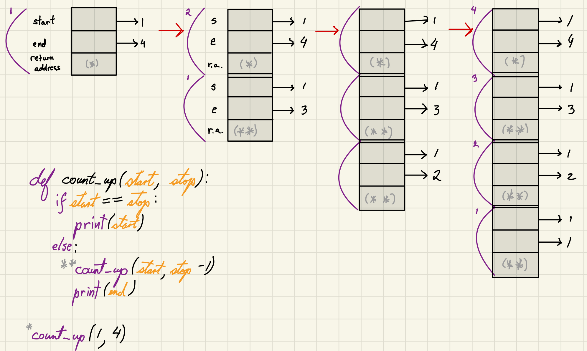
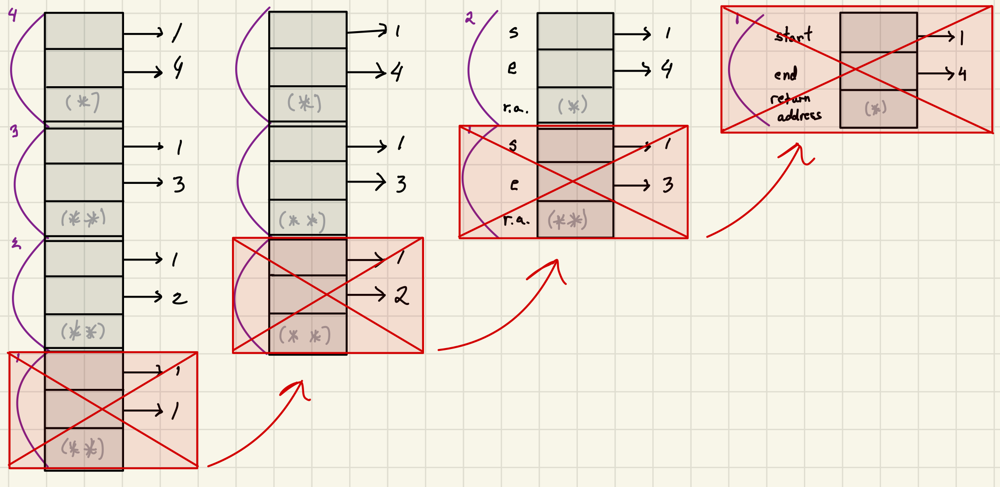

<h2 align=center>Week 06 and 07</h2>

<h1 align=center><code>Recursion</code></h1>

<p align=center><strong><em>Song of the day</strong>: <a href="https://youtu.be/IF2t2CeDhGg?si=mdggY3cwKEYKRcHG"><strong><u>Way Out</u></strong></a> by FKJ (2022).</em></p>

---

## Sections

---

## Recursion Review

Ah yes, recursion. Everybody's favourite topic in computer science. When you first look at it, it feels like it _shouldn't_ work, like it's magic, but then it _does_ work and it _isn't_ magic. Recursion is a big topic on its own, so you can imagine that calculating the runtime of a recursive algorithm isn't exactly a walk in the park either. Not to worry though, we'll slowly build up to it.

It would help to provide a formal definition to work with, first:

> In computer science, **recursion** is a problem solving technique, closely related to [**mathematical induction**](https://en.wikipedia.org/wiki/Mathematical_induction), where we define the solution as a combination of solutions to smaller instances of the same problem.

As we've already seen in 1114, recursive algorithms are comprised of two parts:

1. The **base case**, whereby we must:
    1. Identify how to measure the size of the input.
    2. Find the condition that tests for the smallest possible input.
    3. Formulate the solution of the problem for the smallest possible input.
2. The **recursive step**, whereby we must:
    1. Define the recursion hypothesis and assume that “when calling the function with a smaller input, it would do its job”.
    2. Based on this assumption, find how to combine calls to smaller instances in order to solve the problem for the given input.

Let's start with a simple example by counting up from one number to another:

```python
def count_up(start, end):
    if start == end:
        # the base case
        print(start)
    else:
        # the recursive step
        count_up(start, end - 1)
        print(end)
    
count_up(1, 5)
```

Here, our base case is when counting up becomes trivial: that is, when there's only one number to count, we don't have to count at all—we simply print.

If there's more than one number to count, our recursive hypothesis is that “when calling `count_up` with a smaller range, it will print the numbers in that range in an increasing order”. In other words, until the problem becomes trivial, keep decreasing the size of the input.

### Recursion in Memory

Mapping out recursion in memory is rather interesting. When you make a function call, that call is placed on something called the "call stack," which you can consider a sequential to-do list. If we have three tasks in our to-do list (say, tasks 1, 2, and 3) and we add a fourth (task 4), _we cannot take care of tasks 1-3 until we take care of task 4_. By the same token, we cannot take care of tasks 1 and 2 until we take care of task 3, and so on.


The same thing applies with recursive function calls. Absolutely nothing else can happen in our program until that function is removed from the call stack (i.e. when the function is finished running):




<sub>**Figures 1 & 2**: The progression of the call stack after a function call `count_up(1, 4)`.</sub>


<sub>**Figure 3**: This same progression of the call stack as shown in our [**code visualiser**](https://pythontutor.com/).</sub>

In figures 1 and 2, the first function call is denoted by the **`*`** character, while each recursive call after that is denoted by a **`**`**. As you can see (by reading the diagrams from left-to-right), the first function call does not get completely executed until the very last step, _after every recursive call has been, itself, called an executed._ In that sense, we're basically going down to the last possible recursion level (in our case, printing `1`) before even thinking of what follows a recursive call.

A different version of this algorithm might look like this:

```python
# assumes start <= end
# prints a sequence of
# ascending values, one per line

def count_up(start, end):
	if start == end:
		print(start)
	else:
		print(start)
		count_up(start + 1, end)

count_up(1, 4)
```

This version does something very similar, except that the lowest possible recursion level prints `5` instead, since we're incrementing the value of `start` instead of decrementing the value of `end`:


<sub>**Figure 4**: The progression of the call stack for the second version of our algorithm.</sub>

Finally, we might envision a version of this code that does something similar to binary search and "splits" the counting "in half":

```python
# assumes start <= end
# prints a sequence of ascending values, one per line

def count_up(start, end):
	if start == end:
		print(start)
	else:
		mid = (start + end) // 2
        count_up(start, mid)
		count_up(mid+1, end)

count_up(4)
```