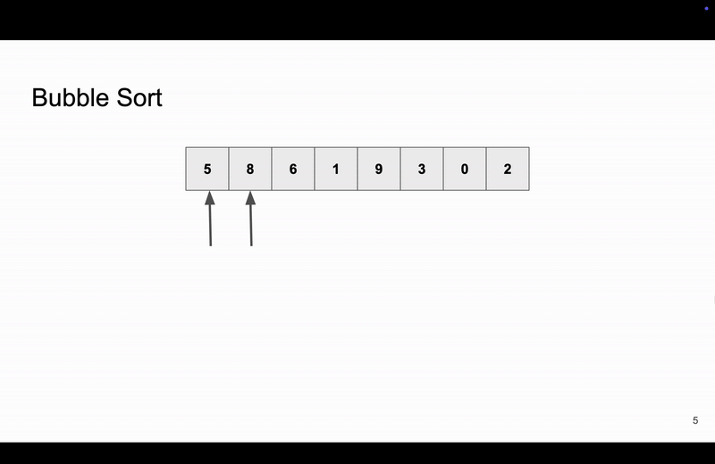

<h2 align=center>Weeks 07 and 08</h2>

<h1 align=center>Sorting Algorithms</h1>

<p align=center><strong><em>Song of the day</strong>: <a href="https://youtu.be/Oz6MHPIhZEg?si=tvCMFcHSRpyjf04I"><strong><u>Day Tripper (BBC Sessions)</u></strong></a> by The Jimi Hendrix Experience (1967)</em></p>

---

## **Sections**

1. [**The Sorting Problem**](#1)
2. [**Selection Sort**](#2)
    1. [**Implementation**](#2-1)
    2. [**Time Complexity**](#2-2)
3. [**Bubble Sort**](#3)
    1. [**Implementation**](#3-1)
    2. [**Time Complexity**](#3-2)
4. [**Insertion Sort**](#4)
    1. [**Implementation**](#4-1)
    2. [**Time Complexity**](#4-2)
5. [**Correctness & Loop Invariants**](#5)
6. [**Merge Sort**](#6)
    1. [**Implementation**](#6-1)
    2. [**Time Complexity**](#6-2)


---

<a id="1"></a>

## **The Sorting Problem**

Just like searching, sorting is one of those incredibly fundamental operations in computer science. It allows us to organize data in a meaningful order, making tasks—like searching itself (recall that binary search presupposes that a list be already sorted)—more efficient.

This _sorting problem_ can be posed in the following way: 

> Given a list, `lst`, of numbers (or really any data), **reorder** them so that at the end they are in _ascending order_.

For example, given a Python list of integers:

```python
lst = [5, 8, 12, 7, 8, 10]
```

Calling the following would sort the list in the following way:

```python
some_sort(lst)
print(lst)
```

Output:

```
[5, 7, 8, 8, 10, 12]
```

Notice that our generic `some_sort` function here is _not_ creating a new sorted list but is rather **mutating the original list, `lst`**. This is going to be a common theme across all of the sorting algorithms that we'll go over. In general, we wanna minimise creating new lists, though as we'll see, this is not always possible.

<br>

<a id="2"></a>

## [**Selection Sort**](https://www.sortvisualizer.com/selectionsort/)

To me, the easiest sorting algorithm is _selection sort_. As the name implies, selection Sort repeatedly selects the smallest element and swaps it with the first _unsorted_ element of the list. This process continues until the entire list is sorted. So...

1. Find the smallest element in the unsorted portion.
2. Swap it with the first unsorted element.
3. Move the boundary of the sorted section one step forward.

Using our list from above, we could visualise these steps as follows:


<sub>**Figure 1**: A visual guide to selection sort, where the current iteration's swap is represented in green and the next iteration's swap is represented in orange.</sub>

<a id="2-1"></a>

### [**Implementation**](code/selection_sort.py)

```python
def swap(lst, curr, min_idx):
    temp = lst[curr]          # Θ(1)
    lst[curr] = lst[min_idx]  # Θ(1)
    lst[min_idx] = temp       # Θ(1)

def selection_sort(lst):
    n = len(lst)                       # Θ(1)

    # Θ(n)
    for curr in range(n):
        min_idx = curr                 # Θ(1)

        # Θ(curr) === Θ(n)
        for j in range(curr + 1, n):
            if lst[j] < lst[min_idx]:  # Θ(1)
                min_idx = j            # Θ(1)
        swap(lst, curr, min_idx)       # Θ(1)
```

<a id="2-2"></a>

### **Time Complexity**

> **T(`n`) = Σ(`curr` = 1 to `n`) `curr`**
>
> **T(`n`) = 1 + 2 + 3 + ... + `n`**
>
> **T(`n`) = (`n` * (`n` - 1)) / 2**
>
> **T(`n`) = O(`n`²) = Θ(`n`²)**

- **Best Case:** Ω(`n`²)
- **Worst Case:** O(`n`²)
- **Average Case:** Θ(`n`²)

The accursed quadratic runtime; life can't always be easy. Selection Sort simple to understand and even works well for small lists, but is incredibly inefficient for large datasets.

<br>

<a id="3"></a>

## [**Bubble Sort**](https://www.sortvisualizer.com/bubblesort/)

Bubble Sort's got a cute name because it's got a cute way of sorting through its elements. It repeatedly compares _adjacent elements_ and swaps them _if they are out of order_. This process continues until the list is sorted.

In other words:

1. **Compare adjacent elements:**  
   - Start from the **beginning of the list**.
   - Compare each element with the one next to it.

2. **Swap if needed:**  
   - If the current element is **greater** than the next element, swap them.
   - This pushes the **larger values toward the end** of the list.

3. **Repeat until the largest element is in place:**  
   - Continue comparing and swapping until the **largest unsorted element reaches the last position**.
   - This completes **one full pass** through the list.

4. **Reduce the unsorted section and repeat:**  
   - On the **next pass**, ignore the last sorted element (since it is already in place).
   - Continue bubbling up the **next largest** element.

Using our list from above, we can trace the way this swapping takes place the following way:



<sub>**Figure 2**: A simple animation of bubble sort. The steps involved are listed below.</sub>

```
STARTING LIST:
[5, 8, 6, 1, 9, 3, 0, 1]


FIRST PASS:
lst[0] -> 5
lst[1] -> 8
No swap.
[5, 8, 6, 1, 9, 3, 0, 1]

lst[1] -> 8
lst[2] -> 6
Swap!
[5, 6, 8, 1, 9, 3, 0, 1]

lst[2] -> 8
lst[3] -> 1
Swap!
[5, 6, 1, 8, 9, 3, 0, 1]

lst[3] -> 8
lst[4] -> 9
No swap.
[5, 6, 1, 8, 9, 3, 0, 1]

lst[4] -> 9
lst[5] -> 3
Swap!
[5, 6, 1, 8, 3, 9, 0, 1]

lst[5] -> 9
lst[6] -> 0
Swap!
[5, 6, 1, 8, 3, 0, 9, 1]

lst[6] -> 9
lst[7] -> 1
Swap!
[5, 6, 1, 8, 3, 0, 1, 9]


SECOND PASS:
lst[0] -> 5
lst[1] -> 6
No swap.
[5, 6, 1, 8, 3, 0, 1, 9]

lst[1] -> 6
lst[2] -> 1
Swap!
[5, 1, 6, 8, 3, 0, 1, 9]

lst[2] -> 6
lst[3] -> 8
No swap.
[5, 1, 6, 8, 3, 0, 1, 9]

lst[3] -> 8
lst[4] -> 3
Swap!
[5, 1, 6, 3, 8, 0, 1, 9]

lst[4] -> 8
lst[5] -> 0
Swap!
[5, 1, 6, 3, 0, 8, 1, 9]

lst[5] -> 8
lst[6] -> 1
Swap!
[5, 1, 6, 3, 0, 1, 8, 9]


THIRD PASS:
lst[0] -> 5
lst[1] -> 1
Swap!
[1, 5, 6, 3, 0, 1, 8, 9]

lst[1] -> 5
lst[2] -> 6
No swap.
[1, 5, 6, 3, 0, 1, 8, 9]

lst[2] -> 6
lst[3] -> 3
Swap!
[1, 5, 3, 6, 0, 1, 8, 9]

lst[3] -> 6
lst[4] -> 0
Swap!
[1, 5, 3, 0, 6, 1, 8, 9]

lst[4] -> 6
lst[5] -> 1
Swap!
[1, 5, 3, 0, 1, 6, 8, 9]


FOURTH PASS:
lst[0] -> 1
lst[1] -> 5
No swap.
[1, 5, 3, 0, 1, 6, 8, 9]

lst[1] -> 5
lst[2] -> 3
Swap!
[1, 3, 5, 0, 1, 6, 8, 9]

lst[2] -> 5
lst[3] -> 0
Swap!
[1, 3, 0, 5, 1, 6, 8, 9]

lst[3] -> 5
lst[4] -> 1
Swap!
[1, 3, 0, 1, 5, 6, 8, 9]


FIFTH PASS:
lst[0] -> 1
lst[1] -> 3
No swap.
[1, 3, 0, 1, 5, 6, 8, 9]

lst[1] -> 3
lst[2] -> 0
Swap!
[1, 0, 3, 1, 5, 6, 8, 9]

lst[2] -> 3
lst[3] -> 1
Swap!
[1, 0, 1, 3, 5, 6, 8, 9]


SIXTH PASS:
lst[0] -> 1
lst[1] -> 0
Swap!
[0, 1, 1, 3, 5, 6, 8, 9]

lst[1] -> 1
lst[2] -> 1
No swap.
[0, 1, 1, 3, 5, 6, 8, 9]


SEVENTH PASS:
lst[0] -> 0
lst[1] -> 1
No swap.
[0, 1, 1, 3, 5, 6, 8, 9]


FINAL LIST:
[0, 1, 1, 3, 5, 6, 8, 9]
```

<a id="3-1"></a>

### [**Implementation**](code/bubble_sort.py)

```python
def bubble_sort(lst):
    n = len(lst)  # Θ(1)
    
    # Θ(n)
    for i in range(n - 1):

        # Θ(i) === Θ(n)
        for j in range(n - i - 1):
            if lst[j] > lst[j + 1]:  # Θ(1)
                # swap
                temp = lst[j + 1]    # Θ(1)
                lst[j + 1] = lst[j]  # Θ(1)
                lst[j] = temp        # Θ(1)
```

The logic behind this implementation is the following:

1. **Outer Loop (`for i in range(n - 1)`)**  
   - The sorting process runs for `n - 1` passes.  
   - With each pass, the **largest remaining element moves to its correct position at the end**.

2. **Inner Loop (`for j in range(n - i - 1)`)**  
   - The inner loop **compares adjacent elements** (`lst[j]` and `lst[j + 1]`).  
   - It runs `n - i - 1` times, meaning it ignores the last `i` elements (which are already sorted).

3. **Compare & Swap (`if lst[j] > lst[j + 1]`)**  
   - If the left element is **greater** than the right one, they are swapped.  
   - This ensures that larger elements "bubble up" toward the end of the list.

4. **Repeat Until the List is Sorted**  
   - The outer loop **reduces the unsorted portion** of the list with each iteration.  
   - The largest element is placed in the correct position after each pass.

<a id="3-2"></a>

### **Time Complexity**

> **T(`n`) = Σ(`i` = 1 to `n`) `i`**
>
> **T(`n`) = 1 + 2 + 3 + ... + `n`**
>
> **T(`n`) = (`n` * (`n` - 1)) / 2**
>
> **T(`n`) = O(`n`²) = Θ(`n`²)**

- **Best Case:** Ω(`n`) (already sorted list)
- **Worst Case:** O(`n`²)
- **Average Case:** Θ(`n`²)

Oh well, we tried. Let's keep going.

<br>

<a id="4"></a>

## **Insertion Sort**

Insertion Sort builds the sorted list one element at a time by inserting each new element into its correct position.

### **Steps for Insertion Sort**
Insertion Sort builds the sorted list one element at a time by inserting each new element into its correct position.

1. **Start with a partially sorted list**  
   - Assume that the **first element is already sorted**.
   - The remaining elements are **unsorted**.

2. **Pick the next element**  
   - Take the **first unsorted element** and prepare to insert it into the correct position.

3. **Shift elements to make space**  
   - Compare the element to the ones before it.
   - If an element is **larger**, shift it to the right to make space for insertion.

4. **Insert the element in its correct position**  
   - Once a smaller or equal element is found (or the beginning is reached), **place the element there**.

5. **Repeat until all elements are sorted**  
   - Move to the next unsorted element and repeat the process.

```
- STARTING LIST:
[5, 8, 6, 1, 9, 3, 0, 2]


- PASS #1:

idx -> 1
Current (lst[idx]) -> 8
List before insertion: [5, 8, 6, 1, 9, 3, 0, 2]
-----------------------------------------------------------------
Inserting...
[idx: 1] Is lst[idx - 1] (5) > current (8)? No, so we stop here.
-----------------------------------------------------------------
List after insertion: [5, 8, 6, 1, 9, 3, 0, 2]


- PASS #2:

idx -> 2
Current (lst[idx]) -> 6
List before insertion: [5, 8, 6, 1, 9, 3, 0, 2]
-----------------------------------------------------------------
Inserting...
[idx: 2] Is lst[idx - 1] (8) > current (6)? Yes
Then SWAP! lst[2] (6) <-> lst[1] (8)

[idx: 1] Is lst[idx - 1] (5) > current (6)? No, so we stop here.
-----------------------------------------------------------------
List after insertion: [5, 6, 8, 1, 9, 3, 0, 2]


- PASS #3:

idx -> 3
Current (lst[idx]) -> 1
List before insertion: [5, 6, 8, 1, 9, 3, 0, 2]
-----------------------------------------------------------------
Inserting...
[idx: 3] Is lst[idx - 1] (8) > current (1)? Yes
Then SWAP! lst[3] (1) <-> lst[2] (8)

[idx: 2] Is lst[idx - 1] (6) > current (1)? Yes
Then SWAP! lst[2] (8) <-> lst[1] (6)

[idx: 1] Is lst[idx - 1] (5) > current (1)? Yes
Then SWAP! lst[1] (6) <-> lst[0] (5)
-----------------------------------------------------------------
List after insertion: [1, 5, 6, 8, 9, 3, 0, 2]


- PASS #4:

idx -> 4
Current (lst[idx]) -> 9
List before insertion: [1, 5, 6, 8, 9, 3, 0, 2]
-----------------------------------------------------------------
Inserting...
[idx: 4] Is lst[idx - 1] (8) > current (9)? No, so we stop here.
-----------------------------------------------------------------
List after insertion: [1, 5, 6, 8, 9, 3, 0, 2]


- PASS #5:

idx -> 5
Current (lst[idx]) -> 3
List before insertion: [1, 5, 6, 8, 9, 3, 0, 2]
-----------------------------------------------------------------
Inserting...
[idx: 5] Is lst[idx - 1] (9) > current (3)? Yes
Then SWAP! lst[5] (3) <-> lst[4] (9)

[idx: 4] Is lst[idx - 1] (8) > current (3)? Yes
Then SWAP! lst[4] (9) <-> lst[3] (8)

[idx: 3] Is lst[idx - 1] (6) > current (3)? Yes
Then SWAP! lst[3] (8) <-> lst[2] (6)

[idx: 2] Is lst[idx - 1] (5) > current (3)? Yes
Then SWAP! lst[2] (6) <-> lst[1] (5)

[idx: 1] Is lst[idx - 1] (1) > current (3)? No, so we stop here.
-----------------------------------------------------------------
List after insertion: [1, 3, 5, 6, 8, 9, 0, 2]


- PASS #6:

idx -> 6
Current (lst[idx]) -> 0
List before insertion: [1, 3, 5, 6, 8, 9, 0, 2]
-----------------------------------------------------------------
Inserting...
[idx: 6] Is lst[idx - 1] (9) > current (0)? Yes
Then SWAP! lst[6] (0) <-> lst[5] (9)

[idx: 5] Is lst[idx - 1] (8) > current (0)? Yes
Then SWAP! lst[5] (9) <-> lst[4] (8)

[idx: 4] Is lst[idx - 1] (6) > current (0)? Yes
Then SWAP! lst[4] (8) <-> lst[3] (6)

[idx: 3] Is lst[idx - 1] (5) > current (0)? Yes
Then SWAP! lst[3] (6) <-> lst[2] (5)

[idx: 2] Is lst[idx - 1] (3) > current (0)? Yes
Then SWAP! lst[2] (5) <-> lst[1] (3)

[idx: 1] Is lst[idx - 1] (1) > current (0)? Yes
Then SWAP! lst[1] (3) <-> lst[0] (1)
-----------------------------------------------------------------
List after insertion: [0, 1, 3, 5, 6, 8, 9, 2]


- PASS #7:

idx -> 7
Current (lst[idx]) -> 2
List before insertion: [0, 1, 3, 5, 6, 8, 9, 2]
-----------------------------------------------------------------
Inserting...
[idx: 7] Is lst[idx - 1] (9) > current (2)? Yes
Then SWAP! lst[7] (2) <-> lst[6] (9)

[idx: 6] Is lst[idx - 1] (8) > current (2)? Yes
Then SWAP! lst[6] (9) <-> lst[5] (8)

[idx: 5] Is lst[idx - 1] (6) > current (2)? Yes
Then SWAP! lst[5] (8) <-> lst[4] (6)

[idx: 4] Is lst[idx - 1] (5) > current (2)? Yes
Then SWAP! lst[4] (6) <-> lst[3] (5)

[idx: 3] Is lst[idx - 1] (3) > current (2)? Yes
Then SWAP! lst[3] (5) <-> lst[2] (3)

[idx: 2] Is lst[idx - 1] (1) > current (2)? No, so we stop here.
-----------------------------------------------------------------
List after insertion: [0, 1, 2, 3, 5, 6, 8, 9]


- FINAL LIST:
[0, 1, 2, 3, 5, 6, 8, 9]
```

<a id="4-1"></a>

### [**Implementation**](code/insertion_sort.py)

```python
def insertion_sort(lst):
    # Θ(n)
    for curr_idx in range(1, len(lst)):
        curr = lst[curr_idx]  # Θ(1)
        j = curr_idx          # Θ(1)

        # Θ(curr_idx) === Θ(n)
        while j >= 1 and lst[j - 1] > curr:
            lst[j] = lst[j - 1]  # Θ(1)
            j -= 1               # Θ(1)

        lst[j] = curr            # Θ(1)
```

To understand what's going on here, let's break down each line by what it represents. Note that the implementation uses `j` instead of `idx`, which I use above:

1. **Outer Loop (`for curr_idx in range(1, len(lst))`)**  
   - The algorithm starts at index `1` because the **first element is already "sorted"**.  
   - It runs **`n-1` times**, inserting one element per iteration.

2. **Pick the current element (`curr = lst[curr_idx]`)**  
   - Store the element at `curr_idx` (the **first unsorted element**) in `curr`.  
   - Prepare to insert it into the sorted portion.

3. **Shift elements right if needed (`while j >= 1 and lst[j - 1] > curr`)**  
   - Start at `j = curr_idx`, comparing `curr` to elements before it.  
   - If the previous element (`lst[j - 1]`) is **larger**, shift it right.  
   - Keep moving left (`j -= 1`) until the correct position is found.

4. **Insert the element in its correct position (`lst[j] = curr`)**  
   - After shifting larger elements, place `curr` into its **sorted position**.

5. **Repeat until the list is sorted**  
   - The loop continues until all elements have been processed.

<a id="4-2"></a>

### **Time Complexity**

> **T(`n`) = Σ(`curr_idx` = 1 to `n`) `curr_idx`**
>
> **T(`n`) = 1 + 2 + 3 + ... + `n`**
>
> **T(`n`) = (`n` * (`n` - 1)) / 2**
>
> **T(`n`) = O(`n`²) = Θ(`n`²)**

- **Best Case:** Ω(`n`) (already sorted list)
- **Worst Case:** O(`n`²)
- **Average Case:** Θ(`n`²)

Insertion Sort is still not quite it. It _is_ efficient for small datasets and nearly sorted lists, but ultimately we still get an asymptotic runtime of `n`². We're going to need to get creative if we want to improve the runtime of our sorting.

<br>

<a id="5"></a>

## **Correctness & Loop Invariants**

Remember when we started looking at asymptotic analysis the first thing we did was [**prove the correctness of checking for primality**](https://github.com/sebastianromerocruz/CS1134-data-structures-and-algorithms/tree/main/lectures/03-asymptotic-analysis#testing-for-prime-numbers)? Now, I did mention that this class doesn't so much focus on the correctness of the algorithms that we look at as much as their runtime—something more readily applicable. However, there is this one concept when it comes to the correctness of algorithms that does fit pretty nicely when it comes with sorting, and that is of the _loop invariant_.

A **loop invariant** is a condition that is always true **before and after every iteration** of a loop. Through it, It we can prove that an algorithm works correctly in a structures way. The way it works is as follows. When reasoning about any given algorithm, we need to show that:

1. **Initialisation**: The invariant is true **before the loop starts**.
2. **Maintenance**: If the invariant is true before an iteration, it **remains true** after the iteration.
3. **Termination**: When the loop ends, the invariant ensures the desired result has been achieved.

Let's take insertion sort as an example. In insertion sort, the loop invariant is:
> "At the start of each iteration `i`, the first `i` elements of the list are sorted."

So, to prove this, we say that:
1. **Initialization:** Before the loop starts, the first element `lst[0]` is trivially sorted.
2. **Maintenance:** At iteration `i`, the sublist `lst[:i]` is sorted. The algorithm inserts `lst[i]` into its correct position, ensuring that `lst[:i + 1]` remains sorted.
3. **Termination:** When `i = n`, we have `lst[:n]`, meaning the entire list is sorted.

```python
def insertion_sort(lst):
    for i in range(1, len(lst)):
        key = lst[i]
        j = i - 1

        while j >= 0 and lst[j] > key:
            lst[j + 1] = lst[j]  # Shift elements right
            j -= 1

        lst[j + 1] = key  # Insert element in correct place
```

That's all there is to it. Of course, proving the correctness of an algorithm goes into much more depth than this, but you can worry about that in a couple of semesters. Let's move on to more efficient sorting algorithms.

<br>

<a id="6"></a>

## [**Merge Sort**](https://www.sortvisualizer.com/mergesort/)

Merge Sort follows a **divide-and-conquer** approach, where the problem is recursively broken down into smaller sub-problems and then merged back together in sorted order.

1. **Base Case**: If the list has _0 or 1 elements_, it is already sorted. Simply return.
2. **Divide**: Split the list into _two halves_ (left and right).
3. **Conquer**: Recursively call Merge Sort on both halves to sort them.
4. **Combine**: Merge the two sorted halves back together using the _merge_ function.
5. **Copy Back**: Replace the original list with the merged, sorted version.

```
STARTING LIST:
- [5, 8, 6, 1, 9, 3, 0, 2]

SPLITTING [5, 8, 6, 1, 9, 3, 0, 2] INTO:
 -> left_side: [5, 8, 6, 1]
 -> right_side: [9, 3, 0, 2]

SPLITTING [5, 8, 6, 1] INTO:
 -> left_side: [5, 8]
 -> right_side: [6, 1]

SPLITTING [5, 8] INTO:
 -> left_side: [5]
 -> right_side: [8]

MERGING [5] AND [8]...
 - Adding left_side[0] -> 5
 - Adding right_side[0] -> 8
Merged list: [5, 8]

SPLITTING [6, 1] INTO:
 -> left_side: [6]
 -> right_side: [1]

MERGING [6] AND [1]...
 - Adding right_side[0] -> 1
 - Adding left_side[0] -> 6
Merged list: [1, 6]

MERGING [5, 8] AND [1, 6]...
 - Adding right_side[0] -> 1
 - Adding left_side[0] -> 5
 - Adding right_side[1] -> 6
 - Adding left_side[1] -> 8
Merged list: [1, 5, 6, 8]

SPLITTING [9, 3, 0, 2] INTO:
 -> left_side: [9, 3]
 -> right_side: [0, 2]

SPLITTING [9, 3] INTO:
 -> left_side: [9]
 -> right_side: [3]

MERGING [9] AND [3]...
 - Adding right_side[0] -> 3
 - Adding left_side[0] -> 9
Merged list: [3, 9]

SPLITTING [0, 2] INTO:
 -> left_side: [0]
 -> right_side: [2]

MERGING [0] AND [2]...
 - Adding left_side[0] -> 0
 - Adding right_side[0] -> 2
Merged list: [0, 2]

MERGING [3, 9] AND [0, 2]...
 - Adding right_side[0] -> 0
 - Adding right_side[1] -> 2
 - Adding left_side[0] -> 3
 - Adding left_side[1] -> 9
Merged list: [0, 2, 3, 9]

MERGING [1, 5, 6, 8] AND [0, 2, 3, 9]...
 - Adding right_side[0] -> 0
 - Adding left_side[0] -> 1
 - Adding right_side[1] -> 2
 - Adding right_side[2] -> 3
 - Adding left_side[1] -> 5
 - Adding left_side[2] -> 6
 - Adding left_side[3] -> 8
 - Adding right_side[3] -> 9
Merged list: [0, 1, 2, 3, 5, 6, 8, 9]

FINAL LIST:
 - [0, 1, 2, 3, 5, 6, 8, 9]
```

<a id="6-1"></a>

### [**Implementation**](code/merge_sort.py)

```python
def merge_sort(lst):
    if len(lst) == 0:     # Θ(1)
        return            # Θ(1)
    elif len(lst) == 1:   # Θ(1)
        return            # Θ(1)
    else:
        mid = len(lst) // 2      # Θ(1)
        left_lst = lst[ : mid]   # Θ(n)
        right_lst = lst[mid : ]  # Θ(n)
        
        merge_sort(left_lst)
        merge_sort(right_lst)
        
        merged = merge(left_lst, right_lst)  # Θ(n)
        
        for i in range(len(merged)):
            lst[i] = merged[i]   # Θ(n)


def merge(srt_lst1, srt_lst2):
    merged_list = []  # Θ(1)
    idx_1 = 0         # Θ(1)
    idx_2 = 0         # Θ(1)
    
    # Θ(n)
    while idx_1 < len(srt_lst1) and idx_2 < len(srt_lst2):
        if srt_lst1[idx_1] < srt_lst2[idx_2]:    # Θ(1)
            merged_list.append(srt_lst1[idx_1])  # Θ(1)
            idx_1 += 1                           # Θ(1)
        else:
            merged_list.append(srt_lst2[idx_2])  # Θ(1)
            idx_2 += 1                           # Θ(1)

    # Θ(n)  
    while idx_1 < len(srt_lst1):                 # Θ(1)
        merged_list.append(srt_lst1[idx_1])      # Θ(1)
        idx_1 += 1                               # Θ(1)

    # Θ(n)  
    while idx_2 < len(srt_lst2):                 # Θ(1)
        merged_list.append(srt_lst2[idx_2])      # Θ(1)
        idx_2 += 1                               # Θ(1)
        
    return merged_list                           # Θ(1)
```

Following the given code, merge sort proceeds as:

1. **Check if the list is already sorted** (base case):
   - If `lst` has **0 or 1 elements**, return immediately.

2. **Find the middle index** of `lst`:
   - `mid = len(lst) // 2`

3. **Split the list into two halves**:
   - `left_lst = lst[:mid]` → first half
   - `right_lst = lst[mid:]` → second half

4. **Recursively apply Merge Sort** to both halves:
   - `merge_sort(left_lst)`
   - `merge_sort(right_lst)`

5. **Merge the sorted halves**:
   - `merged = merge(left_lst, right_lst)`
   - The `merge` function itself does the following:
        1. **Initialize empty merged list** and two index pointers:
            - `merged_list = []`
            - `idx_1 = 0` (tracks position in `srt_lst1`)
            - `idx_2 = 0` (tracks position in `srt_lst2`)

        2. **Iterate while both lists have elements left**:
            - Compare `srt_lst1[idx_1]` and `srt_lst2[idx_2]`
            - Append the smaller element to `merged_list`
            - Move the corresponding pointer forward

        3. **Copy any remaining elements**:
            - If `srt_lst1` has leftover elements, append them.
            - If `srt_lst2` has leftover elements, append them.

        4. **Return the merged, sorted list**.

6. **Copy merged values back into the original list**:
   - Iterate over `merged` and update `lst[i]` accordingly.

<a id="6-2"></a>

### **Time Complexity**

- **Splitting the list**: Θ(`n`) (each level)
- **Merge function**: Θ(`n`) (each level)
- **Number of levels**: log₂(`n`) (since we halve the list each time)

The total cost at each level is therefore:

> T(`n`) = Θ(`n`) + Θ(`n`) + Θ(`n`) + ... (log₂(`n`) times)
>
> T(`n`) = Θ(`n` log`⁡n`)

Therefore...

> T(`n`) = 2 * T(`n` / 2) + O(`n`) = O(`n` log`n`) = **Θ(`n` log`n`)**

- **Best Case:** O(n log n)
- **Worst Case:** O(n log n)
- **Average Case:** O(n log n)

Now, a common optimization strategy in in this class is to avoid list slicing, replacing it with two pointers (low and high indices). However, this would actually not improve the overall runtime, asymptotically. Here’s why:
    - List slicing takes Θ(`n`) per level due to memory allocation for new lists.
    - Instead of `left_lst = lst[:mid]`, we could pass index ranges to avoid copying. This would eliminate the Θ(n) copy cost, but...
    - Merging still takes Θ(`n`) at each level, and
    - Recursive calls still go down log₂(`n`) levels.

Thus, while reducing slicing can reduce constant factors, the overall complexity remains Θ(`n` log`n`).