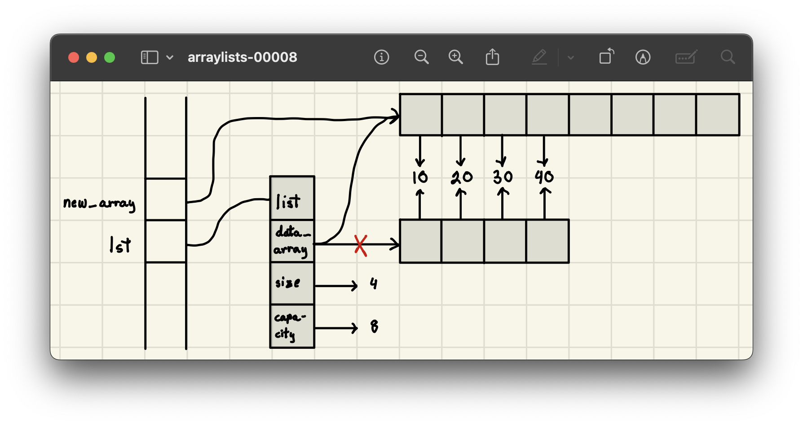

<h2 align=center>Week V: <em>Day 2</em></h2>

<h1 align=center><code>ArrayList</code></h1>

<p align=center><strong><em>Song of the day</strong>: <a href="https://youtu.be/ffwWRqpmUc8?si=Da6G_pK-_pClMBhP"><strong><u>Radio</u></strong></a> by Bershy (2022), recommended by Adalys U. A.</em></p>

---

## Sections

1. [**`ArrayList`: The True Story of Python Lists**](#3)
    1. [**Dynamic Array Growth**](#3-1)
    2. [**The Python Implementation**](#3-2)
2. [**Addendum A: _Important Summations To Know_**](#4)
3. [**Addendum B: _Dunder Methods_**](#5)

---

<a id="3"></a>

## **`ArrayList`: The True Story of Python Lists**

This all brings us back to Python lists. Consider the following piece of code:

```python
lst = []
for i in range(1, 6):
    lst.append(10 * i)
```

<a id="3-1"></a>

### **Dynamic Array Growth**

Initially, the list starts with a small capacity—just enough to hold a single element. As we append elements, Python dynamically resizes the list when necessary. The result is something like this:


<sub>**Figure 6**: The list's capacity doubles each time it runs out of space, resulting in three resizing operations here.</sub>

As we now know, Python doesn't simply expand the existing memory; instead, it creates a completely new, larger array, copies the existing elements into it, and then appends the new element. 

For instance, just when we're about to append `50` to the list, an accurate memory map would look like this:



<sub>**Figure 7**: The array portion of the list is stored in a separate memory location, and the resizing involves copying data to this new space.</sub>

<a id="3-2"></a>

### **The Python Implementation**

Behind the scenes, Python lists rely on a dynamic array implementation. While we can't see the exact C-level details directly, we can simulate a simplified version in Python:

```python
import ctypes  # provides low-level arrays


def make_array(n):
    return (n * ctypes.py_object)()


class ArrayList:
    def __init__(self):
        self.data_arr = make_array(1)
        self.capacity = 1
        self.n = 0

    def resize(self, new_size):
        new_array = make_array(new_size)
        for i in range(self.n):
            new_array[i] = self.data_arr[i]
        self.data_arr = new_array
        self.capacity = new_size

    def append(self, val):
        if (self.n == self.capacity):
            self.resize(2 * self.capacity)
        self.data_arr[self.n] = val
        self.n += 1

    def extend(self, iter_collection):
        for elem in iter_collection:
            self.append(elem)

    def __len__(self):
        return self.n

    def __getitem__(self, ind):
        if (not (0 <= ind <= self.n - 1)):
            raise IndexError('invalid index')
        return self.data_arr[ind]

    def __setitem__(self, ind, val):
        if (not (0 <= ind <= self.n - 1)):
            raise IndexError('invalid index')
        self.data_arr[ind] = val

    def __iter__(self):
        for i in range(len(self)):
            yield self.data_arr[i]  #could also yield self[i]
```

Note here in this implementation:
- The **`resize` method** handles the creation of a larger array and the transfer of existing elements.
- The **`append` method** doubles the array’s capacity when needed by calling `resize` and using `2 * self.capacity` as an argument.

<br>

<a id="4"></a>

## Addendum A: _Important Summations To Know_

1. 

> 1 + 2 + 3 + 4 + 5 + ... + `n` = `n`(`n` - 1) / 2 = **Θ(`n`<sup>2</sup>)**

2.

> 1 + 2 + 3 + 4 + 5 + ... + √`n` = **Θ(`n`)**

3.

> 1 + 2 + 3 + 4 + 5 + ... + log(`n`) = **Θ(log<sup>2</sup>(`n`))**

4.

> 1 + 2 + 4 + 8 + 16 + ... + 2<sup>`n`</sup> = 2<sup>`n` - 1</sup> - 1 = **Θ(2<sup>`n`</sup>)**

5.

> 1 + 2 + 4 + 8 + 16 + ... + `n` = 2`n` - 1 = **Θ(`n`)**

<br>

<a id="5"></a>

## Addendum B: _Dunder Methods_

| Common Syntax     | Special Method Form                  |
|--------------------|--------------------------------------|
| `a + b`           | `a.__add__(b)`, alternatively `b.__radd__(a)` |
| `a - b`           | `a.__sub__(b)`, alternatively `b.__rsub__(a)` |
| `a * b`           | `a.__mul__(b)`, alternatively `b.__rmul__(a)` |
| `a / b`           | `a.__truediv__(b)`, alternatively `b.__rtruediv__(a)` |
| `a // b`          | `a.__floordiv__(b)`, alternatively `b.__rfloordiv__(a)` |
| `a % b`           | `a.__mod__(b)`, alternatively `b.__rmod__(a)` |
| `a ** b`          | `a.__pow__(b)`, alternatively `b.__rpow__(a)` |
| `a << b`          | `a.__lshift__(b)`, alternatively `b.__rlshift__(a)` |
| `a >> b`          | `a.__rshift__(b)`, alternatively `b.__rrshift__(a)` |
| `a & b`           | `a.__and__(b)`, alternatively `b.__rand__(a)` |
| `a ^ b`           | `a.__xor__(b)`, alternatively `b.__rxor__(a)` |
| `a \| b`           | `a.__or__(b)`, alternatively `b.__ror__(a)` |
| `a += b`          | `a.__iadd__(b)`                     |
| `a -= b`          | `a.__isub__(b)`                     |
| `a *= b`          | `a.__imul__(b)`                     |
| `+a`              | `a.__pos__()`                       |
| `-a`              | `a.__neg__()`                       |
| `~a`              | `a.__invert__()`                    |
| `abs(a)`          | `a.__abs__()`                       |
| `a < b`           | `a.__lt__(b)`                       |
| `a <= b`          | `a.__le__(b)`                       |
| `a > b`           | `a.__gt__(b)`                       |
| `a >= b`          | `a.__ge__(b)`                       |
| `a == b`          | `a.__eq__(b)`                       |
| `a != b`          | `a.__ne__(b)`                       |
| `a in b`          | `a.__contains__(b)`                 |
| `a[k]`            | `a.__getitem__(k)`                  |
| `a[k] = v`        | `a.__setitem__(k, v)`               |
| `del a[k]`        | `a.__delitem__(k)`                  |
| `a(arg1, arg2, ...)` | `a.__call__(arg1, arg2, ...)`    |
| `len(a)`          | `a.__len__()`                       |
| `hash(a)`         | `a.__hash__()`                      |
| `iter(a)`         | `a.__iter__()`                      |
| `next(a)`         | `a.__next__()`                      |
| `bool(a)`         | `a.__bool__()`                      |
| `float(a)`        | `a.__float__()`                     |
| `int(a)`          | `a.__int__()`                       |
| `repr(a)`         | `a.__repr__()`                      |
| `reversed(a)`     | `a.__reversed__()`                  |
| `str(a)`          | `a.__str__()`                       |