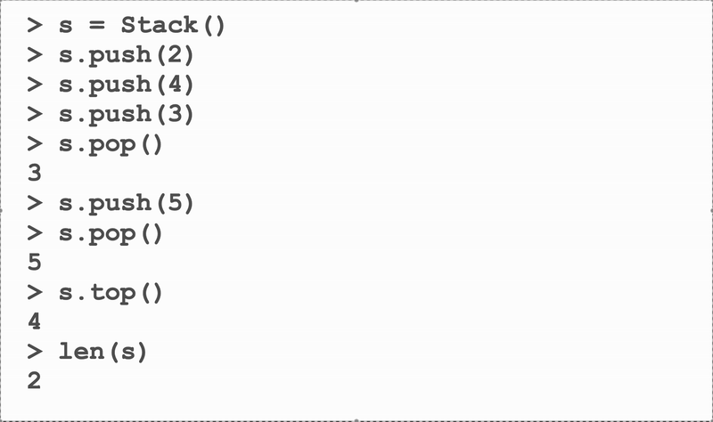
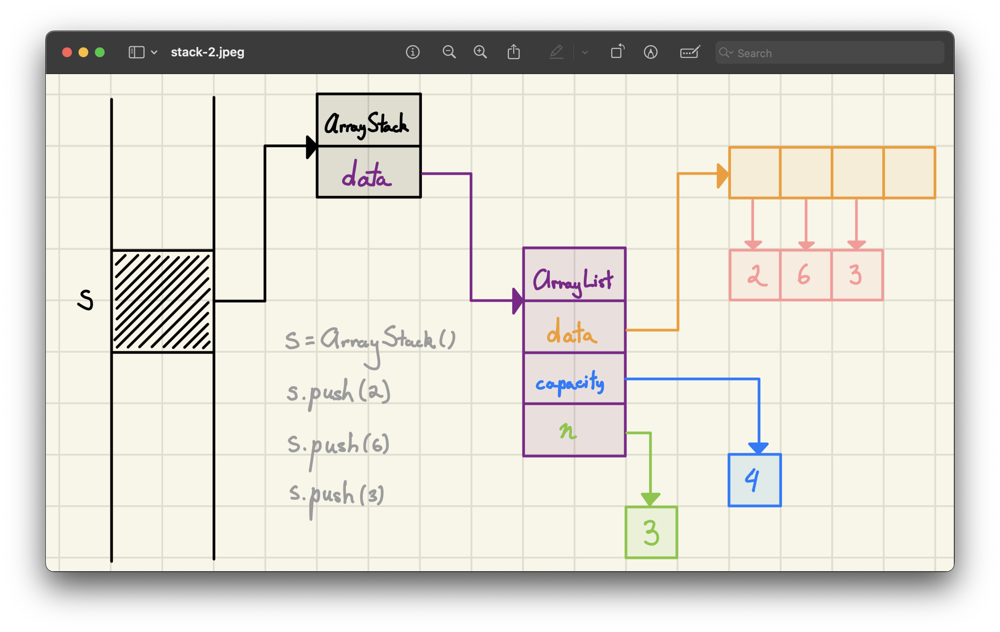
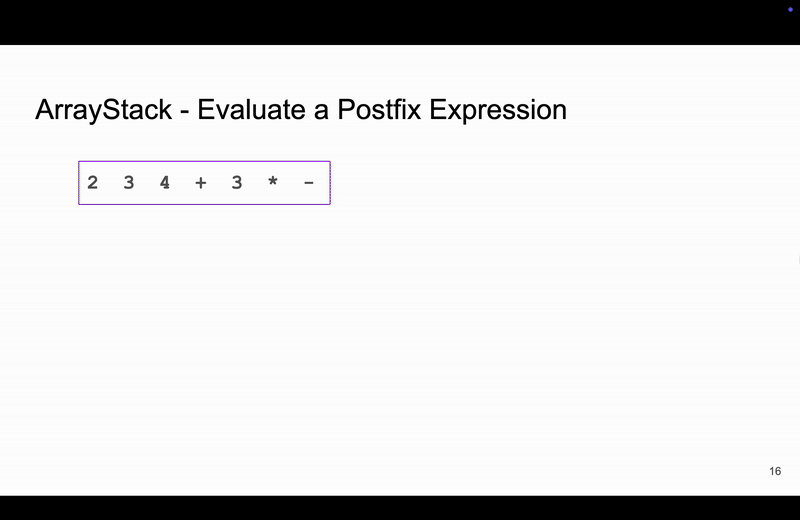

<h2 align=center>Week 08</h2>

<h1 align=center>Abstract Data Types: <em>Stacks</em></h1>

<p align=center><strong><em>Song of the day</strong>: <a href="https://youtu.be/_b_YVrex0yI?si=WA_M7UXSMMCqEha_"><strong><u>Sweet Disposition</u></strong></a> by Temper Trap (2010)</em></p>

---

## Sections

1. [**Abstract Data Types (ADTs)**](#1)
2. [**Stacks**](#2)
    1. [**What Are They?**](#2-1)
    2. [**Implementation**](#2-2)
        - [**Static**](#2-2-1)
        - [**Dynamic**](#2-2-2)
3. [**Problem-Solving Using Stacks**](#3)
    1. [**Reversing A String**](#3-1)
    2. [**Evaluating Polish Notation**](#3-2)

---

<a id="1"></a>

## Abstract Data Types (ADTs)

At this point, we have just about finished the "algorithms" portion of the course and will be going fully into the "data structures" section. Congratulations! In my opinion, the toughest part of the course is now over, and we can focus now in concepts that are applied in computer science on a daily basis.

We'll start with the most general conception of data structures here, which we call **abstract data types**. _Abstraction_ is a good concept to be familiar with in computer science. For our purposes, we define it as separating the interface of our programs (i.e. what the user sees when they use it) from its implementation (i.e. what the program actually does behind the scenes). Here's a couple of definitions you should be aware of.

- **Procedural Abstraction**: A group of steps treated as a single unit.
- **Data Abstraction**: A way to organize data without worrying about how it’s stored.

We have two types of abstraction:

| **Abstraction Type**       | **Interface (Public – User's View)**                           | **Implementation (Private – Developer's View)** |
|---------------------------|--------------------------------------------------------------|------------------------------------------------|
| **Procedural Abstraction** | Clearly defines what a function should do for each input    | The actual function that performs the steps   |
| **Data Abstraction**       | Abstract Data Type (ADT) – describes what operations can be done on the data | The data structure (coded as a class) – how the data is actually stored |

<sub>**Figure 1**: Object-oriented programming encompasses both of these abstractions, incidentally.</sub>

In other words...

- **Public (User's View)**: The interface tells us **what** we can do with the data.
- **Private (Developer's View)**: The implementation controls **how** the data is managed.
- **ADTs** help keep code **organized and flexible** by separating **how data is used** from **how it's stored**.

We will be covering multiple of these ADTs throughout the semester, and the we will start with one we've already sort of seen, called the ***stack***.

<br>

<a id="2"></a>

## Stacks

<a id="2-1"></a>

### What Are They?

Back when we first looked at recursion, we explained that recursive calls were placed on something called the [**call stack**](https://github.com/sebastianromerocruz/CS1134-data-structures-and-algorithms/tree/main/lectures/06-recursion#recursion-in-memory), and in order for it to be removed from it (that is, in order for it to finish execution), _any function calls done inside of it_—which are placed on top of it in the call stack—_must be removed first_. In a more simple program:

```python
def fun_1():
    print("Function 1")

def fun_2():
    print("Function 2")
    fun_1()

def fun_3():
    print("Function 3")
    fun_2():

fun_3()
```


<sub>**Figure 2**: On the lower right portion of this gif, you can watch function calls "stack" downwards. The call to function `fun_3` cannot be removed from the stack until the call to `fun_2` is removed, which itself cannot be removed until the call to `fun_1` is removed.</sub>

This sort of "order of operations" is referred to as **last-in-first-out**, or **LIFO**, since the last object to be placed on the stack is the first one to be popped out. The classic operations implemented into a stack are as follow:

|Operation|Description|
|-|-|
|`stack = Stack()`|Creates an empty stack|
|`len(stack)`|Returns the number of items currently on the stack|
|`stack.is_empty()`|Returns `True` is there are no items currenlty placed on the stack, `False` otherwise|
|`stack.push(item)`|Adds `item` to the top of the stack (insert)|
|`stack.pop()`|Removes and returns the top item currently in `stack` (i.e. the last one to have been added). If `stack` is empty, it will raise an exception.|
|`stack.top()`|Returns the top item currently in `stack` (i.e. the last one to have been added). If `stack` is empty, it will raise an exception.|

For example, in the following code:

```python
s = Stack()

s.push(2)
s.push(4)
s.push(3)
print(s.pop())  # 3

s.push(5)
print(s.pop())  # 5

print(s.top())  # 4
print(len(s))   # 2
```

Our stack would act something like this:



<sub>**Figure 3**: As you can see, `pop()` removes an element while also returning it, while `top()` only returns it.</sub>

Of course, Python doesn't have a built-in `Stack` object; we can simulate some of its functionality using Python lists to mimic its behaviour (e.g. `append()` for `push`, `pop()`, and `len()`), but ultimately some of it is still missing (e.g. `top()`/`peek()` and `is_empty()`).

Also, are stacks _static_? That is, if we fill our stack with items and attempt to push one more element, does it give us an error, or does it resize? Well, since the implementation is largely up to us, we can work with either. Let's do that.

<br>

<a id="2-2"></a>

### [**Implementation**](code/Stack.py)



<sub>**Figure 4**: Memory diagram of a stack implemented using an [**`ArrayList`**](https://github.com/sebastianromerocruz/CS1134-data-structures-and-algorithms/tree/main/lectures/05-arraylists#week-04-and-05). Notice that it's been dynamically resized once.</sub>

As stated earlier, there are two versions of a stack we could implement: a _static_ (fixed-size) one and a _dynamic_ one. For the latter, we make use of the `ArrayList` implementation we've developed over the semester, where we would aim for the following operational runtimes:

|Operation|Runtime|
|-|-|
|`len()`|Θ(1) - worst case|
|`is_empty()`|Θ(1) - worst case|
|`push(item)`|Θ(1) - amortised|
|`pop()`|Θ(1) - amortised|
|`top()`|Θ(1) - worst case|

<sub>**Figure 5**: Note the amortisation of operations that occasionally require resizing.</sub>

<a id="2-2-1"></a>

#### Static Implementation

```python
class StaticArrayStack:
    def __init__(self, max_capacity):
        self.data = make_array(max_capacity)  # using ctypes' pyobject
        self.capacity = max_capacity 
        self.n = 0

    def is_empty(self):
        return len(self) == 0

    def is_full(self):
        return len(self) == self.capacity

    def push(self, item):
        if self.is_full():
            raise Exception("Stack is full")
        
        self.data[self.n] = item
        self.n += 1

    def pop(self):
        if self.is_empty():
            raise Exception("Stack is empty")
        
        item = self.data[self.n - 1]
        self.data[self.n - 1] = None
        self.n -= 1
        return item

    def top(self):
        if self.is_empty():
            raise Exception("Stack is empty")
        
        return self.data[self.n - 1]
    
    def __len__(self):
        return self.n
```

<a id="2-2-2"></a>

#### Dynamic

```python
from ArrayList import ArrayList

class ArrayStack:
    def __init__(self):
        self.data = ArrayList()

    def is_empty(self):
        return len(self) == 0

    def push(self, val):
        self.data.append(val)

    def top(self):
        if self.is_empty():
            raise Exception("Stack is empty")

        return self.data[-1]

    def pop(self):
        if self.is_empty():
            raise Exception("Stack is empty")

        return self.data.pop()

    def __len__(self):
        return len(self.data)
```

<br>

<a id="3"></a>

## Problem-Solving Using Stacks

We already saw an example of how stacks are useful when we looked at the call stack, but how else can we use them? There's quite a few of these, but here's a couple.

<a id="3-1"></a>

### Reversing A String

Reversing a string is a natural fit for stacks; since the first letter of a string goes first, it will be the last to leave:


<sub>**Figure 6**: FILO at its finest.</sub>

The implementation is also pretty simple to grasp:

```python
# Θ(n)
def print_in_reverse(string):
    stack = ArrayStack()         # Θ(1)

    # Θ(n)
    for char in string:
        stack.push(char)         # Θ(1)

    # Θ(n)
    while not stack.is_empty():
        char = stack.pop()       # Θ(1)
        print(char, end='')      # Θ(1)
        
    print()                      # Θ(1)

if __name__ == "__main__":
    string = "Phaedrus, by Plato"
    print_in_reverse(string)
```

<a id="3-2"></a>

### Evaluating Polish Notation

Usually, we write mathematical expressions in the following format:

```
operand_one operator operand_two
```

As in:

```
2 + 2
```

This is known as infix notation, and it turns out that this is not the only way we can write this operation. We could, for instance, write the operators we are using first, following it with the two operands we're using:

```
+ 2 2
```

This type of notation is known as Polish notation:

> **Polish notation**, also known as normal Polish notation, Łukasiewicz notation, Warsaw notation, Polish prefix notation or simply prefix notation, is a mathematical notation in which **operators precede their operands**, in contrast to the more common infix notation, in which operators are placed between operands, as well as reverse Polish notation, in which operators follow their operands. It does not need any parentheses as long as each operator has a fixed number of operands. 
>
> The description "Polish" refers to the nationality of logician Jan Łukasiewicz, who invented Polish notation in 1924. The term Polish notation is sometimes taken to also include reverse Polish notation. When Polish notation is used as a syntax for mathematical expressions by programming language interpreters, it is readily parsed into abstract syntax trees and can, in fact, define a one-to-one representation for the same.

– [***Polish Notation, Wikipedia***](https://en.wikipedia.org/wiki/Polish_notation)

| **Infix Notation**         | **Prefix Notation**       | **Postfix Notation**      |
|----------------------------|---------------------------|---------------------------|
| 5                          | 5                         | 5                         |
| 5 + 2                      | + 5 2                     | 5 2 +                     |
| 5 - (3 * 6)                | - 5 * 3 6                 | 5 3 6 * -                 |
| (5 - 3) * 6                | * - 5 3 6                 | 5 3 - 6 *                 |
| ((5 + 2) * (8 - 3)) / 4    | / * + 5 2 - 8 3 4         | 5 2 + 8 3 - * 4 /         |

<sub>**Figure 7**: Examples of math operations written in infix, prefix, and reverse prefix (i.e. postfix) notations.</sub>

Let's evaluate the **postfix expression** step by step for:

```
2  3  4  +  3  *  -
```

In postfix notation, the operator appears _after_ its operands. We scan the operation from _left to right_. We _process an operator immediately when we have enough operands_. Let's start from the leftmost side and process operands until we reach an operator.

Let's evaluate the **postfix expression** step by step for:

```
2 3 4 + 3 * -
```

- First operator encountered is `+`
- Operands: `3` and `4`
- Compute: `3 + 4 = 7`
- Replace in the expression:

```
2 7 3 * -
```

- Next operator is `*`
- Operands: `7` and `3`
- Compute: `7 * 3 = 21`
- Replace in the expression:

```
2 21 -
```

- Final operator is `-`
- Operands: `2` and `21`
- Compute: `2 - 21 = -19`
- Replace in the expression:

```
-19
```

If we consider the right side of the expression to be the bottom of a stack, then this looks like a perfect application for one:



<sub>**Figure 8**: A stack can keep popping operands _until_ it encounters an operator, upon which it will make the calculation and push the result.</sub>

```python
OPERATORS = "+-*/"

# Θ(n)
def eval_postfix_exp(expression_string):
    expression_list = expression_string.split()     # Θ(n)
    operand_stack = ArrayStack()                    # Θ(1)
    
    # Θ(n)
    for token in expression_list:
        if token not in OPERATORS:                  # Θ(1)
            operand_stack.push(int(token))          # Θ(1)
        else:
            operand_one = operand_stack.pop()       # Θ(1)
            operand_two = operand_stack.pop()       # Θ(1)
            
            if token == '+':                        # Θ(1)
                result = operand_two + operand_one  # Θ(1)
            elif token == '-':                      # Θ(1)
                result = operand_two - operand_one  # Θ(1)
            elif token == '*':                      # Θ(1)
                result = operand_two * operand_one  # Θ(1)
            elif token == '/':                      # Θ(1)
                if operand_one == 0:                # Θ(1)
                    raise ZeroDivisionError         # Θ(1)
                else:                               # Θ(1)
                    result = operand_two / operand_one  # Θ(1)

            operand_stack.push(result)              # Θ(1)

    return operand_stack.pop()                      # Θ(1)
```

Now, why would we go about solving this problem this way? Well, if we went about this naively we would repeatedly _scan the entire expression from left to right_, identifying operators and applying operations immediately, rather than using a stack to process the expression in a single pass. That is:

1. Read the entire expression left to right. 
2. Find the first operator.  
3. Apply the operator to the two most recent operands.
4. Replace the operator and its two operands with the result. This creates a new string.
5. Repeat steps 1-4 until only one number remains.

This is, of course, inefficient because of the following reasons:
- Re-scanning the expression repeatedly:
    - Every time we find an operator, we process it and then _rewrite_ the expression without that operator.  
    - This means we are traversing the list multiple times.  
- String/Array modifications:
    - We keep removing elements and shifting others, which takes extra time.  
- Time Complexity:  
    - In the worst case (where every operator appears at the end of the list), this approach can take **Θ(n²)** time due to repeated scans and list modifications.