<h2 align=center>Week 06</h2>

<h1 align=center>Recursion</h1>

<p align=center><strong><em>Song of the day</strong>: <a href="https://iqu-music.bandcamp.com/album/chotto-matte-a-moment-klp085"><strong><u>Flower and Moon</u></strong></a> by IQU (1998)</em></p>

---

## Sections

1. [**Recursion Review**](#1)
    1. [**Recursion In Memory**](1-1)
    2. [**Counting Up In Different Ways**](1-2)
    3. [**Counting Down**](1-3)
    4. [**Counting Up And Down**](1-4)
    5. [**Factorial**](1-5)
<!-- 2. [**Asymptotic Analysis for Recursive Functions**](#2)
    1. [**Recursive Tree Structure**](#2-1)
    2. [**Cost Per Node ("Leaf")**](#2-2)
    3. [**Examples**](#2-3)
        - [**Factorial**](#2-3-1)
        - [**Counting The Occurrences Of A Number In A List**](#2-3-2)
        - [**List Of Ascending Integers**](#2-3-3)
        - [**Power**](#2-3-4) -->

---

<a id="1"></a>

## Recursion Review

Ah yes, recursion. Everybody's favourite topic in computer science. When you first look at it, it feels like it _shouldn't_ work, like it's magic, but then it _does_ work and it _isn't_ magic and you have to get tested on it. Recursion is a big topic on its own, so you can imagine that calculating the runtime of a recursive algorithm isn't exactly a walk in the park either. Not to worry though, we'll slowly build up to it.

It would help to provide a formal definition to work with, first:

> In computer science, **recursion** is a problem solving technique, closely related to [**mathematical induction**](https://en.wikipedia.org/wiki/Mathematical_induction), where we define the solution as a combination of solutions to smaller instances of the same problem.

As we've already seen in 1114, recursive algorithms are comprised of two parts:

1. The **base case**, whereby we must:
    1. Identify how to measure the size of the input.
    2. Find the condition that tests for the smallest possible input.
    3. Formulate the solution of the problem for the smallest possible input.
2. The **recursive step**, whereby we must:
    1. Define the recursion hypothesis and assume that “when calling the function with a smaller input, it would do its job”.
    2. Based on this assumption, find how to combine calls to smaller instances in order to solve the problem for the given input.

Let's start with a simple example by counting up from one number to another:

```python
def count_up(start, end):
    if start == end:
        # the base case
        print(start)
    else:
        # the recursive step
        count_up(start, end - 1)
        print(end)
    
count_up(1, 5)
```

Here, our base case is when counting up becomes trivial: that is, when there's only one number to count, we don't have to count at all—we simply print.

If there's more than one number to count, our recursive hypothesis is that “when calling `count_up` with a smaller range, it will print the numbers in that range in an increasing order”. In other words, until the problem becomes trivial, keep decreasing the size of the input.

<a id="1-1"></a>

### Recursion In Memory

Mapping out recursion in memory is rather interesting. When you make a function call, that call is placed on something called the "call stack," which you can consider a sequential to-do list. If we have three tasks in our to-do list (say, tasks 1, 2, and 3) and we add a fourth (task 4), _we cannot take care of tasks 1-3 until we take care of task 4_. By the same token, we cannot take care of tasks 1 and 2 until we take care of task 3, and so on.


The same thing applies with recursive function calls. Absolutely nothing else can happen in our program until that function is removed from the call stack (i.e. when the function is finished running):

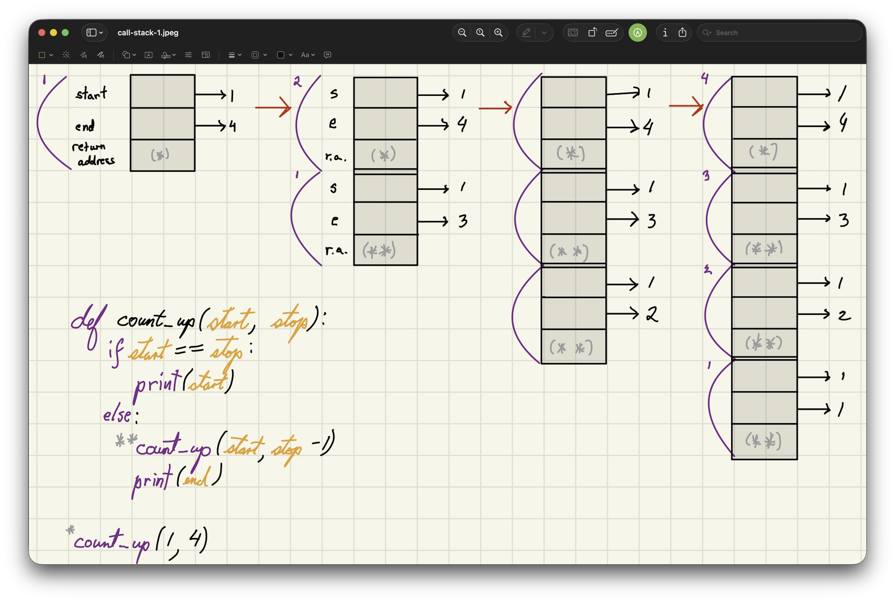
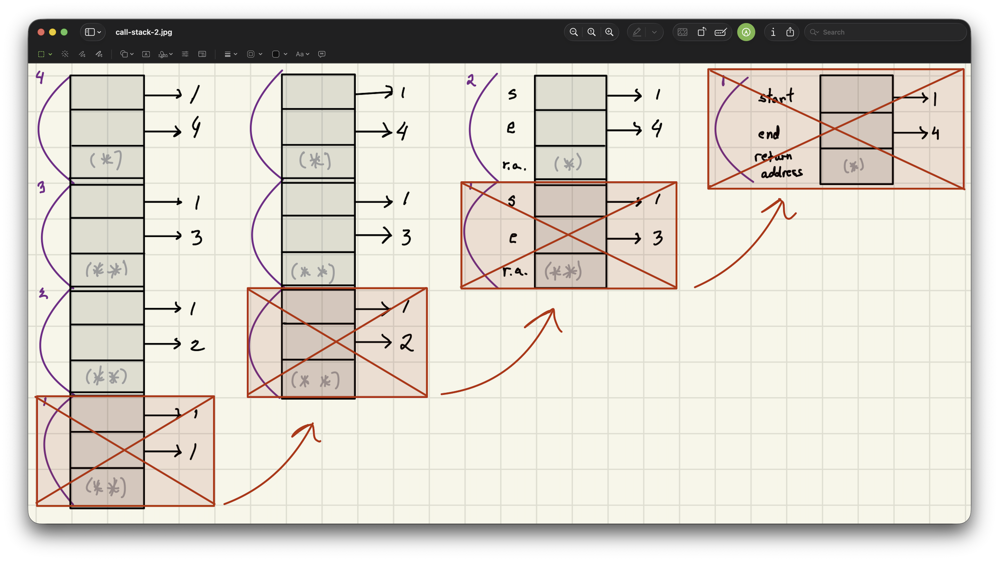

<sub>**Figures 1 & 2**: The progression of the call stack after a function call `count_up(1, 4)`.</sub>

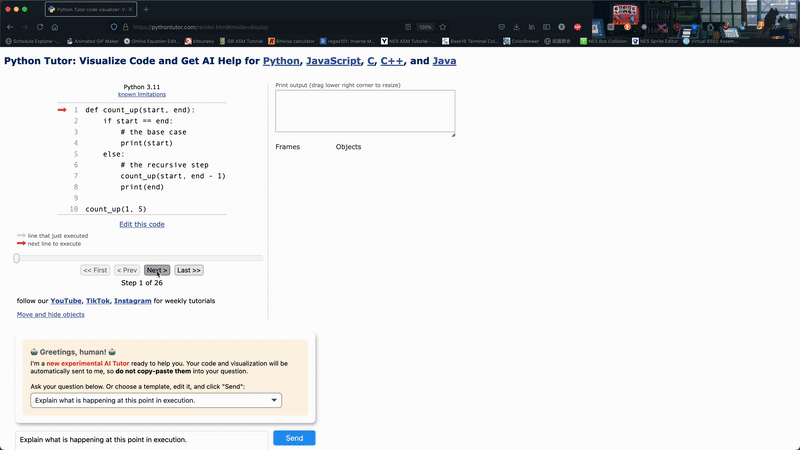

<sub>**Figure 3**: This same progression of the call stack as shown in our [**code visualiser**](https://pythontutor.com/).</sub>

In figures 1 and 2, the first function call is denoted by the **`*`** character, while each recursive call after that is denoted by a **`**`**. As you can see (by reading the diagrams from left-to-right), the first function call does not get completely executed until the very last step, _after every recursive call has been, itself, called an executed._ In that sense, we're basically going down to the last possible recursion level (in our case, printing `1`) before even thinking of what follows a recursive call.

A different version of this algorithm might look like this:

```python
# assumes start <= end
# prints a sequence of
# ascending values, one per line

def count_up(start, end):
    if start == end:
        print(start)
    else:
        print(start)
        count_up(start + 1, end)

count_up(1, 4)
```

This version does something very similar, except that the lowest possible recursion level prints `5` instead, since we're incrementing the value of `start` instead of decrementing the value of `end`:

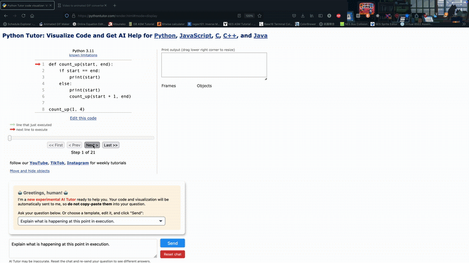

<sub>**Figure 4**: The progression of the call stack for the second version of our algorithm.</sub>

<a id="1-2"></a>

### Counting Up In Different Ways

Finally, we might envision a version of this code that does something similar to binary search and "splits" the counting "in half":

```python
# assumes start <= end
# prints a sequence of ascending values, one per line

def count_up(start, end):
    if start == end:
        print(start)
    else:
        mid = (start + end) // 2
        count_up(start, mid)
        count_up(mid+1, end)

count_up(4)
```

There's no reason why this shouldn't work—after all, we're simply cutting the range of counting with each call of `count_up`. We assuming that, when calling `count_up` with a smaller range, it would print the numbers in that range in an increasing order.

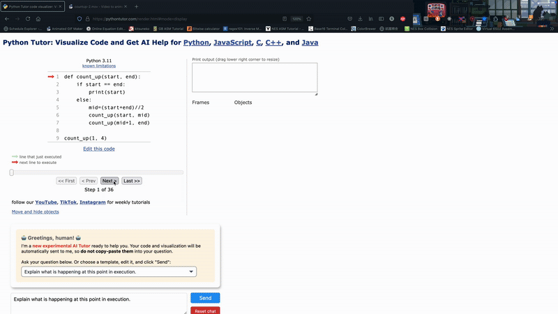

<sub>**Figure 5**: The progression of the call stack for the third version of our algorithm.</sub>

In this particular case, this "cutting" of the range could be visualised the following way:

<a id="countup-vis"></a>

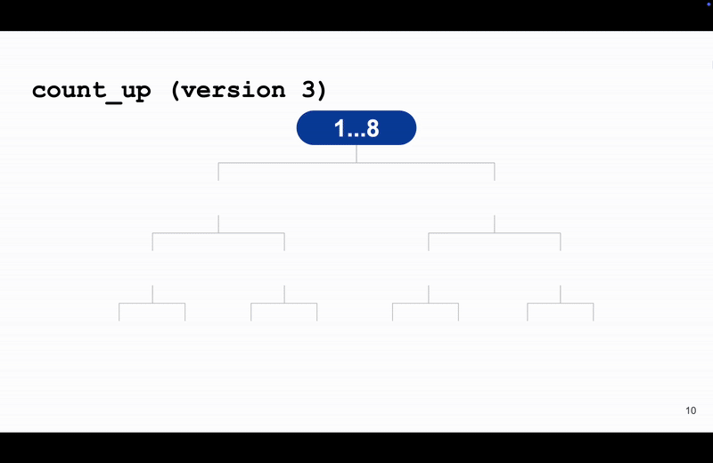

<sub>**Figure 6**: As you can see, each call to `countup` reaches its deepest level before moving on to the next call.</sub>

<br>

In all three cases, we are covering the entire range of numbers to count, just in different "directions":

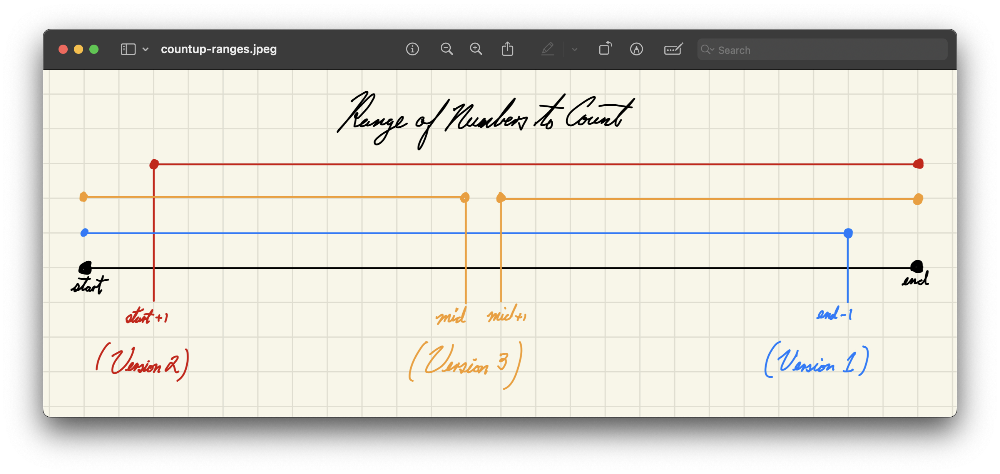

<sub>**Figure 7**: We're covering the same ground with all three versions of counting.</sub>

<a id="1-3"></a>

### Counting Down

What about counting down? For this algorithm, let's have the following:

- **Base case**: If the range of numbers is 0 (i.e. it includes only 1 numbers), the we print that number.
- **Assumption**: Assume that “when calling `count_down` with a smaller **range**, it would **print the numbers in that range in a decreasing order**”.

```python
# assumes start <= end

def count_down(start, end):
    if start == end:
        print(start)
    else:
        count_down(start + 1, end)
        print(start)
```

Using, say, `1` and `2` as parameters, we would see the following:

```
1 == 2 —> false
so call count_down(2, 2)

2 == 2 —> true
so print 2
go back to where count(2, 2) was called

the line after count(2, 2) is print(start)
so print 1
```

<a id="1-4"></a>

### Counting Up And Down

What would you say about counting up and down, then? That is, the following call:

```python
count_up_and_down(1, 4)
```

Outputs:

```
1
2
3
4
3
2
1
```

Let's the the base case of the range containing only one number, in which case we just print that number. We'll make the assumption that:

> ...when calling `count_up_and_down` with a smaller range, it would **print the numbers of that range in an increasing followed by decreasing order**.

```python
# assumes start <= end

def count_up_and_down(start, end):
	if start == end:
        print(start)
    else:
        print(start)
        count_up_and_down(start + 1, end)
        print(start)
```

Let's take the easy example of `count_up_and_down(1, 3)`:

```
1 == 3 —> false
so print 1
call count_up_and_down(2, 3)

2 == 3 —> false
so print 2
call count_up_and_down(3, 3)

3 == 3 —> true
so print 3
return to where count_up_and_down(3, 3) was called

after count_up_and_down(3, 3), print start
so print 2
return to where count_up_and_down(2, 3) was called

after count_up_and_down(2, 3), print start
so print 1
```

<a id="1-5"></a>

### Factorial

What about something like a factorial? It's mathematical definition seems something literally designed for recursion:

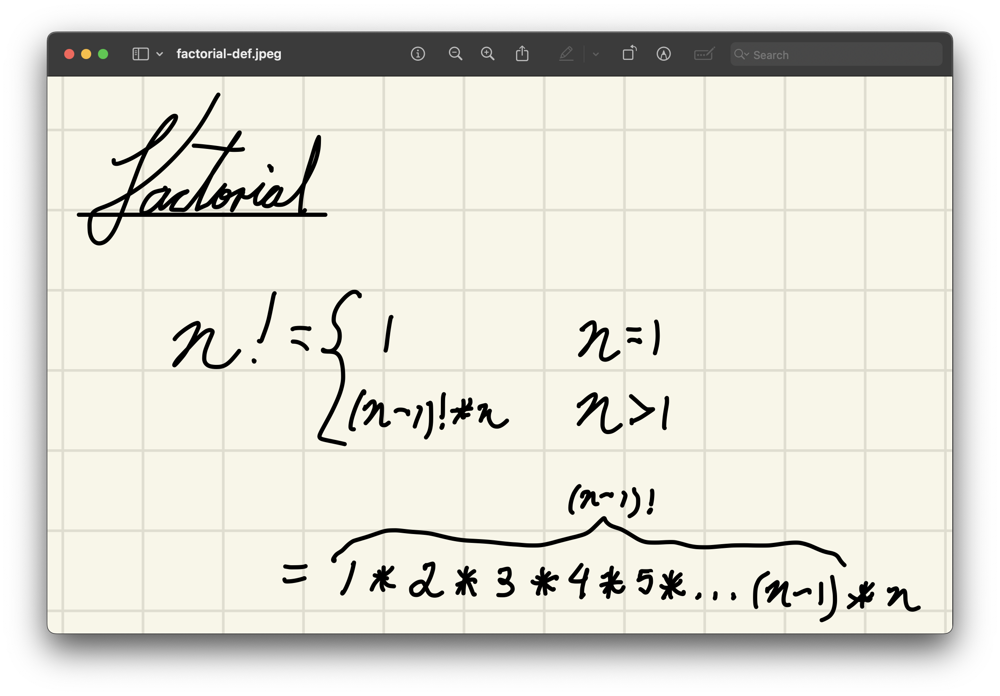

<sub>**Figure 8**: Factorials are defined as smaller definitions of themselves.</sub>

Our base case is easy:

- **Base case**: If `n` equals 1, then the factorial is 1.
- **Assumption**: When calling `factorial` with a smaller `n`, it would return the factorial of that `n`, as if by magic.

```python
# n >= 1
def factorial(n):
    if n == 1:
        return 1
    else:
        result = n * factorial(n - 1)
        return result
```

For `factorial(3)`:

```
3 == 1 —> false
so multiply 3 by whatever factorial(2) is

2 == 1 –> false
so multiply 2 by whatever factorial(1) is

1 == 1 —> true
so return 1 to wherever factorial(1) was called

store 2 * 1 = 2 inside result
return result to wherever factorial(2) was called

store 3 * 2 = 6 inside result
return result to wherever factorial(3) was called
```

<br>

<a id="2"></a>

<!-- ## Asymptotic Analysis for Recursive Functions

And now, for the question that you probably saw coming: how do we measure asymptotic behaviour for recursive operations? Life was relatively simple with loops. After all, we could look at each line of code and, as long as we knew exactly what that particular line was doing and how long it took to do it, we could add up all those steps to get our final answer. The problem with recursive algorithms is that some of the lines in them are calls to itself—and if we're not done figuring out the runtime of the algorithm in the first place, we're going to be stuck in circles. Right?

...right? Well, no. Otherwise we wouldn't be bothering asking this question and this class wouldn't exist. There _is_ a way to measure the runtime of these algorithms—it simply works a little different. We instead measure them using something called a **recursive tree**, reminiscent of the one we had in [**figure 6**](#countup-vis).

<a id="2-1"></a>

### Recursive Tree Structure

We build this tree structure representing each call to the function and the amount of work done at each level. The structure is as follows:

1. Each recursive call is represented as a **node** (a "leaf") in the tree. Inside each node, we write the **size of the input** that this particular call was passed as an argument.
2. If function call 'A' makes function call 'B', we draw an **edge** (a "branch") from node 'A' to node 'B'.

<a id="2-2"></a>

### Cost Per Node ("Leaf")

Then, next to each node, we write the _local cost_ of that recursive call, which is the cost **without including the cost of the recursive calls it makes**. Once you are done drawing your tree, you add up the cost of all your local costs to obtain the total costs of your recursive algorithm.

<a id="2-3"></a>

### Examples

<a id="2-3-1"></a>

#### Factorial

Take, for example, our factorial function:

```python
# n >= 1
def factorial(n):
    if n == 1:    # Θ(1)
        return 1  # Θ(1)
    else:
        result = factorial(n - 1)
        result *= n    # Θ(1)
        return result  # Θ(1)
```

Our recursive tree in this case is super simple:

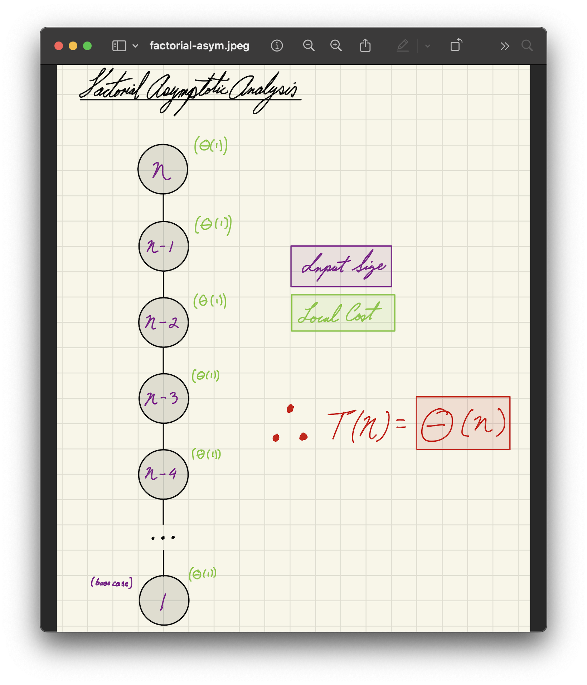

<sub>**Figure 8**: The first call is the top node, whereas the last is the bottom node. Because the local cost of each call to `factorial` is Θ(1), we're just acting constant time `n`-number of times.</sub>

<a id="2-3-2"></a>

#### Counting The Occurrences Of A Number In A List

Let's say we have a function that returns the number of times a given value occurs in a list of values. There are a few ways of writing this function recursively, but let's start with the most obvious one.

> **Recursion Base Case**: When calling `count_occurrences` on an empty list, it would return `0`.
> **Recursion Assumption**: When calling `count_occurrences` with a shorter list (the "tail" of the list), it would return the number of times a given value occurs in that list.

The way it will do this is by:

1. Recurse on smaller list (the "tail") to obtain its occurrences.
2. Check the first element (the "head") of the list. If it's equal to our target value, return the count obtained from step 1, plus 1. If it is not, simply return the count obtained from step 1.

```python
def count_occurences_v1(lst, val):
    if len(lst) == 0:  # Θ(1)
        # base case
        return 0       # Θ(1)
    else:
        head = lst[0]   # Θ(1)
        tail = lst[1:]  # Θ(n - 1)
        
        # assumption
        count_tail = count_occurences_v1(tail, val)
        
        if head == val:            # Θ(1)
            return count_tail + 1  # Θ(1)
        else:
            return count_tail      # Θ(1)
```

For the most part, the local cost of this function is constant _except_ for the creation of our shorter list (`tail`) through slicing, which is Θ(`n` - 1), or simply Θ(`n`). Since we repeat this process an `n` number of times, our total runtime is **Θ(`n`<sup>2</sup>)**:

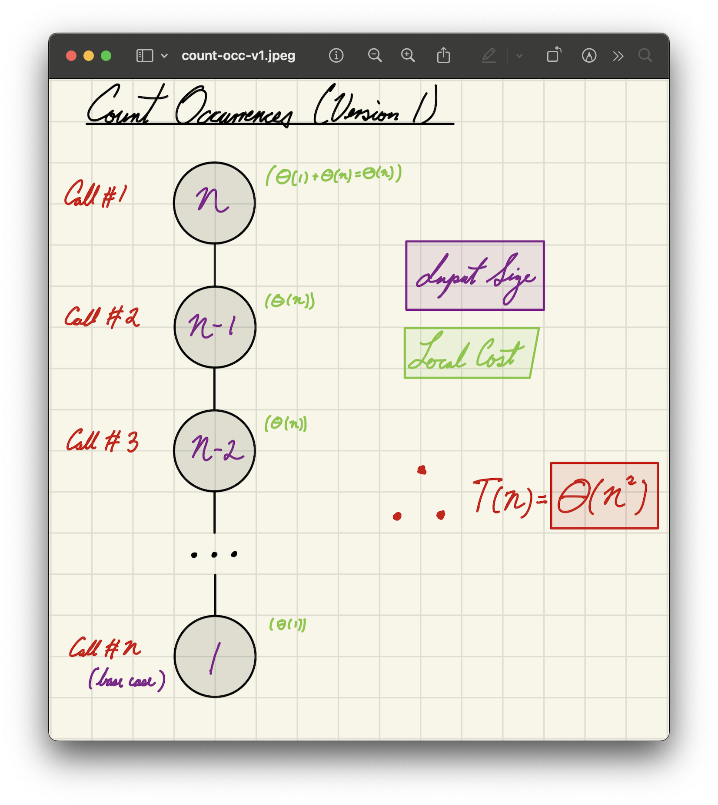

<sub>**Figure 9**: The first call is the top node, whereas the last is the bottom node. Because the local cost of each call to `factorial` is Θ(`n`), we're acting linear time `n`-number of times, resulting in quadratic behaviour.</sub>

---

Can we do better? By this point, you've heard of a problem-solving strategy called the _two-pointer solution_. Say that, instead of creating a list each time we call our function recursively, we just ask it consider **a range starting from a lower limit `low` and ending at an upper limit `high`** (similar to how we did with binary search).

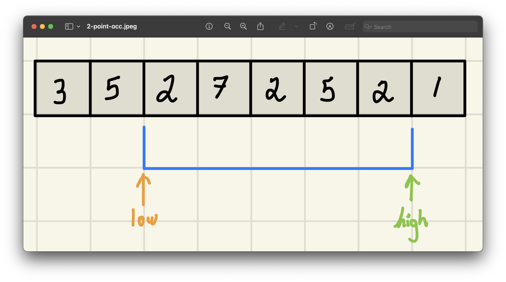

<sub>**Figure 10**: This way, there's no need to create a new list each time, which is both time and memory intensive.</sub>

This is a little difficult to do if the user doesn't pass in the start and the end values as additional parameters, since recursive functions depend on successive calls to themselves. For that reason, we can define a little "helper" function _inside_ of our function definition.

Our assumption takes a slightly different form: "when calling count occurrences with a smaller range within the same list, it would return the number of times a given value occurs in that list."

```python
def count_occurrences_v2(lst, val):
    def count_appearances_helper(lst, low, high, val):
        # base case
        if low == high:
            # if the only value in the list equals to the target
            if lst[low] == val:
                return 1 # return 1
            else:
                return 0 # otherwise, return 0
        else:
            # recursive case
            # assume that that this count will do its job by calling it
            # on a smaller range
            count_head = count_appearances_helper(lst, low + 1, high, val)

            # after that count is done
            # check if the low element is the target value
            if lst[low] == val:
                # if it is, then return the count of the smaller ranger + 1
                return count_rest + 1
            else:
                # otherwise, just return the count of the smaller range
                return count_rest

    # we only do this if the list is not empty, anyway
    if len(lst) == 0:
        return 0
    else:
        return count_appearances_helper(lst, 0, len(lst) - 1, val)
```

All of these steps are Θ(1), so our total runtime is **Θ(`n`)**!

<a id="2-3-3"></a>

#### List Of Ascending Integers

Say we wanted to generate a list of `n` integers from 1 to `n`:

```python
print(pos_ints_list(5))
print(pos_ints_list(1))
```

Output:

```
[1, 2, 3, 4, 5]
[1]
```

Our base case, as always, is simple:

- **Base case**: If `n` is 1, then return a list with the integer `1`.

Our assumption is specific to this problem, but should sound fairly familiar by now:

- **Assumption**: When calling `pos_ints_list` with a smaller value, it would return a list with all the positive integers from `1` up to that value in an increasing order.

```python
def pos_ints_list(n):
    if n == 1:      # Θ(1)
        return [1]  # Θ(1)
    else:
        smaller_list = pos_ints_list(n - 1)
        smaller_list.append(n)  # Θ(1), amortised
        return smaller_list     # Θ(1)
```

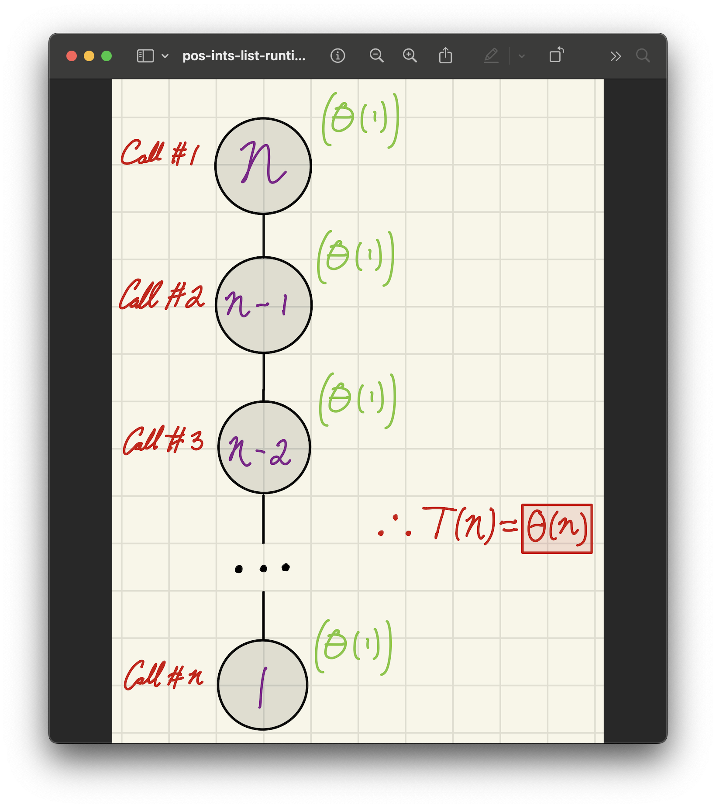

<sub>**Figure 11**: Again, running Θ(1) `n` times results in `n` * Θ(1) = **Θ(`n`)**.</sub>

<a id="2-3-4"></a>

#### Power

As a final example, let's look at something that can be optimised quite a bit, though maybe not as obviously as the others. The mathematical definition of calculating a value's power also ties in very neatly to a recursive paradigm:

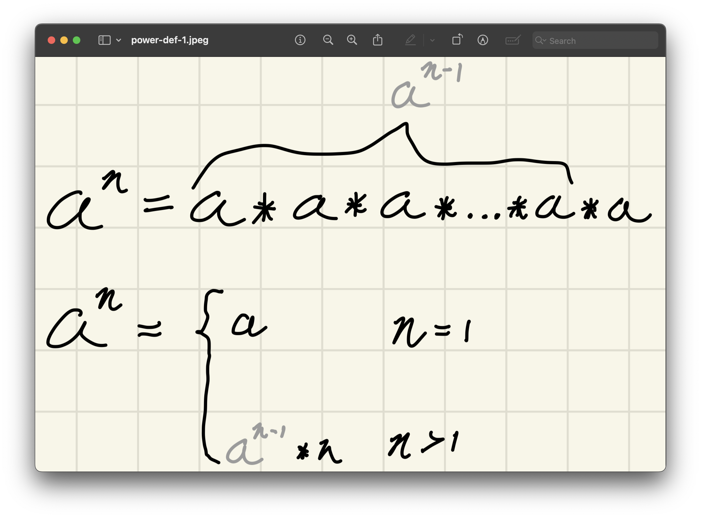

<sub>**Figure 12**: The power function is almost identical to the factorial function.</sub>

So:
- **Base case**: If `n`, the value of the exponent of `a`, equals 1, then the result is `a`.
- **Assumption**: When calling `power` with a smaller exponent, it would return the value of raising the base (`a`) by that exponent (`n - 1`).

Here's perhaps the simplest way of doing this:

```python
def power(a, n):
    if(n == 1):   # Θ(1)
        return a  # Θ(1)
    else:
        rest = power(a, n - 1)
        return a * rest  # Θ(1)
```

The runtime of this algorithm is **Θ(`n`)**, as we are performing Θ(1) operations an `n` amount of times. Θ(`n`) is not _bad_, but by now we should be pretty cognizant that, if there is a way we can cut the amount of iterations in any way, shape, or form, we definitely should. Consider the following examples:

For example:
- 2<sup>5</sup> = 2 * 2 * 2 * 2 * 2 = 32
- 3<sup>4</sup> = 3 * 3 * 3 * 3 = 81

Is this too slow? Well, if `n` is very large (say 10<sup>100</sup>), then performing 10<sup>100</sup> multiplications is probably infeasible. Instead, we should look for some way to reduce the number of multiplications in a significant way. The idea here is that instead of multiplying `a` by itself `n` times, we can **break the problem into smaller subproblems** and reuse computations to reduce the number of multiplications.

Let's take advantage of the following mathematical property:

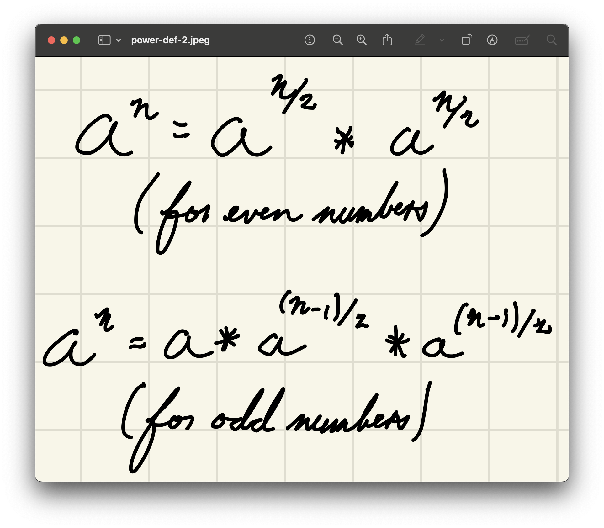

<sub>**Figure 13**: The power function can be divided into two smaller versions of itself.</sub>

Something like this, perhaps:

```python
def power(a, n): 
    if n == 1:    # Θ(1)
        return a  # Θ(1)
    else:
        part_1 = power(a, n // 2)
        part_2 = power(a, n // 2)

        if (n % 2 == 0):                # Θ(1)
            return part_1 * part_2      # Θ(1)
        else: # n is odd
            return a * part_1 * part_2  # Θ(1)
```

Does this help our runtime? Well, interestingly, it doesn't. Let's draw our recursive tree to find out why:

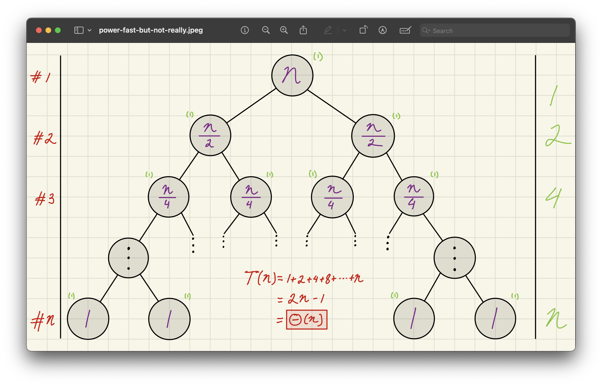

| Level #       | # of calls in level | Size of each call in level | Local cost of each call in level | Total cost of level |
|--------------|--------------------|---------------------------|--------------------------------|---------------------|
| 0            | 1                  | n                         | 1                              | 1                   |
| 1            | 2                  | n/2                       | 1                              | 2                   |
| 2            | 4                  | n/4                       | 1                              | 4                   |
| 3            | 8                  | n/8                       | 1                              | 8                   |
| ...          | ...                | ...                       | ...                            | ...                 |
| `k`          | 2<sup>`k`</sup>    | `n` / 2<sup>`k`</sup>     | 1                              | 2<sup>`k`</sup>     |
| ...          | ...                | ...                       | ...                            | ...                 |
| log₂(`n`)    | `n`                | 1                         | 1                              | `n`                 |

<sub>**Figure 14**: Since we're making two recursive calls every recursive call, the number of calls on the stacks gets a little crazy.</sub>

In other words:

1. Level 1 (Root Call):
    - We start with `n` as input.
    - Number of calls: 1
    - Size of each call: `n`
    - Total cost: 1
2. Level 2:
    - The function makes two recursive calls, each with input `n` / 2.
    - Number of calls: 2
    - Size of each call: `n` / 2
    - Total cost: 2
3. Level 3:
    - Each of the previous calls makes two more calls.
    - Number of calls: 4
    - Size of each call: `n` / 4
    - Total cost: 4
4. Step `k`
    - At level `k`, the number of calls is 2<sup>`k`</sup>.
    - The size of each input is `n` / 2<sup>`k`</sup>.
    - The total cost of that level is 2<sup>`k`</sup>.
4. Step `n` (Base Case):
    - The recursion stops when `n` /  2<sup>`k`</sup> = 1, meaning `k` = log₂(`n`).
    - At this level, there are `n` calls (since 2<sup>log₂(`n`)</sup> = `n`).
    - Total cost of this level: `n`.

To find the total runtime here, we sum the work done across all levels:

> T(`n`) = 1 + 2 + 4 + 8 + ... + `n` (a.k.a. the [**geometric series**](https://github.com/sebastianromerocruz/CS1134-data-structures-and-algorithms/tree/main/lectures/05-arraylists#4))
>
> T(`n`) = 2 * `n` − 1
> 
> T(`n`) = Θ(`n`)

That literally didn't help at all! Can we fix this? Well, yes. These two sides are identical, so why calculate them twice in one call?

Let's instead simply:
1. **First compute** `a`<sup>`n`/2</sup>
2. **Then square it** to get `a`<sup>`n`</sup>

By reusing `a`<sup>`n` / 2</sup>, we avoid all this unnecessary work and reduce the number of operations. The logic of the function definition is as follows:

1. **Base Case**:  
   If `n` = 1, we simply return `a`, since:

    `a`<sup>1</sup> = `a`

2. **Recursive Case 1: `n` is even**  
   If `n` is even, we break it into two equal halves:

   `a`<sup>`n` = `a`<sup>`n`/2</sup> * `a`<sup>`n`/2</sup>

   Instead of computing `a`<sup>`n`</sup> directly, we compute `a`<sup>`n`/2</sup> **once** and reuse it.

3. **Recursive Case 2: `n` is odd**  
   If `n` is odd, we split it as follows:

   `a`<sup>`n`</sup> = `a` * `a`<sup>(`n` - 1)/2</sup> * `a`<sup>(`n` - 1)/2</sup>

   To avoid dividing odd numbers, since `n`<sub><em>odd</em></sub> - 1 will be even. This gives us two equal parts, though it only adds up to `n` − 1, not `n`. To compensate, we multiply by an additional `a` to ensure the total exponent remains correct.

Thus, we get the following definition:


<sub>**Figure 15**: The complete definition of the power function along with its base case.</sub>

For example, for 2<sup>8</sup>, using the recursive definition:

1. 2<sup>8</sup> = 2<sup>4</sup> * 2<sup>4</sup>  
2. 2<sup>4</sup> = 2<sup>2</sup> * 2<sup>2</sup>  
3. 2<sup>2</sup> = 2<sup>1</sup> * 2<sup>1</sup>  
4. 2<sup>1</sup> (Base case)

Now, working backwards:

1. 2<sup>2</sup> = 2 * 2 = 4
2. 2<sup>4</sup> = 4 * 4 = 16
3. 2<sup>8</sup> = 16 * 16 = 256

Instead of performing 8 multiplications, we only did **3 recursive calls**. Each time, we cut `n` **in half**. Thankfully, in Python, the whole-number division operator saves us the trouble of odd number fractiona values, so we don't need to use `- 1`, since it basically does it by itself:

```python
def fast_power(a, n):
    if n == 1:    # Θ(1)
        return a  # Θ(1)
    else:
        part = fast_power(a, n // 2)
        if n % 2 == 0:              # Θ(1)
            return part * part      # Θ(1)
        else: # n is odd
            return a * part * part  # Θ(1)

```

This means the number of recursive calls follows a logarithmic pattern:

> T(`n`) = T(`n`/2) + O(1)

Since the depth of recursion is **log₂(`n`)**, the total runtime is **O(log(`n`))**, which is a huge improvement over O(`n`)!

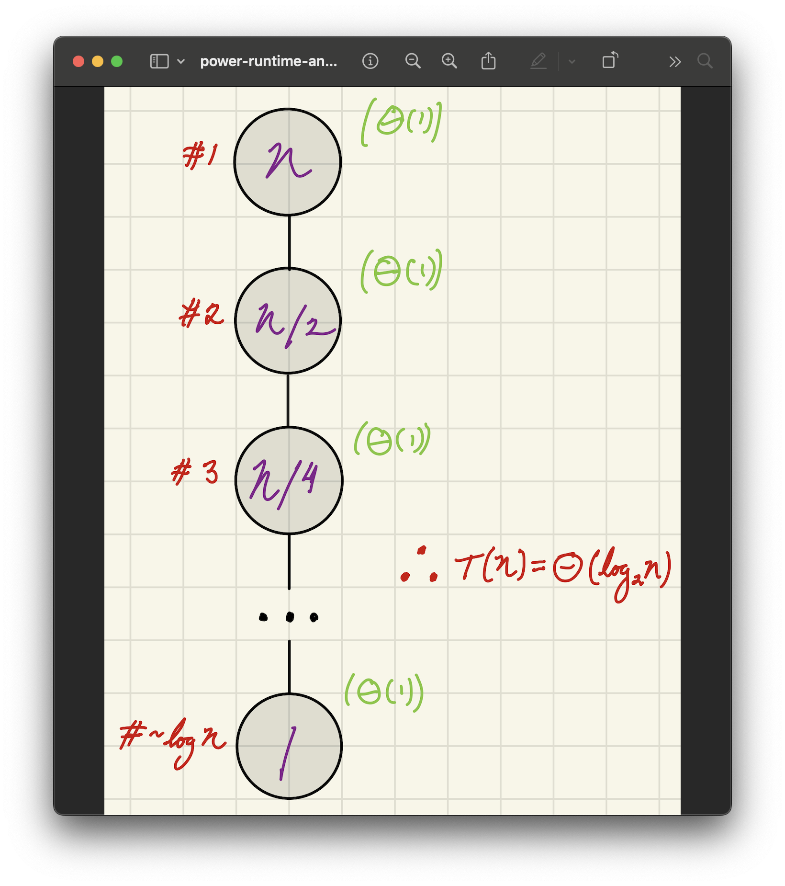

<sub>**Figure 16**: The best improvement a programmer could ask for, believe me.</sub> -->