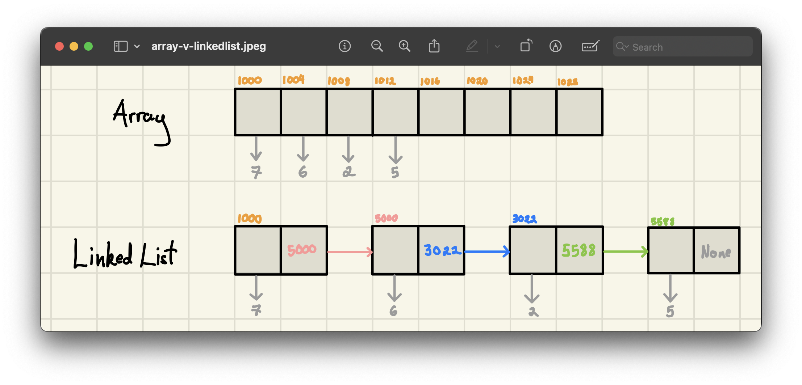
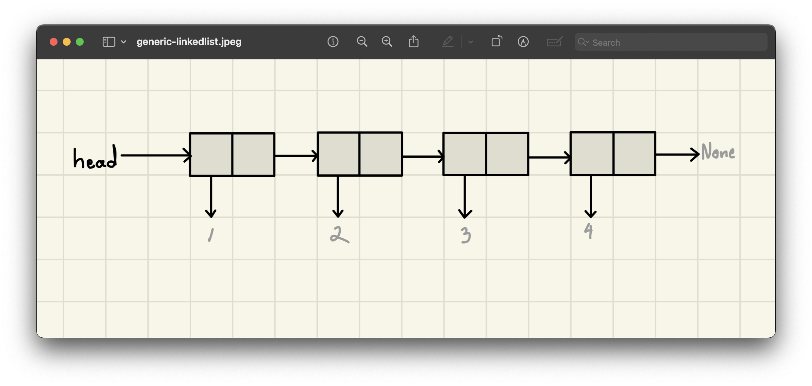
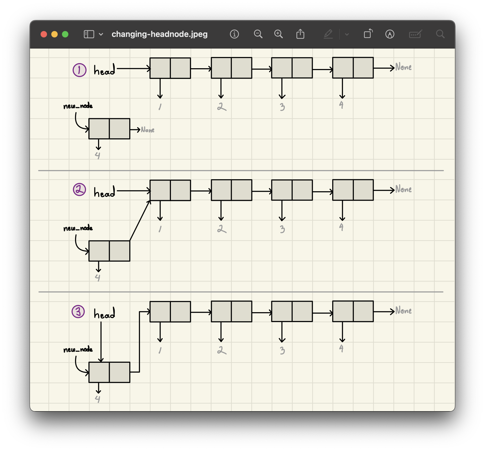

<h2 align=center>Week 10</h2>

<h1 align=center>Abstract Data Types: <em>Linked Lists</em></h1>

<p align=center><strong><em>Song of the day</strong></em>: <em><a href="https://youtu.be/7Tln_B11HgQ?si=QIAzJd2zFSMHg8Ms"><strong><u>Lesson Learnt (Live at COLORS)</u></strong></a> by Aaron Taylor (2017)</em></p>

---

## Sections
1. [**The Pros and Cons of Using An `ArrayList`**](#1)
2. [**Linked Lists**](#2)
    - [**A Concept**](#2-1)
    - [**Nodes**](#2-2)
    - [**Linked-List Traversal**](#2-3)
3. [**Node-Only Implementation**](#3)
    - [**The `Node` Class**](#3-1)
    - [**Traversal**](#3-2)
    - [**Changing The Head Of A Linked List**](#3-3)

---

<a id="1"></a>

## The Pros and Cons of Using An `ArrayList`

Last lecture was kind of a wake-up-call for all big fans of the `ArrayList` class; it turns out that, while it is a very versatile and useful base class, it doesn't quite do the job for _every_ programming situation. In fact, it's the very nature of `ArrayList` objects that gives them their weakness: the data contained in them _has to be contagious_ (i.e. right next to each other in memory):

|Pros|Cons|
|-|-|
|Random access to data (e.g. access directly via index, rather than iterate through data to find it)|Storing data contiguously in the memory can be a problem when working with a _very_ large data set|
|Efficient amortised performance for adding and removing from the end|Insertions and deletions at interior positions of an array are expensive|
||Amortised bounds may be unacceptable in real-time systems|

<sub>**Figure 1**: The good, the bad, and the ugly of the `ArrayList`.</sub>

Indeed, data contiguity is excellent for indexing because it does so in constant time.

Otherwise, though, it's kind of a mess to deal with. It's as if you _had_ to fit all 180+ 1134 students in _one single classroom_ just because they're all taking the same class. It doesn't really make a lot of sense, right? It's totally fine for them exist within the Tandon community and take the same course without having to be in a single classroom at the same time. This principle is followed by a different ADT, one which is my personal favourite, and it's called **linked lists**.

<br>

<a id="2"></a>

## Linked Lists

<a id="2-1"></a>

### A Concept

Just like most data structures, linked lists are...exactly what they sound like. That is: values _linked_ together sequentially, forming a list. "Isn't that what an `ArrayList` is?", I can hear you ask. Well, no. Arrays contain values _placed_ together sequentially, forming a list. Their only relationship with each other is the fact that they are placed right next to each other—_they otherwise have zero awareness of each other's existence_.

Linked-lists inherently differ in that aspect, as they are "linked" to the next item in the list _by keeping track of its address_. We can thus say that each element in the linked-list is "aware" of its linked partners existences:



<sub>**Figure 1**: As you can see, the addresses of the elements of the linked lists are completely disjointed, but each element "knows" the memory location of the element it is connected to.</sub>

Traditionally, we call the first element of a linked list the **head** of the list, and the rest of the elements follow it. The last element of the list, sometimes referred to as the **trailer**, is not connected to any other element, and thus keeps the address of the value `None` (in Python; other languages have other names for this):



<sub>**Figure 2**: A simple "one-way," or **singly-**, linked list. The value containing the integer `1` is the head of the list.</sub>

Let's take a closer look at one of these individual values contained within a linked list.

<a id="2-2"></a>

### Nodes

Each element that forms part of a linked list is traditionally called a **node**, and at its simplest it contains the following:

- **`data`**: The actual value being kept track of by this element. In figure 2 above, these are integers, but they can be of any data type.
- **`next`**: The address of, or the _pointer to_, the next node in the list.


<sub>**Figure 3**: An empty node (i.e. with no data nor linked "next" node).</sub>

What's interesting about the particular node shown above is that it could be one of three things:

1. A "free-floating" **empty node**, existing by itself.
2. The **head** node of an empty list.
3. The **trailer** node of a "one-way," or singly-, linked list.

All three definitions either could apply to this node. In the trailer case, for example, some other node somewhere else in memory _could_ be pointing to this empty node as its `next` node. Since this list only links one way, though, we have no way of knowing.

<a id="2-3"></a>

### Linked List Traversal

Like all sequential objects, we will be treating linked lists as [**iterables**](https://github.com/sebastianromerocruz/CS1134-data-structures-and-algorithms/tree/main/lectures/02-iterators-generators#1). This is actually simpler, since one of the key parts of each node is the memory location of its `next` linked item:

```python
"""
For linked list:
    1 -> 2 -> 3 -> 4 -> None
"""
current = head          # of the list
data = current.data
print(data)             # prints 1

current = current.next
print(current.data)     # prints 2

current = current.next
current = current.next

current = current.next
print(current is None)  # prints True
```

In memory, we might be looking at something like this:


<sub>**Figure 4**: Note how the "link" linking each node to the next is the same kind of link linking the variable `current` to each node—it's literally just a _reference_ to its location in memory.</sub>

<br>

<a id="3"></a>

## [**Node-Only Implementation**](code/Node.py)

<a id="3-1"></a>

### The `Node` Class

Since linked lists are simply Python objects, connected by a pointer, we can actually define a linked list by simply defining a series of nodes, each pointing to the next. The code for a singly-linked node is straight-forward enough:

```python
class Node:
    def __init__(self, data=None):
        self.data = data
        self.next = None

    def disconnect(self):
        self.data = None
        self.next = None
```

As you can see, we have the option to leave a node empty or give it a value. For example:

```python
head = Node()
head.data = 1

print(head.data)  # prints 1
```

To link another item to the linked list, we simply create a new node and assign it to `head`'s `next` attribute:

```python
new_node = Node(2)
head.next = new_node

print(head.next.data)  # prints 2
```

And we can continue adding nodes to this list by setting the `next` node's `next` attribute to yet another new node:

```python
new_node = Node(3)
head.next.next = new_node

print(head.next.next.data)  # prints 3
```

...and another:

```python
new_node = Node(4)
head.next.next.next = new_node

print(head.next.next.next.data)  # prints 4
```

Naturally, there's a much better way of adding nodes to a list, but let's keep it "simple" for now. 

<a id="3-2"></a>

### Traversal

We can quickly traverse this list using a `while`-loop, much as we did [**earlier**](2-3):

```python
current = head
    
while current != None:
    print(f"{current.data} -> ", end='')
    current = current.next
```

Output:

```
1 -> 2 -> 3 -> 4 -> 
```

So, what kind of operations should these linked lists be capable of, and how do we implement them?

<a id="3-3"></a>

### Changing The Head Of A Linked List

Let's start by illustrating what extending our list _at the front_ would look like. In other words, we want another, new node (`new_node`) to become the head of the linked list, with the rest of the nodes trailing after it. 

We know that, for an `ArrayList`, this would be a rather expensive operation, as it would involve a shift to the right of every single one of its elements, potentially _after_ a resizing. With linked lists, however, this process is quick and easy. We simply...

1. Assign the current `head` of the list **to the `next` value in `new_node`**.
2. **Reassign** the `head` pointer to `new_node`.

...and that's it.



<sub>**Figure 5**: This, as you've probably guessed, is done in _constant_ time.</sub>

Using our code from earlier:

```python
new_node = Node(0) 

new_node.next = head  # step 1
head = new_node       # step 2
```

If we traversed the list once more, we would now see the following as output:

```
0 -> 1 -> 2 -> 3 -> 4 -> 
```