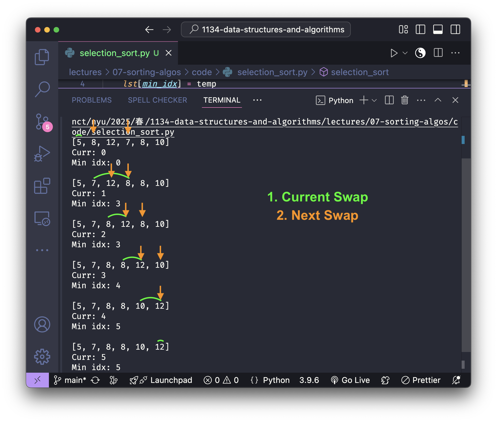

<h2 align=center>Week VII</h2>

<h1 align=center>Sorting Algorithms</h1>

<p align=center><strong><em>Song of the day</strong>: <a href="https://youtu.be/NR65vdoHYW0?si=c5D2mKUJUHArX0IF"><strong><u>فانتزی اصفهان (Phantasia Isfahanensis)</u></strong></a> by Maliheh Saeedi, performed by Asal Vaseghnia (2025)</em></p>

---

## **Sections**

1. [**The Sorting Problem**](#1)
2. [**Selection Sort**](#2)
    1. [**Implementation**](#2-1)
    2. [**Time Complexity**](#2-2)
3. [**Bubble Sort**](#3)
    1. [**Implementation**](#3-1)
    2. [**Time Complexity**](#3-2)
4. [**Insertion Sort**](#4)
    1. [**Implementation**](#4-1)
    2. [**Time Complexity**](#4-2)
5. [**Correctness & Loop Invariants**](#5)
6. [**Merge Sort**](#6)
    1. [**Implementation**](#6-1)
    2. [**Time Complexity**](#6-2)

---

<a id="1"></a>

## **The Sorting Problem**

Just like searching, sorting is one of those incredibly fundamental operations in computer science. It allows us to organise data in a meaningful order, making tasks—like searching itself (recall that binary search presupposes that a list be already sorted)—more efficient.

This _sorting problem_ can be posed in the following way: 

> Given a list, `lst`, of numbers (or really any data), **reorder** them so that at the end they are in _ascending order_.

For example, given a Python list of integers:

```python
lst = [5, 8, 12, 7, 8, 10]
```

Calling the following would sort the list in the following way:

```python
some_sort(lst)
print(lst)
```

Output:

```
[5, 7, 8, 8, 10, 12]
```

Notice that our generic `some_sort` function here is _not_ creating a new sorted list but is rather **mutating the original list, `lst`**. This is going to be a common theme across all of the sorting algorithms that we'll go over. In general, we wanna minimise creating new lists, though as we'll see, this is not always possible.

<br>

<a id="2"></a>

## [**Selection Sort**](https://www.sortvisualizer.com/selectionsort/)

To me, the easiest sorting algorithm is _selection sort_. As the name implies, selection sort repeatedly selects the smallest element and swaps it with the first _unsorted_ element of the list. It then moves the boundary of the sorted section one step forward and repeats, continuing until the entire list is sorted.

Using our list from above, we could visualise these steps as follows:



<sub>**Figure 1**: A visual guide to selection sort, where the current iteration's swap is represented in green and the next iteration's swap is represented in orange.</sub>

<a id="2-1"></a>

### [**Implementation**](code/selection_sort.py)

```python
def swap(lst, curr, min_idx):
    temp = lst[curr]          # Θ(1)
    lst[curr] = lst[min_idx]  # Θ(1)
    lst[min_idx] = temp       # Θ(1)

def selection_sort(lst):
    n = len(lst)                       # Θ(1)

    # Θ(n)
    for curr in range(n):
        min_idx = curr                 # Θ(1)

        # Θ(n - curr) === Θ(n)
        for j in range(curr + 1, n):
            if lst[j] < lst[min_idx]:  # Θ(1)
                min_idx = j            # Θ(1)
        swap(lst, curr, min_idx)       # Θ(1)
```

This implementation maps almost directly onto the description above—once you understand what it's doing conceptually, the code is just that idea written down. 

The one thing worth noting is the role of `min_idx`: rather than swapping eagerly on every comparison, we track the index of the minimum element found so far and perform exactly one swap at the end of each outer iteration. This is what makes the Θ(1) swap cost at the bottom of the loop valid.

<a id="2-2"></a>

### **Time Complexity**

> **T(`n`) = Σ(`curr` = 0 to `n`-1) (`n` - `curr` - 1)**
>
> **T(`n`) = (`n`-1) + (`n`-2) + ... + 1 + 0**
>
> **T(`n`) = (`n` * (`n` - 1)) / 2**
>
> **T(`n`) = O(`n`²) = Θ(`n`²)**

The best, worst, and average cases all land at Ω(`n`²), O(`n`²), and Θ(`n`²) respectively; life can't always be easy. Selection sort is simple to understand and even works pretty well for small lists, but is incredibly inefficient for large datasets. Let's see if our next algorithm fares any better.

<a id="3"></a>

## [**Bubble Sort**](https://www.sortvisualizer.com/bubblesort/)

Bubble Sort's got a cute name because it's got a cute way of sorting through its elements. It repeatedly compares adjacent elements and swaps them _if they are out of order_, literally "bubbling up" the bigger elements to the end of the list. This process continues until the list is sorted.

Starting from the beginning of the list, we compare each element with its neighbour and swap them whenever the left one is greater than the right. This bubbles the larger values toward the end, completing one full "pass" once the largest unsorted element has settled into its final position. On the next pass, we simply ignore that last sorted element and continue bubbling up the next largest. The unsorted portion shrinks by one each time until nothing remains to sort.

Using our list from above, we can trace the way this swapping takes place the following way:


<sub>**Figure 2**: A simple animation of bubble sort. The steps involved are listed below.</sub>

```
STARTING LIST:
[5, 8, 6, 1, 9, 3, 0, 1]


FIRST PASS:
lst[0] -> 5
lst[1] -> 8
No swap.
[5, 8, 6, 1, 9, 3, 0, 1]

lst[1] -> 8
lst[2] -> 6
Swap!
[5, 6, 8, 1, 9, 3, 0, 1]

lst[2] -> 8
lst[3] -> 1
Swap!
[5, 6, 1, 8, 9, 3, 0, 1]

lst[3] -> 8
lst[4] -> 9
No swap.
[5, 6, 1, 8, 9, 3, 0, 1]

lst[4] -> 9
lst[5] -> 3
Swap!
[5, 6, 1, 8, 3, 9, 0, 1]

lst[5] -> 9
lst[6] -> 0
Swap!
[5, 6, 1, 8, 3, 0, 9, 1]

lst[6] -> 9
lst[7] -> 1
Swap!
[5, 6, 1, 8, 3, 0, 1, 9]


SECOND PASS:
lst[0] -> 5
lst[1] -> 6
No swap.
[5, 6, 1, 8, 3, 0, 1, 9]

lst[1] -> 6
lst[2] -> 1
Swap!
[5, 1, 6, 8, 3, 0, 1, 9]

lst[2] -> 6
lst[3] -> 8
No swap.
[5, 1, 6, 8, 3, 0, 1, 9]

lst[3] -> 8
lst[4] -> 3
Swap!
[5, 1, 6, 3, 8, 0, 1, 9]

lst[4] -> 8
lst[5] -> 0
Swap!
[5, 1, 6, 3, 0, 8, 1, 9]

lst[5] -> 8
lst[6] -> 1
Swap!
[5, 1, 6, 3, 0, 1, 8, 9]


THIRD PASS:
lst[0] -> 5
lst[1] -> 1
Swap!
[1, 5, 6, 3, 0, 1, 8, 9]

lst[1] -> 5
lst[2] -> 6
No swap.
[1, 5, 6, 3, 0, 1, 8, 9]

lst[2] -> 6
lst[3] -> 3
Swap!
[1, 5, 3, 6, 0, 1, 8, 9]

lst[3] -> 6
lst[4] -> 0
Swap!
[1, 5, 3, 0, 6, 1, 8, 9]

lst[4] -> 6
lst[5] -> 1
Swap!
[1, 5, 3, 0, 1, 6, 8, 9]


FOURTH PASS:
lst[0] -> 1
lst[1] -> 5
No swap.
[1, 5, 3, 0, 1, 6, 8, 9]

lst[1] -> 5
lst[2] -> 3
Swap!
[1, 3, 5, 0, 1, 6, 8, 9]

lst[2] -> 5
lst[3] -> 0
Swap!
[1, 3, 0, 5, 1, 6, 8, 9]

lst[3] -> 5
lst[4] -> 1
Swap!
[1, 3, 0, 1, 5, 6, 8, 9]


FIFTH PASS:
lst[0] -> 1
lst[1] -> 3
No swap.
[1, 3, 0, 1, 5, 6, 8, 9]

lst[1] -> 3
lst[2] -> 0
Swap!
[1, 0, 3, 1, 5, 6, 8, 9]

lst[2] -> 3
lst[3] -> 1
Swap!
[1, 0, 3, 1, 5, 6, 8, 9]
[1, 0, 1, 3, 5, 6, 8, 9]


SIXTH PASS:
lst[0] -> 1
lst[1] -> 0
Swap!
[0, 1, 1, 3, 5, 6, 8, 9]

lst[1] -> 1
lst[2] -> 1
No swap.
[0, 1, 1, 3, 5, 6, 8, 9]


SEVENTH PASS:
lst[0] -> 0
lst[1] -> 1
No swap.
[0, 1, 1, 3, 5, 6, 8, 9]


FINAL LIST:
[0, 1, 1, 3, 5, 6, 8, 9]
```

<a id="3-1"></a>

### [**Implementation**](code/bubble_sort.py)

```python
def bubble_sort(lst):
    n = len(lst)  # Θ(1)
    
    # Θ(n)
    for i in range(n - 1):

        # Θ(n - i) === Θ(n)
        for j in range(n - i - 1):
            if lst[j] > lst[j + 1]:  # Θ(1)
                # swap
                temp = lst[j + 1]    # Θ(1)
                lst[j + 1] = lst[j]  # Θ(1)
                lst[j] = temp        # Θ(1)
```

1. **The outer loop runs `n - 1` passes** — `for i in range(n - 1)`. After each pass, the largest remaining unsorted element has bubbled all the way to its correct position. We only need `n - 1` passes because once `n - 1` elements are in place, the last one must be too.

2. **The inner loop shrinks with each pass** — `for j in range(n - i - 1)`. On pass `i`, the last `i` elements are already sorted and locked in place, so the inner loop stops `i` positions earlier each time. This is the key optimisation that avoids redundant comparisons.

3. **The swap fires on a single condition** — `if lst[j] > lst[j + 1]`. If the left neighbour is larger, the two elements trade places using a temporary variable. If they're already in order, nothing happens and we move on.

<a id="3-2"></a>

### **Time Complexity**

> **T(`n`) = Σ(`i` = 0 to `n`-1) (`n` - `i` - 1)**
>
> **T(`n`) = (`n`-1) + (`n`-2) + ... + 1 + 0**
>
> **T(`n`) = (`n` * (`n` - 1)) / 2**
>
> **T(`n`) = O(`n`²) = Θ(`n`²)**

Since the implementation shown has no early-exit check for an already-sorted list, all three cases — best, worst, and average — come in at Θ(`n`²). A common variant adds a flag to detect when no swaps occurred in a pass and breaks early; that version achieves Ω(`n`) on an already-sorted list, but we're not doing that here.

Oh well, we tried. Let's keep going.

<br>

<a id="4"></a>

## **Insertion Sort**

So far both of our algorithms have shared the same strategy: find the right element and move it into a sorted region. Insertion Sort sort of does the opposite: instead of hunting for the minimum, it simply takes the next unsorted element and walks it _backwards_ through the sorted region until it finds the spot where it belongs.

Insertion Sort builds the sorted list one element at a time by inserting each new element into its correct position. We begin by assuming the first element is already sorted and all remaining elements are unsorted. At each step, we save the first unsorted element, then shift any larger elements in the sorted region one position to the right to open up a slot. Once we find a smaller or equal element—or reach the beginning of the list—we drop our saved element into that slot. Then we move on to the next unsorted element and repeat until the whole list is done.

```
- STARTING LIST:
[5, 8, 6, 1, 9, 3, 0, 2]


- PASS #1:

idx -> 1
Current (lst[idx]) -> 8
List before insertion: [5, 8, 6, 1, 9, 3, 0, 2]
-----------------------------------------------------------------
Inserting...
[idx: 1] Is lst[idx - 1] (5) > current (8)? No, so we stop here.
-----------------------------------------------------------------
List after insertion: [5, 8, 6, 1, 9, 3, 0, 2]


- PASS #2:

idx -> 2
Current (lst[idx]) -> 6
List before insertion: [5, 8, 6, 1, 9, 3, 0, 2]
-----------------------------------------------------------------
Inserting...
[idx: 2] Is lst[idx - 1] (8) > current (6)? Yes
Then SHIFT! lst[2] <- lst[1] (8)

[idx: 1] Is lst[idx - 1] (5) > current (6)? No, so we stop here.
Place current (6) at lst[1].
-----------------------------------------------------------------
List after insertion: [5, 6, 8, 1, 9, 3, 0, 2]


- PASS #3:

idx -> 3
Current (lst[idx]) -> 1
List before insertion: [5, 6, 8, 1, 9, 3, 0, 2]
-----------------------------------------------------------------
Inserting...
[idx: 3] Is lst[idx - 1] (8) > current (1)? Yes
Then SHIFT! lst[3] <- lst[2] (8)

[idx: 2] Is lst[idx - 1] (6) > current (1)? Yes
Then SHIFT! lst[2] <- lst[1] (6)

[idx: 1] Is lst[idx - 1] (5) > current (1)? Yes
Then SHIFT! lst[1] <- lst[0] (5)
Place current (1) at lst[0].
-----------------------------------------------------------------
List after insertion: [1, 5, 6, 8, 9, 3, 0, 2]


- PASS #4:

idx -> 4
Current (lst[idx]) -> 9
List before insertion: [1, 5, 6, 8, 9, 3, 0, 2]
-----------------------------------------------------------------
Inserting...
[idx: 4] Is lst[idx - 1] (8) > current (9)? No, so we stop here.
-----------------------------------------------------------------
List after insertion: [1, 5, 6, 8, 9, 3, 0, 2]


- PASS #5:

idx -> 5
Current (lst[idx]) -> 3
List before insertion: [1, 5, 6, 8, 9, 3, 0, 2]
-----------------------------------------------------------------
Inserting...
[idx: 5] Is lst[idx - 1] (9) > current (3)? Yes
Then SHIFT! lst[5] <- lst[4] (9)

[idx: 4] Is lst[idx - 1] (8) > current (3)? Yes
Then SHIFT! lst[4] <- lst[3] (8)

[idx: 3] Is lst[idx - 1] (6) > current (3)? Yes
Then SHIFT! lst[3] <- lst[2] (6)

[idx: 2] Is lst[idx - 1] (5) > current (3)? Yes
Then SHIFT! lst[2] <- lst[1] (5)

[idx: 1] Is lst[idx - 1] (1) > current (3)? No, so we stop here.
Place current (3) at lst[1].
-----------------------------------------------------------------
List after insertion: [1, 3, 5, 6, 8, 9, 0, 2]


- PASS #6:

idx -> 6
Current (lst[idx]) -> 0
List before insertion: [1, 3, 5, 6, 8, 9, 0, 2]
-----------------------------------------------------------------
Inserting...
[idx: 6] Is lst[idx - 1] (9) > current (0)? Yes
Then SHIFT! lst[6] <- lst[5] (9)

[idx: 5] Is lst[idx - 1] (8) > current (0)? Yes
Then SHIFT! lst[5] <- lst[4] (8)

[idx: 4] Is lst[idx - 1] (6) > current (0)? Yes
Then SHIFT! lst[4] <- lst[3] (6)

[idx: 3] Is lst[idx - 1] (5) > current (0)? Yes
Then SHIFT! lst[3] <- lst[2] (5)

[idx: 2] Is lst[idx - 1] (3) > current (0)? Yes
Then SHIFT! lst[2] <- lst[1] (3)

[idx: 1] Is lst[idx - 1] (1) > current (0)? Yes
Then SHIFT! lst[1] <- lst[0] (1)
Place current (0) at lst[0].
-----------------------------------------------------------------
List after insertion: [0, 1, 3, 5, 6, 8, 9, 2]


- PASS #7:

idx -> 7
Current (lst[idx]) -> 2
List before insertion: [0, 1, 3, 5, 6, 8, 9, 2]
-----------------------------------------------------------------
Inserting...
[idx: 7] Is lst[idx - 1] (9) > current (2)? Yes
Then SHIFT! lst[7] <- lst[6] (9)

[idx: 6] Is lst[idx - 1] (8) > current (2)? Yes
Then SHIFT! lst[6] <- lst[5] (8)

[idx: 5] Is lst[idx - 1] (6) > current (2)? Yes
Then SHIFT! lst[5] <- lst[4] (6)

[idx: 4] Is lst[idx - 1] (5) > current (2)? Yes
Then SHIFT! lst[4] <- lst[3] (5)

[idx: 3] Is lst[idx - 1] (3) > current (2)? Yes
Then SHIFT! lst[3] <- lst[2] (3)

[idx: 2] Is lst[idx - 1] (1) > current (2)? No, so we stop here.
Place current (2) at lst[2].
-----------------------------------------------------------------
List after insertion: [0, 1, 2, 3, 5, 6, 8, 9]


- FINAL LIST:
[0, 1, 2, 3, 5, 6, 8, 9]
```

<a id="4-1"></a>

### [**Implementation**](code/insertion_sort.py)

```python
def insertion_sort(lst):
    # Θ(n)
    for curr_idx in range(1, len(lst)):
        curr = lst[curr_idx]  # Θ(1)
        j = curr_idx          # Θ(1)

        # Θ(curr_idx) === Θ(n)
        while j >= 1 and lst[j - 1] > curr:
            lst[j] = lst[j - 1]  # Θ(1)
            j -= 1               # Θ(1)

        lst[j] = curr            # Θ(1)
```

Note that the code uses `j` instead of `idx` from the trace above.

1. **Start at index 1, not 0** — `for curr_idx in range(1, len(lst))`. The first element is trivially sorted on its own, so we begin by considering the second element as the first "unsorted" candidate. The loop runs `n - 1` times total.

2. **Save the element before shifting** — `curr = lst[curr_idx]`. This is crucial. As we shift larger elements rightward to open up a slot, we'd overwrite `lst[curr_idx]` and lose the value. Saving it in `curr` first lets us restore it later.

3. **Shift larger elements one step right** — `while j >= 1 and lst[j - 1] > curr`. Starting from `curr_idx`, we walk `j` backward. As long as the element to the left is larger than `curr`, we copy it one step rightward (`lst[j] = lst[j - 1]`). Notice this isn't a swap—we're just overwriting slots, which is faster. The condition `j >= 1` prevents us from walking off the left edge of the list.

4. **Drop the element into its slot** — `lst[j] = curr`. Once the while loop exits, `j` is sitting on the first position where the element to the left is ≤ `curr` (or `j` has hit `0`). That's exactly where `curr` belongs, so we write it there.

<a id="4-2"></a>

### **Time Complexity**

> **T(`n`) = Σ(`curr_idx` = 1 to `n`-1) `curr_idx`**
>
> **T(`n`) = 1 + 2 + 3 + ... + (`n`-1)**
>
> **T(`n`) = (`n` * (`n` - 1)) / 2**
>
> **T(`n`) = O(`n`²) = Θ(`n`²)**

Its best case is Ω(`n`) on an already-sorted list, while the worst and average cases sit at O(`n`²) and Θ(`n`²).

Insertion Sort is still not quite it. It _is_ efficient for small datasets and nearly sorted lists, but ultimately we still get an asymptotic runtime of `n`². We're going to need to get creative if we want to improve the runtime of our sorting. Before we do, though, it's worth pausing to ask a question we've been implicitly ignoring: how do we know any of these algorithms are actually _correct_?

<br>

<a id="5"></a>

## **Correctness & Loop Invariants**

Remember when we started looking at asymptotic analysis the first thing we did was [**prove the correctness of checking for primality**](https://github.com/sebastianromerocruz/CS1134-data-structures-and-algorithms/tree/main/lectures/03-asymptotic-analysis#testing-for-prime-numbers)? Now, I did mention that this class doesn't so much focus on the correctness of the algorithms that we look at as much as their runtime—something more readily applicable. However, there is this one concept when it comes to the correctness of algorithms that does fit pretty nicely when it comes with sorting, and that is of the _loop invariant_.

A **loop invariant** is a condition that is always true **before and after every iteration** of a loop. Through it, we can prove that an algorithm works correctly in a structured way. When reasoning about any given algorithm, we need to show three things. First, **initialisation**: the invariant must be true before the loop starts. Second, **maintenance**: if the invariant holds before an iteration, it must remain true after it. Third, **termination**: when the loop ends, the invariant must guarantee that the desired result has been achieved.

Let's take insertion sort as an example. In insertion sort, the loop invariant is:
> "At the start of each iteration `i`, the first `i` elements of the list are sorted."

So, to prove this, we say that before the loop starts, the first element `lst[0]` is trivially sorted (**initialisation**). At iteration `i`, the sublist `lst[:i]` is sorted, and the algorithm inserts `lst[i]` into its correct position, ensuring that `lst[:i + 1]` remains sorted (**maintenance**). When `i = n`, we have `lst[:n]`, meaning the entire list is sorted (**termination**).

```python
def insertion_sort(lst):
    for i in range(1, len(lst)):
        key = lst[i]
        j = i - 1

        while j >= 0 and lst[j] > key:
            lst[j + 1] = lst[j]  # Shift elements right
            j -= 1

        lst[j + 1] = key  # Insert element in correct place
```

That's all there is to it. Of course, proving the correctness of an algorithm goes into much more depth than this, but you can worry about that in a couple of semesters. For now, let's move on to a sorting algorithm that actually breaks our Θ(`n`²) ceiling.

<br>

<a id="6"></a>

## [**Merge Sort**](https://www.sortvisualizer.com/mergesort/)

Merge Sort follows a **divide-and-conquer** approach, where the problem is recursively broken down into smaller sub-problems and then merged back together in sorted order. If the list has zero or one elements it is already sorted and we simply return. Otherwise, we split the list into two halves, recursively call Merge Sort on each half to sort them independently, then merge the two sorted halves back together using a dedicated _merge_ function. Finally, we copy the merged result back into the original list.

```
STARTING LIST:
- [5, 8, 6, 1, 9, 3, 0, 2]

SPLITTING [5, 8, 6, 1, 9, 3, 0, 2] INTO:
 -> left_side: [5, 8, 6, 1]
 -> right_side: [9, 3, 0, 2]

SPLITTING [5, 8, 6, 1] INTO:
 -> left_side: [5, 8]
 -> right_side: [6, 1]

SPLITTING [5, 8] INTO:
 -> left_side: [5]
 -> right_side: [8]

MERGING [5] AND [8]...
 - Adding left_side[0] -> 5
 - Adding right_side[0] -> 8
Merged list: [5, 8]

SPLITTING [6, 1] INTO:
 -> left_side: [6]
 -> right_side: [1]

MERGING [6] AND [1]...
 - Adding right_side[0] -> 1
 - Adding left_side[0] -> 6
Merged list: [1, 6]

MERGING [5, 8] AND [1, 6]...
 - Adding right_side[0] -> 1
 - Adding left_side[0] -> 5
 - Adding right_side[1] -> 6
 - Adding left_side[1] -> 8
Merged list: [1, 5, 6, 8]

SPLITTING [9, 3, 0, 2] INTO:
 -> left_side: [9, 3]
 -> right_side: [0, 2]

SPLITTING [9, 3] INTO:
 -> left_side: [9]
 -> right_side: [3]

MERGING [9] AND [3]...
 - Adding right_side[0] -> 3
 - Adding left_side[0] -> 9
Merged list: [3, 9]

SPLITTING [0, 2] INTO:
 -> left_side: [0]
 -> right_side: [2]

MERGING [0] AND [2]...
 - Adding left_side[0] -> 0
 - Adding right_side[0] -> 2
Merged list: [0, 2]

MERGING [3, 9] AND [0, 2]...
 - Adding right_side[0] -> 0
 - Adding right_side[1] -> 2
 - Adding left_side[0] -> 3
 - Adding left_side[1] -> 9
Merged list: [0, 2, 3, 9]

MERGING [1, 5, 6, 8] AND [0, 2, 3, 9]...
 - Adding right_side[0] -> 0
 - Adding left_side[0] -> 1
 - Adding right_side[1] -> 2
 - Adding right_side[2] -> 3
 - Adding left_side[1] -> 5
 - Adding left_side[2] -> 6
 - Adding left_side[3] -> 8
 - Adding right_side[3] -> 9
Merged list: [0, 1, 2, 3, 5, 6, 8, 9]

FINAL LIST:
 - [0, 1, 2, 3, 5, 6, 8, 9]
```

<a id="6-1"></a>

### [**Implementation**](code/merge_sort.py)

```python
def merge_sort(lst):
    if len(lst) == 0:     # Θ(1)
        return            # Θ(1)
    elif len(lst) == 1:   # Θ(1)
        return            # Θ(1)
    else:
        mid = len(lst) // 2      # Θ(1)
        left_lst = lst[ : mid]   # Θ(n)
        right_lst = lst[mid : ]  # Θ(n)
        
        merge_sort(left_lst)
        merge_sort(right_lst)
        
        merged = merge(left_lst, right_lst)  # Θ(n)
        
        for i in range(len(merged)):
            lst[i] = merged[i]   # Θ(n)


def merge(srt_lst1, srt_lst2):
    merged_list = []  # Θ(1)
    idx_1 = 0         # Θ(1)
    idx_2 = 0         # Θ(1)
    
    # Θ(n)
    while idx_1 < len(srt_lst1) and idx_2 < len(srt_lst2):
        if srt_lst1[idx_1] < srt_lst2[idx_2]:    # Θ(1)
            merged_list.append(srt_lst1[idx_1])  # Θ(1)
            idx_1 += 1                           # Θ(1)
        else:
            merged_list.append(srt_lst2[idx_2])  # Θ(1)
            idx_2 += 1                           # Θ(1)

    # Θ(n)  
    while idx_1 < len(srt_lst1):                 # Θ(1)
        merged_list.append(srt_lst1[idx_1])      # Θ(1)
        idx_1 += 1                               # Θ(1)

    # Θ(n)  
    while idx_2 < len(srt_lst2):                 # Θ(1)
        merged_list.append(srt_lst2[idx_2])      # Θ(1)
        idx_2 += 1                               # Θ(1)
        
    return merged_list                           # Θ(1)
```

There are two functions to understand here: `merge_sort`, which handles the divide-and-conquer structure, and `merge`, which does the actual combining work. Let's take them one at a time.

**`merge_sort`**

1. **Check the base case first** — `if len(lst) == 0` or `len(lst) == 1`, return immediately. A list of zero or one elements is sorted by definition. Every recursive call will eventually bottom out here, which is what stops the recursion. Without this, we'd recurse forever.

2. **Split down the middle** — `mid = len(lst) // 2`, then `left_lst = lst[:mid]` and `right_lst = lst[mid:]`. Note that these are _new lists_, not views into the original—Python's slice notation copies the elements. This is a Θ(`n`) cost per level, which we'll revisit in the time complexity section.

3. **Recurse on both halves** — `merge_sort(left_lst)` and `merge_sort(right_lst)`. This is the heart of divide-and-conquer. We're trusting that the recursive calls will correctly sort each half before we proceed. Each call splits its input in half again, so the call stack grows to a depth of log₂(`n`) levels before any base case is hit.

4. **Merge the two sorted halves** — `merged = merge(left_lst, right_lst)`. By the time we reach this line, both `left_lst` and `right_lst` are fully sorted. The `merge` function (detailed below) weaves them together into a single sorted list. Importantly, this is only possible _because_ the two halves are already sorted—merge relies on that assumption.

5. **Copy the result back into the original list** — `for i in range(len(merged)): lst[i] = merged[i]`. Because Python slicing creates new lists, our sorted result lives in `merged`, not in `lst`. This loop writes it back so that whoever called `merge_sort` sees the sorted result in-place. This is the reason `merge_sort` doesn't need to return anything.

**`merge`**

The `merge` function is elegant and worth understanding deeply, because it's the reason this whole approach is efficient. Given two already-sorted lists, it produces a single sorted list in Θ(`n`) time—linear, not quadratic.

1. **Set up two pointers and an output list** — `idx_1 = 0`, `idx_2 = 0`, `merged_list = []`. Each pointer tracks our current position in one of the two input lists. We advance whichever pointer we pull from, and the output accumulates in `merged_list`.

2. **Race the two pointers against each other** — `while idx_1 < len(srt_lst1) and idx_2 < len(srt_lst2)`. On each iteration, we peek at the front of each remaining list and append the smaller of the two to `merged_list`, then advance that pointer. Because both input lists are sorted, the smaller of the two front elements is _guaranteed_ to be the smallest element not yet placed. This is the key insight—we never need to look beyond the front of either list.

3. **Drain whichever list still has elements** — the two `while` loops after the main one handle this. When one pointer reaches the end of its list, the main loop exits. But the other list may still have elements, all of which are already sorted and all larger than anything we've appended so far. We simply append them in order. At most one of these two cleanup loops will do any work per call.

4. **Return the merged result** — `return merged_list`. The caller (`merge_sort`) receives this and copies it back into the original list.

One thing worth sitting with: notice that `merge` is _not_ sorting anything on its own. It can only do its job because the inputs are already sorted. The sorting happens implicitly through the recursion—by the time we merge, all the hard work has already been done at lower levels of the call stack.

<a id="6-2"></a>

### **Time Complexity**

Splitting the list costs Θ(`n`) at each level, as does the merge function. Since we halve the list each time, there are log₂(`n`) levels in total.

The total cost at each level is therefore:

> T(`n`) = Θ(`n`) + Θ(`n`) + Θ(`n`) + ... (log₂(`n`) times)
>
> T(`n`) = Θ(`n` log`⁡n`)

Therefore...

> T(`n`) = 2 * T(`n` / 2) + O(`n`) = O(`n` log`n`) = **Θ(`n` log`n`)**

Best, worst, and average cases all come in at O(n log n)—a significant improvement over our previous algorithms.

Now, a common optimisation strategy in this class is to avoid list slicing by replacing it with two index pointers (low and high). However, this would not actually improve the overall runtime asymptotically. List slicing takes Θ(`n`) per level due to memory allocation for new lists, so instead of `left_lst = lst[:mid]` we could pass index ranges to avoid copying. This eliminates the Θ(n) copy cost, but merging still takes Θ(`n`) at each level and the recursive calls still go down log₂(`n`) levels. Thus, while reducing slicing can reduce constant factors, the overall complexity remains Θ(`n` log`n`).