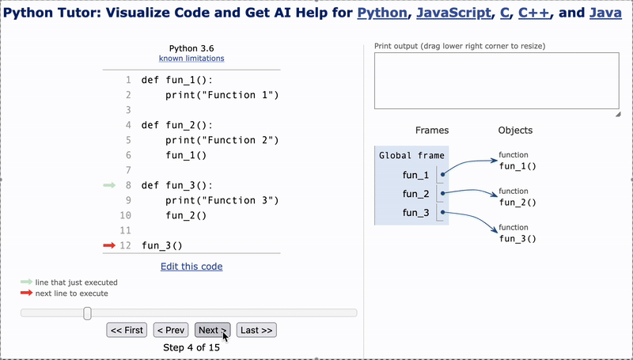
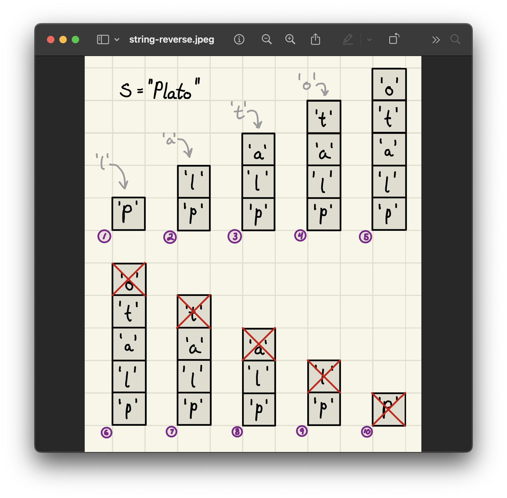

<h2 align=center>Week VIII & IX</h2>

<h1 align=center>Abstract Data Types: <em>Stacks</em></h1>

<p align=center><strong><em>Song of the day</strong>: <a href="https://youtu.be/Ew6x6sHiFaw?si=xnNIVAyPrc7Cu5uv"><strong><u>A Little Less Sixteen Candles, a Little More "Touch Me"</u></strong></a> by Fall Out Boy (2005)</em></p>

---

## Sections

1. [**Abstract Data Types (ADTs)**](#1)
2. [**Stacks**](#2)
    1. [**What Are They?**](#2-1)
    2. [**Implementation**](#2-2)
        - [**Static**](#2-2-1)
        - [**Dynamic**](#2-2-2)
3. [**Problem-Solving Using Stacks**](#3)
    1. [**Reversing A String**](#3-1)
    2. [**Evaluating Polish Notation**](#3-2)

---

<a id="1"></a>

## Abstract Data Types (ADTs)

With the algorithms portion of the course behind us, we now turn our attention fully to data structures—the bread and butter of real-world programming. We now know how to reason about efficiency, correctness, and complexity. What we'll be building on top of that, now, are the actual structural forms that data can take.

We'll start with the most general conception of a data structure, which we call an **abstract data type**. _Abstraction_ is a recurring theme in computer science. For our purposes, we can define it as the separation between the _interface_ of a program (what the user sees and interacts with) and its _implementation_ (what the program actually does behind the scenes to make that happen). This distinction gives rise to two related ideas:

- **Procedural Abstraction**: A group of steps treated as a single named unit.
- **Data Abstraction**: A way to organise data without worrying about how it's stored.

| **Abstraction Type**       | **Interface (Public – User's View)**                           | **Implementation (Private – Developer's View)** |
|---------------------------|--------------------------------------------------------------|------------------------------------------------|
| **Procedural Abstraction** | Clearly defines what a function should do for each input    | The actual function that performs the steps   |
| **Data Abstraction**       | Abstract Data Type (ADT) – describes what operations can be done on the data | The data structure (coded as a class) – how the data is actually stored |

<sub>**Figure 1**: Object-oriented programming encompasses both of these abstractions, incidentally.</sub>

Put simply:

- **Public (User's View)**: The interface tells us **what** we can do with the data.
- **Private (Developer's View)**: The implementation controls **how** the data is managed.
- **ADTs** keep code **organised and flexible** by cleanly separating **how data is used** from **how it's stored**.

We will be covering several of these ADTs throughout the rest of the semester, and we'll start with one we've already encountered in passing—the ***stack***.

<br>

<a id="2"></a>

## Stacks

<a id="2-1"></a>

### What Are They?

Back when we first looked at recursion, we explained that recursive calls were placed on something called the [**call stack**](https://github.com/sebastianromerocruz/CS1134-data-structures-and-algorithms/tree/main/lectures/06-recursion#recursion-in-memory). In order for a function call to be removed from it—that is, in order for it to finish execution—_any function calls made inside of it_, which are placed on top of it in the call stack, _must be removed first_. To make that concrete, consider a simple program:

```python
def fun_1():
    print("Function 1")

def fun_2():
    print("Function 2")
    fun_1()

def fun_3():
    print("Function 3")
    fun_2():

fun_3()
```



<sub>**Figure 2**: On the lower right portion of this gif, you can watch function calls "stack" downwards. The call to function `fun_3` cannot be removed from the stack until the call to `fun_2` is removed, which itself cannot be removed until the call to `fun_1` is removed.</sub>

This "order of operations" is referred to as **last-in-first-out**, or **LIFO**: the last object placed on the stack is always the first one to come off. The classic operations a stack exposes are the following:

|Operation|Description|
|-|-|
|`stack = Stack()`|Creates an empty stack|
|`len(stack)`|Returns the number of items currently on the stack|
|`stack.is_empty()`|Returns `True` is there are no items currenlty placed on the stack, `False` otherwise|
|`stack.push(item)`|Adds `item` to the top of the stack (insert)|
|`stack.pop()`|Removes and returns the top item currently in `stack` (i.e. the last one to have been added). If `stack` is empty, it will raise an exception.|
|`stack.top()`|Returns the top item currently in `stack` (i.e. the last one to have been added). If `stack` is empty, it will raise an exception.|

For example, given the following code:

```python
s = Stack()

s.push(2)
s.push(4)
s.push(3)
print(s.pop())  # 3

s.push(5)
print(s.pop())  # 5

print(s.top())  # 4
print(len(s))   # 2
```

Our stack would behave something like this:


<sub>**Figure 3**: As you can see, `pop()` removes an element while also returning it, while `top()` only returns it.</sub>

Of course, Python doesn't have a built-in `Stack` object. We can simulate some of its behaviour using Python lists (e.g. `append()` for `push`, `pop()`, and `len()`), but some pieces are still missing (e.g. `top()`/`peek()` and `is_empty()`). That means we'll need to implement it ourselves—and since the implementation is up to us, we get to decide whether the stack is _static_ (fixed-size) or _dynamic_ (resizable). Let's do both.

<br>

<a id="2-2"></a>

### [**Implementation**](code/Stack.py)


<sub>**Figure 4**: Memory diagram of a stack implemented using an [**`ArrayList`**](https://github.com/sebastianromerocruz/CS1134-data-structures-and-algorithms/tree/main/lectures/08-array-lists#week-v-day-2). Notice that it's been dynamically resized once.</sub>

For the dynamic version, we'll rely on the `ArrayList` implementation we've been building over the semester. Our target runtimes are:

|Operation|Static (`StaticArrayStack`)|Dynamic (`ArrayStack`)|
|-|-|-|
|`len()`|Θ(1) - worst case|Θ(1) - worst case|
|`is_empty()`|Θ(1) - worst case|Θ(1) - worst case|
|`push(item)`|Θ(1) - worst case|Θ(1) - **amortised**|
|`pop()`|Θ(1) - worst case|Θ(1) - **amortised**|
|`top()`|Θ(1) - worst case|Θ(1) - worst case|

<sub>**Figure 5**: The key distinction between the two: static operations are true worst-case Θ(1), while the dynamic version amortises the occasional resize cost across many operations.</sub>

<a id="2-2-1"></a>

#### Static Implementation

```python
class StaticArrayStack:
    def __init__(self, max_capacity):
        self.data = make_array(max_capacity)  # using ctypes' pyobject
        self.capacity = max_capacity
        self.n = 0

    def is_empty(self):
        return len(self) == 0

    def is_full(self):
        return len(self) == self.capacity

    def push(self, item):
        if self.is_full():
            raise Exception("Stack is full")

        self.data[self.n] = item
        self.n += 1

    def pop(self):
        if self.is_empty():
            raise Exception("Stack is empty")

        item = self.data[self.n - 1]
        self.data[self.n - 1] = None
        self.n -= 1
        return item

    def top(self):
        if self.is_empty():
            raise Exception("Stack is empty")

        return self.data[self.n - 1]

    def __len__(self):
        return self.n
```

Let's walk through what each method is actually doing.

`__init__` allocates a raw, fixed-size array of `max_capacity` slots using `ctypes`, and sets `n = 0` to indicate the stack starts empty. Notice that we track _two_ separate values: `capacity` (the total number of slots in the underlying array) and `n` (how many of those slots are currently occupied). The "top" of the stack is always at index `n - 1`.

`is_empty` and `is_full` are simple comparisons—both Θ(1). The former checks `n == 0`, the latter checks `n == capacity`. Note that `is_full` has no counterpart in the dynamic version; a fixed-size stack is the only one that can actually run out of room.

`push` first guards against overflow via `is_full`. If there's room, it writes the item to `data[n]`—the first unoccupied slot—and increments `n`. That's it: a single array write and a counter increment, so Θ(1) worst-case with no exceptions.

`pop` reads the item at `data[n - 1]`, then does something worth noting: it explicitly sets that slot to `None` before decrementing `n`. Decrementing `n` alone would be enough to "logically" remove the element (nothing would ever read past index `n - 1`), but the underlying array would still hold a live _reference_ to the popped object. Python's garbage collector works by counting references, so that object's memory would never be freed as long as the stack exists. Zeroing the slot breaks that reference and lets the garbage collector do its job. After that, `n` is decremented and the item is returned—all Θ(1) worst-case.

`top` is `pop` without the removal: read `data[n - 1]`, return it, change nothing. Θ(1) worst-case.

`__len__` returns `n` directly—a single attribute read. Θ(1) worst-case.

Because the array never grows, _every_ operation here is a true worst-case Θ(1)—no amortisation, no hidden cost. The trade-off is that once `n` reaches `capacity`, `push` will raise an exception rather than silently expanding.

<a id="2-2-2"></a>

#### Dynamic

```python
from ArrayList import ArrayList

class ArrayStack:
    def __init__(self):
        self.data = ArrayList()

    def is_empty(self):
        return len(self) == 0

    def push(self, val):
        self.data.append(val)

    def top(self):
        if self.is_empty():
            raise Exception("Stack is empty")

        return self.data[-1]

    def pop(self):
        if self.is_empty():
            raise Exception("Stack is empty")

        return self.data.pop()

    def __len__(self):
        return len(self.data)
```

The `ArrayStack` wraps an `ArrayList` rather than a raw fixed array. This makes the class remarkably elegant—most of the heavy lifting is delegated, and that's exactly the point: an ADT shouldn't care how its data is stored; it only defines _what_ can be done.

`__init__` simply constructs an empty `ArrayList`. No capacity argument, no upper bound—the stack will grow as needed.

`is_empty` calls `__len__` and checks whether the result is zero. Θ(1).

`push` delegates to `ArrayList.append`, which [**as we've seen, is amortised Θ(1)**](https://github.com/sebastianromerocruz/CS1134-data-structures-and-algorithms/tree/main/lectures/07-amortised#2).

`top` accesses `data[-1]`, a direct index into the `ArrayList`—Θ(1) worst-case. No modification, just a read.

`pop` delegates to `ArrayList.pop()`, which removes and returns the last element. Like `push`, this is also amortised Θ(1): occasionally a shrink triggers a copy, but that cost is spread out over the sequence.

`__len__` delegates to `len(self.data)`—Θ(1).

Notice that there's no `is_full` method here. That's not an oversight—a dynamic stack simply cannot fill up (within the limits of available memory), so the concept doesn't apply.

<br>

<a id="3"></a>

## Problem-Solving Using Stacks

The call stack is just one example of where this structure shows up in the wild. The LIFO property turns out to be genuinely useful in a surprising number of situations. Here are a couple of classic ones.

<a id="3-1"></a>

### Reversing A String

Reversing a string is a natural fit for stacks: since the first character of a string is pushed on earliest, it will be the last one to come off—placing it at the end of the reversed output.



<sub>**Figure 6**: FILO at its finest.</sub>

The implementation follows directly from that intuition:

```python
# Θ(n)
def print_in_reverse(string):
    stack = ArrayStack()         # Θ(1)

    # Θ(n)
    for char in string:
        stack.push(char)         # Θ(1)

    # Θ(n)
    while not stack.is_empty():
        char = stack.pop()       # Θ(1)
        print(char, end='')      # Θ(1)

    print()                      # Θ(1)

if __name__ == "__main__":
    string = "Phaedrus, by Plato"
    print_in_reverse(string)
```

Let `n = len(string)`. The analysis breaks down into two passes over the data:

- **Push loop**: We iterate over every character in the string exactly once, calling `push` on each—`n` iterations × amortised Θ(1) per push = **Θ(n)**.
- **Pop loop**: We pop every character back off in reverse order, again exactly once each—`n` iterations × amortised Θ(1) per pop = **Θ(n)**.
- Everything else (`ArrayStack()`, the final `print()`) is Θ(1).

Adding those up: Θ(n) + Θ(n) + Θ(1) = **Θ(n)** overall.

For space, the stack holds at most all `n` characters simultaneously—right after the push loop completes but before we start popping. So auxiliary space is **Θ(n)**.

<a id="3-2"></a>

### Evaluating Polish Notation

Usually, we write mathematical expressions in the following format:

```
operand_one operator operand_two
```

As in:

```
2 + 2
```

This is known as **infix notation**, and it turns out to be just one of several valid ways to express the same operation. For instance, we could instead write the operator _first_, followed by its two operands:

```
+ 2 2
```

This is known as **Polish notation**, or **prefix notation**:

> **Polish notation**, also known as normal Polish notation, Łukasiewicz notation, Warsaw notation, Polish prefix notation or simply prefix notation, is a mathematical notation in which **operators precede their operands**, in contrast to the more common infix notation, in which operators are placed between operands, as well as reverse Polish notation, in which operators follow their operands. It does not need any parentheses as long as each operator has a fixed number of operands.
>
> The description "Polish" refers to the nationality of logician Jan Łukasiewicz, who invented Polish notation in 1924. The term Polish notation is sometimes taken to also include reverse Polish notation. When Polish notation is used as a syntax for mathematical expressions by programming language interpreters, it is readily parsed into abstract syntax trees and can, in fact, define a one-to-one representation for the same.

– [***Polish Notation, Wikipedia***](https://en.wikipedia.org/wiki/Polish_notation)

| **Infix Notation**         | **Prefix Notation**       | **Postfix Notation**      |
|----------------------------|---------------------------|---------------------------|
| 5                          | 5                         | 5                         |
| 5 + 2                      | + 5 2                     | 5 2 +                     |
| 5 - (3 * 6)                | - 5 * 3 6                 | 5 3 6 * -                 |
| (5 - 3) * 6                | * - 5 3 6                 | 5 3 - 6 *                 |
| ((5 + 2) * (8 - 3)) / 4    | / * + 5 2 - 8 3 4         | 5 2 + 8 3 - * 4 /         |

<sub>**Figure 7**: Examples of math operations written in infix, prefix, and reverse prefix (i.e. postfix) notations.</sub>

We'll focus on **postfix** (also called reverse Polish notation), since it maps especially cleanly onto a stack. In postfix, the operator appears _after_ its operands, and we scan the expression from _left to right_, processing an operator as soon as we have enough operands to apply it. Let's trace through an example:

```
2 3 4 + 3 * -
```

- First operator encountered is `+`
- Operands: `3` and `4`
- Compute: `3 + 4 = 7`
- Replace in the expression:

```
2 7 3 * -
```

- Next operator is `*`
- Operands: `7` and `3`
- Compute: `7 * 3 = 21`
- Replace in the expression:

```
2 21 -
```

- Final operator is `-`
- Operands: `2` and `21`
- Compute: `2 - 21 = -19`
- Replace in the expression:

```
-19
```

If we think of the right side of the expression as the top of a stack, the pattern becomes clear—and so does the implementation:


<sub>**Figure 8**: A stack can keep pushing operands _until_ it encounters an operator, upon which it makes the calculation and pushes the result back.</sub>

```python
OPERATORS = "+-*/"

# Θ(n)
def eval_postfix_exp(expression_string):
    expression_list = expression_string.split()     # Θ(n)
    operand_stack = ArrayStack()                    # Θ(1)

    # Θ(n)
    for token in expression_list:
        if token not in OPERATORS:                  # Θ(1)
            operand_stack.push(int(token))          # Θ(1)
        else:
            operand_one = operand_stack.pop()       # Θ(1)
            operand_two = operand_stack.pop()       # Θ(1)

            if token == '+':                        # Θ(1)
                result = operand_two + operand_one  # Θ(1)
            elif token == '-':                      # Θ(1)
                result = operand_two - operand_one  # Θ(1)
            elif token == '*':                      # Θ(1)
                result = operand_two * operand_one  # Θ(1)
            elif token == '/':                      # Θ(1)
                if operand_one == 0:                # Θ(1)
                    raise ZeroDivisionError         # Θ(1)
                else:                               # Θ(1)
                    result = operand_two / operand_one  # Θ(1)

            operand_stack.push(result)              # Θ(1)

    return operand_stack.pop()                      # Θ(1)
```

Let `n` be the number of tokens in the expression. The analysis:

- **`split()`**: scans the entire expression string once to break it into tokens—**Θ(n)**.
- **Main loop**: `n` iterations, one per token. In each:
    - Checking `token not in OPERATORS` tests against a fixed 4-character string—Θ(1).
    - A token is either an operand (`push`, amortised Θ(1)) or an operator (two `pop`s + arithmetic + one `push`, all Θ(1) amortised).
    - So each iteration is amortised Θ(1), and the full loop is **Θ(n)**.
- **Final `pop()`**: Θ(1).

Total: Θ(n) + Θ(n) + Θ(1) = **Θ(n)**.

For space: a valid postfix expression with `k` operators has `k + 1` operands, and at any moment the stack only holds operands that haven't yet been consumed by an operator. In the worst case (all operands appear before any operator), the stack can reach roughly `n/2` elements—still **Θ(n)** auxiliary space.

Why use a stack here rather than a naive approach? Without one, we'd end up repeatedly scanning the entire expression from left to right, finding the first operator, applying it, rewriting the expression, and starting over:

1. Read the entire expression left to right.
2. Find the first operator.
3. Apply the operator to the two most recent operands.
4. Replace the operator and its operands with the result, forming a new string.
5. Repeat steps 1–4 until only one number remains.

This is inefficient for two reasons. First, we're traversing the list multiple times—once per operator found. Second, each rewrite removes elements and shifts others to fill the gap, which takes time proportional to the remaining list size. In the worst case (every operator appears at the end of the expression), each of the Θ(n) operators triggers a scan and a rewrite of an expression that is still Θ(n) long—giving **Θ(n²)** overall. The stack-based solution avoids all of that by processing the expression in a single left-to-right pass: one push or one pop per token, nothing more.
