<h2 align=center>Week 11</h2>

<h1 align=center>Abstract Data Types: <em>Trees</em></h1>

<p align=center><strong><em>Song of the day</strong></em>: <em><a href="https://youtu.be/ZeylQF-5OSE?si=KGiamrO-RRsGBD-B"><strong><u>Something To Hold (Live at Glasshaus)</u></strong></a> by Bilal [feat. Questlove, Common, Robert Glasper, & Burniss Travis] (2024)</em></p>

---

## Sections

1. [**An Old Friend**](#1)
2. [**Definitions**](#2)
    - [**Parent, Child, and Sibling Nodes**](#2-1)
    - [**Types of Nodes**](#2-2)
    - [**Subtrees**](#2-3)
    - [**Edges, Paths, and Lengths**](#2-4)
    - [**Ancestors and Descendants**](#2-5)
    - [**Depth and Height**](#2-6)
3. [**Binary Trees**](#3)
    - [**Asymptotic Analysis of Binary Trees**](#3-1)
    - [**Implementation**](#3-2)
        - [**The `Node` Class**](#3-2-1)
        - [**The `LinkedBinaryTree` Class**](#3-2-2)
4. [**Traversals**](#4)

---

<a id="1"></a>

## An Old Friend

Remember back when we were talking about stacks, we one of our use cases was the resolution of a [**postfix expression**](https://github.com/sebastianromerocruz/CS1134-data-structures-and-algorithms/tree/main/lectures/08-stacks#3-2)?

A common way of representing these operations is by using something called a **tree**, which allows us to split up the individual operations to get a better idea of what happens first:

<a id="polish"></a>

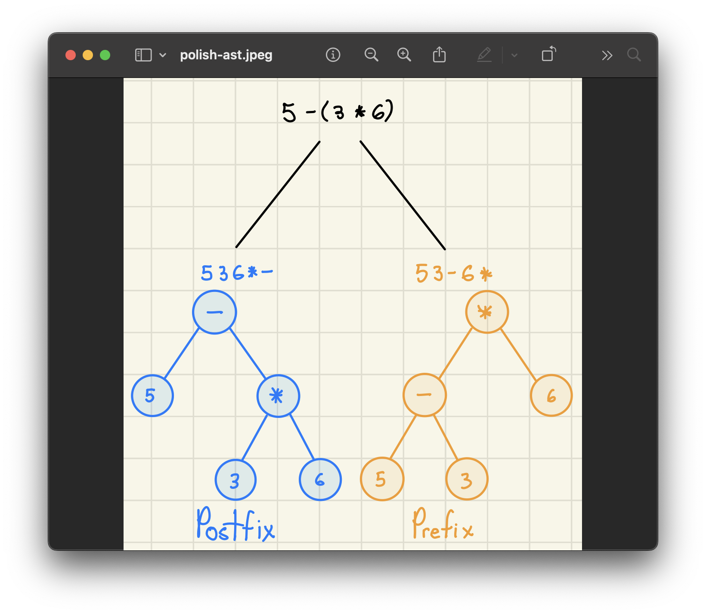

<sub>**Figure 1**: Polish notation represented by tree structures.</sub>

We've seen tree structures in other situations as well, such as when we used [**recursion trees**](https://github.com/sebastianromerocruz/CS1134-data-structures-and-algorithms/tree/main/lectures/06-recursion#2-1) in order to figure out the runtime of recursive algorithms:


<sub>**Figure 2**: Recursive tree analysis of one of our versions of the [**power function**](https://github.com/sebastianromerocruz/CS1134-data-structures-and-algorithms/tree/main/lectures/06-recursion#2-3-4).</sub>

Clearly, these structures are useful for representing data in certain situations, so why don't we formally introduce them and find out how we can convert them into an actual workable data structure.

<br>

<a id="2"></a>

## Definitions

<a id="2-1"></a>

### Parent, Child, and Sibling Nodes

In order to better work with these tree structures, it's helpful to introduce a few definitions of its components. At its simplest, a tree is simply a structure that has two nodes connected to each other. The node placed highest up the tree is referred to as the **parent** node, while all nodes down the tree are referred to as **children** nodes. For this reason, we say that tree nodes share a **parent-child** relationship:

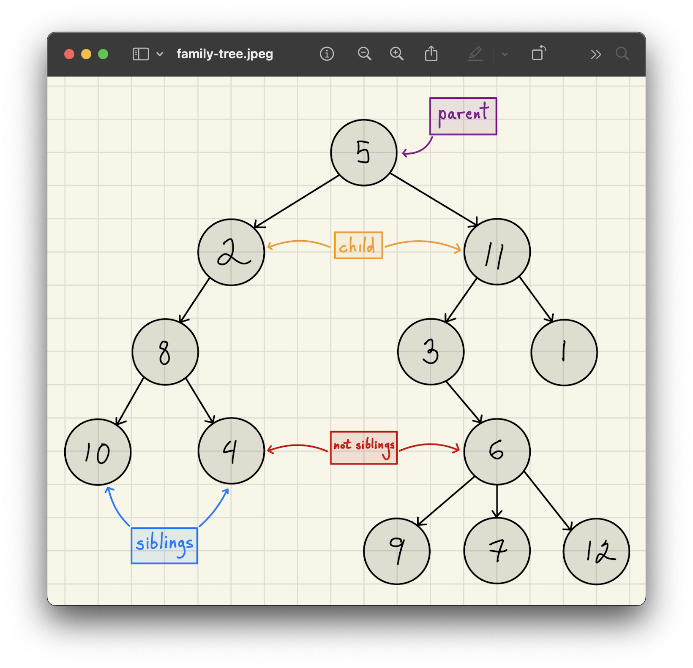

<sub>**Figure 3**: Much like a real-life family tree, trees in computer science use relationship terminology.</sub>

As you can see above, two children nodes that connect to the same parent as known as **sibling** nodes.

<a id="2-2"></a>

### Types of Nodes

Nodes take on additional different names depending on their position within the tree. For example: 

- **Root**: The node from which all subsequence child nodes connect.
- **Leaf**: A node that is part of the tree but has no children itself.
- **Internal**: A node that is both a child and a parent of another node within a tree.

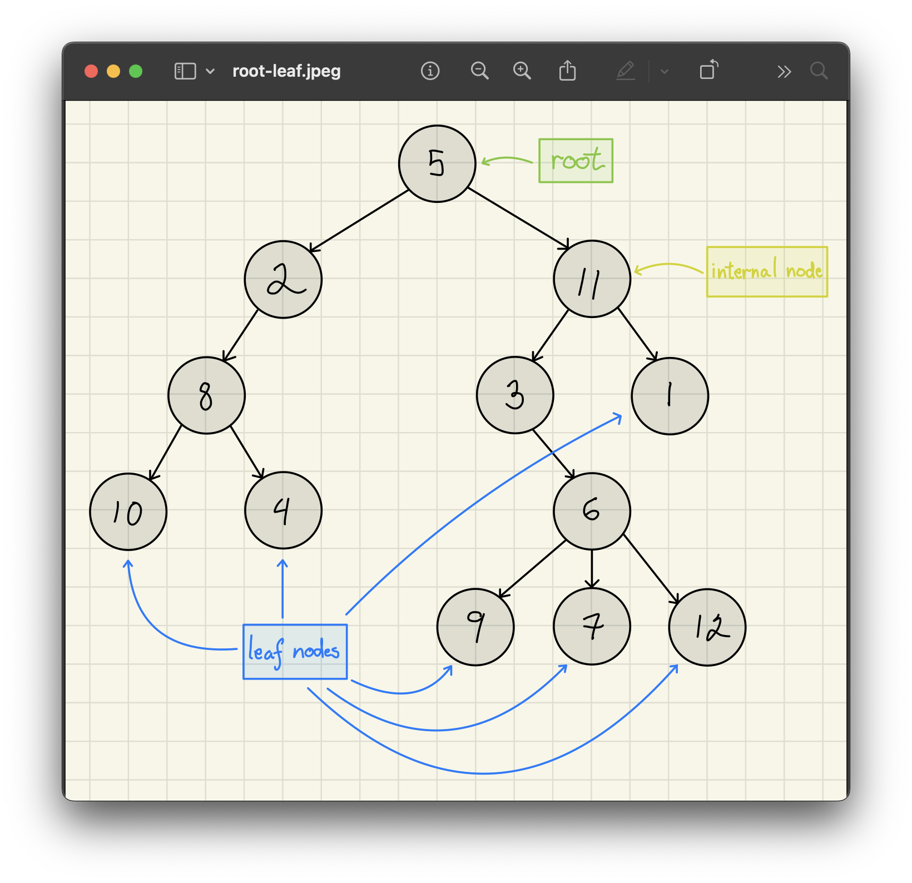

<sub>**Figure 4**: Root, leaf, and internal nodes. Note here that `Node(8)`, `Node(3)`, and `Node(2)` are also internal nodes.</sub>

<a id="2-3"></a>

### Subtrees

As you can see, the trees that we are working with are _singly-linked_. That is, the connection between nodes goes only one way. Because of this, depending on how you look at them, you could consider each individual node as the _root_ node of its own **subtree**. Something like this:

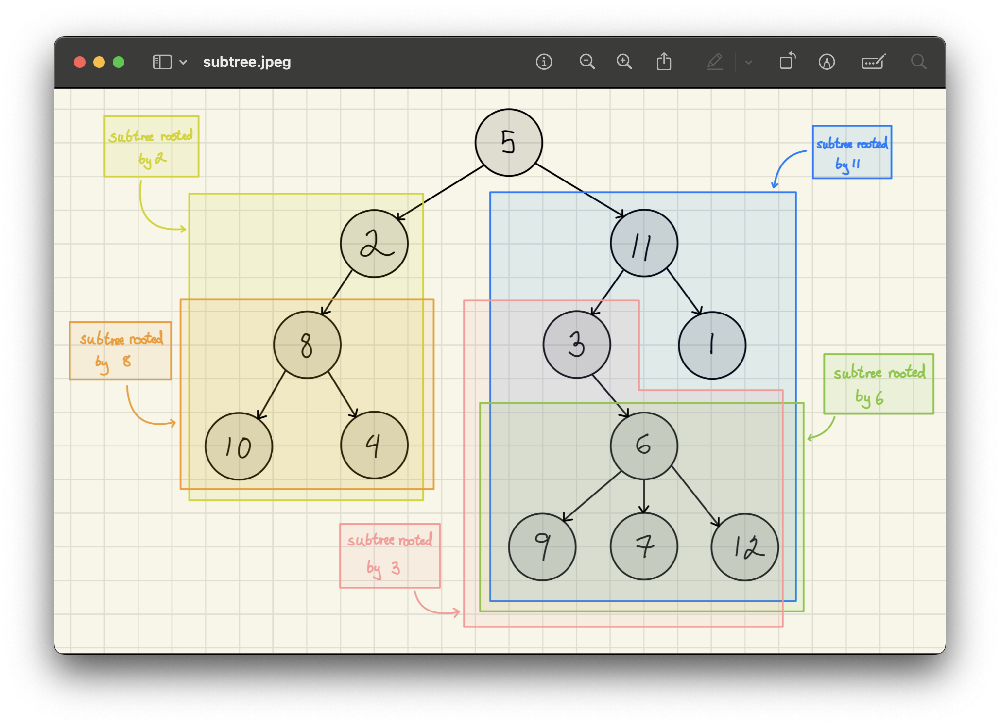

<sub>**Figure 5**: Each leaf node, too, could in some sense be considered the root node of an empty subtree.</sub>

In other words, every tree _could_ itself be a subtree of another tree, which _could_ be a subtree of another tree, which _could_ be a subtree of another tree. You get the point. You might be thinking to yourself: "Hey, that sounded a bit like recursion!" You would be 100% correct. Tree structures lend themselves really well to recursive operations.

We'll be looking at those later.

<a id="2-4"></a>

### Edges, Paths, and Lengths

Next, we'll look at the other components and attributes that make up, or can be derived from, a tree. For example:

- **Edge**: If `u` and `v` are nodes within a tree, then **(`u`, `v`)** is an _edge_ if `u` is the parent of `v`.
- **Path**: **`p`** = (`v1`, `v2`, …, `vk`) is a path if each two consecutive nodes forms an edge. Here nodes `v1`, `v2`, etc. are consecutive nodes.
- **Length Of Path**: **|`p`|** = number of edges in `p`.

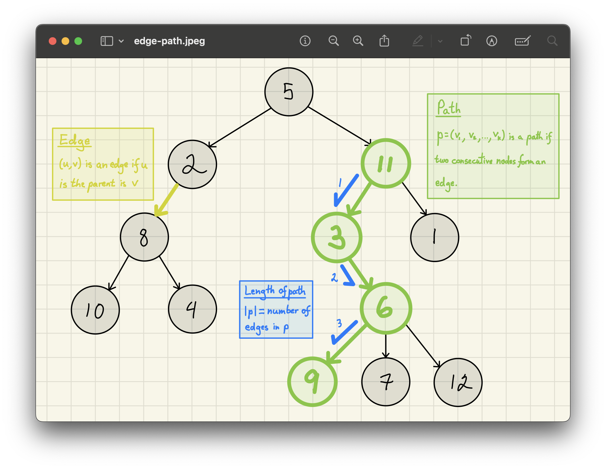

<sub>**Figure 6**: The length of the path marked in green, in this case, is 3.</sub>

<a id="2-5"></a>

### Ancestors and Descendants

Similar to parent and child nodes:

- **Ancestor**: If `u` and `v` are nodes within a tree, the `u` is an _ancestor_ of `v` if there is a path from `u` to `v` (alternatively, if `v` is in the subtree rooted by (at) `u`).
- **Descendant**: `u` is a _descendant_ of `v` if `v` is an ancestor of `u`.

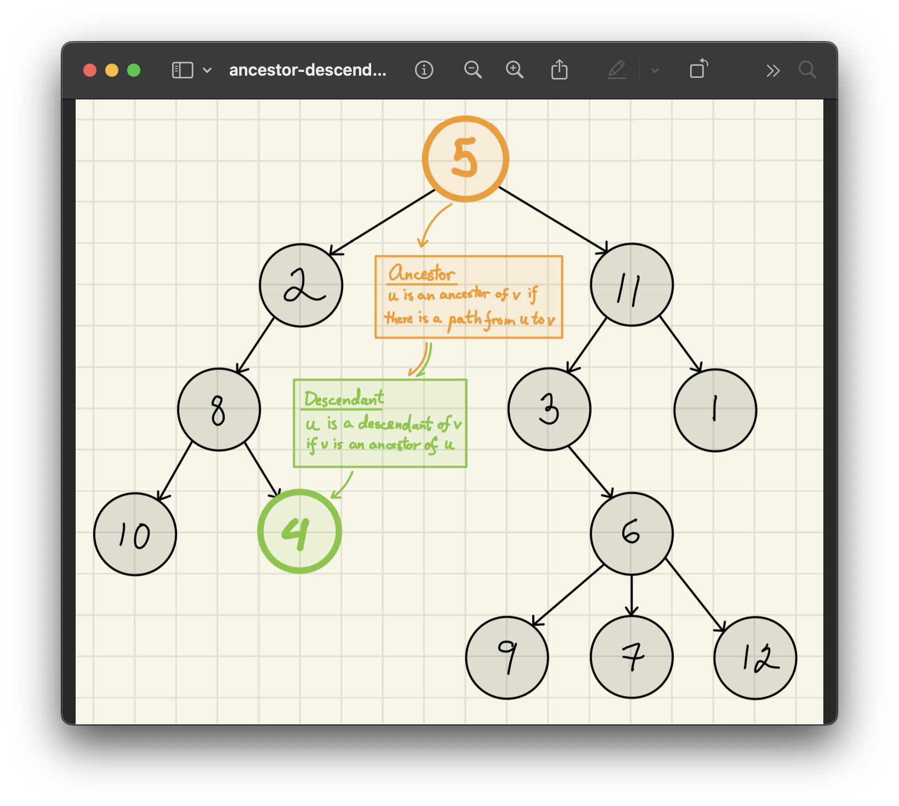

<sub>**Figure 7**: An example of an ancestor and descendant nodes.</sub>

<a id="2-6"></a>

### Depth and Height

Finally, two terms that will become very important later on:

- **Depth of a Node**: `depth(v)` is the length of the path from the `root` to `v`.
- **Height of a Tree**: `height(T)` is the length of the longest path in `T`.

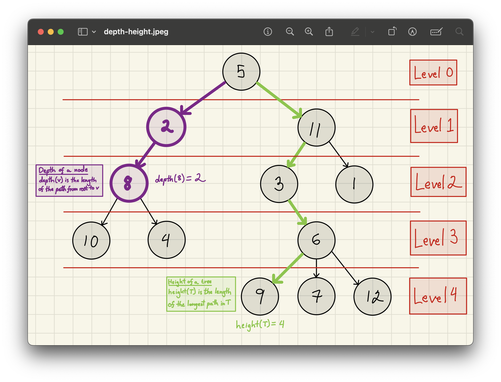

<sub>**Figure 8**: Note that the `root` level is considered to have a depth of 0.</sub>

<br>

<a id="3"></a>

## Binary Trees

Now, while there are many ways to implement trees, the ones that we'll focus on are called **binary trees**. A tree, `T`, is a binary tree if the number of children of each node in `T` is either 0, 1, or 2:

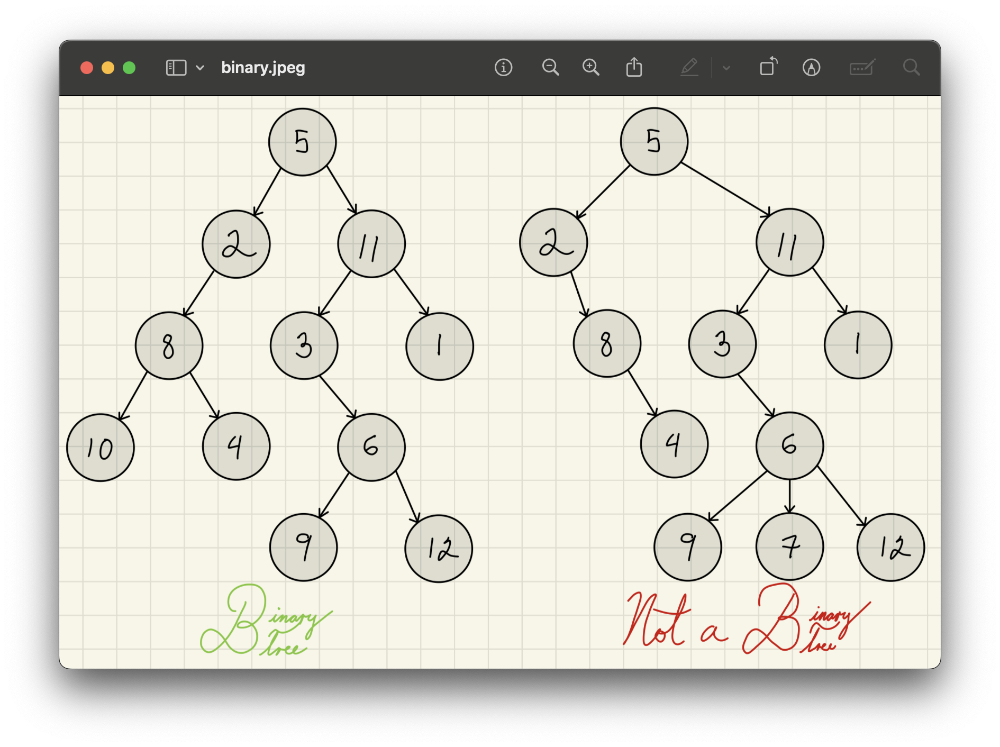

<sub>**Figure 9**: As defined above, binary trees cannot have more than 2 children.</sub>

More specifically:

- **Full (Proper) Binary Tree**: A binary tree, `T`, is a _full binary tree_, if the number of children of each node in `T` is either 0 or 2.
- **Complete Binary Tree**: A binary tree, `T`, is a _complete binary tree_, if all the levels of `T` contain all possible nodes (i.e. 2).

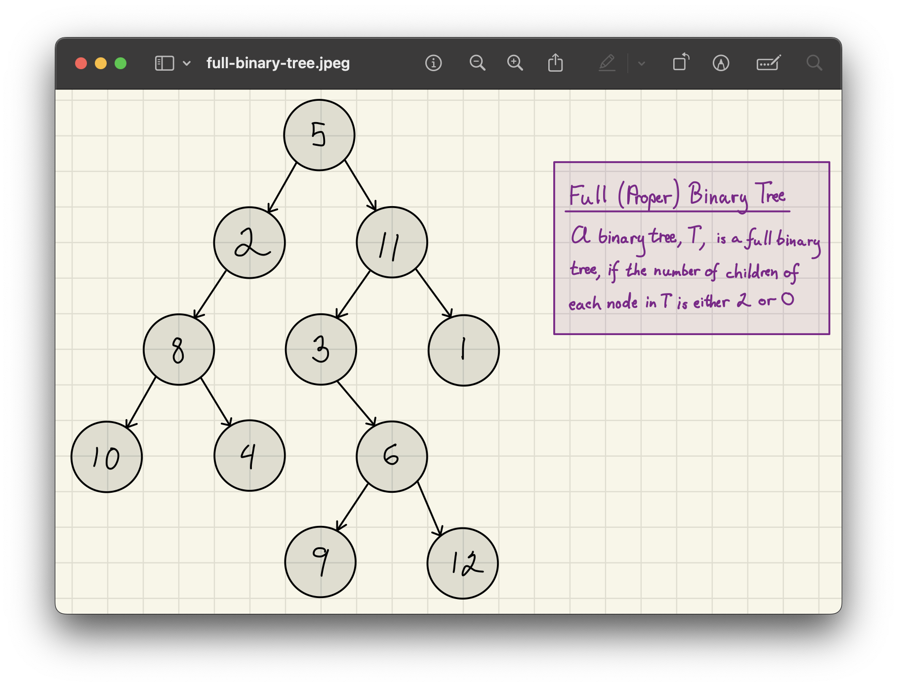
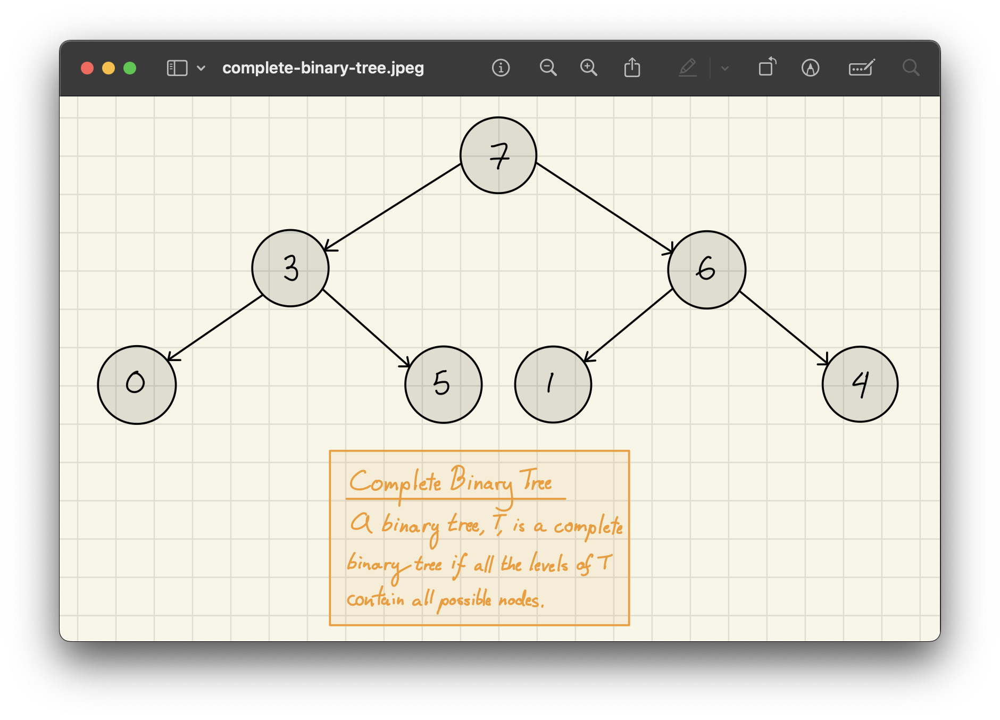

<sub>**Figures 10 and 11**: A full and complete example of a binary tree.</sub>

Other examples of binary tree include our [**polish notation trees**](#polish) from earlier. Note that leaf nodes, implementation-wise, are nodes whose children are `None`:

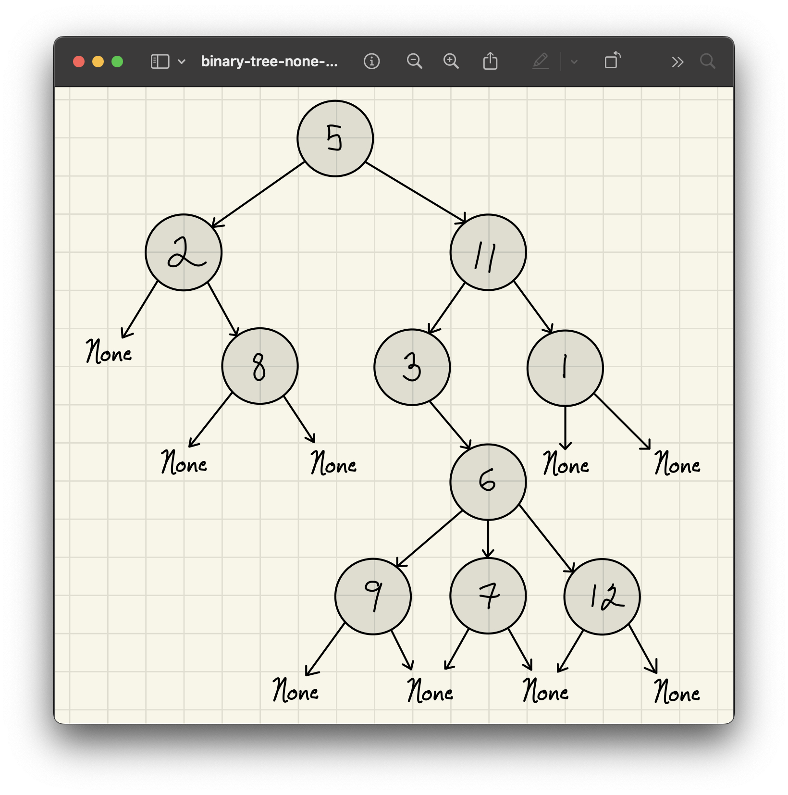

<sub>**Figure 12**: Checking for `None` nodes is a key part of many binary tree operations.</sub>

So why is it that we focus on binary trees above all? Well, for one, it's a _lot_ easier to implement a data structure with a set number of components. Also, however, it turns out that asymptotic analysis for general trees is much the same as binary trees. So, by analyse binary trees, we analyse trees in general.

Let's look at that next.

<a id="3-1"></a>

### Asymptotic Analysis of Binary Trees

Say that we wrote a function that summed up all the values in a tree. It doesn't even need to be a binary tree, but for simplicity, let us assume that it is one. Arithmetic operations are done in constant time, as we know, so, were we to represent the work being done here, each node would have a little (1) next to it (once more, like we did in [**recursion trees**](https://github.com/sebastianromerocruz/CS1134-data-structures-and-algorithms/tree/main/lectures/06-recursion#2-1)). The way we're going to generalise our binary tree is by representing our **<a style="color:blue">internal nodes in _blue_</a>** and our **<a style="color:red">leaf nodes in _red_</a>**.

For each **<a style="color:blue">node</a>**, then, our work is constant. The work being done by our **<a style="color:red">children nodes</a>** is also constant. If we progress through this algorithm recursively, we can generalise the work being done here as follows:

> **T(`n`)** = number of nodes in tree
>
> **T(`n`)** = **<a style="color:blue">number of blue nodes</a>** + **<a style="color:red">number of red nodes</a>**

Now, in a binary tree, we know that the number of leaf nodes per level is bounded by 2 (that is, there can only be 0, 1, or 2). For that reason, we can say that:

> **T(`n`)** = **<a style="color:blue">number of blue nodes</a>** + **<a style="color:red">number of red nodes</a>**
>
> **T(`n`)** = **<a style="color:blue">`n`</a>** + **<a style="color:red">2`n`<sub>max</sub></a>**
>
> **T(`n`)** = **3`n`**.

...which, ultimately means that:

> **T(`n`)** = **`n` = total cost ≤ 3`n`**
>
> **T(`n`)** = **Θ(`n`)**

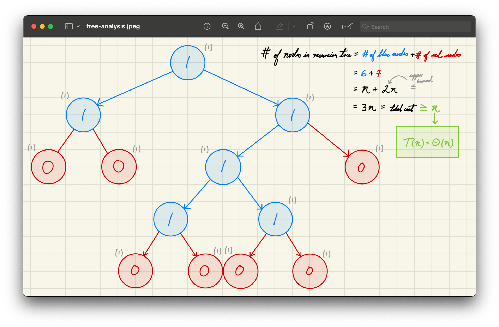

<sub>**Figure 13**: Asymptotic analysis of a constant time operation involving trees.</sub>

So, why does this make the number of children nodes not matter. Well, as we have just proved, the number of children is really just a constant–we can have as many as we want but, ultimately, as the size of `n` approaches infinity, it will remain what it is: a constant.

<a id="3-2"></a>

### Implementation

<a id="3-2-1"></a>

#### The `Node` Class

The nodes used to create binary trees are similar to those of a linked list's, and it's for that reason that we will be calling our data structure `LinkedBinaryTree`. The implementation of the `Node` class, thus, will look very familiar:

```python
class Node:
    def __init__(self, data, left=None, right=None):
        self.data = data
        
        self.left = left
        if left is not None:
            self.left.parent = self
            
        self.right = right
        if right is not None:
            self.right.parent = self
            
        self.parent = None
```

The key difference here is that, aside from having connections to its children, each node also keeps track of its _parent node_:

```python
node_a  = Node(3)
node_b = Node(25)
root  = Node(7, node_a, node_b)

print(f"\t({root.data})")
print(f"({root.left.data})\t\t({root.right.data})")

print(f"\n- Node ({node_a.data})'s parent is ({node_a.parent.data})")
print(f"- Node ({node_b.data})'s parent is ({node_b.parent.data})")
print(f"- Node ({root.data})'s parent is ({root.parent.data if root.parent else None})")
```

Output:

```
        (7)
(3)             (25)

- Node (3)'s parent is (7)
- Node (25)'s parent is (7)
- Node (7)'s parent is (None)
```

<a id="3-2-2"></a>

#### The `LinkedBinaryTree` Class

Putting our `Node` class inside of our general data structure, we thus get the following:

```python
class LinkedBinaryTree:
    class Node:
        def __init__(self, data, left=None, right=None):
            self.data = data
            
            self.left = left
            if left is not None:
                self.left.parent = self
                
            self.right = right
            if right is not None:
                self.right.parent = self
                
            self.parent = None

    def __init__(self, root=None):
        self.root = root
        self.size = self.count_nodes()
```

What is this mysterious `count_nodes` method? It turns out to not be very different from our [**sum operation**](#3-1) we did earlier. Fundamentally, counting the number of nodes in a tree can be defined as:

> Count(`node`) = 1 + Count(`node.left`) + Count(`node.right`)

Where the count of the `left` and `right` of a leaf node are both zero. At that point, we stop counting. Extremely recursive, I know. It's precisely _because_ of recursion that this definition is so simple:

```python
def count_nodes(self):
    def subtree_count(root):
        if root is None:
            return 0
        else:
            left_count  = subtree_count(root.left)
            right_count = subtree_count(root.right)
            
            return left_count + right_count + 1

    return subtree_count(self.root)
```

The sum method, by the way, is quite literally the same exact same thinking:

```python
def sum(self):
    def subtree_sum(root):
        if root is None:
            return 0
        else:
            left_sum  = subtree_sum(root.left)
            right_sum = subtree_sum(root.right)
            
            return left_sum + right_sum + root.data

    return subtree_sum(self.root)
```

<br>

<a id="4"></a>

## Traversals

