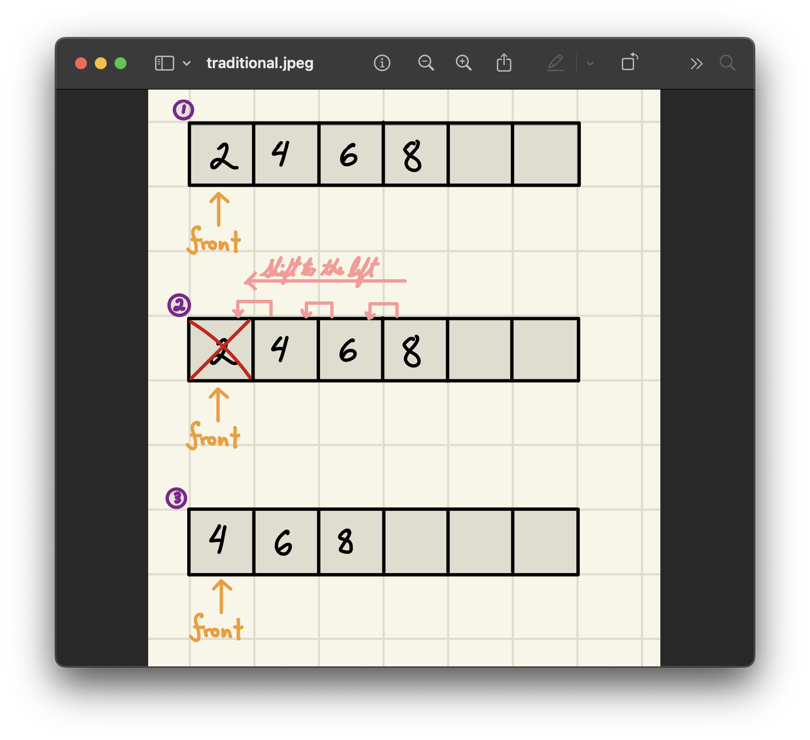
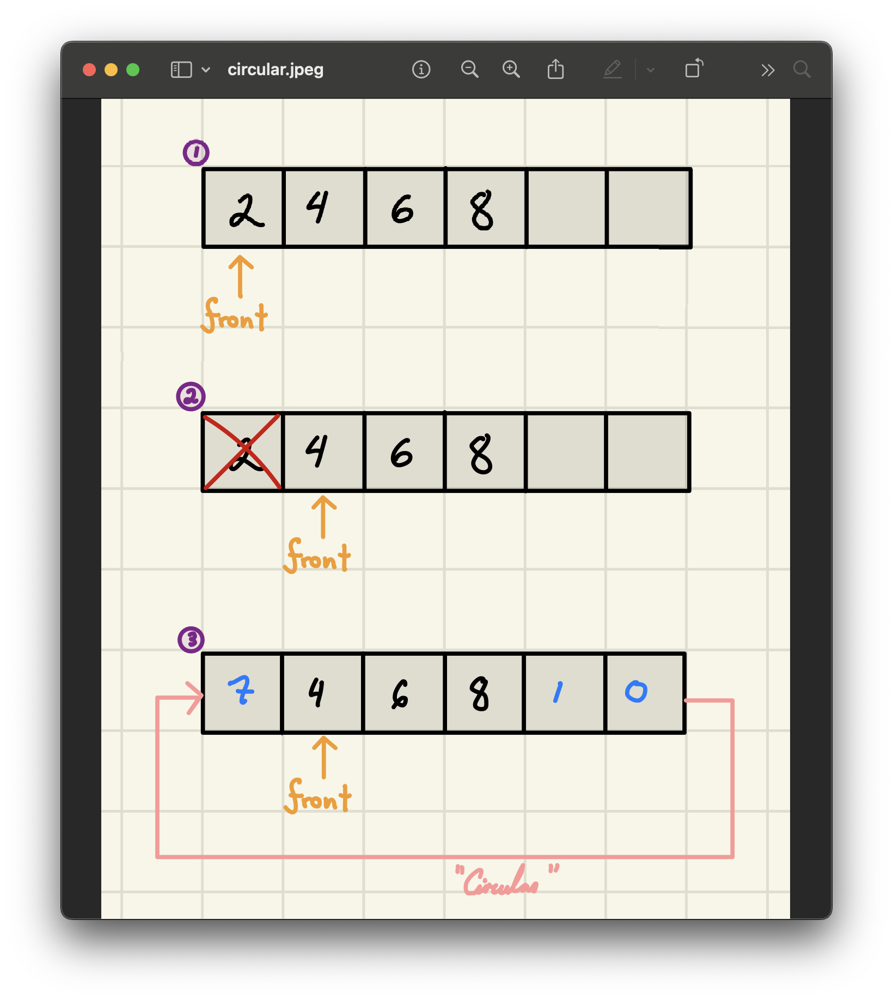
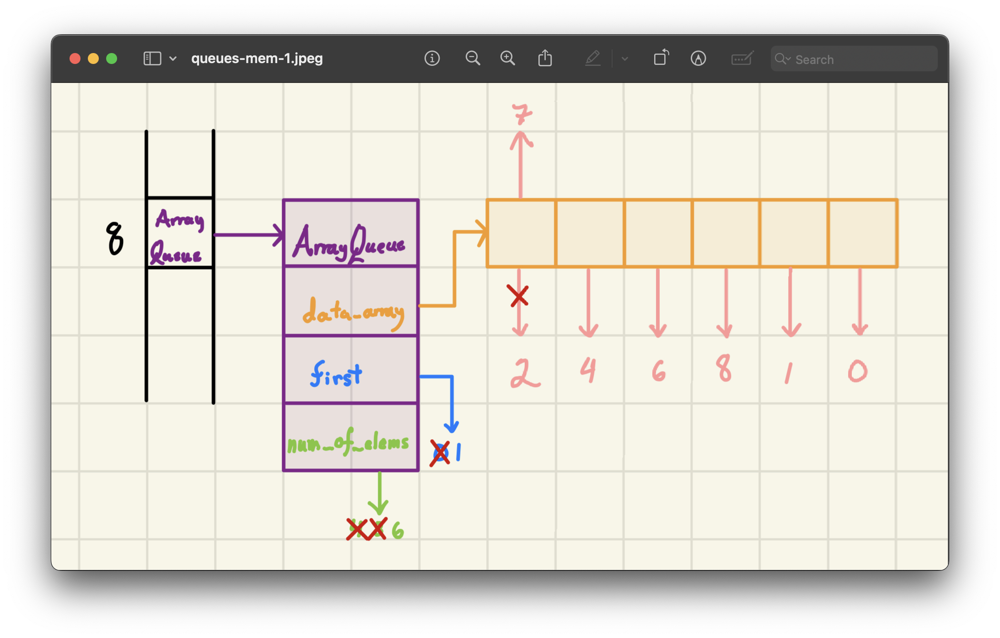
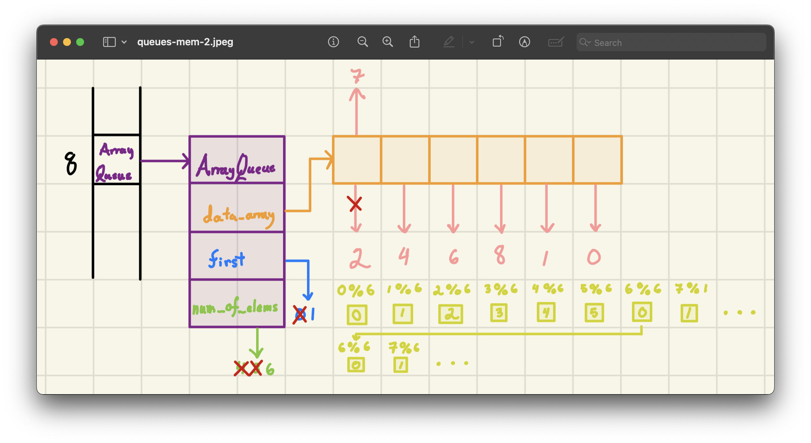
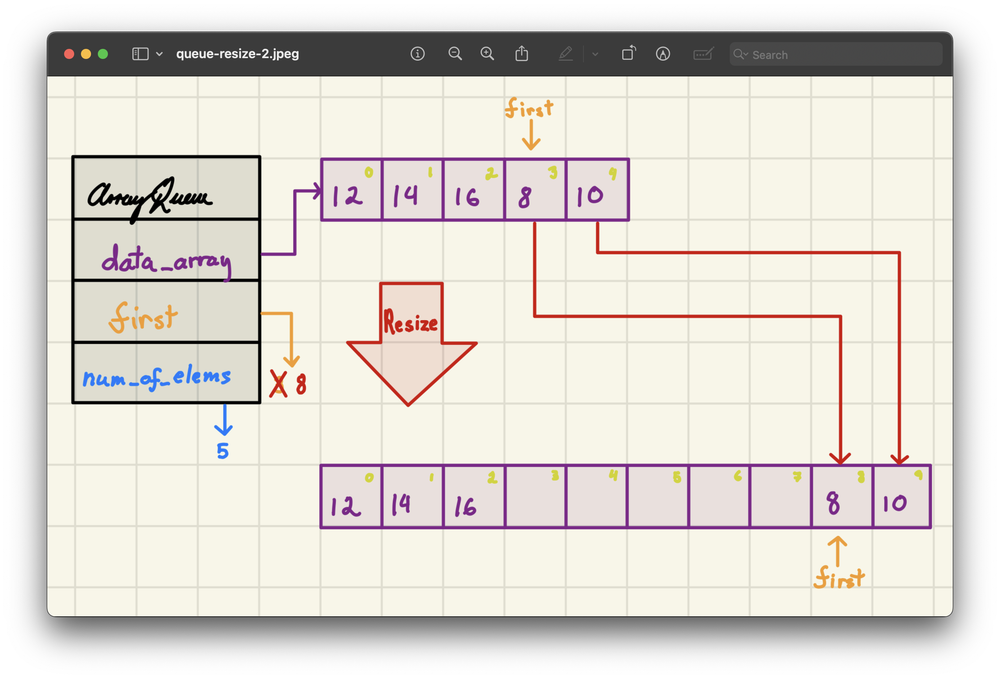
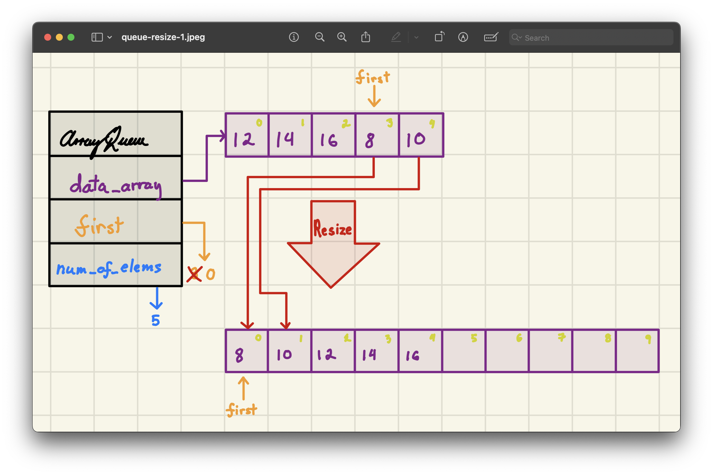

<h2 align=center>Week IX</h2>

<h1 align=center>Abstract Data Types: <em>Queues</em></h1>

<p align=center><strong><em>Song of the day</strong></em>: <em><a href="https://youtu.be/7Tln_B11HgQ?si=QIAzJd2zFSMHg8Ms"><strong><u>Lesson Learnt (Live at COLORS)</u></strong></a> by Aaron Taylor (2017)</em></p>

---

## Sections

1. [**Queue ADT**](#1)
2. [**Queue Implementations**](#2)
   1. [**Dynamic Queue**](#2-1)
   2. [**Static Queue**](#2-2)
3. [**Queue Implementation Models**](#3)
4. [**Python Implementation**](#4)
   1. [**Static**](#4-1)
   2. [**Dynamic**](#4-2)

---

<a id="1"></a>

## **Queue ADT**

Next on our list of ADTs is the **queue**. Just like forming a line to enter, say, an event or a restaurant, a queue is a data structure that maintains items in a **FIFO** order (First-In, First-Out). The earliest enqueued element is always the first one dequeued, or "popped". Its operations are as follows:

| **Operation**         | **Description**                                                                                  |
|-----------------------|--------------------------------------------------------------------------------------------------|
| `q = Queue()`         | Creates an empty queue                                                                           |
| `len(q)`              | Returns the number of items in `q`                                                               |
| `q.is_empty()`        | Returns `True` if `q` is empty, `False` otherwise                                               |
| `q.enqueue(item)`     | Adds `item` to the **end** of the queue                                                         |
| `q.dequeue()`         | Removes and returns the **front** item (the earliest enqueued); raises exception if empty        |
| `q.first()`           | Returns the **front** item without removing it; raises exception if empty                       |

<sub>**Figure 1**: The general queue operations we are to implement.</sub>

Just like with stacks, lists can provide some of this functionality, but certainly not all and not with the flexibility that we are after.

<br>

<a id="2"></a>

## **Queue Implementations**

Also just like stacks, we can implement a queue in two main ways: a **dynamic** one with no preset size limit, and a **static** one with a maximum capacity.

<a id="2-1"></a>

### **Dynamic Queue**

A **dynamic queue** expands memory usage as needed. It has no size limitation and can accommodate more data automatically. We, thus, have no need to check if our queue is full. Think of this as the queue to get into literally any NYU career fair:

| Operation       | Description                                                       |Time Complexity Goal (Amortised)|
|----------------|------------------------------------------------------------------|-|
| `q = Queue()`   | Creates an empty, dynamically sizable queue                      |Θ(1)|
| `enqueue(item)` | Adds `item` to the queue end                                    |Θ(1)|
| `dequeue()`     | Removes the earliest enqueued item and returns it               |Θ(1)|
| `first()`       | Returns the front item without removing it                      |Θ(1)|
| `len(q)`        | Returns the number of items in `q`                              |Θ(1)|
| `q.is_empty()`  | Checks if `q` has no items (returns True/False)                 |Θ(1)|

<sub>**Figure 2**: Methods of a dynamic queue alongside our target time complexities.</sub>

<a id="2-2"></a>

### **Static Queue**

A **static queue** uses a **fixed size** array and will raise an exception if it becomes full. For this, of course, we need an additional method.

| Operation             | Description                                                                              |Time Complexity Goal (Amortised)|
|-----------------------|------------------------------------------------------------------------------------------|-|
| `q = Queue(max_cap)`  | Creates an empty queue with capacity `max_cap`                                           |Θ(1)|
| `enqueue(item)`       | Adds `item` to the queue end, or raises exception if full                               |Θ(1)|
| `dequeue()`           | Removes and returns the earliest enqueued item, or raises exception if empty             |Θ(1)|
| `first()`             | Returns the front item without removing it, or raises exception if empty                |Θ(1)|
| `is_full()`           | Returns `True` if the queue is at max capacity, `False` otherwise                       |Θ(1)|
| `len(q)`              | Returns the number of items in `q`                                                      |Θ(1)|
| `q.is_empty()`        | Checks if `q` has no items (returns True/False)                                         |Θ(1)|

<sub>**Figure 3**: Methods of a static queue alongside our target time complexities.</sub>

Now, implementing these runtimes with stacks was relatively simple; under LIFO, `pop()` does not have to do much in order to remove an element from either a dynamic or a static stack. Queues, however, are a little more complicated since we are removing the _first element_ when we dequeue. This introduces the key question when considering queues: _when we remove an element from the queue, **what happens to the rest of the elements?**_

Do they all shift one index to the left towards the "front" of the queue, or does index 1 become the new front of the queue? Can we achieve a constant runtime under both of those implementations? Well, let's look at an example of a queue to illustrate this.

<br>

<a id="3"></a>

## **Queue Implementation Models**

Consider the following queue in memory:

```python
q = Queue()
q.enqueue(2)
q.enqueue(4)
q.enqueue(6)
q.enqueue(8)

print(q.dequeue())  # -> 2
# Now queue has [4, 6, 8] (front is 4)
```

<a id="3-1"></a>

### Traditional Model

In this implementation `dequeue` requires shifting items so the new front is at index 0. This is more akin to a queue in real life. However, just like dequeuing in real life, this requires every single person in the queue to move a step forward, which is quite a bit of work. Indeed, the cost of implementing this is Θ(`n`), since we must recopy each element in the queue over again, just one step to the left:



<sub>**Figure 4**: Clearly, we're not meeting our Θ(1) amortised runtime goal like this.</sub>

<a id="3-2"></a>

### Circular Model

The solution to this is to think in relative terms. Instead of making everybody in the line move one step forward, why not move the front-of-queue marker one step forward in the array? We call this the circular model. This way, we can track the front and end positions (using pointers) without shifting every item. Finding the index of the next available slot (for enqueuing) or the next front (after dequeuing) is super easy using the following formula (which is, itself, constant time):

> index<sub>(`front` + 1)</sub> = (index<sub>`front`</sub> + 1) % `capacity`

This way, doing the following:

```python
q.enqueue(1)
q.enqueue(0)
q.enqueue(7)
```

Would result in the following:



<sub>**Figure 5**: As users of this queue, we can't really tell the difference, as we don't see what's actually going on in memory, but the runtime is now constant as opposed to linear.</sub>

Using an `ArrayList`, we might be looking at something like this in memory:



<sub>**Figure 6**: Memory map of a dynamic `ArrayQueue`.</sub>

Here, the circular model is being implemented using the aforementioned index modulus strategy:



<sub>**Figure 7**: In yellow, you can see how modulus perfectly "circulates" our queue positions as we add more elements.</sub>

A question remains in this situation, though: what about resizing? The circular model is great for solving the question of dequeuing—and enqueuing in the case of a static queue—but we have to come up with some appropriate method for our dynamic queue, which the `ArrayList`'s `resize()` method doesn't solve for us.

<br>

For example, we could approach resizing in the following way:

```python
q = Queue()

q.enqueue(2)
q.enqueue(4)
q.enqueue(6)
q.enqueue(8)

q.dequeue()  # 2
q.dequeue()  # 4
q.dequeue()  # 6

q.enqueue(10)
q.enqueue(12)
```

We could also do this in the following way, creating a gap between the front of the line:



<sub>**Figure 8**: A "gap-creating" approach.</sub>



<sub>**Figure 9**: A "proper order" approach.</sub>

The second approach might seem wasteful compared to just appending more space after the end of the queue—after all, we do want to avoid that Θ(`n`) left-shift that it involves, but it turns out that it doesn't really matter. Remember that resizing doesn't happen very often at all compared to the amount of times that we enqueue and dequeue, so the amortised runtime would be Θ(1) anyway.

Let's check out the Python implementations for both the static and dynamic queues.

<br>

<a id="4"></a>

## [**Python Implementation**](code/ArrayQueue.py)

Both implementations share the same conceptual backbone: a fixed-size underlying array, a `front_ind` pointer, and a size counter `n`. The key difference is whether the array can grow. Let’s walk through each method carefully.

<a id="4-1"></a>

### Static

```python
class StaticArrayQueue:
   def __init__(self, max_cap):
      self.data_arr = make_array(max_cap)
      self.capacity = max_cap
      self.n = 0
      self.front_ind = None
```

The constructor allocates a fixed array of size `max_cap` and initialises three bookkeeping fields:

- `self.n` — the current number of elements in the queue.
- `self.capacity` — the maximum number of elements this queue can ever hold.
- `self.front_ind` — the index of the element at the front of the queue. It starts as `None` because the queue is empty; there is no meaningful front yet.

**Runtime: Θ(1).** We allocate a fixed block and set three variables—no loops involved.

---

```python
   def __len__(self):
      return self.n

   def is_empty(self):
      return len(self) == 0

   def is_full(self):
      return self.n == self.capacity
```

These three are pure bookkeeping lookups. `__len__` simply reads `self.n`. `is_empty` delegates to `__len__` and compares to zero. `is_full` compares `self.n` to `self.capacity`, something that a dynamic queue would never need to do.

**Runtime: Θ(1) each.** All three are single comparisons against stored values.

---

```python
   def enqueue(self, item):
      if self.is_full():
         raise Exception("Queue is full")
      elif self.is_empty():
         self.data_arr[0] = item
         self.front_ind = 0
         self.n += 1
      else:
         back_ind = (self.front_ind + self.n) % self.capacity
         self.data_arr[back_ind] = item
         self.n += 1
```

`enqueue` has three branches:

1. **Full queue** — we raise immediately. There is nowhere to put the item.
2. **Empty queue** — this is a special case because `front_ind` is `None`. We place the item at index `0` and initialise `front_ind` to `0`.
3. **General case** — we compute the index of the next available slot using the circular formula `(front_ind + n) % capacity`. Since `front_ind` is the index of the first item and `n` is how many items are already in the queue, `front_ind + n` is how far past the front we need to go, and the modulus wraps it around the end of the array if necessary.

**Runtime: Θ(1).** The modulus operation is arithmetic—no traversal, no shifting.

---

```python
   def dequeue(self):
      if self.is_empty():
         raise Exception("Queue is empty")

      value = self.data_arr[self.front_ind]
      self.data_arr[self.front_ind] = None
      self.front_ind = (self.front_ind + 1) % self.capacity
      self.n -= 1

      if self.is_empty():
         self.front_ind = None

      return value
```

`dequeue` is where the circular model pays off. Rather than shifting every remaining element one step to the left (which would be Θ(`n`)), we simply:

1. Save the value at `front_ind` to return later.
2. Clear that slot by setting it to `None` (good practice—avoids holding references to objects unnecessarily).
3. Advance `front_ind` by one, again using the modulus to wrap around the end of the array: `(front_ind + 1) % capacity`.
4. Decrement `n`.
5. If the queue is now empty, reset `front_ind` to `None` to restore the canonical empty state.

The net effect: from the caller’s perspective the front element is gone and the next element is now "first"—but we never touched any of the other elements.

**Runtime: Θ(1).** No loops. All operations are index arithmetic and single array accesses.

---

```python
   def first(self):
      if self.is_empty():
         raise Exception("Queue is empty")

      return self.data_arr[self.front_ind]
```

`first` is a non-destructive peek: it looks up and returns the element at `front_ind` without modifying anything. Since `front_ind` always tracks the front element’s exact position, this is a single array read.

**Runtime: Θ(1).**

---

<a id="4-2"></a>

### Dynamic

```python
class ArrayQueue:
    INITIAL_CAPACITY = 8  # static constant

    def __init__(self):
        self.data_arr = make_array(ArrayQueue.INITIAL_CAPACITY)
        self.capacity = ArrayQueue.INITIAL_CAPACITY
        self.n = 0
        self.front_ind = None
```

The dynamic queue starts with a small fixed-size array (8 slots by default) and grows or shrinks as needed. The class-level constant `INITIAL_CAPACITY` avoids magic numbers throughout the code. Everything else mirrors the static constructor, except we drop `max_cap` as a parameter—there is no user-supplied ceiling.

**Runtime: Θ(1).**

---

```python
    def is_empty(self):
        return len(self) == 0

    def __len__(self):
        return self.n
```

Identical reasoning to the static case.

**Runtime: Θ(1) each.**

---

```python
    def resize(self, new_cap):
        new_data = make_array(new_cap)
        old_ind = self.front_ind

        for new_ind in range(self.n):
            new_data[new_ind] = self.data_arr[old_ind]
            old_ind = (old_ind + 1) % self.capacity

        self.data_arr = new_data
        self.capacity = new_cap
        self.front_ind = 0
```

`resize` is the only method with a loop, and it is an internal helper—callers never invoke it directly. It works in three steps:

1. **Allocate** a new array of size `new_cap`.
2. **Copy** every element from the old array into the new one in logical order (front to back), using the same circular index arithmetic to walk through the old array correctly regardless of where `front_ind` happens to be.
3. **Reassign** `self.data_arr`, `self.capacity`, and `self.front_ind`. After copying, the queue’s elements sit neatly at indices `0` through `n - 1` in the new array, so `front_ind` becomes `0`.

**Runtime: Θ(`n`).** We copy every element exactly once. This cost is real, but as we saw earlier, resizing happens infrequently enough that the _amortised_ per-operation cost remains Θ(1).

---

```python
    def enqueue(self, elem):
        if self.n == self.capacity:
            self.resize(2 * self.capacity)
        if self.is_empty():
            self.data_arr[0] = elem
            self.front_ind = 0
            self.n += 1
        else:
            back_ind = (self.front_ind + self.n) % self.capacity
            self.data_arr[back_ind] = elem
            self.n += 1
```

`enqueue` first checks whether the backing array is full. If so, it doubles its capacity before inserting—this is the same doubling strategy we used for dynamic arrays. After the (possible) resize, the insertion logic is identical to the static version: place the element at the next circular index.

**Runtime: Θ(1) amortised.** The occasional `resize` call costs Θ(`n`), but doubling strategy guarantees that across any sequence of `n` enqueue operations the total resize work is O(`n`), so the per-operation amortised cost is Θ(1).

---

```python
    def dequeue(self):
        if self.is_empty():
            raise Exception("Queue is empty")

        value = self.data_arr[self.front_ind]
        self.data_arr[self.front_ind] = None
        self.front_ind = (self.front_ind + 1) % self.capacity
        self.n -= 1

        if self.is_empty():
            self.front_ind = None

        if self.n < self.capacity // 4 and self.capacity > ArrayQueue.INITIAL_CAPACITY:
            self.resize(self.capacity // 2)

        return value
```

The removal logic matches the static version exactly—save, clear, advance `front_ind`, decrement `n`. What’s new here is **shrinking**: if after the removal the number of elements drops below one-quarter of the capacity, we halve the backing array (provided we haven’t already reached the minimum size `INITIAL_CAPACITY`). This prevents the queue from holding onto a huge block of memory after a burst of enqueues followed by many dequeues.

The threshold of `capacity // 4` (not `capacity // 2`) is deliberate: if we shrank at half-capacity, a sequence of alternating enqueue/dequeue calls right at the boundary could trigger a resize on every single call, catastrophically breaking our amortised guarantee. By waiting until the array is only quarter-full before halving, we ensure there is always enough "breathing room" before the next resize.

**Runtime: Θ(1) amortised.** Same argument as `enqueue`—shrinking is infrequent enough that amortised cost stays Θ(1).

---

```python
    def first(self):
        if self.is_empty():
            raise Exception("Queue is empty")

        return self.data_arr[self.front_ind]
```

A direct read of `data_arr[front_ind]`. No side effects.

**Runtime: Θ(1).**

---

To summarise the full runtime picture for both implementations:

| **Method**      | **Static** | **Dynamic (amortised)** |
|-----------------|:----------:|:-----------------------:|
| `__init__`      | Θ(1)       | Θ(1)                    |
| `__len__`       | Θ(1)       | Θ(1)                    |
| `is_empty`      | Θ(1)       | Θ(1)                    |
| `is_full`       | Θ(1)       | —                       |
| `enqueue`       | Θ(1)       | Θ(1)                    |
| `dequeue`       | Θ(1)       | Θ(1)                    |
| `first`         | Θ(1)       | Θ(1)                    |
| `resize`        | —          | Θ(n) per call           |

<sub>**Figure 10**: All public-facing operations run in constant (amortised) time. `resize` is Θ(n) per call but is invoked rarely enough that it does not affect the amortised per-operation cost.</sub>