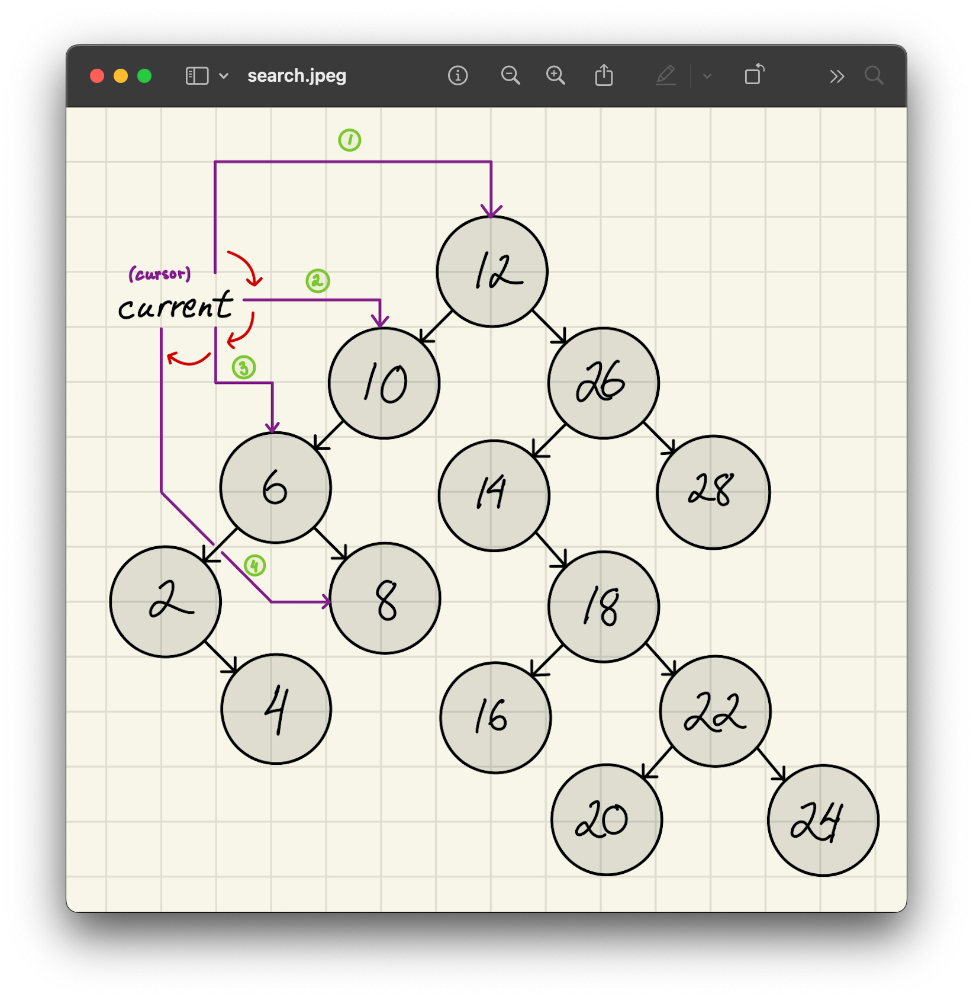
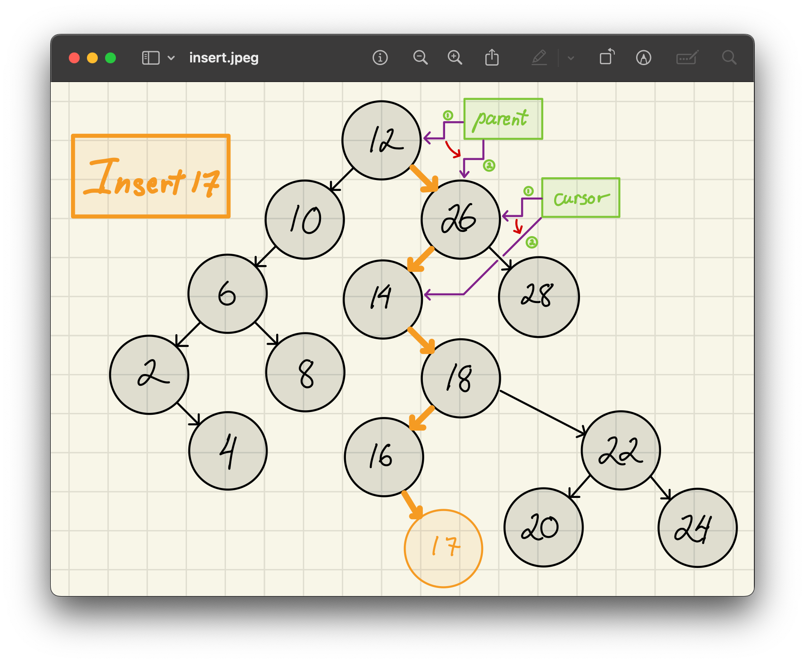
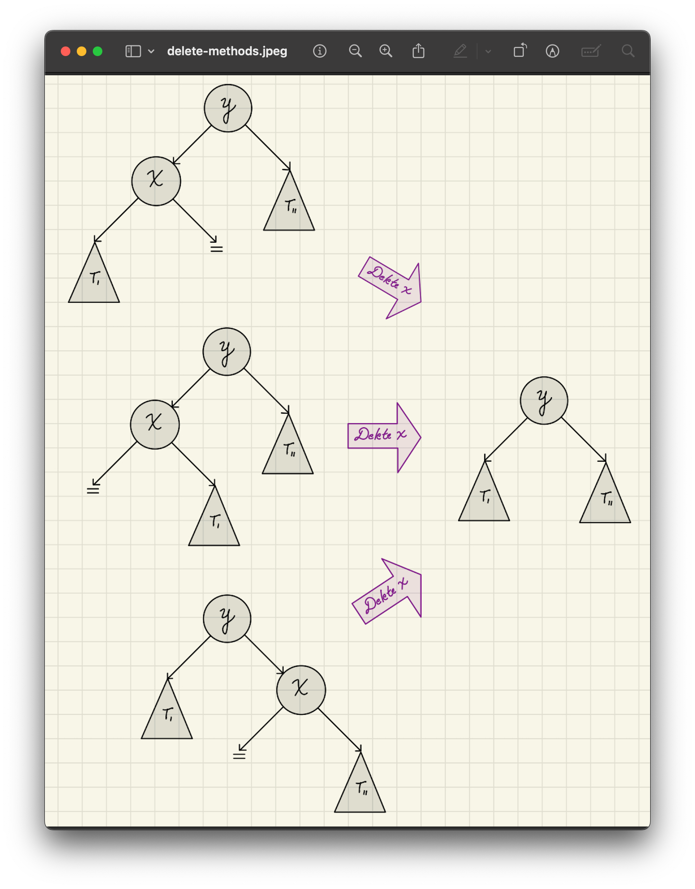

<h2 align=center>Week 13</h2>

<h1 align=center>Abstract Data Types: <em>Binary Search Trees</em></h1>

<p align=center><strong><em>Song of the day</strong></em>: <em><a href="https://youtu.be/r4G0nbpLySI?si=QsycBKcGoJqhapq-"><strong><u>Wait for the Moment</u></strong></a> by Vulfpeck (2024)</em></p>

---

## Sections
1. [**Searching Using Trees**](#1)
    - [**Our Search For The Perfect Search**](#1-1)
    - [**Intro To BSTs**](#1-2)
2. [**Runtime Analysis**](#2)
3. [**BST Operations**](#3)
    - [**Lookup**](#3-1)
    - [**Insertion**](#3-2)
    - [**Deletion**](#3-3)
4. [**Addendum: Helper Methods**](#4)
    - [**`BinarySearchTreeMap.Item`**](#4-1)
    - [**`BinarySearchTreeMap.Node`**](#4-2)
    - [**`subtree_max`**](#4-4)

---

<a id="1"></a>

## Binary (Search) Trees

<a id="1-1"></a>

### Our Search For The Perfect Search

Last time, we introduced the concept of maps with a pretty tall order of a promise: constant-time lookup speeds. As prelude to such amazing speeds, we discussed the potential implementation of maps using less-efficient data structures:

| **Map Implementation**     | **Find**    | **Insert**   | **Delete**  |
|----------------------------|-------------|-------------|--------------|
| **UnsortedArrayMap**       | Θ(`n`)        | Θ(`n`)        | Θ(`n`)   |
| **UnsortedLinkedListMap**  | Θ(`n`)        | Θ(`n`)        | Θ(`n`)   |
| **SortedArrayMap**         | Θ(log(`n`))   | Θ(`n`)        | Θ(`n`)   |
| **SortedLinkedListMap**    | Θ(`n`)        | Θ(`n`)        | Θ(`n`)   |

<sub>**Figure 1**: Data Structures for Map ADT.</sub>

These are pretty paltry runtimes, especially when you consider our constant-time goal. As we will see next week, these data structures are but a (necessary) prelude to implementing our super-efficient map. Before that, though, we'll introduce one more data structure that's like utilises our most recent ADT: the **binary search tree (BST)**.

<a id="1-2"></a>

### Intro To BSTs

The formal definition of these special trees goes as follows:

> Let **`T`** be a binary tree. We say that **`T`** is a Binary Search Tree, if for each node **`n`** in **`T`**:
>
> - All keys stored in the left subtree of `n` are less than the key stored in `n`.
>
> - All keys stored in the right subtree of `n` are greater than the key stored in `n`.

Here's an example of one, right alongside one that _isn't_:


<sub>**Figure 2**: Because 42 is greater than its ancestor node 26, we cannot call this a BST.</sub>

<br>

<a id="2"></a>

## Runtime Analysis

You'll notice above that the runtime notation for both of these trees is slightly different. Namely, we say that the runtime of each operation in a BST is **Θ(`h`)** and not Θ(`n`), where `h` stands for the _height_ of the tree. Why is this the case?

Well, consider a situation where we start inserting the following numbers into a BST:

```python
bst = BinarySearchTree()
lst = [14, 18, 22, 24]

for number for lst:
    lst.insert(number)
```

Because the numbers in `lst` are already sorted, our BST would end up looking highly skewed to the right:


<sub>**Figure 3**: This ends up looking more like a linked list.</sub>

Similarly, if the list contained numbers in descending order, like `[12, 10, 6, 2]`, we'd have a tree highly skewed to the left:


<sub>**Figure 4**: We've got a similar, very _linear_ situation here.</sub>

Since the height, `h`, is defined as the longest possible path in a tree, then we must consider the possibility that _the BST could be simply a single path with length `h`_. So we say, as we've [**determined many times before**](https://github.com/sebastianromerocruz/CS1134-data-structures-and-algorithms/tree/main/lectures/03-asymptotic-analysis#analysing-code), that the runtime of such a traversal would be ***Θ(`n`)***.

<br>

<a id="3"></a>

## BST Operations

<a id="3-1"></a>

### Lookup

Searching for a value in a **Binary Search Tree (BST)** is simple because the tree is **ordered**: for any node with value `v`, everything in the left subtree is less than `v`, and everything in the right is greater.

Let’s say we’re searching for a value `8` in the following BST. Starting at our root node:

1. **If the current node is `None`**, return `None` → the value isn’t in the tree.
2. **If `8 == node.data`**, return the node, since we've found our target.
3. **If `8 < node.data`**, search the **left subtree**.
4. **If `8 > node.data`**, search the **right subtree**.



<sub>**Figure 4**: We've got a similar, very _linear_ situation here.</sub>

Since we eliminate half of the tree with each step—just like with [**binary search**](https://github.com/sebastianromerocruz/CS1134-data-structures-and-algorithms/tree/main/lectures/04-searching-algos#2)—our average runtime of lookup _if the tree is not heavily skewed_ (which is a really big assumption that we don't usually make) can be logarithmic!

- **Best Case**: value is found near the root → Θ(1)
- **General Average Case**: Θ(`h`)
- **Balanced Average Case**: Θ(log `h`)
- **Worst Case**: Θ(`n`) if the tree is skewed (like a linked list)

```python
def find_node(self, key):
    cursor = self.root
    
    while cursor is not None:
        if cursor.item.key == key:
            return cursor
        elif cursor.item.key > key:
            cursor = cursor.left
        else: # (cursor.item.key < key
            cursor = cursor.right
            
    return None
```

<a id="3-2"></a>

### Insertion

Inserting in BSTs is interesting because there are a number of ways to do it. Remember, the only requirement for a tree to be a binary search tree—regardless of its balancing. Because of this we are left with the following possibilities:


<sub>**Figure 5**: All of these inserts are perfectly valid BSTs.</sub>

The top and bottom approaches would require us to rebalance the tree, which is fairly expensive. For this reason, we'll be implementing the centre approach:

1. If the tree is empty, the node becomes the root.
2. Traverse left or right depending on the comparison with the key.
3. When a `None` spot is found, insert the new node there.

Here's an example of what it looks like:



<sub>**Figure 6**: Inserting the value of 17 into a BST.</sub>

And its implementation (note that there are a couple of things here that we haven't explicitly implemented. If you wan't to see how they work, check out the [**addendum**](#4)):

```python
def insert(self, key, value):
    new_item = BinartSearchTreeMap.Item(key, value)
    new_node = BinartSearchTreeMap.Node(new_item)

    if self.is_empty():
        self.root = new_node
        self.n = 1
    else:
        parent = None
        cursor = self.root

        while cursor is not None:
            parent = cursor
            if key < cursor.item.key:
                cursor = cursor.left
            else:
                cursor = cursor.right

        if key < parent.item.key:
            parent.left = new_node
        else:
            parent.right = new_node

        new_node.parent = parent
        self.n += 1
```

<a id="3-3"></a>

### Deletion

What makes deletion a bit more complicated is that several deletion instances can lead to the same exact resulting BST:



<sub>**Figure 7**: Here, our goal is to delete the `x` node.</sub>

As you can see, what makes deleting tricky is that we have to handle the possibilities of our target node have either no children, one child, or two children.

The steps are as follow:

1. **Find the node with the given key**.
2. **Check how many children the node has**.
3. Then do the appropriate process:
   - **No children** (leaf node):  
     - Simply disconnect the node from its parent.
     - If it’s the root, set `root = None`.
   - **One child**:  
     - Replace the node with its only child by updating the parent’s reference.
     - If it’s the root, update `root` to be the child.
     - Update the child’s parent pointer.
   - **Two children**:  
     - Find the **maximum node in the left subtree** (in-order predecessor) using `subtree_max()`.
     - Copy the item from that node into the node being deleted.
     - Recursively delete the predecessor node.

Each case updates the size of the tree (`self.n -= 1`) and disconnects the removed node to free up memory.

For example, let's say we want to delete node `10`, which has **two children**. We'll replace it with its **predecessor** — the **maximum node in its left subtree**, which is `8`.

```
        10
       /  \
      5    15
     / \
    2   8
       /
      7
```

Here:
- Node `8` is the **predecessor** of `10`.
- `8` has a **left child**, `7`.

#### Step 1: Replace `10`'s data with `8`'s:

We copy the contents of node `8` into node `10`.

```
        8   ← copied from predecessor
       /  \
      5    15
     / \
    2   8
       /
      7
```

> Note: There are now two `8`s temporarily in the tree — but that’s okay, since we’re about to delete the original one.

#### Step 2: Delete the original `8` (which had a left child `7`)

We promote its left child (`7`) into its place:

```
        8
       /  \
      5    15
     / \
    2   7   ← 7 moved up
```


Now, the node we **intended to delete** (`10`) is gone, replaced by its predecessor, and the original predecessor node (`8`) has been properly removed — promoting its child if necessary.

This implementation handles root vs non-root deletion as special cases:

```python
def delete_node(self, node_to_delete):
    item = node_to_delete.item
    num_children = node_to_delete.num_children()

    if node_to_delete is self.root:
        if num_children == 0:
            self.root = None
            node_to_delete.disconnect()
            self.n -= 1

        elif num_children == 1:
            if self.root.left is not None:
                self.root = self.root.left
            else:
                self.root = self.root.right

            self.root.parent = None
            node_to_delete.disconnect()
            self.n -= 1

        else:
            max_of_left = self.subtree_max(node_to_delete.left)
            node_to_delete.item = max_of_left.item
            self.delete_node(max_of_left)
    else:
        parent = node_to_delete.parent

        if num_children == 0:
            if node_to_delete is parent.left:
                parent.left = None
            else:
                parent.right = None
            node_to_delete.disconnect()

        elif num_children == 1:
            if node_to_delete.left is not None:
                child = node_to_delete.left
            else:
                child = node_to_delete.right

            if node_to_delete is parent.left:
                parent.left = child
            else:
                parent.right = child
            child.parent = parent
            node_to_delete.disconnect()

        else:
            max_in_left = self.subtree_max(node_to_delete.left)
            node_to_delete.item = max_in_left.item
            self.delete_node(max_in_left)

        self.n -= 1

    return item
```

As always, the runtime is **Θ(`h`)**, where `h` is the tree’s height. You can find the entire implementation [**here**](code/BinarySearchTreeMap.py).

<br>

<a id="4"></a>

## Addendum: Helper Methods

<a id="4-1"></a>

### `BinarySearchTreeMap.Item`

This simple class holds the actual key-value pair we’re storing in the tree.

```python
class Item:
    def __init__(self, key, value=None):
        self.key = key
        self.value = value
```

We wrap our data in an `Item` so that we can associate each key with a value (just like a Python dictionary does). This way, we don’t just store numbers — we can store any information tied to a unique key.

<a id="4-2"></a>

### `BinarySearchTreeMap.Node`

Each `Node` object holds an `Item` and knows its position in the tree:

```python
class Node:
    def __init__(self, item):
        self.item = item
        self.parent = None
        self.left = None
        self.right = None
```

A `Node` keeps track of:
- Its **`item`** (which stores the key/value).
- Its **parent** node.
- Its **left** and **right** children.

This structure makes it possible to walk through the tree in any direction: up or down.

<a id="4-3"></a>

### `num_children()`

This method tells us how many children a node has — a key piece of logic when we’re deciding how to delete it.

```python
def num_children(self):
    count = 0
    if self.left is not None:
        count += 1
    if self.right is not None:
        count += 1
    return count
```

It returns:
- `0` if the node is a leaf.
- `1` if the node has one child.
- `2` if the node has both left and right children.

We use this in [**deletion**](#3-3) logic to determine which of the three cases we’re in.

<a id="4-4"></a>

### `subtree_max(subtree_root)`

This method is used when we need to find the **predecessor** of a node — that is, the **largest key in its left subtree**.

```python
def subtree_max(self, subtree_root):
    cursor = subtree_root
    while cursor.right is not None:
        cursor = cursor.right
    return cursor
```

We keep moving right until there’s nowhere else to go — since in a BST, the largest value in a subtree is always the right-most node.