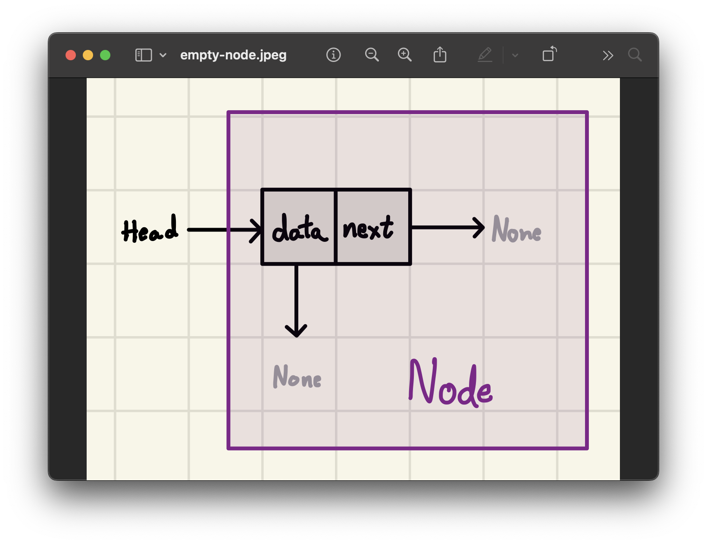
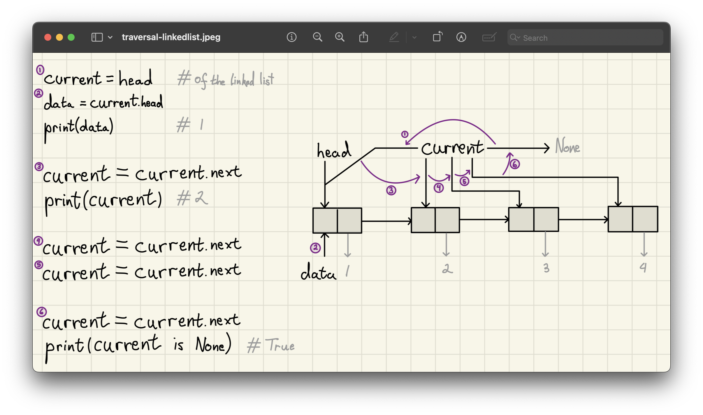
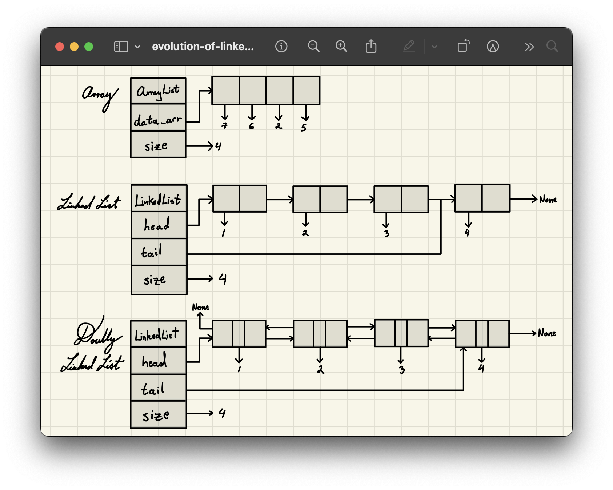
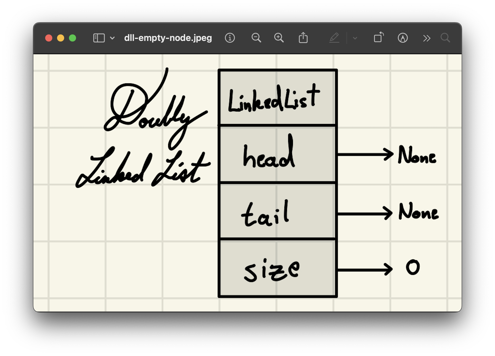
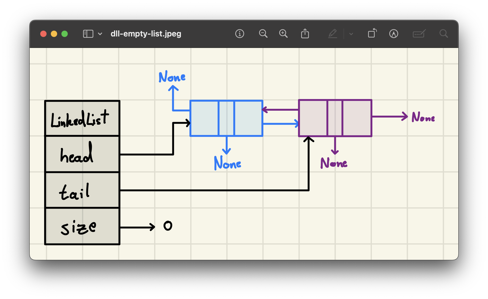
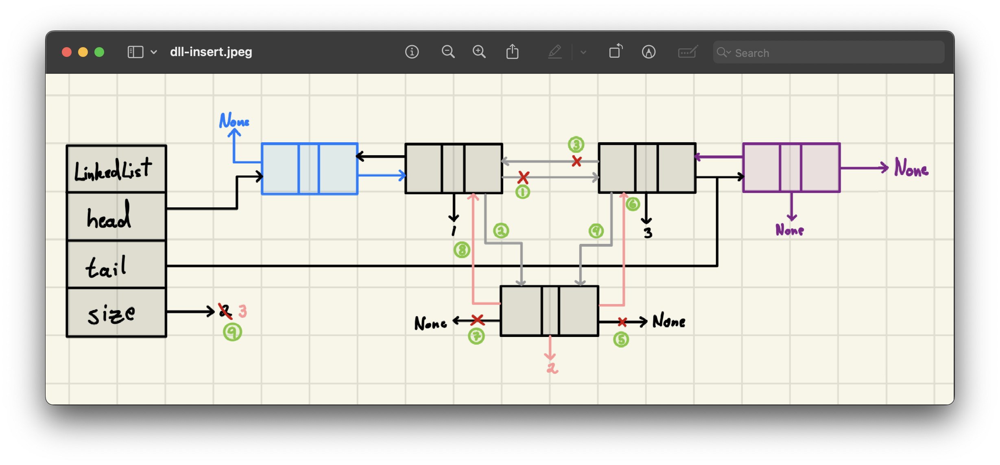
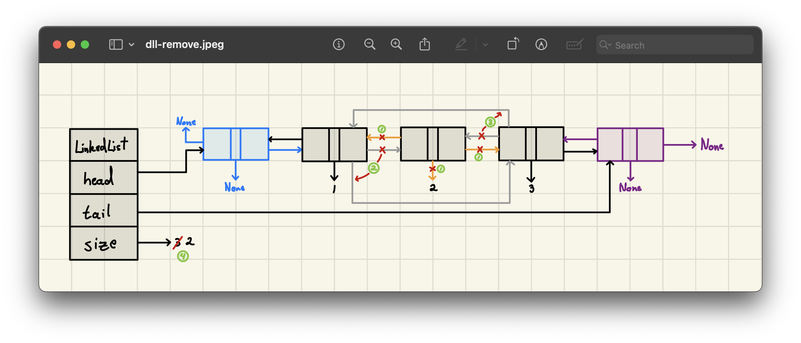
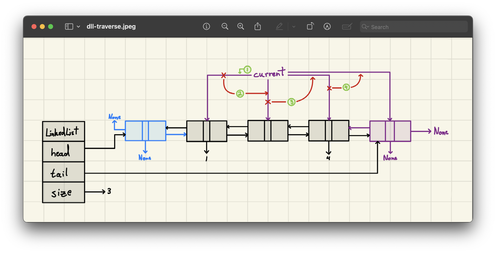

<h2 align=center>Week X</h2>

<h1 align=center>Abstract Data Types: <em>Linked Lists</em></h1>

<p align=center><strong><em>Song of the day</strong></em>: <em><a href="https://www.youtube.com/watch?v=lJ0OmBVoTJ4"><strong><u>Camisa Negra</u></strong></a> by Juanes (2025)</em></p>

---

## Sections
1. [**The Pros and Cons of Using An `ArrayList`**](#1)
2. [**Linked Lists**](#2)
    - [**A Concept**](#2-1)
    - [**Nodes**](#2-2)
    - [**Linked-List Traversal**](#2-3)
3. [**Node-Only Implementation**](#3)
    - [**The `Node` Class**](#3-1)
    - [**Traversal**](#3-2)
    - [**Changing The Head Of A Linked List**](#3-3)
4. [**Doubly-Linked Lists**](#4)
    - [**Evolution Of The Linked List**](#4-1)
    - [**Doubly-Linked List Implementation Basics**](#4-2)
    - [**Inserting A New Node**](#4-3)
    - [**Deleting A Node**](#4-4)
    - [**Traversal, Iteration, And Representation**](#4-5)
    - [**Complete Implementation**](#4-6)

---

<a id="1"></a>

## The Pros and Cons of Using An `ArrayList`

Last lecture was kind of a wake-up-call for all big fans of the `ArrayList` class; it turns out that, while it is a very versatile and useful base class, it doesn't quite do the job for _every_ programming situation. In fact, it's the very nature of `ArrayList` objects that gives them their weakness: the data contained in them _has to be contiguous_ (i.e. right next to each other in memory):

|Pros|Cons|
|-|-|
|Random access to data (e.g. access directly via index, rather than iterate through data to find it)|Storing data contiguously in the memory can be a problem when working with a _very_ large data set|
|Efficient amortised performance for adding and removing from the end|Insertions and deletions at interior positions of an array are expensive|
||Amortised bounds may be unacceptable in real-time systems|

<sub>**Figure 1**: The good, the bad, and the ugly of the `ArrayList`.</sub>

Indeed, data contiguity is excellent for indexing because it does so in constant time.

Otherwise, though, it's kind of a mess to deal with. It's as if you _had_ to fit all 180+ 1134 students in _one single classroom_ just because they're all taking the same class. It doesn't really make a lot of sense, right? It's totally fine for them to exist within the Tandon community and take the same course without having to be in a single classroom at the same time. This principle is followed by a different ADT, one which is my personal favourite, and it's called **linked lists**.

<br>

<a id="2"></a>

## Linked Lists

<a id="2-1"></a>

### A Concept

Just like most data structures, linked lists are...exactly what they sound like. That is: values _linked_ together sequentially, forming a list. "Isn't that what an `ArrayList` is?", I can hear you ask. Well, no. Arrays contain values _placed_ together sequentially, forming a list. Their only relationship with each other is the fact that they are placed right next to each other—_they otherwise have zero awareness of each other's existence_.

Linked-lists inherently differ in that aspect, as they are "linked" to the next item in the list _by keeping track of its address_. We can thus say that each element in the linked-list is "aware" of its linked partners existences:


<sub>**Figure 1**: As you can see, the addresses of the elements of the linked lists are completely disjointed, but each element "knows" the memory location of the element it is connected to.</sub>

Traditionally, we call the first element of a linked list the **head** of the list, and the rest of the elements follow it. The last element of the list, sometimes referred to as the **trailer**, is not connected to any other element, and thus keeps the address of the value `None` (in Python; other languages have other names for this):


<sub>**Figure 2**: A simple "one-way," or **singly-**, linked list. The value containing the integer `1` is the head of the list.</sub>

Let's take a closer look at one of these individual values contained within a linked list.

<a id="2-2"></a>

### Nodes

Each element that forms part of a linked list is traditionally called a **node**, and at its simplest it contains the following:

- **`data`**: The actual value being kept track of by this element. In figure 2 above, these are integers, but they can be of any data type.
- **`next`**: The address of, or the _pointer to_, the next node in the list.



<sub>**Figure 3**: An empty node (i.e. with no data nor linked "next" node).</sub>

What's interesting about the particular node shown above is that it could be one of three things:

1. A "free-floating" **empty node**, existing by itself.
2. The **head** node of an empty list.
3. The **trailer** node of a "one-way," or singly-, linked list.

All three definitions either could apply to this node. In the trailer case, for example, some other node somewhere else in memory _could_ be pointing to this empty node as its `next` node. Since this list only links one way, though, we have no way of knowing.

<a id="2-3"></a>

### Linked List Traversal

Like all sequential objects, we will be treating linked lists as [**iterables**](https://github.com/sebastianromerocruz/CS1134-data-structures-and-algorithms/tree/main/lectures/02-iterators-generators#1). This is actually simpler, since one of the key parts of each node is the memory location of its `next` linked item:

```python
"""
For linked list:
    1 -> 2 -> 3 -> 4 -> None
"""
current = head          # of the list
data = current.data
print(data)             # prints 1

current = current.next
print(current.data)     # prints 2

current = current.next
current = current.next

current = current.next
print(current is None)  # prints True
```

In memory, we might be looking at something like this:



<sub>**Figure 4**: Note how the "link" linking each node to the next is the same kind of link linking the variable `current` to each node—it's literally just a _reference_ to its location in memory.</sub>

<br>

<a id="3"></a>

## [**Node-Only Implementation**](code/Node.py)

<a id="3-1"></a>

### The `Node` Class

Since linked lists are simply Python objects, connected by a pointer, we can actually define a linked list by simply defining a series of nodes, each pointing to the next. The code for a singly-linked node is straight-forward enough:

```python
class Node:
    def __init__(self, data=None):
        self.data = data
        self.next = None

    def disconnect(self):
        self.data = None
        self.next = None
```

As you can see, we have the option to leave a node empty or give it a value. For example:

```python
head = Node()
head.data = 1

print(head.data)  # prints 1
```

To link another item to the linked list, we simply create a new node and assign it to `head`'s `next` attribute:

```python
new_node = Node(2)
head.next = new_node

print(head.next.data)  # prints 2
```

And we can continue adding nodes to this list by setting the `next` node's `next` attribute to yet another new node:

```python
new_node = Node(3)
head.next.next = new_node

print(head.next.next.data)  # prints 3
```

...and another:

```python
new_node = Node(4)
head.next.next.next = new_node

print(head.next.next.next.data)  # prints 4
```

Naturally, there's a much better way of adding nodes to a list, but let's keep it "simple" for now. 

<a id="3-2"></a>

### Traversal

We can quickly traverse this list using a `while`-loop, much as we did [**earlier**](2-3):

```python
current = head
    
while current != None:
    print(f"{current.data} -> ", end='')
    current = current.next
```

Output:

```
1 -> 2 -> 3 -> 4 -> 
```

So, what kind of operations should these linked lists be capable of, and how do we implement them?

<a id="3-3"></a>

### Changing The Head Of A Linked List

Let's start by illustrating what extending our list _at the front_ would look like. In other words, we want another, new node (`new_node`) to become the head of the linked list, with the rest of the nodes trailing after it. 

We know that, for an `ArrayList`, this would be a rather expensive operation, as it would involve a shift to the right of every single one of its elements, potentially _after_ a resizing. With linked lists, however, this process is quick and easy. We simply...

1. Assign the current `head` of the list **to the `next` value in `new_node`**.
2. **Reassign** the `head` pointer to `new_node`.

...and that's it.


<sub>**Figure 5**: This, as you've probably guessed, is done in _constant_ time.</sub>

Using our code from earlier:

```python
new_node = Node(0) 

new_node.next = head  # step 1
head = new_node       # step 2
```

If we traversed the list once more, we would now see the following as output:

```
0 -> 1 -> 2 -> 3 -> 4 ->
```

However, consider what happens if we need to insert a node _in the middle_ of the list, or delete a specific node. Without any knowledge of the preceding node, we'd have to traverse from the head every time just to find it—linear time for every such operation. This is the fundamental limitation of the singly-linked list, and the motivation for what comes next.

<br>

<a id="4"></a>

## [**Doubly-Linked Lists**](code/DoublyLinkedLists.py)

<a id="4-1"></a>

### Evolution Of The Linked List

Thus far, the linked-lists that we have been looking at are what are called _singly-linked lists_. Their core limitation, as we saw, is that each node only knows about the node _after_ it. This makes efficient insertion and deletion at arbitrary positions difficult: to delete a node, for instance, you need its predecessor—but since there is no `prev` pointer, the only way to find it is to walk from the head.

The fix is straightforward: give every node a pointer to its _previous_ neighbour as well. This bidirectional awareness is what makes insert and delete operations truly efficient, and it also means the list can be traversed in either direction.

This is what is known as a ***doubly-linked list (DLL)***:



<sub>**Figure 6**: From top to bottom, an array, a singly-linked list, and a doubly-linked list. Note the two-way connections between nodes.</sub>

Let's analyse the implementation more closely, starting with its nodes.

<a id="4-2"></a>

### Doubly-Linked List Implementation Basics

A DLL node simply has one attribute: a reference/pointer to its previous counterpart. Thus, our implementation will look pretty familiar:

```python
class Node:
    def __init__(self, data=None):
        self.data = data
        self.next = None
        self.prev = None
```

Now that the structure is getting a little more complex, we will also create a class to represent our DLL. A DLL would thus look like this:



<sub>**Figure 7**: An empty doubly-linked list.</sub>

Before diving into insertion and deletion, consider what a “naïve” DLL implementation would look like. To add a new node to the head of the list, for example, we might outline the following steps:

1. Create a DLL `Node` object.
2. Set the `head` pointer to this new node.
3. Set the `tail` pointer to this new node as well.
4. Set the size of the list to 1.

That’s fine on paper—but notice that step 3 only applies when the list _was already empty_. Once the list has more than one element, `head` and `tail` point to different nodes, so every insertion and deletion method would need a special-case branch to handle an empty list, a single-element list, operating on the very first node, or the very last node. The logic quickly becomes a tangle of `if node is None` guards, each one a potential bug.

In other words, **without any anchor at the boundaries, the list’s `head` and `tail` can be `None`, and every operation has to defend against that**.

The standard fix is to introduce two permanent, data-free **sentinel nodes**—one called the `header` and one called the `trailer`—that permanently bookend the list. They hold no real data; their only job is to always be there, so that `header.next` is always a valid node (either the first real node or `trailer` itself), and `trailer.prev` is always a valid node (either the last real node or `header` itself).

With sentinels in place, every real data node always has a live predecessor _and_ a live successor. That means every _insertion_, _removal_, and _traversal_ can follow the exact same steps regardless of whether the list is empty, has one element, or has a thousand—no special cases needed:



<sub>**Figure 8**: An empty doubly-linked list with these "sentinel" header and trailer nodes.</sub>

In code, this might look as follows:

```python
class DoublyLinkedList:
    # we can make the Node class belong to
    # our DLL only by making an inner class
    class Node:
        def __init__(self, data=None):
            self.data = data
            self.next = None
            self.prev = None

    def __init__(self):
        # create sentinel end nodes...
        self.header = DoublyLinkedList.Node()
        self.trailer = DoublyLinkedList.Node()

        # ...and connect them to each other
        self.header.next = self.trailer
        self.trailer.prev = self.header
        self.n = 0
```

Before we get into insertions and deletions, two utility methods worth establishing first—since the delete methods will rely on them:

```python
class DoublyLinkedList:
    def __len__(self):
        return self.n

    def is_empty(self):
        return len(self) == 0
```

`__len__` simply returns `self.n`, the running count we maintain in `__init__`. `is_empty` delegates to it. Both are O(1), and `is_empty` is what the delete methods will use to guard against operating on an empty list.

Alrighty, let's get into the three most common DLL operations.

<a id="4-3"></a>

### Inserting A New Node

Inserting a new node is fairly simple as well. Say we have a DLL that looks like this:

```
[1 <--> 3]
```

and we wanted to insert a node containing the number 2 between them:

```
[1 <--> 2 <--> 3]
```

The steps are as follows:

1. **Break the old link from `1` to `3`**: That is, set the `next` pointer of the node holding `1` so it no longer points to `3`.
2. **Break the old link from `3` to `1`**: That is, set the `prev` pointer of the node holding `3` so it no longer points to `1`.
3. **Link `1` → `2`**: Set the `next` pointer of the node holding `1` to the new node holding `2`.
4. **Link `3` → `2`**: Set the `prev` pointer of the node holding `3` to the new node holding `2`.
5. **Link `2` → `3`**: Set the `next` pointer of the new node (`2`) so it points to the node holding `3`.
6. **Link `2` → `1`**: Set the `prev` pointer of the new node (`2`) so it points back to the node holding `1`.
7. **Increment the DLL size**: Since you’ve added one more node, be sure to update the length count of your list.



<sub>**Figure 8**: Inserting a new node (`2`) into a DLL. Note our sentinel end nodes.</sub>

In this case, we are **adding node `2` _after_ node `1`. In our implementation, we'll call this method `add_after`:

```python
class DoublyLinkedList:
    def add_after(self, node, val):
        new_node = DoublyLinkedList.Node(val)
        
        prev_node = node
        next_node = node.next
        
        prev_node.next = new_node  # step 3
        new_node.prev = prev_node  # step 4
        new_node.next = next_node  # step 5
        next_node.prev = new_node  # step 6
        
        self.n += 1                # step 7
        
        return new_node            # pointer to this new location
```

What's nice about this method is that, because of our sentinel nodes, the `header` and `trailer` can act as the `node` parameter. So we don't have to create any special condition to handle the edge cases (the first and last node).

```python
class DoublyLinkedList:
    def add_first(self, val):
        return self.add_after(self.header, val)
    
    def add_last(self, val):
        return self.add_after(self.trailer.prev, val)

    def add_before(self, node, val):
        return self.add_after(node.prev, val)
```

<a id="4-4"></a>

### Deleting A Node

For deleting a node involves completely disconnecting it from the rest of the list. For that reason, we will add another simple method to our `Node` inner class:

```python
class DoublyLinkedList:
    class Node:
        def disconnect(self):
            self.data = None
            self.next = None
            self.prev = None
```

The steps are as follows. We assume the node to be deleted is already in the list:

1. **Link the node’s previous and next neighbors**: Set `node.prev.next` to `node.next`.
2. **Link the node’s next neighbor back to the previous neighbor**: Set `node.next.prev` to `node.prev`.
3. **Disconnect the node itself**: Call `node.disconnect()` so its `prev`, `next`, and `data` are all set to `None`.
4. **Update the list size**: Decrement the DLL’s size count by one.



<sub>**Figure 9**: Removing node `2` from our DLL from earlier.</sub>

And the implementation:

```python
class DoublyLinkedList:
    def delete_node(self, node):
        data = node.data
        
        prev_node = node.prev
        next_node = node.next
        
        prev_node.next = next_node  # step 1
        next_node.prev = prev_node  # step 2
        node.disconnect()           # step 3

        self.n -= 1                 # step 4
        
        return data

    def delete_last(self):
        if self.is_empty():
            raise Exception("List is empty")

        return self.delete_node(self.trailer.prev)

    def delete_first(self):
        if self.is_empty():
            raise Exception("List is empty")
        
        return self.delete_node(self.header.next)
```

<a id="4-5"></a>

### Traversal, Iteration, And Representation

Traversal works much the same way as it does for [**singly-linked lists**](#2-3):

1. **Initialize a pointer**
   - Let’s call it `current` and set it to point to `header`. 
   - Remember, `header` is the **always-present** node at the front (which doesn’t hold real data).
2. **Walk through the list**  
   - While `current` does **not** point to `trailer` (the always-present node at the end):
     - Move `current` to `current.next` in each iteration.
     - (Optionally) process or print the data stored in `current` if `current` is a real data node.
3. **Stop at `trailer`**: Once `current` reaches `trailer`, we have **visited every real node** in the list.



<sub>**Figure 10**: Traversing our DLL.</sub>

We can use this method to, say, remove all elements from a DLL with a specific value:

```python
class DoublyLinkedList:
    def remove_all(self, elem):
        cursor = self.header.next
        
        while cursor is not self.trailer:
            if cursor.data == elem:
                next_node = cursor.next
                self.delete_node(cursor)
                cursor = next_node
            else:
                cursor = cursor.next
```

The same traversal pattern, stripped down to its essence, gives us our iterator:

```python
class DoublyLinkedList:
    def __iter__(self):
        cursor = self.header.next
        while cursor is not self.trailer:
            yield cursor.data
            cursor = cursor.next
```

`__iter__` starts just past the header sentinel and yields each real node's data until it reaches the trailer. Implementing it as a generator (with `yield`) means we don't materialise the whole list in memory at once—Python will ask for the next value only when it needs it.

With `__iter__` in place, `__repr__` becomes a one-liner that joins every element with the `<-->` arrow notation:

```python
class DoublyLinkedList:
    def __repr__(self):
        return '[' + " <--> ".join([str(elem) for elem in self]) + ']'
```

The `for elem in self` loop calls `__iter__` implicitly, so `__repr__` depends on it—which is exactly why we implement them in this order.

<a id="4-6"></a>

### Complete Implementation

```python
class DoublyLinkedList:
    class Node:
        def __init__(self, data=None):
            self.data = data
            self.next = None
            self.prev = None

        def disconnect(self):
            self.data = None
            self.next = None
            self.prev = None


    def __init__(self):
        self.header = DoublyLinkedList.Node()
        self.trailer = DoublyLinkedList.Node()
        self.header.next = self.trailer
        self.trailer.prev = self.header
        self.n = 0

    def is_empty(self):
        return len(self) == 0

    def add_after(self, node, val):
        new_node = DoublyLinkedList.Node(val)
        
        prev_node = node
        next_node = node.next
        
        prev_node.next = new_node
        new_node.prev = prev_node
        new_node.next = next_node
        next_node.prev = new_node
        
        self.n += 1
        
        return new_node

    def add_first(self, val):
        return self.add_after(self.header, val)

    def add_last(self, val):
        return self.add_after(self.trailer.prev, val)

    def add_before(self, node, val):
        return self.add_after(node.prev, val)

    def delete_node(self, node):
        data = node.data
        
        prev_node = node.prev
        next_node = node.next
        
        prev_node.next = next_node
        next_node.prev = prev_node
        
        self.n -= 1
        node.disconnect()
        
        return data

    def delete_first(self):
        if self.is_empty():
            raise Exception("List is empty")
        
        return self.delete_node(self.header.next)

    def delete_last(self):
        if self.is_empty():
            raise Exception("List is empty")
        
        return self.delete_node(self.trailer.prev)

    def remove_all(self, elem):
        cursor = self.header.next

        while cursor is not self.trailer:
            if cursor.data == elem:
                next_node = cursor.next
                self.delete_node(cursor)
                cursor = next_node
            else:
                cursor = cursor.next

    def __len__(self):
        return self.n
    
    def __iter__(self):
        cursor = self.header.next
        while cursor is not self.trailer:
            yield cursor.data
            cursor = cursor.next

    def __repr__(self):
        return '[' + " <--> ".join([str(elem) for elem in self]) + ']'
```