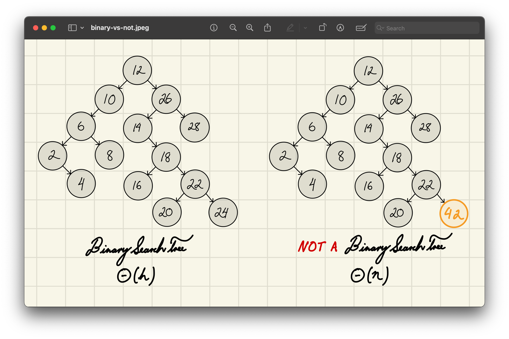
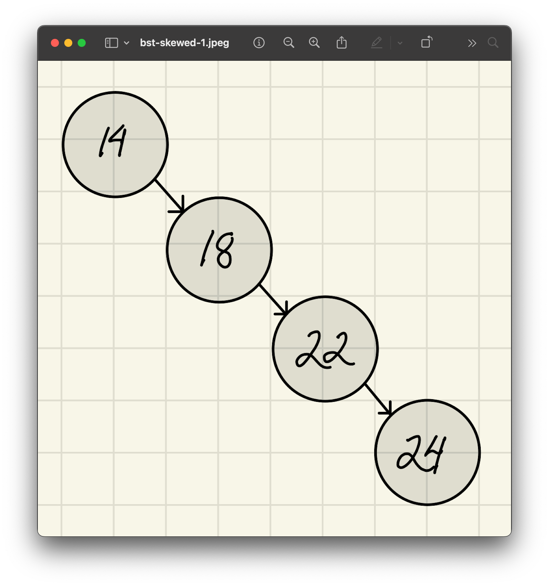
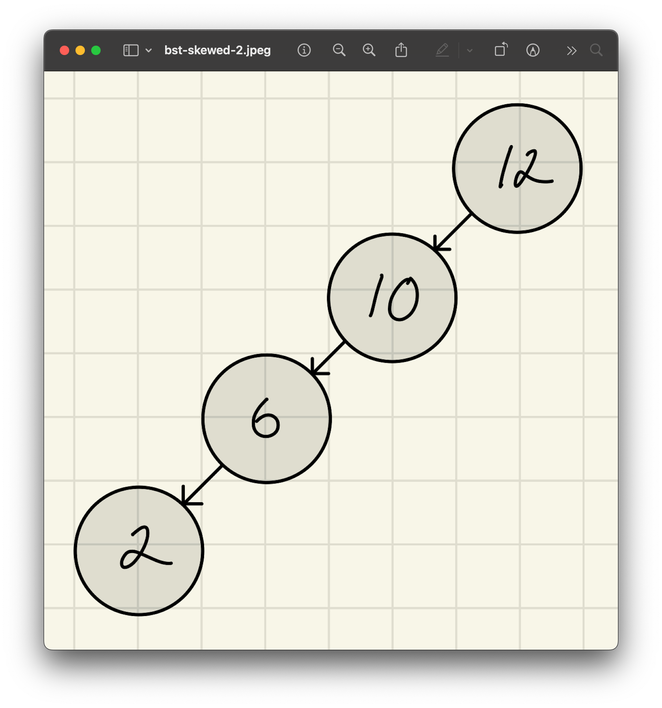
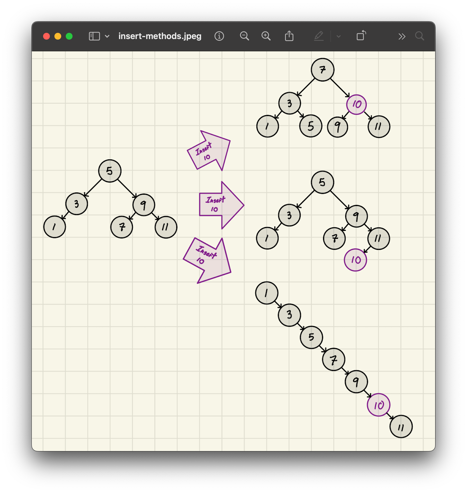

<h2 align=center>Week 13</h2>

<h1 align=center>Abstract Data Types: <em>Binary Search Trees</em></h1>

<p align=center><strong><em>Song of the day</strong></em>: <em><a href="https://youtu.be/Oj6f1U3O3I4?si=MrjmjkyY7GaUIJik"><strong><u>Quédate Un Momento</u></strong></a> by Comisario Pantera (2023)</em></p>

---

## Sections

1. [**Searching Using Trees**](#1)
    - [**Our Search For The Perfect Search**](#1-1)
    - [**Intro To BSTs**](#1-2)
2. [**Runtime Analysis**](#2)
3. [**The `BinarySearchTreeMap`**](#3)
    - [**`Item`**](#3-1)
    - [**`Node`**](#3-2)
    - [**`__len__` and `is_empty`**](#3-3)
4. [**BST Operations**](#4)
    - [**Lookup**](#4-1)
    - [**Insertion**](#4-2)
    - [**Deletion**](#4-3)
5. [**Iteration**](#5)

---

<a id="1"></a>

## Binary (Search) Trees

<a id="1-1"></a>

### Our Search For The Perfect Search

Last time, we began building map implementations and measured how well they perform:

| **Map Implementation**     | **Find**      | **Insert**    | **Delete**    |
|----------------------------|---------------|---------------|---------------|
| **UnsortedArrayMap**       | Θ(`n`)        | Θ(`n`)        | Θ(`n`)        |
| **UnsortedLinkedListMap**  | Θ(`n`)        | Θ(`n`)        | Θ(`n`)        |
| **SortedArrayMap**         | Θ(log(`n`))   | Θ(`n`)        | Θ(`n`)        |
| **SortedLinkedListMap**    | Θ(`n`)        | Θ(`n`)        | Θ(`n`)        |

<sub>**Figure 1**: Data Structures for Map ADT.</sub>

These are pretty paltry runtimes. The best we managed was Θ(log `n`) lookup for `SortedArrayMap`—and that worked because the array was already sorted, letting us do binary search. But maintaining sorted order in an array is expensive: every insertion or deletion requires shifting elements around, which puts us right back at Θ(`n`).

So here is the question worth sitting with: _what if we had a data structure that was **inherently sorted**—one where the ordering is baked into its shape, so we never have to shift anything to maintain it?_ We wouldn't need to sort explicitly; the structure would guarantee the right ordering by construction. Lookup could remain fast, and insert and delete could potentially improve too.

That structure is the **binary search tree (BST)**.

<a id="1-2"></a>

### Intro To BSTs

The formal definition of these special trees goes as follows:

> Let **`T`** be a binary tree. We say that **`T`** is a Binary Search Tree, if for each node **`n`** in **`T`**:
>
> - All keys stored in the left subtree of `n` are less than the key stored in `n`.
>
> - All keys stored in the right subtree of `n` are greater than the key stored in `n`.

Here's an example of one, right alongside one that _isn't_:



<sub>**Figure 2**: Because 42 is greater than its ancestor node 26, we cannot call this a BST.</sub>

<br>

<a id="2"></a>

## Runtime Analysis

You'll notice above that the runtime notation for both of these trees is slightly different. Namely, we say that the runtime of each operation in a BST is **Θ(`h`)** and not Θ(`n`), where `h` stands for the _height_ of the tree. Why is this the case?

Well, consider a situation where we start inserting the following numbers into a BST:

```python
bst = BinarySearchTree()
lst = [14, 18, 22, 24]

for number in lst:
    bst.insert(number)
```

Because the numbers in `lst` are already sorted, our BST would end up looking highly skewed to the right:



<sub>**Figure 3**: This ends up looking more like a linked list.</sub>

Similarly, if the list contained numbers in descending order, like `[12, 10, 6, 2]`, we'd have a tree highly skewed to the left:



<sub>**Figure 4**: We've got a similar, very _linear_ situation here.</sub>

Since the height, `h`, is defined as the longest possible path in a tree, then we must consider the possibility that _the BST could be simply a single path with length `h`_. So we say, as we've [**determined many times before**](https://github.com/sebastianromerocruz/CS1134-data-structures-and-algorithms/tree/main/lectures/03-asymptotic-analysis#analysing-code), that the runtime of such a traversal would be ***Θ(`n`)***.

<br>

<a id="3"></a>

## The `BinarySearchTreeMap`

Before we look at the three core operations, let's establish the building blocks of our implementation.

<a id="3-1"></a>

### `Item`

`Item` is a simple inner class that holds the actual key-value pair we're storing in the tree.

```python
class Item:
    def __init__(self, key, value=None):
        self.key = key
        self.value = value
```

We wrap our data in an `Item` so that we can associate each key with a value—just like a Python dictionary does. This way, we don't just store numbers; we can store any information tied to a unique key.

<a id="3-2"></a>

### `Node`

Each `Node` holds an `Item` and knows its position in the tree via three pointers:

```python
class Node:
    def __init__(self, item):
        self.item = item
        self.parent = None
        self.left = None
        self.right = None
```

This structure makes it possible to walk through the tree in any direction: up toward the root, or down toward the leaves.

`Node` also carries two helper methods that the operations below will rely on.

**`num_children()`** counts how many children a node has—a key piece of logic when deciding how to delete it:

```python
def num_children(self):
    count = 0
    if self.left is not None:
        count += 1
    if self.right is not None:
        count += 1
    return count
```

It returns `0` for a leaf, `1` if exactly one child is present, and `2` if both are.

**`disconnect()`** nulls out all of a node's references, completely severing it from the tree:

```python
def disconnect(self):
    self.item = None
    self.parent = None
    self.left = None
    self.right = None
```

It is called after every deletion to help the garbage collector reclaim the node's memory. Without it, the removed node would still hold live references to parts of the tree.

<a id="3-3"></a>

### `__len__` and `is_empty`

The tree tracks its own size in `self.n` and exposes it through the standard interface:

```python
def __len__(self):
    return self.n

def is_empty(self):
    return len(self) == 0
```

Both are Θ(1)—no traversal required since `self.n` is kept up-to-date by every insertion and deletion.

<br>

<a id="4"></a>

## BST Operations

<a id="4-1"></a>

### Lookup

Searching for a value in a BST is straightforward because the tree is **ordered**: for any node with value `v`, everything in the left subtree is less than `v`, and everything in the right is greater.

Let's say we're searching for a value `8`. Starting at the root:

1. **If the current node is `None`**, return `None`; the value isn't in the tree.
2. **If `8 == node.data`**, return the node—we've found our target.
3. **If `8 < node.data`**, search the **left subtree**.
4. **If `8 > node.data`**, search the **right subtree**.


<sub>**Figure 5**: Each step eliminates one subtree entirely, narrowing the search until we find the target or reach `None`.</sub>

Since we eliminate half of the tree with each step—just like with [**binary search**](https://github.com/sebastianromerocruz/CS1134-data-structures-and-algorithms/tree/main/lectures/04-searching-algos#2)—the average runtime of lookup _if the tree is not heavily skewed_ (which is a big assumption) can be logarithmic:

- **Best Case**: value is found at the root; Θ(1)
- **General Case**: Θ(`h`)
- **Balanced Case**: Θ(log `n`)
- **Worst Case**: Θ(`n`) if the tree is skewed like a linked list

```python
def find_node(self, key):
    cursor = self.root

    while cursor is not None:
        if cursor.item.key == key:
            return cursor
        elif cursor.item.key > key:
            cursor = cursor.left
        else:
            cursor = cursor.right

    return None
```

<a id="4-2"></a>

### Insertion

Inserting in BSTs is interesting because there are a number of ways to do it. The only requirement is that the result remains a valid binary search tree—the structure doesn't have to be balanced. Because of this we are left with the following possibilities:



<sub>**Figure 6**: All of these inserts are perfectly valid BSTs.</sub>

The top and bottom approaches would require us to rebalance the tree, which is fairly expensive. For this reason, we'll be implementing the centre approach:

1. If the tree is empty, the node becomes the root.
2. Traverse left or right depending on the comparison with the key.
3. When a `None` spot is found, insert the new node there.

Here's an example of what it looks like:


<sub>**Figure 7**: Inserting the value of 17 into a BST.</sub>

We start by wrapping the incoming key and value in the internal `Item` and `Node` types, then handle the trivial case of an empty tree:

```python
def insert(self, key, value):
    new_item = BinarySearchTreeMap.Item(key, value)
    new_node = BinarySearchTreeMap.Node(new_item)

    if self.is_empty():
        self.root = new_node
        self.n = 1
```

If the tree is not empty, we walk down from the root—going left whenever the key is smaller, right whenever it's larger—keeping a `parent` pointer one step behind `cursor`. When `cursor` falls off the tree (`None`), `parent` is the node we attach to:

```python
    else:
        parent = None
        cursor = self.root

        while cursor is not None:
            parent = cursor
            if key < cursor.item.key:
                cursor = cursor.left
            else:
                cursor = cursor.right

        if key < parent.item.key:
            parent.left = new_node
        else:
            parent.right = new_node

        new_node.parent = parent
        self.n += 1
```

<a id="4-3"></a>

### Deletion

What makes deletion a bit more complicated is that several deletion approaches can lead to the same resulting BST:


<sub>**Figure 8**: Here, our goal is to delete the `x` node.</sub>

What makes deleting tricky is that we have to handle the possibilities of our target node having either no children, one child, or two children:

1. **Find the node with the given key**.
2. **Check how many children the node has**.
3. Then do the appropriate process:
   - **No children** (leaf node):
     - Simply disconnect the node from its parent.
     - If it's the root, set `root = None`.
   - **One child**:
     - Replace the node with its only child by updating the parent's reference.
     - If it's the root, update `root` to be the child.
     - Update the child's parent pointer.
   - **Two children**:
     - Find the **maximum node in the left subtree** (the in-order predecessor).
     - Copy that node's item into the node being deleted.
     - Recursively delete the predecessor node.

Each case updates the size of the tree (`self.n -= 1`) and disconnects the removed node to free up memory.

#### `subtree_max`

The two-children case relies on a helper, `subtree_max`, which finds the rightmost node in a given subtree—the largest key in that subtree, since in a BST the largest value is always the rightmost node:

```python
def subtree_max(self, subtree_root):
    cursor = subtree_root
    while cursor.right is not None:
        cursor = cursor.right
    return cursor
```

#### Worked example

Let's say we want to delete node `10`, which has **two children**. We'll replace it with its **predecessor**—the maximum in its left subtree, which is `8`:

```
        10
       /  \
      5    15
     / \
    2   8
       /
      7
```

**Step 1**: Copy the contents of node `8` into node `10`.

```
        8   ← copied from predecessor
       /  \
      5    15
     / \
    2   8
       /
      7
```

> Note: There are now two `8`s temporarily in the tree—but that's okay, since we're about to delete the original one.

**Step 2**: Delete the original `8` (which has a left child `7`), promoting `7` into its place:

```
        8
       /  \
      5    15
     / \
    2   7   ← 7 moved up
```

The node we intended to delete (`10`) is gone, replaced by its predecessor, and the original predecessor node (`8`) has been properly removed.

#### Implementation

The implementation splits into two top-level branches depending on whether the node being removed is the root or not.

**Deleting the root** is a special case because there is no parent pointer to update:

```python
def delete_node(self, node_to_delete):
    item = node_to_delete.item
    num_children = node_to_delete.num_children()

    if node_to_delete is self.root:
        if num_children == 0:          # root is a lone node
            self.root = None
            node_to_delete.disconnect()
            self.n -= 1

        elif num_children == 1:        # promote the single child to root
            if self.root.left is not None:
                self.root = self.root.left
            else:
                self.root = self.root.right

            self.root.parent = None
            node_to_delete.disconnect()
            self.n -= 1

        else:                          # replace with in-order predecessor
            max_of_left = self.subtree_max(node_to_delete.left)
            node_to_delete.item = max_of_left.item
            self.delete_node(max_of_left)
```

**Deleting a non-root node** follows the same three cases, but now we also have to update the parent's left or right pointer:

```python
    else:
        parent = node_to_delete.parent

        if num_children == 0:          # leaf: just unlink from parent
            if node_to_delete is parent.left:
                parent.left = None
            else:
                parent.right = None
            node_to_delete.disconnect()
            self.n -= 1

        elif num_children == 1:        # splice out, connect child to grandparent
            if node_to_delete.left is not None:
                child = node_to_delete.left
            else:
                child = node_to_delete.right

            if node_to_delete is parent.left:
                parent.left = child
            else:
                parent.right = child
            child.parent = parent
            node_to_delete.disconnect()
            self.n -= 1

        else:                          # replace with in-order predecessor (recursive)
            max_in_left = self.subtree_max(node_to_delete.left)
            node_to_delete.item = max_in_left.item
            self.delete_node(max_in_left)

    return item
```

As always, the runtime is **Θ(`h`)**, where `h` is the tree's height. You can find the entire implementation [**here**](code/BinarySearchTreeMap.py).

<br>

<a id="5"></a>

## Iteration

`inorder` is a recursive generator that yields every node in **left → root → right** order:

```python
def inorder(self):
    def subtree_inorder(root):
        if root is None:
            return
        else:
            yield from subtree_inorder(root.left)
            yield root
            yield from subtree_inorder(root.right)

    yield from subtree_inorder(self.root)
```

This is worth pausing on: because of the BST ordering property, visiting nodes left → root → right always visits keys in **ascending sorted order**. In other words, iterating over a BST automatically gives you a sorted sequence—no extra sorting step needed.

`__iter__` wraps `inorder` to yield only the keys, which is the standard map iteration interface:

```python
def __iter__(self):
    for node in self.inorder():
        yield node.item.key
```

So `for k in bst:` walks the tree in sorted key order—a property none of our earlier map implementations had.
