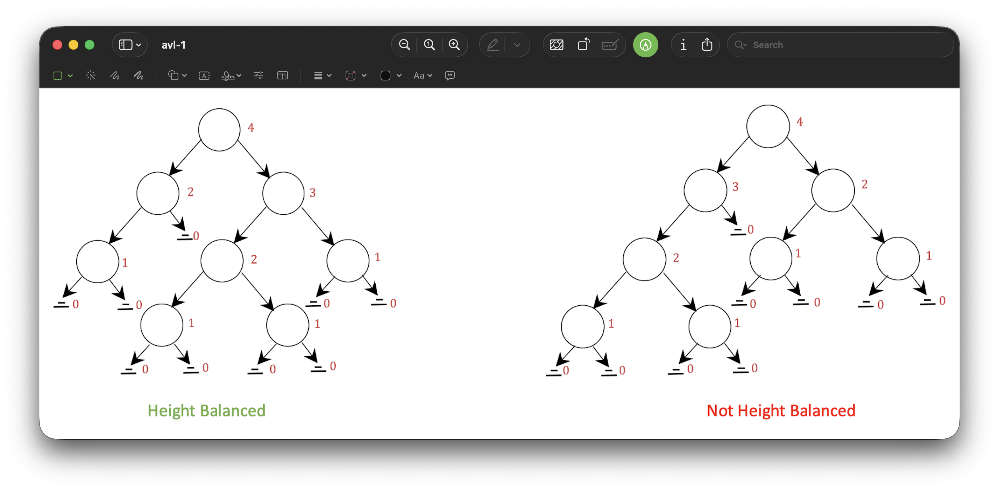
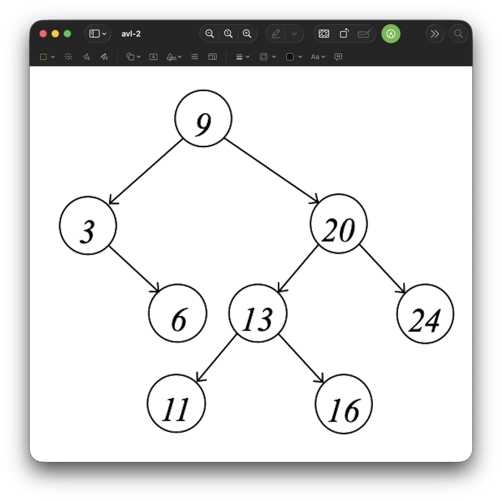
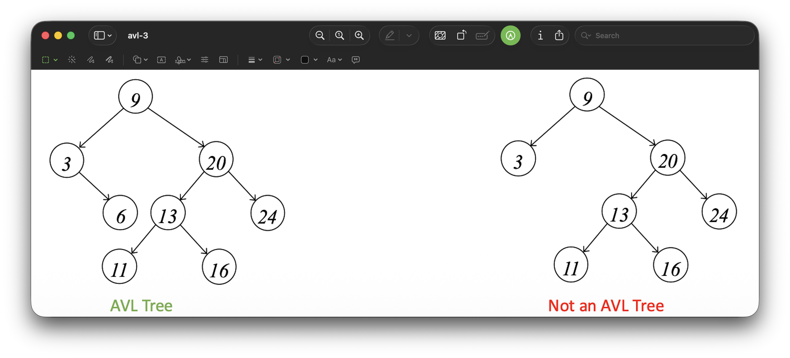

<h2 align=center>Week 14</h2>

<h1 align=center>Abstract Data Types: <em>AVL Trees</em></h1>

<p align=center><strong><em>Song of the day</strong></em>: <em><a href="https://youtu.be/0vBdpLXTDUs?si=Q3aN5BH3xLjLR5V0"><strong><u>Inspiration Comes and Goes, Record It Straight Onto My Phone</u></strong></a> by LambC / 램씨 (2025)</em></p>

---

## Sections

1. [**The Problem with Binary Search Trees**](#1)
2. [**The Height-Balance Property**](#2)
3. [**AVL Trees: Definition**](#3)
4. [**Performance**](#4)

---

<a id="1"></a>

## The Problem with Binary Search Trees

Last time, we wrapped up our study of the `BinarySearchTreeMap`. It was promising—every core operation runs in **Θ(`h`)**, where `h` is the height of the tree. But we also noted a serious caveat: in the worst case, `h` can be as large as `n`. Consider what happens when we insert an already-sorted sequence:

```python
bst = BinarySearchTreeMap()
for key in [3, 6, 9, 12, 15]:
    bst.insert(key, None)
```

Because each new value is larger than the last, every node goes into the right child of the previous one. The result is a tree that is really just a linked list in disguise—height `h = n - 1`, giving us the worst-case **Θ(`n`)** for every operation.

This is the gap we want to close. Our goal is a binary search tree that **guarantees** its height stays in Θ(log `n`)—no matter what order keys arrive in.

| **Map Implementation**     | **Find**         | **Insert**       | **Delete**       |
|----------------------------|------------------|------------------|------------------|
| **UnsortedArrayMap**       | Θ(`n`)           | Θ(`n`)           | Θ(`n`)           |
| **UnsortedLinkedListMap**  | Θ(`n`)           | Θ(`n`)           | Θ(`n`)           |
| **SortedArrayMap**         | Θ(log `n`)       | Θ(`n`)           | Θ(`n`)           |
| **SortedLinkedListMap**    | Θ(`n`)           | Θ(`n`)           | Θ(`n`)           |
| **BinarySearchTreeMap**    | Θ(`n`) / Θ(`h`)  | Θ(`n`) / Θ(`h`)  | Θ(`n`) / Θ(`h`)  |
| **AVLTreeMap**             | Θ(log `n`)       | Θ(log `n`)       | Θ(log `n`)       |

<sub>**Figure 1**: The AVL tree fills in the gap left by every prior implementation.</sub>

The `AVLTreeMap` achieves this by adding one extra rule on top of everything a BST already requires.

<br>

<a id="2"></a>

## The Height-Balance Property

Before we can define an AVL tree, we need to define what it means for a binary tree to be _balanced_. The key idea is captured in the **height-balance property**:

> **Height-Balance Property**: For every node _n_ of a tree _T_, the heights of the children of _n_ differ by **at most 1**.

Recall that the height of a node is the length of the longest path from that node down to a leaf. A leaf itself has height 0, and a `None` (absent) child is treated as having height -1.

Consider the two trees below:



<sub>**Figure 2**: The left tree satisfies the height-balance property at every node—it is height balanced. The right tree does not: somewhere inside it, a node has children whose heights differ by 2.</sub>

Walking through the left tree: at every single node, if you look at its left child's height and its right child's height, the difference is never more than 1. The right tree violates this at at least one node—and that is enough to disqualify it.

<br>

<a id="3"></a>

## AVL Trees: Definition

We now have everything we need for a formal definition.

> **AVL Tree**: Let _T_ be a binary tree. We say that _T_ is an *AVL Tree* if:
> 1. It is a **binary search tree**, and
> 2. It satisfies the **height-balance property**.

The name comes from its inventors: Adelson-Velsky and Landis, who published this structure in 1962—making it one of the first self-balancing binary search trees ever described.

Here is a concrete example:



<sub>**Figure 3**: This tree rooted at 9 is an AVL tree. It is a valid BST, and at every node the children's heights differ by at most 1.</sub>

Now compare it against the tree on the right in the next figure:



<sub>**Figure 4**: The tree on the left is an AVL tree. The tree on the right is a valid BST, but it violates the height-balance property at the node with value 3—its left child has height 1, but its right child is absent (height -1), giving a difference of 2.</sub>

What's important here is that the height-balance property is not just a nice-to-have: it _forces_ the tree to remain bushy, which is precisely what bounds the height.

### Why does balancing guarantee Θ(log `n`) height?

Intuitively, a tree that satisfies the height-balance property cannot be too lopsided. At every level, both subtrees must be "approximately" the same size. This means the number of nodes at least doubles as you go down each level (roughly), which caps the height at Θ(log `n`).

The practical consequence: **an AVL tree with `n` nodes always has height Θ(log `n`)**, regardless of insertion order.

<br>

<a id="4"></a>

## Performance

Because every `find`, `insert`, and `delete` in an AVL tree follows a root-to-leaf path (just like in a regular BST), and because the height of an AVL tree is always Θ(log `n`), all three operations run in **Θ(log `n`)**.

The catch is that `insert` and `delete` must also _restore_ the height-balance property whenever it gets violated. This is done via a process called **rotation**.

### Rotations

After an insertion or deletion, we walk back up the tree toward the root, checking the height-balance property at each ancestor. If we find a node `z` whose children's heights now differ by more than 1, we perform a rotation at `z` to fix it.

A rotation is a purely local operation—it only rewires a few parent/child pointers. It always runs in Θ(1) time and, crucially, it never breaks the BST ordering property.

There are two basic rotation shapes, depending on which side is too tall.

#### Right Rotation (left-heavy)

If `z`'s left subtree is too tall, we **rotate right**: `z` steps down and its left child `y` takes its place.

```
      z                   y
     / \                 / \
    y   T3    →        x     z
   / \                / \   / \
  x   T2            T0  T1 T2  T3
 / \
T0  T1
```

`T0`, `T1`, `T2`, `T3` are arbitrary subtrees. After the rotation every BST ordering constraint still holds—everything in `T2` is still between `y` and `z`, exactly as before.

#### Left Rotation (right-heavy)

The mirror image: if `z`'s right subtree is too tall, we **rotate left**.

```
  z                       y
 / \                     / \
T0   y        →        z     x
    / \               / \   / \
   T1   x           T0  T1 T2  T3
       / \
      T2  T3
```

#### Double Rotations (zig-zag cases)

The two cases above only work when the imbalance is _straight_ (left-left or right-right). When the imbalance is _bent_—the tall subtree is the right child of a left child, or the left child of a right child—a single rotation isn't enough, and we need two in sequence.

**Left-Right case** (left child is right-heavy): rotate left on `y` first, then rotate right on `z`.

```
      z                   z                   x
     / \                 / \                 / \
    y   T3    →        x   T3    →         y     z
   / \                / \                 / \   / \
  T0   x             y  T2              T0  T1 T2  T3
      / \           / \
     T1  T2        T0  T1
```

**Right-Left case** (right child is left-heavy): rotate right on `y` first, then rotate left on `z`.

```
  z                   z                       x
 / \                 / \                     / \
T0   y     →       T0   x         →        z     y
    / \                / \                / \   / \
   x   T3             T1   y            T0 T1 T2  T3
  / \                     / \
 T1  T2                  T2  T3
```

In every case, the rotation restores balance at `z` in Θ(1) time. Because the height of an AVL tree is Θ(log `n`), we visit at most Θ(log `n`) ancestors per operation, so the overall runtime for both `insert` and `delete` remains **Θ(log `n`)**.

We won't implement AVL rotations in this course, but understanding what they do conceptually—rewire a small neighbourhood of the tree to restore balance, without disturbing the ordering—is enough to reason about why the AVL tree achieves its performance guarantees.

| **Map Implementation** | **Find**   | **Insert** | **Delete** |
|------------------------|------------|------------|------------|
| **AVLTreeMap**         | Θ(log `n`) | Θ(log `n`) | Θ(log `n`) |

<sub>**Figure 5**: With AVL trees, we finally achieve logarithmic performance across all three map operations.</sub>
