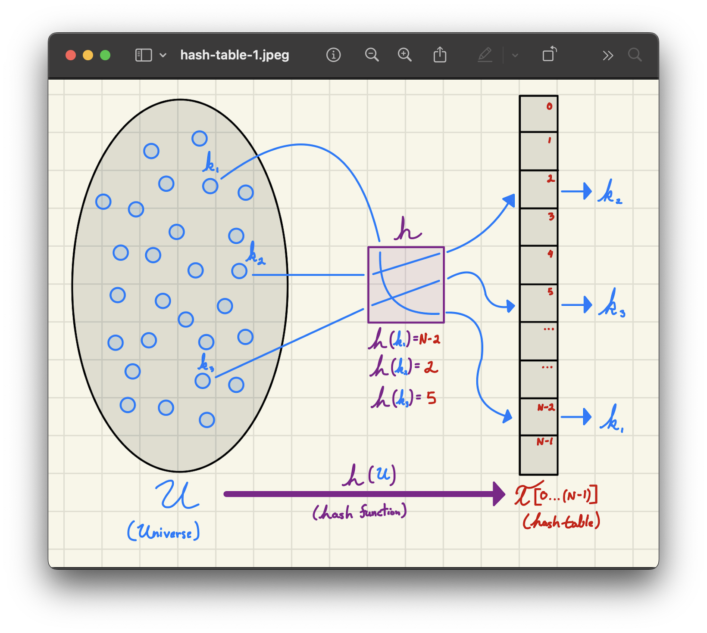
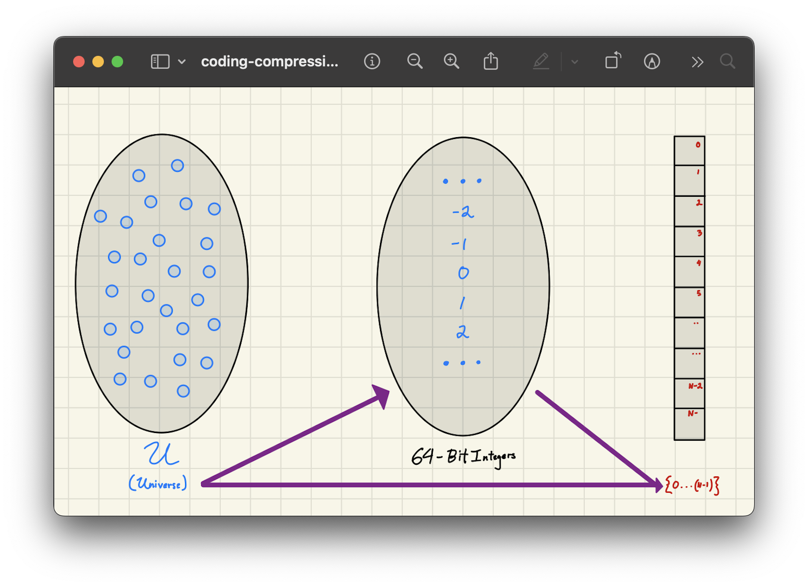

<h2 align=center>Week 14</h2>

<h1 align=center>Abstract Data Types: <em>Hash Maps</em></h1>

<p align=center><strong><em>Song of the day</strong></em>: <em><a href="https://youtu.be/r4G0nbpLySI?si=QsycBKcGoJqhapq-"><strong><u>Wait for the Moment</u></strong></a> by Vulfpeck (2013)</em></p>

---

## Sections

1. [**Maps: _Recap_**](#1)
    - [**Bucket Arrays**](#1-1)
    - [**Hashing**](#1-2)
2. [**Hash Tables**](#2)
    - [**Collisions**](#2-1)
    - [**Hash Functions**](#2-2)
3. [**Coding Functions**](#3)
    - [**Integer Casting**](#3-1)
    - [**Component Sum**](#3-2)
    - [**Polynomial Accumulation**](#3-3)
4. [**Compression Functions**](#4)
    - [**The Division Method**](#4-1)
    - [**The Multiplication-Add-Divide (MAD) Method**](#4-2)
5. [**Runtime Analysis**](#5)
6. [**`ChainingHashTableMap`**](#6)
    - [**The MAD Hash Function**](#6-1)
    - [**Initialization**](#6-2)
    - [**Size and Emptiness**](#6-3)
    - [**Lookup**](#6-4)
    - [**Insertion**](#6-5)
    - [**Deletion**](#6-6)
    - [**Membership**](#6-7)
    - [**Iteration**](#6-8)
    - [**Rehashing**](#6-9)

---

<a id="1"></a>

## Maps: _Recap_

We've been using balanced binary search trees—like AVL trees—to speed up our map operations. Thanks to their structure, we can guarantee that lookup, insert, and delete take Θ(log `n`) time. That's a big improvement over the Θ(`n`) we saw with unsorted lists and arrays. But is log `n` really the best we can do? Is it possible to get even faster? We've been cutting the problem in half at each step—binary search style—but what if we could skip the search altogether and jump straight to the spot where the key goes?

This is it, y'all. After a lengthy conversation on various ways of implementing maps, it's time to get our legendary constant runtime. This involves us considering the idea of _direct access_: what if we could just compute where a key belongs in constant time, instead of searching for it (through an AVL, for example)? That's the dream, and where the idea of a **bucket array** comes in.

<a id="1-1"></a>

### Bucket Arrays

Think of a _bucket array_ as this giant list of spots (buckets), and each key is mapped to a particular index in the array using some sort of deterministic (that is, fairly predictable) rule. For example, if I wanted to insert or find the key `"cat"`, I can jump directly to the bucket where it would belong—no searching required.

In this case, we would have no need for comparison-based searching and potential for constant runtime! So, how do we know where a key should go? If we just try to use the key as an index—like `array["cat"]`—that won't work, since keys like strings or large numbers aren't valid indices (which need to be _unsigned, or positive, integers_). We need a way to translate keys into valid array indices.

This is where _hashing_ comes into play.

<a id="1-2"></a>

### Hashing

A **hash function** lets us take any kind of key—strings, integers, whatever—and _deterministically convert it into a number_. This process ideally would take any key and match them to individual indices.

A (very, very) simple hashing function might be taking the key's length and using that number as its index. So, the following strings would have the following keys:

<a id="bad-hash"></a>

|`val`|`len(val)`|`key`|
|-----|----------|-----|
|`"cat"`| 3 | 3 |
|`"guitar"`| 6 | 6 |
|`"tar"`| 3 | 3 |
|`range(10)`| 10 | 10 |
|`(1, 2, 3)`| 3 | 3 |

<sub>**Figure 1**: A hash function using the value's length as its basis for hashing.</sub>

As you can see above, sometimes we end up mapping multiple keys to the same index. That's called a **collision**. With a hash function as simple as `len(val)`, we'd get collisions quite often, even for extremely different keys. We're definitely going to have to do better than this. The structure we build to manage these collisions is what gives rise to the **Hash Table**.

A hash table is basically a bucket array with some clever logic behind the scenes:
- A hash function to compute the bucket index.
- A collision strategy to handle overlap.

Framed this way, we get the following space and runtime complexities:

| **Data Structure**           | **Find**        | **Insert**      | **Delete**      | **Space**                           |
|-----------------------------|------------------|------------------|------------------|--------------------------------------|
| **UnsortedArrayMap**        | Θ(`n`)             | Θ(`n`)             | Θ(`n`)             | Θ(`n`)                                 |
| **UnsortedLinkedListMap**   | Θ(`n`)             | Θ(`n`)             | Θ(`n`)             | Θ(`n`)                                 |
| **SortedArrayMap**          | Θ(log(`n`))        | Θ(`n`)             | Θ(`n`)             | Θ(`n`)                                 |
| **SortedLinkedListMap**     | Θ(`n`)             | Θ(`n`)             | Θ(`n`)             | Θ(`n`)                                 |
| **BinarySearchTreeMap**     | Θ(`n`)<br>Also, Θ(`h`) | Θ(`n`)<br>Also, Θ(`h`) | Θ(`n`)<br>Also, Θ(`h`) | Θ(`n`)                                 |
| **AVLTreeMap**              | Θ(log(`n`))        | Θ(log(`n`))        | Θ(log(`n`))        | Θ(`n`)                                 |
| **BucketArray**             | Θ(`1`)             | Θ(`1`)             | Θ(`1`)             | Could be asymptotically larger than `n` |
| **Hash Table**              | Θ(`1`)             | Θ(`1`)             | Θ(`1`)             | Θ(`n`)                                 |

<sub>**Figure 2**: Hello, constant runtime.</sub>

<br>

<a id="2"></a>

## Hash Tables

As with every data structure we cover, we'll start with some definitions:

- **Universe (`U`)**: A [**set**](https://www.splashlearn.com/math-vocabulary/sets#0-what-is-a-set) from which the keys will be taken.
- **Hash Table (`T[0, …, (N-1)]`)**: An array with `N` slots, where entries will be stored.
- **Hash Function (`h(U) → {0, 1, …, (N-1)}`)**: A function that maps keys from the universe to slots in the table (`T`).



<sub>**Figure 3**: Here, each of our keys (e.g. `k`<sub>1</sub>, `k`<sub>2</sub>, `k`<sub>3</sub>, etc.) in our universe `U` is passed through some undefined hash function `h` to determine their respective indices.</sub>

<br>

<a id="2-1"></a>

### Collisions

Say, under our hash function `h`, key `k`<sub>4</sub> hashes to index `2`—the same slot already occupied by `k`<sub>2</sub>. That's a **collision**.

There are multiple ways to handle collisions, but one of the simplest solutions is by doing something called **chaining**: storing all entries that are mapped to the same slot in some other, secondary collection (like an array or a linked list):


<sub>**Figure 4**: Chaining `k`<sub>4</sub> after it hashed to the same index as `k`<sub>2</sub>.</sub>

Now, the problem with this approach is that, if lots of keys hash out to the same index (like with [**our first attempt at a hash function**](#bad-hash)), a lot of keys could end up being stored at the same slot, leading to bad performance. The solution to this would be, naturally, a really good hashing function. Ideally, we would like keys, regardless of their similarity, to never map to the same index, but since hash functions are _deterministic_, this is nigh impossible.

Instead we'd like a function that would, at the very least, _uniformly distribute_ these indices, which is definitely doable. So, how would such a function work?

<a id="2-2"></a>

### Hash Functions

A **uniform hashing function** is formally defined as:

> A function that when given a randomly chosen key, it will be equally likely mapped to any of the `N` slots of `T`, independently of where any other key has hashed to.

Typically, we say that there are two portions to the hashing process (`h`):

<a id="hashing-parts"></a>

1. **A coding function (`h`<sub>1</sub>)**: a (constant-time) process that transforms a key (like a string, number, or object) into an integer. Its goal is to take any kind of input and give you a (possibly large) number that represents it uniquely and consistently.
    Python has a function called `hash` that does this for you (although we'll be creating our own later):
    ```python
    hash("cat")  # might return something like 9873452010298
    ```

2. **A compression function (`h`<sub>2</sub>)**: Since the numbers coming out of the coding function can be quite large (usually a 64-bit number), this second function takes that big integer produced by the coding function and shrinks it down into a valid index within your bucket array.
    This is because our hash table might only have, say, a `capacity` number slots (i.e. indices `0`, `1`, `2`, ..., `capacity - 1`). A typical number returned by a hash function could be as large as, say, `9873452010298`. Because of this, we'd need to _compress_ this number to `0 ≤ index < capacity`.

So, our hashing process would look like this:

> **`h`(`key`) = `h`<sub>2</sub>(`h`<sub>1</sub>(`key`)) = `index`**



<sub>**Figure 5**: A more detailed process for hashing.</sub>

Let's take a look at a few common coding function approaches.

<br>

<a id="3"></a>

## Coding Functions

<a id="3-1"></a>

### Integer Casting

The first one we'll look at is called integer casting, where we do the following:

1. Look at the binary representation of the key.
2. Take the first 8 bytes (the most significant portion).
3. Interpret those 8 bytes as a 64-bit 2's complement number.


For example, let's say our key is:

```python
key = "cat"
```

#### Step 1: Look at the Binary Representation

In memory, `"cat"` is stored as a sequence of bytes using **ASCII** encoding:

- `'c'` → 99 → `01100011`
- `'a'` → 97 → `01100001`
- `'t'` → 116 → `01110100`

So the full byte sequence for `"cat"` is:

```
01100011 01100001 01110100
```

Or in hex:  
```
"cat" → 0x636174
```

That's only 3 bytes—not 8—so we pad with zeros at the front:

```
00000000 00000000 00000000 00000000 00000000 00000000 01100011 01100001 01110100
```

Now we interpret this whole thing as a 64-bit [**two's complement integer**]().

#### Step 2: Interpret as a 64-bit Integer

That binary number corresponds to:

```
0x0000000000636174 = 6501204 (in decimal)
```

So, our **coding function** gives us:

```python
hash_value = 6501204
```

The problem with this approach is that, for keys longer than 8 bytes, everything after the first 8 characters is simply thrown away. If the unique parts of your keys happen to live beyond that cutoff, every one of those keys maps to the **same hash value**, producing nothing but **collisions**.

<a id="same-prefix"></a>

For example, imagine you're building a hash table keyed on **student IDs**, all of which follow this format:

```
"NYU2025-0001"
"NYU2025-0002"
"NYU2025-0003"
...
"NYU2025-0123"
```

Let's say your integer casting implementation only reads the first 8 bytes (or even worse, just the beginning characters for the hash):

```python
"NYU2025-0001" →  bytes: ['N', 'Y', 'U', '2', '0', '2', '5', '-']
"NYU2025-0002" →  bytes: ['N', 'Y', 'U', '2', '0', '2', '5', '-']
```

That's _identical_ across all keys—the only changing part is _after_ byte 8!

If your hash function does this:
```python
first_eight = key[:8]  # Only considers "NYU2025-"
hash_val = to_int(first_eight)  # Convert to int from those 8 bytes
```

Then **every single key will produce the same hash**! Let's, then, try something else.

<a id="3-2"></a>

### Component Sum

The component sum approach is defined as follows:

> Break the key into its components: key = (`k`<sub>0</sub>, `k`<sub>1</sub>, `k`<sub>2</sub>, `k`<sub>3</sub>, …, `k`<sub>`m`-1</sub>). The coding function h1 would add all the components of a key. That is: `h1`(`k`) = `k`<sub>0</sub> + `k`<sub>1</sub> + `k`<sub>2</sub> + `k`<sub>3</sub> + … + `k`<sub>`m`-1</sub>

More simply put, we might...

1. Take each byte (or character) of the key,
2. Convert each one into an integer, and then...
3. Add them all together to get a final sum.

For example, let's take the key:

```python
key = "abc"
```

Using ASCII values:

| Char | ASCII |
|------|--------|
| a    | 97     |
| b    | 98     |
| c    | 99     |

Component sums:
- `"abc"` → 97 + 98 + 99 = **294**

Now, this approach is particularly vulnerable because it **completely ignores the order of a key's components**. For example:

- `"abc"` → 97 + 98 + 99 = **294**
- `"cab"` → 99 + 97 + 98 = **294**
- `"bca"` → 98 + 99 + 97 = **294**

This causes high collision rates, especially in datasets where:
  - Key components are reused or permuted,
  - Or where prefixes/suffixes are common (see our [**`NYU2025-` example**](#same-prefix) above).

This goes against our goal of making a good hash function: to distribute keys as evenly and uniquely as possible across buckets.

<a id="3-3"></a>

### Polynomial Accumulation

Polynomial accumulation is defined as follows:

> Let `z` be an integer ≥ 2. To code a `key` of length `m`, break it into its components so that:
> <p align=center><code>h</code><sub>1</sup>(<code>key</code>) = <code>k</code><sub>0</sub> * <code>z</code><sup><code>m</code>-1</sup> + <code>k</code><sub>1</sub> * <code>z</code><sup><code>m</code>-2</sup> + <code>k</code><sub>2</sub> * <code>z</code><sup><code>m</code>-3</sup> + … + <code>k</code><sub><code>m</code>-1</sub> * <code>z</code><sup>0</sup></p>

For example, using `"abcd"` as a key:

```python
hash = ord('a') * x³ + ord('b') * x² + ord('c') * x¹ + ord('d') * x⁰
```

Or, mathematically:

```python
hash = Σ[ord(key[i]) * x^(n - 1 - i)] for i from 0 to n-1
```

Let's walk through hashing the key `"cat"` using base `x = 33`.

1. Get ASCII values:
   - `c` = 99
   - `a` = 97
   - `t` = 116

2. Plug into the polynomial:

```
hash = 99 * 33² + 97 * 33¹ + 116 * 33⁰
     = 99 * 1089 + 97 * 33 + 116 * 1
     = 107811 + 3201 + 116
     = 111128
```

Polynomial accumulation gives _each character a unique, position-based weight_. That's what makes it better:

- Every position in the key contributes a distinct power of `z`, so the hash is sensitive to both _what_ the characters are and _where_ they appear.
- Even a single transposition—like swapping two adjacent characters—produces a completely different hash value.

<br>

<a id="4"></a>

## Compression Functions

Moving on to the next part of our hashing process: the compression function, as we [**mentioned earlier**](#hashing-parts), takes the 64-bit integer produced by the coding functions and reduces them to an acceptable index within our table (`h`[`0`...`N`-1]). We'll start with very simple ones and slowly work our way up to the one we want to use.

<a id="4-1"></a>

### The Division Method

Possibly the most obvious of these is the division method, through which we take the 64-bit number and mod it by `N` (the size of the table). In other words:

> **`h`<sub>2</sub>(`k`) = `k` mod `N`**

Say, for example, that our table was of size `N=1000`. If we took our earlier key of `"cat"`, from which we got the hash `111128`, and mod it by `N`:

> **`index` = `111128 % 1000` = _128_**

Meaning that `"cat"` would be placed in the 128th bucket of our array.

Now, this compression function is very common because it's easy to implement and, in fact, works pretty uniformly **if the keys are unbiased**. What does this mean? Well, consider the situation where we have an `N=10` and the following keys:

```python
{0, 5, 10, 15, 20, 25, 30, 35, 40, 45, 50, 55}
```

Using the division method would yield the following results:


<sub>**Figure 6**: Oh no, so many collisions!</sub>

In this situation, the keys are biased in the sense that they have similar properties (i.e. divisible by the size of the table, and/or by half of the size of a table), so this results in long chains and bad performance. Ideally, we'd like even keys like this to be able to be distributed evenly, so this might not be ideal in all cases.

If you're set on using the division method, one common heuristic is to **choose `N` (the size of the table) to be a prime number**. This guarantees that divisibility will not be a common issue when distributing your keys across the bucket array:


<sub>**Figure 7**: Oh hey, not so many collisions!</sub>

<a id="4-2"></a>

### The Multiplication-Add-Divide (MAD) Method

The compression method that we'll be using in our implementation is a little more involved, and is known as the **multiplication-add-divide, or MAD, method**. The formal definition goes as follows:

> Let `p` be a prime number such that `p` > |`U`| (i.e. the size of `U`).
> Let `a` be a random number from `1` to `p - 1`.
> Let `b` be a random number from `0` to `p - 1`.
> We thus define: **`h`<sub>2</sub>(`k`) = [(`a` * `k` + `b`) mod `p`] mod `N`**

For example, if |`U`| = `60` and the keys are:

```python
{0, 5, 10, 15, 20, 25, 30, 35, 40, 45, 50, 55}
```

Let's choose `p = 101`, `a = 31`, and `b = 6` for a table size of `N = 10`. Thus, our hashing function becomes:

> **`h`<sub>2</sub>(`k`) = [(`31` * `k` + `6`) mod `101`] mod `10`**


<sub>**Figure 8**: Oh yay, even fewer collisions!</sub>

Pretty nice, right? Since all of these operations are constant, and indexing is also constant, we've achieved the legendary constant runtime we've been looking for. In the next section, we'll do a proper analysis to prove this.

<br>

<a id="5"></a>

## Runtime Analysis

When we use a hash table, the general idea is simple: apply a hash function to a key, and it tells us which bucket—or slot—in the table to check. If two keys happen to hash to the same slot (a collision), we store both in a **chain**, like a list or linked list, at that bucket.

So what does it actually take to **find** a key?

1. First, compute the hash to figure out which slot to look in.
2. Then, search through the chain in that slot until we find the key (or determine it's not there).

Now, let's talk about the **worst case**. Imagine if **every key** hashed to the exact same slot. That would mean one long chain with all `n` elements in it—and searching becomes a linear scan through the entire table. In that case, `find` takes **Θ(`n`)** time, completely negating the advantages of hashing.

But in practice, with a **good hash function**—one that distributes keys uniformly across the table—we expect the keys to be spread out more evenly. This means most chains stay short, and we get much better performance.

To describe this more precisely, we introduce the **load factor**, denoted by `α`:

```
α = n / N
```

Where:
- `n` is the number of keys in the table
- `N` is the number of buckets

So `α` is the **average number of elements per chain**. If we have 100 keys and 100 buckets, then `α = 1`, meaning we expect one key per chain on average.

With this in mind, the expected time to `find` a key breaks down like this:

1. **O(1)**: Compute the hash and jump directly to the correct slot.
2. **O(α)**: Scan through the chain in that slot.

This gives us a total expected time of:

```
O(1 + α)
```

Now, here's the good news: as long as we **maintain `α` ≤ 1**—by resizing the table when it gets too full—we keep the chains short, and the runtime stays close to constant:

```
O(1 + α) → O(1 + 1) → O(2) → Θ(1)
```

That's why **dynamic resizing** is so critical in a hash table: it keeps the number of buckets proportional to the number of elements, which in turn keeps our operations efficient. When done right, finding a key in a hash table is—on average—**constant time**.

<br>

<a id="6"></a>

## `ChainingHashTableMap`

Now it's time to put all of this together in code. Our implementation, `ChainingHashTableMap`, combines:

- **Python's built-in `hash()`** as the coding function—it's fast, handles strings, numbers, and tuples, and gives us a (potentially huge, potentially negative) integer.
- **The MAD method** as the compression function—to scatter those raw hash values uniformly across our table.
- **Chaining with `UnsortedArrayMap`** as the collision strategy—each slot in the table holds a small secondary map, so multiple keys can live at the same index without overwriting each other.
- **Dynamic resizing** to keep the load factor in check.

Let's build it up piece by piece.

<a id="6-1"></a>

### The MAD Hash Function

The first thing we need is a callable object that encapsulates all three parameters of the MAD formula (`N`, `a`, `b`, and `p`). We model it as an inner class so that it stays tightly coupled to the hash table that owns it.

```python
from random import randrange

class ChainingHashTableMap:
    class MADHashFunction:
        def __init__(self, N, p=40206835204840513073):
            self.N = N
            self.p = p
            self.a = randrange(1, self.p - 1)
            self.b = randrange(0, self.p - 1)
```

`p` defaults to a very large prime—large enough to dwarf any realistic universe of keys. `a` and `b` are drawn at random each time a new hash function is created, which is what gives MAD its randomised, collision-resistant flavour.

To actually call this function, we implement `__call__`, which turns any instance of `MADHashFunction` into a callable:

```python
        def __call__(self, key):
            return ((self.a * hash(key) + self.b) % self.p) % self.N
```

The inner `% self.p` scrambles the raw hash value; the outer `% self.N` brings it down to a valid index. Both steps together are Θ(1).

<a id="6-2"></a>

### Initialization

With our hash function in hand, we can set up the table itself. The `__init__` method needs to:

1. Allocate a low-level array of exactly `N` slots (we use `ctypes` for this, the same technique as in `ArrayList`).
2. Fill every slot with an empty `UnsortedArrayMap`—these are the chains.
3. Track the total number of stored items (`self.n`).
4. Create a fresh `MADHashFunction` bound to this table's size.

```python
from ctypes import py_object
from UnsortedArrayMap import UnsortedArrayMap

def make_array(n):
    return (n * py_object)()

class ChainingHashTableMap:
    # ... MADHashFunction inner class ...

    def __init__(self, N=64):
        self.table = make_array(N)

        for i in range(N):
            self.table[i] = UnsortedArrayMap()

        self.n = 0
        self.h = ChainingHashTableMap.MADHashFunction(N)
```

The default capacity of `64` is just a reasonable starting point. Everything else will grow (or shrink) automatically as items are inserted and removed.

<a id="6-3"></a>

### Size and Emptiness

We keep `self.n` up to date as items come and go, so `__len__` is trivially Θ(1):

```python
    def __len__(self):
        return self.n

    def is_empty(self):
        return len(self) == 0
```

Note that `self.n` counts the total number of _items_ in the table, not the number of slots. `len(self.table)` would give us the capacity `N`—a different thing entirely.

<a id="6-4"></a>

### Lookup

To look up a key, we hash it to find the right bucket, then ask that bucket's `UnsortedArrayMap` to do the rest:

```python
    def __getitem__(self, key):
        i = self.h(key)
        curr_bucket = self.table[i]

        return curr_bucket[key]
```

`self.h(key)` runs in Θ(1). `curr_bucket[key]` scans the chain, which is Θ(α) on average—constant as long as the load factor stays in check. If the key isn't in the chain, the `UnsortedArrayMap` raises a `KeyError`, which bubbles up naturally.

<a id="6-5"></a>

### Insertion

Insertion is a little more involved because we need to:

1. Determine whether the key is _new_ or an _update_ to an existing one (only new keys increase `self.n`).
2. Check whether the load factor now exceeds 1, and if so, **rehash** into a larger table.

We detect new vs. update by comparing the bucket's size before and after the assignment:

```python
    def __setitem__(self, key, value):
        i = self.h(key)
        curr_bucket = self.table[i]
        old_size = len(curr_bucket)
        curr_bucket[key] = value
        new_size = len(curr_bucket)

        if new_size > old_size:
            self.n += 1

        if self.n > len(self.table):
            self.rehash(2 * len(self.table))
```

If `new_size > old_size`, the key was brand new; otherwise, we just updated an existing item's value. Once `n` exceeds the number of slots, we double the table—this keeps `α ≤ 1` and amortises the cost of resizing over many insertions.

<a id="6-6"></a>

### Deletion

Deletion follows a similar pattern: delegate to the bucket's map, decrement `self.n`, and check whether the table has grown too sparse. If fewer than a quarter of the slots are occupied, we halve the table to reclaim memory:

```python
    def __delitem__(self, key):
        i = self.h(key)
        curr_bucket = self.table[i]

        del curr_bucket[key]
        self.n -= 1

        if self.n < len(self.table) // 4:
            self.rehash(len(self.table) // 2)
```

Again, if the key doesn't exist, `UnsortedArrayMap.__delitem__` raises a `KeyError`, which propagates up automatically—no extra handling needed on our end.

<a id="6-7"></a>

### Membership

Checking `key in table` follows directly from `__getitem__`: try to retrieve the value, and if a `KeyError` comes back, the key isn't there:

```python
    def __contains__(self, key):
        try:
            val = self[key]
            return True
        except KeyError:
            return False
```

This runs in the same expected Θ(1) as lookup.

<a id="6-8"></a>

### Iteration

Iteration should yield every key in the table. Because the table is an array of `UnsortedArrayMap` buckets, we just walk through each bucket and yield its keys in turn:

```python
    def __iter__(self):
        for curr_bucket in self.table:
            for key in curr_bucket:
                yield key
```

This visits every slot and every item once, giving Θ(`N` + `n`) overall—dominated by Θ(`n`) when the load factor is reasonable.

<a id="6-9"></a>

### Rehashing

`rehash` is what keeps everything else honest. When called, it needs to move all existing items into a fresh table of the new size, with a brand-new hash function:

```python
    def rehash(self, new_size):
        old = [(key, self[key]) for key in self]
        self.__init__(new_size)

        for (key, val) in old:
            self[key] = val
```

First we snapshot every key-value pair from the current table. Then we call `self.__init__(new_size)`, which resets the table, creates a new `MADHashFunction` bound to the new capacity, and clears `self.n`. Finally, we re-insert everything—each item lands in a freshly computed bucket under the new hash function.

Rehashing itself takes Θ(`n`) time, but because we only do it when the table doubles (or halves), the amortised cost per operation stays Θ(1).

---

Putting it all together, here's what our `ChainingHashTableMap` looks like in practice:

```python
ht = ChainingHashTableMap()

ht["Irene"] = "Leader"
ht["Seulgi"] = "Dancer"
ht["Wendy"] = "Singer"
ht["Joy"] = "Dancer"
ht["Yeri"] = "Rapper"

print(len(ht))        # 5
print(ht["Wendy"])    # Singer

del ht["Seulgi"]
print("Seulgi" in ht) # False

for member in ht:
    print(member, "→", ht[member])
```

Each of those operations—insert, lookup, delete, membership check—runs in expected Θ(1) time, which is exactly the constant-time performance we set out to achieve.
