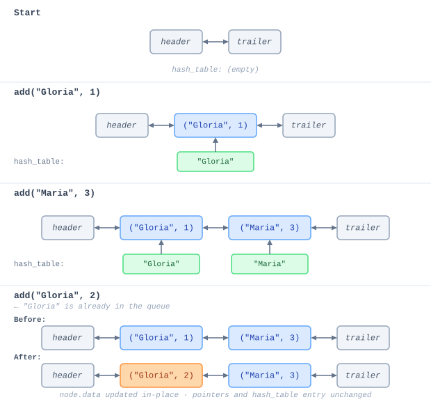
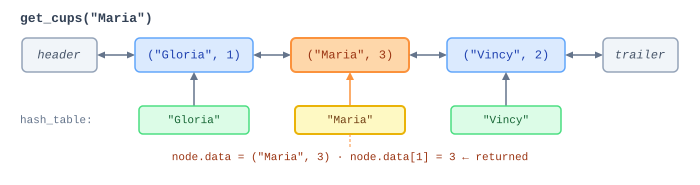
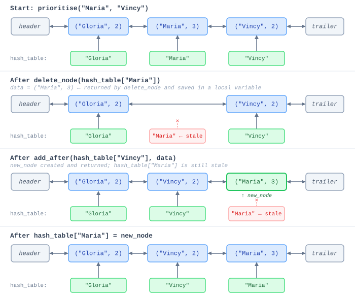
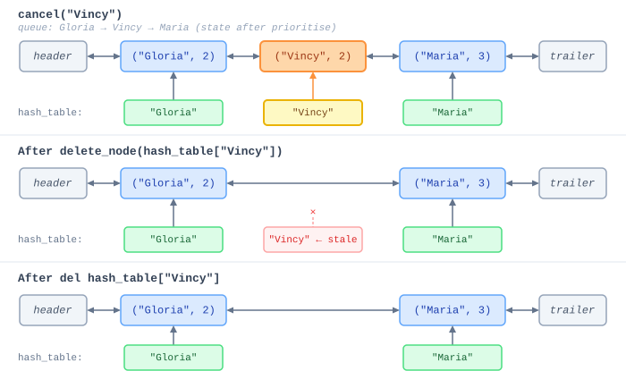
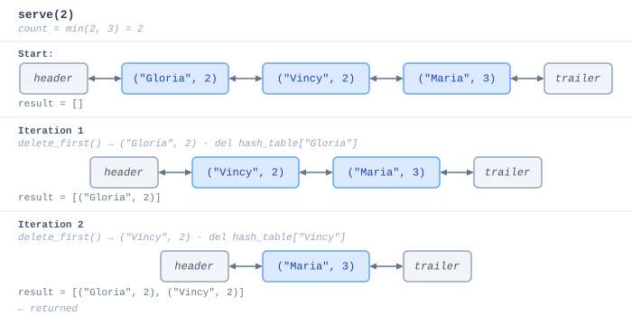

<h2 align=center>Exam-Like Question</h2>

<h1 align=center>Solution Walkthrough</h1>

## Sections

1. [**What do we actually need?**](#1)
2. [**The Data Structures**](#2)
    - [**Why a Doubly Linked List?**](#2-1)
    - [**Why a Hash Map?**](#2-2)
    - [**The Result**](#2-3)
3. [**Implementation**](#3)
    - [**`__init__` and `__len__`**](#3-1)
    - [**`add`**](#3-2)
    - [**`get_cups`**](#3-3)
    - [**`prioritise`**](#3-4)
    - [**`cancel`**](#3-5)
    - [**`serve`**](#3-6)
4. [**Runtime Summary**](#4)

<a id="1"></a>

## What do we actually need?

We need a data structure that maintains a **front-to-back order**. But unlike a plain queue, we also need to:

- Jump directly to any customer by _name_ (not by reference!) and update or remove them without scanning the whole line.
- Reposition any customer to appear immediately after another without touching everyone else.

Both "jump to by name" and "reposition without a scan" have to run in **Θ(1) amortised average** time. A single data structure can't satisfy both constraints. For example:

- A linked list would keep order and repositions cheaply, but finding a customer by name requires a Θ(`n`) linear scan.
- A hash map gives Θ(1) lookup, but it has no inherent notion of front-to-back order (since it is _unordered_), so `prioritise` and `serve` are either awkward or expensive.

So, why not both? This is the classic kinda thing you see in exams, so keep that in mind!

**Note:** The word "queue" in the problem name describes the ordering of customers, not a prescription to use `ArrayQueue`. An `ArrayQueue` only supports O(1) operations at its two ends—it has no way to cancel or reposition an arbitrary element without a full scan. We need something that gives us O(1) access to _any_ node once we have a pointer to it.

<br>

<a id="2"></a>

## The Data Structures

<a id="2-1"></a>

### Why a Doubly Linked List?

Our `DoublyLinkedList` stores the queue's order. Each node will hold one `(name, cups)` pair, and the sequence of nodes from `header.next` to `trailer.prev` defines the front-to-back ordering of the queue.

The reason why I immediately jumped to a DLL is because of its ability to do **O(1) insertion and deletion**:

- `add_last(val)` appends to the back in Θ(1).
- `delete_node(node)` unlinks any node in Θ(1) (if you already have a direct reference to that node). You don't have to find it; you just rewire its neighbours.
- `add_after(node, val)` inserts a new node immediately after any existing node in Θ(1)—again (as long as you have a direct reference).

This is exactly the surgery that `prioritise` needs: remove a node from wherever it currently sits, and re-insert it somewhere else—all in constant time.

<a id="2-2"></a>

### Why a Hash Map?

Ok, so the doubly linked list handles order beautifully, but there's a big problem: its Θ(1) operations only stay Θ(1) **if you already have a reference to the node you want**. Finding a node by name on its own would require walking the entire list, which is Θ(`n`).

That's where `ChainingHashTableMap` comes in. It almost acts as an "index":

```
Key            →  Value
---------------------------------------------
name (string)  →  DLL node (object reference)
```

Given a customer's name, the hash map lets us retrieve the corresponding _DLL node_ in Θ(1) amortised average time. We can then hand that node directly to the list's operations.

<a id="2-3"></a>

### The Result

Combining them eliminates basically each structure's weakness:

| Need | Provided by |
|---|---|
| Maintain front-to-back order | `DoublyLinkedList` |
| O(1) insert at back | `DoublyLinkedList.add_last` |
| O(1) lookup by name | `ChainingHashTableMap` |
| O(1) reposition / delete any node | `DoublyLinkedList.delete_node` + `add_after` (via the hash map pointer) |
| O(`first`) ordered traversal from front | `DoublyLinkedList.delete_first` in a loop |

One rule that must never be broken: **`self.hash_table[name]` must always point to the current, live DLL node for that customer**. If a method removes or replaces a node in the list without updating the hash table, future lookups will follow a "stale" reference into a disconnected node.

<br>

<a id="3"></a>

## Implementation

<a id="3-1"></a>

### `__init__` and `__len__`

```python
def __init__(self):
    self.dll = DoublyLinkedList()
    self.hash_table = ChainingHashTableMap()

def __len__(self):
    return len(self.dll)
```

`DoublyLinkedList.__init__` creates two sentinel nodes—`header` and `trailer`—and wires them together so that `header.next` points to `trailer` and `trailer.prev` points to `header`. These sentinels are never removed and never hold real data; they just mark the two ends of the list. Real nodes are always inserted between them.

`ChainingHashTableMap.__init__` allocates a low-level array of `N` slots (default 64) and fills each slot with an empty `UnsortedArrayMap`. It also creates a fresh MAD hash function bound to that capacity. All key-value pairs will eventually land in one of these slots.

There's nothing else to set up. When both structures are empty, they already agree: the list has no real nodes, and the hash table has no entries.

`__len__` delegates to `self.dll.n`, which `DoublyLinkedList` maintains as a running count and returns directly in Θ(1). We could equally ask `len(self.hash_table)`, which returns `self.hash_table.n` in the same way—both counts track the number of active orders and will always agree.

<a id="3-2"></a>

### `add`

```python
def add(self, name, cups):
    if name in self.hash_table:
        node = self.hash_table[name]
        node.data = (name, cups)
    else:
        node = self.dll.add_last((name, cups))
        self.hash_table[name] = node
```

The first line, `name in self.hash_table`, calls [**`ChainingHashTableMap.__contains__`**](https://github.com/sebastianromerocruz/CS1134-data-structures-and-algorithms/tree/main/lectures/18-hash-tables#6-7), which in turn calls [**`__getitem__`**](https://github.com/sebastianromerocruz/CS1134-data-structures-and-algorithms/tree/main/lectures/18-hash-tables#lookup) (`val = self[key]`) internally and returns `True` if no `KeyError` is raised. This is Θ(1) amortised average.

Our two cases are thus:

- **New customer.** We call [**`self.dll.add_last((name, cups))`**](https://github.com/sebastianromerocruz/CS1134-data-structures-and-algorithms/tree/main/lectures/13-linked-lists#inserting-a-new-node). Under the hood, `add_last` calls `add_after(self.trailer.prev, val)`, which creates a new `Node` object, wires it between the current last real node and the trailer sentinel, increments `self.dll.n`, and **_returns the new node_**. 
    
    We store that returned node reference in the hash table under `name` by calling `self.hash_table[name] = node`, which is `ChainingHashTableMap.__setitem__`. That method hashes the key, finds the right bucket, and delegates to [**`UnsortedArrayMap.__setitem__`**](https://github.com/sebastianromerocruz/CS1134-data-structures-and-algorithms/tree/main/lectures/15-maps#2-1-1)—which either updates an existing entry or appends a new `Item` to the bucket's `ArrayList`.

    
- **Returning customer.** The spec says we should update the cup count _without changing position_. Because the hash table already holds the node, we retrieve it in Θ(1) and overwrite `node.data` directly. No list surgery happens at all (`node.prev` and `node.next` are completely untouched) so the customer stays exactly where they were in the queue. The last section of the diagram above shows this: only the highlighted node changes colour (its data changed); everything else—the list structure, the hash table entry, the node object itself—is identical.


Both branches run in Θ(1) amortised average time.

<a id="3-3"></a>

### `get_cups`

```python
def get_cups(self, name):
    if name not in self.hash_table:
        raise Exception(f"No order found for '{name}'")

    return self.hash_table[name].data[1]
```

The guard check (`name not in self.hash_table`) runs the same `__contains__` path described in [**`add`**](#3-2)—Θ(1) amortised average. If `name` isn't found, we raise immediately as was specified, rather than letting Python produce a confusing `KeyError` from deep inside the hash table.

If the name is present, `self.hash_table[name]` retrieves the DLL node: the MAD function computes the bucket index, and the `UnsortedArrayMap` at that slot does a short linear scan to find the matching entry and return its value (the node object). We then access `.data`, which is the `(name, cups)` tuple stored on that node, and return index `1`—the cup count (index `0` would give us back the name, which we already have).



<a id="3-4"></a>

### `prioritise`

```python
def prioritise(self, name, prev_name):
    if name not in self.hash_table:
        raise Exception(f"No order found for '{name}'")
    if prev_name not in self.hash_table:
        raise Exception(f"No order found for '{prev_name}'")

    data = self.dll.delete_node(self.hash_table[name])
    new_node = self.dll.add_after(self.hash_table[prev_name], data)
    self.hash_table[name] = new_node
```

Both guard checks use `__contains__` as before. They're kept separate so that if only one name is missing, the exception message can say which one—rather than a generic failure.

After the guards pass, we have two direct node references in hand:

1. **`self.hash_table[name]`**—the node we want to move.
2. **`self.hash_table[prev_name]`**—the node we want to move it after.

Let's trace through `prioritise("Maria", "Vincy")` on the queue below:



The entire method is Θ(1) amortised average—three hash map lookups and two list pointer operations, all constant time.

<a id="3-5"></a>

### `cancel`

```python
def cancel(self, name):
    if name not in self.hash_table:
        raise Exception(f"No order found for '{name}'")
    self.dll.delete_node(self.hash_table[name])
    del self.hash_table[name]
```

`cancel` does the same two-step cleanup as the removal in `prioritise`, just without the re-insertion.



`self.dll.delete_node(self.hash_table[name])` retrieves the node from the hash table in Θ(1), then unlinks it from the list: `node.prev.next = node.next`, `node.next.prev = node.prev`, then `node.disconnect()` to null out the node's fields. The surrounding nodes close ranks around the gap—no other nodes are touched.

`del self.hash_table[name]` then calls `ChainingHashTableMap.__delitem__`, which hashes `name` to find the right bucket and delegates to `UnsortedArrayMap.__delitem__`. That method scans the bucket's `ArrayList` for the matching `Item`, calls `ArrayList.pop(j)` to remove it (shifting any later entries left), and decrements the map's count. If the total number of entries has dropped below a quarter of the table's capacity, the hash table also rehashes into a smaller array to reclaim memory.

The order of these two lines matters: we must retrieve the node from the hash table _before_ deleting its entry. If we deleted the hash table entry first, the node reference would be gone and we'd have no way to tell the list which node to unlink.

<a id="3-6"></a>

### `serve`

```python
def serve(self, first=1):
    count = min(first, len(self.dll))
    result = []

    for _ in range(count):
        name, cups = self.dll.delete_first()
        del self.hash_table[name]
        result.append((name, cups))

    return result
```

`serve` is the only method allowed to be slower than Θ(1), and deliberately so—returning `first` items necessarily takes Θ(`first`) time just to build the result list.

`min(first, len(self.dll))` handles the case where `first` ≥ the current queue length: rather than running off the end of the list, we cap `count` at however many orders actually exist and drain the whole thing.

Each iteration does three things:

1. **`self.dll.delete_first()`** calls `delete_node(self.header.next)`—the node immediately after the header sentinel, which is always the front of the queue. `delete_node` stitches the header directly to what was the second node, calls `node.disconnect()` to null out the removed node's fields, decrements `self.dll.n`, and returns the stored `(name, cups)` tuple.

2. **`del self.hash_table[name]`** takes the name we just unpacked from that tuple and removes it from the hash table, exactly as in `cancel`. This keeps the two structures in sync—a node that no longer exists in the list should not have an entry in the hash table.

3. **`result.append((name, cups))`** adds the tuple to the output list.

Here's the full picture for `serve(2)` on the post-`prioritise` queue:



Since each of those three steps is Θ(1) amortised average, and we repeat them `count` times, the full loop runs in Θ(`count`) = Θ(`first`).

<br>

<a id="4"></a>

## Runtime Summary

| **Operation** | **Time Complexity** | **Reasoning** |
|---|---|---|
| `__len__` | Θ(1) | Reads `self.dll.n` directly |
| `add` | Θ(1) amortised avg. | Hash map lookup + DLL `add_last` or in-place node update |
| `get_cups` | Θ(1) amortised avg. | Hash map lookup, then tuple index |
| `prioritise` | Θ(1) amortised avg. | Two hash map lookups + DLL `delete_node` + `add_after` |
| `cancel` | Θ(1) amortised avg. | Hash map lookup + DLL `delete_node` + hash map delete |
| `serve(first)` | Θ(`first`) | Loop of `first` × (DLL `delete_first` + hash map delete) |

The "amortised average" qualifier comes from the hash map: individual operations can be Θ(`n`) in the absolute worst case (all keys collide into one chain), but with a good hash function and dynamic resizing, a sequence of `n` operations completes in Θ(`n`) average time.
